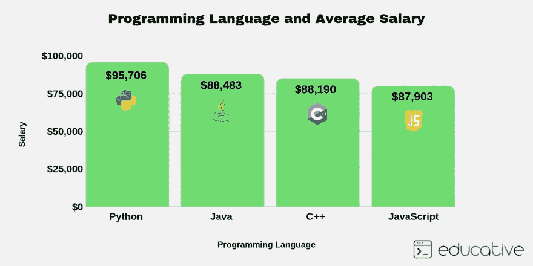
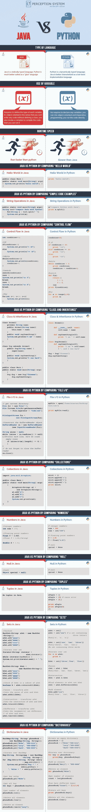
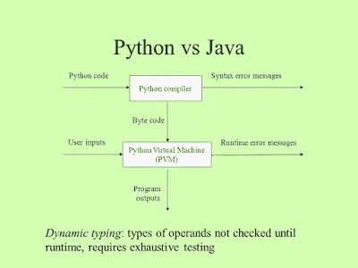

# Python 还是 Java？2023 年做编码应该学哪种编程语言？

> 原文：<https://medium.com/javarevisited/python-or-java-which-programming-language-beginners-should-learn-in-2020-de992b2650ec?source=collection_archive---------0----------------------->

形象学分- [教育性](https://www.educative.io/subscription?affiliate_id=5073518643380224)

Java 和 Python 是当今最流行和最有影响力的两种编程语言。初学程序员经常会感到困惑，最常被问到的一个问题是**我应该学习 Java 还是 Python？***Python 是一门优秀的编程语言吗？*初学 etc，你会推荐哪种编程语言？

由于我是一名 Java 开发人员，我的观点是有偏见的，我总是建议你从 Java 开始，然后学习 Python，但是如果你向 Python 开发人员提出这个问题，你可能会得到正好相反的答案。

关于为什么 Java 是最好的编程语言以及为什么程序员应该学习 Java，我已经很好地记录了我的理由。你会在那篇博文中看到的最重要的原因之一是一个活跃的 Java 社区，它将在你的整个 Java 职业生涯中帮助你。

你可以问一些初学者从如何设置路径和类路径开始，到关于在 Eclipse 中调试 Java 程序的高级资料，无论是什么样的问题，Java 社区中总会有人愿意回答并帮助你。

这也是 StackOverflow 充满 Java 疑问的原因之一。顺便说一下， [Python](http://www.java67.com/2018/02/5-free-python-online-courses-for-beginners.html) 不再是一只小鸡了，它已经完全成长起来，并与主流语言如 [Java](https://javarevisited.blogspot.sg/2017/11/top-5-free-java-courses-for-beginners.html#axzz4zuIICRs9) 和 [C++](http://www.java67.com/2018/02/5-free-cpp-courses-to-learn-programming.html) 展开了激烈的竞争。当我第一次遇到 Python 时，我认为它是一种脚本语言，但这是一种保守的说法。你也可以用 Python 进行面向对象的编程。它还被大量用于 web 开发网站，如 Reddit，这些网站都是使用 Python 和机器学习构建的，数据科学使 Python 变得更加有用。从初学者的角度来看，我总是建议选择一种更容易学习、对你有强大吸引力并有强大社区支持的语言，现在 Java 和 Python 都符合这一要求，除非你做了一些出色的对比分析，否则你无法决定学习 Java 还是 Python。

谢天谢地，我们有一个信息图，它突出了 Python 和 Java 之间的一些重要的**区别**，我相信在看了这个信息图之后，你将能够决定从哪种编程语言开始。如果你已经下定决心学习 Java，那么由 Tim Buchalaka 在 Udemy 上开设的 Java 大师班课程是一个很好的开始。它不仅是最新的课程，涵盖了最近版本的最新 Java 特性，而且是最全面、结构最合理的课程，使学习变得简单。

 [## 完整的 Java Masterclass(针对 Java 10 进行了更新)

### 你刚刚在网上偶然发现了最完整、最深入的 Java 编程课程。拥有超过 260，000 名学生…

click.linksynergy.com](https://click.linksynergy.com/fs-bin/click?id=JVFxdTr9V80&subid=0&offerid=323058.1&type=10&tmpid=14538&RD_PARM1=https%3A%2F%2Fwww.udemy.com%2Fjava-the-complete-java-developer-course%2F) 

# Python 还是 Java？2023 年初学者用哪种编程语言最好？[信息图表]

作为两种不同的编程语言，Java 和 Python 可以成为现代开发人员开发应用程序的有用工具。

在学习任何编程语言之前，了解它们之间的区别是必须的。

宣称 [Java](https://javarevisited.blogspot.com/2018/06/10-all-time-great-books-for-java.html) 由于众多元素而不如 [Python](http://javarevisited.blogspot.sg/2018/03/top-5-courses-to-learn-python-in-2018.html) 高效可能是错误的。

让我们通过这张信息图来了解一些不同之处:

感知系统信息图

从这张信息图中，你可以很容易地看出 **Java 比 Python** 冗长。用 Java 读取一个文件需要 10 行[代码，而用 Python 只需要 2 行代码。这一点与 Python 有关，因为初学程序员肯定喜欢写更少的代码。

第二点是关于变量的静态和动态类型，在我看来，你需要一种严格的编程语言和编译器来检测初学者犯下的愚蠢错误，在 Java 中，你不能在字符串变量中存储一个整数值。

所以在这一点上，我投 Java 一票。速度，这在企业级应用开发上是至关重要的，你可以看到 **Java 比 Python** 快，但是一定要记住你需要编译运行 Java 程序，而 Python 不需要编译。

Python shell 可以直接解释 Python 命令，这对于程序员来说意味着更容易。所以现在 Python 和 Java 都是 2 和 2。

这是初学者学习 Python 的一个重要原因，因为它只是让尝试和学习变得容易，如果你选择学习 Python，那么 Udemy 上何塞·波尔蒂利亚的](http://javarevisited.blogspot.in/2011/12/read-and-write-text-file-java.html) [**完整的 Python 训练营**](https://click.linksynergy.com/fs-bin/click?id=JVFxdTr9V80&subid=0&offerid=562016.1&type=10&tmpid=14537&RD_PARM1=https%3A%2F%2Fwww.udemy.com%2Fcomplete-python-bootcamp%2F%3FsiteID%3DJVFxdTr9V80-wwLMK40h6UPHzzd8dx.nSQ%2526LSNPUBID%3DJVFxdTr9V80) 是一个很好的起点。它从头开始介绍 Python 3。

随着 JShell 在 [Java 9](http://www.java67.com/2018/01/top-10-java-9-tutorials-and-courses.html) 中的引入，情况有所改善，但是在快速编写脚本和运行方面，我仍然认为 [Python](/better-programming/top-5-courses-to-learn-python-in-2018-best-of-lot-26644a99e7ec) 更好。

你也可以看到 Java 中的 hello world 比 python 中的 hello world 需要更多的行数。其余的例子你可以自己分析，但最终得出的结论是 Java 和 Python 能力相当，谁也不比谁差。

作为一个 Java 开发人员，我可以以我的亲身经历说，你不会后悔学习 Java，选择它作为职业；当然，随时可以学习 Python，适合写小实用程序，但是 Java 就是 Java。

**学习 Java 和 Python 的资源**

*   [**完整的 Java Masterclass**](https://click.linksynergy.com/fs-bin/click?id=JVFxdTr9V80&subid=0&offerid=323058.1&type=10&tmpid=14538&RD_PARM1=https%3A%2F%2Fwww.udemy.com%2Fjava-the-complete-java-developer-course%2F)
*   [**完整的 Python 训练营:在 Python 中从零到英雄**](https://click.linksynergy.com/fs-bin/click?id=JVFxdTr9V80&subid=0&offerid=562016.1&type=10&tmpid=14537&RD_PARM1=https%3A%2F%2Fwww.udemy.com%2Fcomplete-python-bootcamp%2F%3FsiteID%3DJVFxdTr9V80-wwLMK40h6UPHzzd8dx.nSQ%2526LSNPUBID%3DJVFxdTr9V80)
*   [2023 年 Java 开发者路线图](https://javarevisited.blogspot.com/2019/10/the-java-developer-roadmap.html)
*   [2023 年 Java 程序员应该学会的 10 件事](https://javarevisited.blogspot.com/2017/12/10-things-java-programmers-should-learn.html#axzz5atl0BngO)
*   [2023 年学习 Python 的 10 门免费课程](https://javarevisited.blogspot.com/2018/12/10-free-python-courses-for-programmers.html)
*   [我最喜欢的深入学习 Java 的免费课程](/javarevisited/10-free-courses-to-learn-java-in-2019-22d1f33a3915)
*   凯·s·霍斯特曼的《核心 Java》第 1 卷和第 2 卷
*   [每个 Java 开发人员都应该阅读的 10 本书](https://javarevisited.blogspot.com/2018/06/10-all-time-great-books-for-java.html)
*   [用于数据科学和机器学习的 Python 训练营](https://click.linksynergy.com/fs-bin/click?id=JVFxdTr9V80&subid=0&offerid=562016.1&type=10&tmpid=14538&RD_PARM1=https%3A%2F%2Fwww.udemy.com%2Fpython-for-data-science-and-machine-learning-bootcamp%2F)

感谢您阅读本文。如果你喜欢这篇文章，那么请分享给你的朋友和同事。如果您有任何问题或反馈，请留言。

 [## 面向初学者的 10 大 Java 在线课程

### 如果你是计算机科学专业的毕业生，或者想学习 Java 并且正在寻找一些很棒的资源，比如…

medium.com](/javarevisited/top-5-java-online-courses-for-beginners-best-of-lot-1e1e240a758)  [## 2023 年 Java 开发者路线图

### 大家好，首先祝大家 2023 新年快乐。我已经分享了很多成为网络的路线图…

javarevisited.blogspot.com](https://javarevisited.blogspot.com/2019/10/the-java-developer-roadmap.html#123)