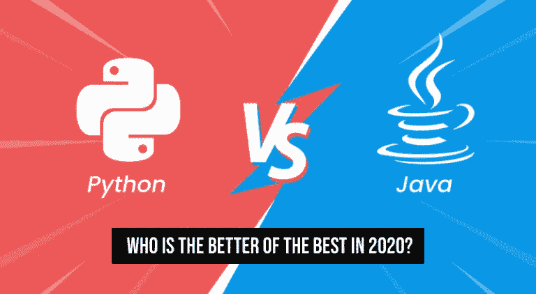
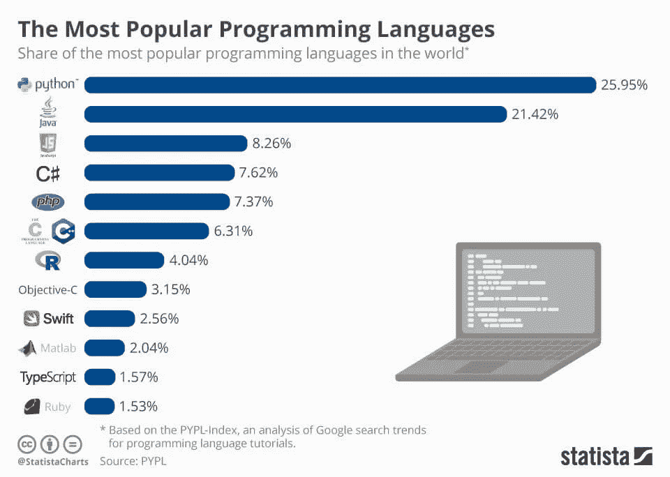
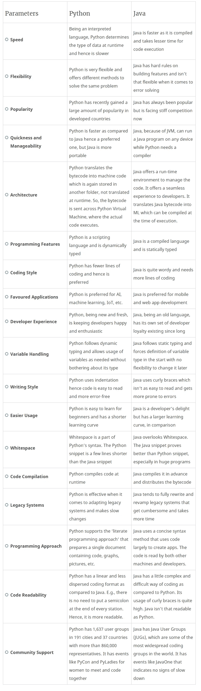

# Python 与 Java 的对比——2020 年谁是佼佼者？

> 原文：<https://medium.com/javarevisited/python-vs-java-comparison-who-is-the-better-of-the-best-in-2020-19d55624b850?source=collection_archive---------1----------------------->

在统治 IT 世界的众多编程语言中，有两个名字相互对立，面临着严峻的对比——Python 和 Java。

对于这两者，已经说了很多，写了很多，经历了很多，实施了很多。两者都在尽最大努力在 2019 年的编程语言中占据首位。尽管 Java 因其资历和受欢迎程度而独占鳌头，但 Python 在此期间显示出了巨大的进步，并处于激烈的竞争中。

**下面先来看一下什么** [**Statista**](https://www.statista.com/chart/16567/popular-programming-languages/) **说:**

这只是一个统计参考，在 Python 和 Java 的大门后面还有更多。让我们通过这两者错综复杂的细节，更好地理解它们。

两者都很好，两者都很高效，两者都很受欢迎——这意味着两者都是最好的。

困扰用户的问题是——“**优中选优？**”

# 计算机编程语言

> “编写 Python 代码的乐趣应该在于看到短小、简洁、易读的类，这些类用少量清晰的代码表达了大量的动作，而不是大量让读者厌烦得要死的琐碎代码。”—吉多·范·罗苏姆

*   一种解释型高级通用编程语言
*   一种清晰、有效和强大的高级语言，具有自动内存管理功能
*   由吉多·范·罗苏姆于 1991 年创建，作为 ABC 语言的继承者
*   由 Python 软件基金会(PSF)开发，这是一个非盈利组织，拥有 Python 背后的权利
*   最新版本是 2019 年 10 月 19 日的 2.7.17

这里有一些 2020 年学习 Python 的有用资源

 [## 10 大 Python 课程、教程和认证——最好的

### 7 门能让你立刻学会编码的最好课程

medium.com](/better-programming/top-5-courses-to-learn-python-in-2018-best-of-lot-26644a99e7ec) 

# Java 语言(一种计算机语言，尤用于创建网站)

> “Java:写一次就跑！”-布鲁斯

*   一种基于类和面向对象的通用编程语言
*   动态链接，允许下载和运行新代码，但不能动态键入
*   承诺'**写一次，随处跑** ' ( **WORA** )的概念
*   由詹姆斯·高斯林设计，由太阳微系统公司于 1995 年开发
*   自 2009 年起归甲骨文公司所有
*   最新版本是 2019 年 9 月 17 日发布的 Java SE 13

而且，如果你想学 Java，这里有一些 2020 年学 Java 的免费资源

 [## 我最喜欢的深入学习 Java 的免费课程

### 我的免费课程列表深入学习 Java 从核心 Java 到多线程到 JDBC 到合集，什么都有…

medium.com](/javarevisited/10-free-courses-to-learn-java-in-2019-22d1f33a3915) 

# Python 与 Java:相似之处

这两种编程语言有许多共同之处，但它们也显示出明显的差异。

以下是它们的一些共同特征:

*   它们有强大的跨平台支持
*   他们有广泛的标准库
*   他们都把几乎所有的东西作为对象来处理
*   两者都编译成字节码并在虚拟机中运行
*   两者都是阿尔戈尔家族的成员

# Python 与 Java:基于几个重要参数的详细比较

## 什么时候选择 Python？

**开发时选择 Python**

*   比赛
*   ML 应用程序
*   Web 应用和框架
*   原型
*   平面设计应用
*   操作系统（Operating System）
*   计算应用

## 什么时候选择 Java？

**开发的时候选择 Java】**

*   桌面应用
*   嵌入式应用
*   数据处理应用程序
*   移动和网络应用
*   企业级解决方案

## 随着比较在 2020 年变得有趣

2019 年已经见证了两大编程语言巨头——[Python](https://hackernoon.com/top-5-courses-to-learn-python-in-2018-best-of-lot-26644a99e7ec)和 [Java](https://itnext.io/must-read-books-to-learn-java-programming-327a3768ea2f#f2fc) 之间的激烈对比和竞争。Python 在接下来的一年里也有很高的发展趋势，并且展示了很多在第一名的竞赛中击败 Java 的潜力。Java 也有足够的能力保住自己的位置，保持霸主地位。

尽管不像以前那样流行，Java 仍然保持着第一的位置。但是 Python 的增长率是指数级的，尤其是在发达国家。有可靠的消息来源认为 Python 可能很快会超过 Java。

主要原因是 Python 对尖端技术做出了巨大贡献，如 [AI](https://javarevisited.blogspot.com/2019/10/top-5-courses-to-learn-artificial-intelligence-AI.html) ，IoT，[数据科学](https://dev.to/javinpaul/10-data-science-and-machine-learning-courses-for-programmers-looking-to-switch-career-57kd)， [ML](https://javarevisited.blogspot.com/2018/10/data-science-and-machine-learning-courses-using-python-and-R-programming.html) 等。让我们看看！看谁超过谁会很有趣！不管是谁，开发者们肯定会乐在其中！

注意:这篇文章之前发表在我们的博客上: [*这里*](https://www.spec-india.com/blog/python-vs-java)

**学习 Java 和 Python 的资源**

*   [2020 年学习 Python 3 的 5 大课程](https://javarevisited.blogspot.com/2018/03/top-5-courses-to-learn-python-in-2018.html)
*   [2020 年学习 Java 的十大课程](/javarevisited/top-5-java-online-courses-for-beginners-best-of-lot-1e1e240a758)
*   [2020 年 Java 开发人员路线图](https://javarevisited.blogspot.com/2019/10/the-java-developer-roadmap.html)
*   【Java 程序员在 2020 年应该学习的 10 件事
*   [2020 年 10 门免费 Python 课程](https://javarevisited.blogspot.com/2018/12/10-free-python-courses-for-programmers.html)

 [## 2020 Java 开发人员路线图

### 大家好，首先，我祝你们 2020 年新年快乐。我已经分享了很多成为网络的路线图…

javarevisited.blogspot.com](https://javarevisited.blogspot.com/2019/10/the-java-developer-roadmap.html#123)  [## 前 10 大 Python 课程、教程和认证—最佳实践

### 7 门最好的课程会让你在短时间内完成编码

medium.com](/better-programming/top-5-courses-to-learn-python-in-2018-best-of-lot-26644a99e7ec)