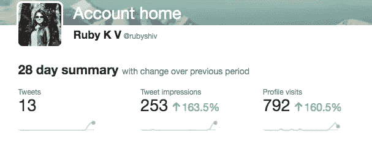

# 通过分叉这个 Git 库，将您的 Twitter 印象提升 100%

> 原文：<https://medium.com/javarevisited/raise-your-twitter-impressions-by-100-percent-by-forking-this-repository-17b6d5fed32b?source=collection_archive---------1----------------------->

## 这个周末，用一个有趣的应用程序玩得开心😜

作者图片——在不到 3 天的时间里发了 13 条推文(接近 5 条/天)

## 一点历史

几年前，我使用了一个流行的 tweet 调度程序的免费版本。我不太喜欢漂亮的用户界面，但这个应用程序有一个相当错误的用户界面。既然人们为那个应用付费，我假设付费版本是…