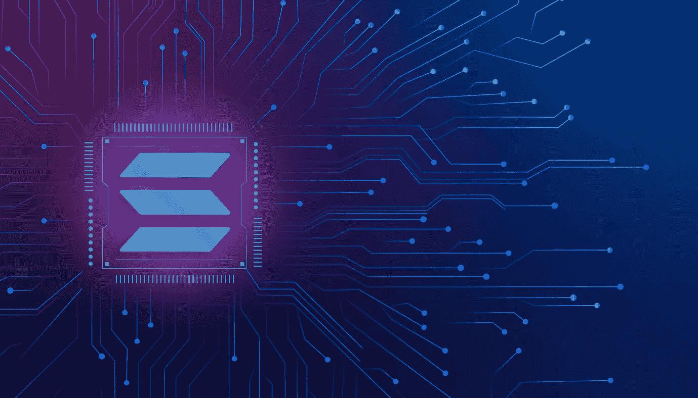

# Rarible 集成 Solana 区块链:如何在 Solana 上创建 Rarible 克隆？

> 原文：<https://medium.com/javarevisited/rarible-integrates-solana-blockchain-how-to-create-rarible-clone-on-solana-9a72b93340ec?source=collection_archive---------4----------------------->

稀有克隆

Web 3.0 空间正在全速扩张，最好的证据就是基于社区的 NFT 市场、DeFi 平台和其他分散应用的推出。像 Rarible 这样的 [**NFT 市场是以社区为中心的，支持建立在不同区块链上的 NFT 的交易。所以，是的，这篇文章是关于稀有的，在这个竞争激烈的 NFT 市场上有什么新的东西。**](https://readwrite.com/how-to-launch-a-lucrative-nft-marketplace-like-rarible-a-beginners-guide-2021/)

📌 **Rarible 整合 Solana 区块链，为其帽子增添更多羽毛**

**Rarible 集成 Solana 区块链**

Rarible 为自己是一个扩展多链支持的 NFT 交易平台而自豪。目前，该平台支持[区块链](/javarevisited/6-best-places-to-learn-blockchain-for-free-dcb20bd92c8f)，如[以太坊](https://javarevisited.blogspot.com/2021/11/top-5-courses-to-learn-ethereum-for.html)、多边形和流。值得注意的是，该平台已经宣布整合索拉纳区块链，旨在促进建立在不同区块链网络上的[NFT](/javarevisited/10-best-nfts-courses-and-certifications-for-beginners-to-learn-non-fungible-tokens-in-2022-3f36a4374ba)的交易。

当将多个区块链网络整合成一个 [**NFT 交易平台**](https://bitcoinist.com/nfts-in-a-nutshell-a-weekly-review-59/) 时，交易数量和交易量将越多。NFT 交易员将受益于能够在一个平台上轻松买卖不同区块链的 NFT。

📌**为什么是索拉纳？**

在区块链整合到平台的序列中，Rarible 的下一步行动是整合 Solana。因此，自然地，将会出现的问题是 Rarible 具体实现 Solana 背后的原因。让我们快速看看选择索拉纳区块链作为 [**NFT 交易平台**](https://www.appdupe.com/rarible-clone) **的主要好处。**

⚈Firstly 认为，高速交易将是 NFT 交易者的期望之一。迄今为止，Solana 是最快的区块链网络，有可能促进即时交易。

⚈Next 以交易速度、市场的流动性为买卖双方所关注。索拉纳也属于保证即时流动性的区块链类别；因此，交易者不会经历任何寻找买家的等待时间。

⚈And 这个[区块链](https://hackernoon.com/6-best-websites-to-learn-blockchain-online)的另一个特点是它扩展的互操作性支持。

总的来说，完全在索拉纳上开发一个市场，或者将平台与索拉纳区块链以及其他区块链整合在一起是有效的。

📌**$ RARI——稀有的本土象征**

一开始，我提到 Rarible 是一个以社区为中心的市场。据你所知，任何以社区为中心的市场或应用程序都将基于来自社区成员的决策而运行。这种投票特权被称为治理。任何支持治理属性的平台都会有治理令牌。只有那些拥有治理令牌的人才能参与投票会话。

$RARI 是本地加密货币或 Rarible 的治理令牌。一般平台用户会通过支付相应的[密码](https://javarevisited.blogspot.com/2022/01/5-best-courses-to-learn-cryptocurrency.html)来购买治理令牌。然而，一些平台也将代币作为奖励分发给他们的用户，这受到某些条款和条件的限制。例如，一些市场将举办虚拟活动，并向参与者分发代币。

🔥**像 NFT 市场开发一样罕见——有多简单？**

像 Rarible 这样的 NFT 市场

像 OpenSea、Rarible 和其他许多 NFT 市场已经为 NFT 交易平台设立了一个基准，这样它就会欢迎更多的交易者。在这里，用“基准”这个词，我想强调平台支持的特性和区块链的类型，这使得它很有吸引力。

毫无疑问，你可以找到一个包含类似功能和区块链支持的市场。然而，开发这样一个前沿平台所需的时间会更多，因为集成更多区块链的复杂性很高。NFT 市场的开发者已经想出了一个简单的方法来构建一个完美的 NFT 平台，它具有与先锋平台相似的所有特性和功能，这就是克隆解决方案。

一个[稀有的克隆](https://techcrunch.com/2022/07/17/nfts-have-the-potential-to-become-media-companies-rarible-co-founder-says/)是一个完整的现成的 NFT 市场解决方案，在那里你可以找到所有需要的预构建功能。您从这种随时可部署的解决方案中获得的突出优势是您可以进行定制。

📌**结果**

2021 年，NFTs 的市场规模为 150 亿美元。研究分析师预测，这一规模将扩大，到 2022 年达到 1220 亿美元。尽管许多人认为非正规金融服务的增长仍处于初级阶段，但市场规模是绝对的，这表明非正规金融服务已经在经历巨大的增长。因此，启动一个像 Rarible 这样的 [**NFT 市场，在交易者数量、交易量以及你的市场繁荣所需的几乎一切方面，都更有利于你的业务。**](https://www.appdupe.com/rarible-clone)