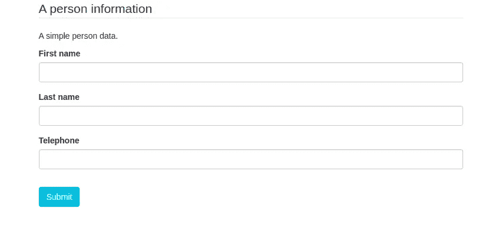
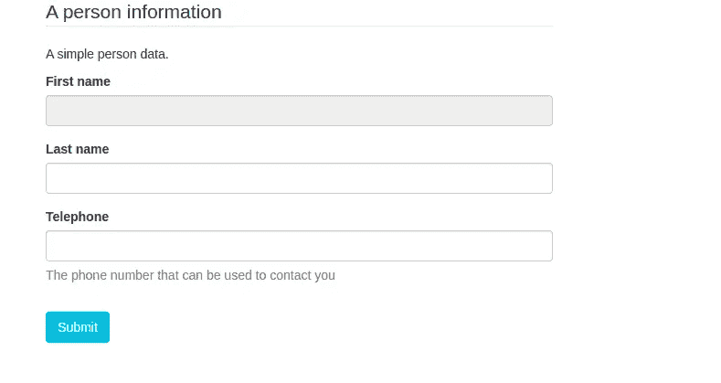
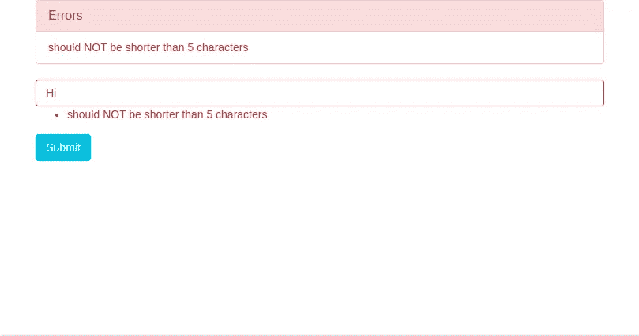

# React JSON 模式表单

> 原文：<https://medium.com/javarevisited/react-json-schema-form-cdc8fbb06f8c?source=collection_archive---------0----------------------->

最近，我一直在探索这个名为 React JSON Schema Form 的库。这个项目是由 Mozilla 团队开始的，后来演变成一个单独的独立项目。它基本上是一个非常简单但不那么简单的表单组件。任何想要集成一个包含各种小部件、特性和定制的表单的人都可以在他们的 React 应用程序中使用这个库。

RJSF 根据 [**JSON 模式**](http://json-schema.org/) 生成 React 表单。它将数据捕获为一个 [JSON 对象](https://www.java67.com/2016/10/3-ways-to-convert-string-to-json-object-in-java.html)。它还提供了像 form props 和 uiSchema 这样的工具来定制表单的外观。

# **为什么你也应该关心了解它？**

> 代码重用是软件工程的圣杯。~道格拉斯·克洛克福特

*   它是开源的，有一个非常活跃的社区。非常感谢 RJSF 社区和所有乐于助人的人们。
*   非常容易安装和集成到应用程序中。
*   有大量的小部件可用。你说出它的名字，它就在那里！
*   甚至可以融入自己喜欢的主题。RJSF 支持 Bootstrap 3(默认)、 [Bootstrap 4](/javarevisited/6-best-bootstrap-online-courses-for-web-designers-and-developers-a688e192b2e2) 、MUI 4 & 5、fluent-ui、antd、Semantic-ui、chakra -ui，你甚至可以创建自己的定制主题。
*   这个库不仅支持自定义主题，还支持[自定义部件和字段](https://react-jsonschema-form.readthedocs.io/en/latest/advanced-customization/custom-widgets-fields/)和[自定义模板](https://react-jsonschema-form.readthedocs.io/en/latest/advanced-customization/custom-templates/)。

# 深入 RJSF

## 装置

首先，从 npm 安装依赖项:

```
$ npm install @rjsf/core — save
```

然后导入依赖关系:

```
**import** Form **from** “@rjsf/core”;
```

**注意:** RJSF 使用 [Bootstrap](/javarevisited/7-free-courses-to-learn-bootstrap-for-web-designers-and-developers-5135215648f1) 语义呈现表单字段和窗口小部件，这意味着您需要在页面上加载 Boostrap 样式表，通过在**" public>index . html "**中添加以下内容来正确查看表单:

```
<link rel="stylesheet" href="https://cdn.jsdelivr.net/npm/bootstrap@3.3.7/dist/css/bootstrap.min.css" integrity="sha384 BVYiiSIFeK1dGmJRAkycuHAHRg32OmUcww7on3RYdg4Va+PmSTsz/K68vbdEjh4u" crossorigin="anonymous">
```

现在，您可以开始创建表单了。

## 配置

1.  **JSON 模式:**为另一个 JSON 对象定义模式的 JSON 对象被称为 JSON 模式，并遵循 JSON 模式标准中描述的约定。基本上，我们用另一个 [JSON 对象](https://javarevisited.blogspot.com/2013/02/how-to-convert-json-string-to-java-object-jackson-example-tutorial.html)定义 JSON 对象的形状。如果我们想获取一个人的名字、姓氏和电话，那么预期的数据 JSON 对象将如下所示:

JSON Shema 对象定义了上面的数据对象的形状，如下所示:

您的表单组件应该如下所示:

这是最起码的开始。让我们看看我们的表单看起来怎么样..

[](https://javarevisited.blogspot.com/2018/02/how-to-parse-json-with-date-field-in-java-jackson-example.html)

**注意:**您可以在组件本身中定义 [JSON 对象](https://www.java67.com/2019/09/3-ways-to-ignore-null-fields-in-json-java-jackson.html)，或者您可以创建一个单独的 JSON 文件，然后在表单组件中给出该 JSON 文件的路径，如下所示:

```
const schema = require("../schema.json")
```

2. **UI 模式:**使用 JSON 模式，我们可以控制在表单中定义什么，但是使用 UI 模式，我们可以控制如何呈现。

在表单组件中添加 uiSchema:

添加 uiSchema 后，我们的表单如下所示:

[](https://javarevisited.blogspot.com/2022/03/3-examples-to-parse-json-in-java-using.html)

3.**表单数据:**有时候我们想用已有的数据来预填数据。这可以通过传递一个与模式匹配的`formData` prop 对象来完成。

## **验证**

正如我们所知，JSON 模式定义了我们用表单捕获的 JSON 数据的形状。JSON 模式允许我们精确地定义形状。但不仅限于此，我们甚至可以限制字符串的长度，只允许某些模式，或者电子邮件正则表达式，等等。验证示例如下:

该表单将如下所示:



## **依赖关系**

RJSF 支持依赖关系，允许我们向表单添加一些功能。我们可以根据用户输入动态地改变表单。在深入了解依赖关系之前，您需要了解动态模式置换:

*   `allOf`:必须对所有子模式有效
*   `not`:对于给定的模式，必须无效
*   `oneOf`:必须对其中一个子模式有效
*   `anyOf`:必须对任何子模式有效

要了解更多依赖关系，请查看他们的[文档](https://react-jsonschema-form.readthedocs.io/en/latest/usage/dependencies/)。

**注意:**在最新的 JSON 模式标准中，依赖性已经被删除，但是 RJSF 仍然支持它。

我希望这篇博客能够帮助您开始使用 RJSF 库，并将其集成到 React 应用程序中。现在，我把探索 RJSF 过多特性的好奇心留给你，从他们的<https://react-jsonschema-form.readthedocs.io/en/latest/>****官方文档中。**查看 [**现场游乐场**](https://rjsf-team.github.io/react-jsonschema-form/) ，通过实例加深理解。另外，我创建了一个简单的 [**表单**](https://github.com/Anushka-shukla/RJSF) 供你参考，你可以在我的 [**GitHub**](https://github.com/Anushka-shukla) 上查看。**

**一定要让我知道你的反馈和建议，这样我就可以通过在这个博客上添加更多的东西来改进。**

**随时在[**LinkedIn**](https://www.linkedin.com/in/anushka--shukla/)**或**[**Twitter**](https://twitter.com/anushka__shukla)上与我联系。******

****谢谢大家！****