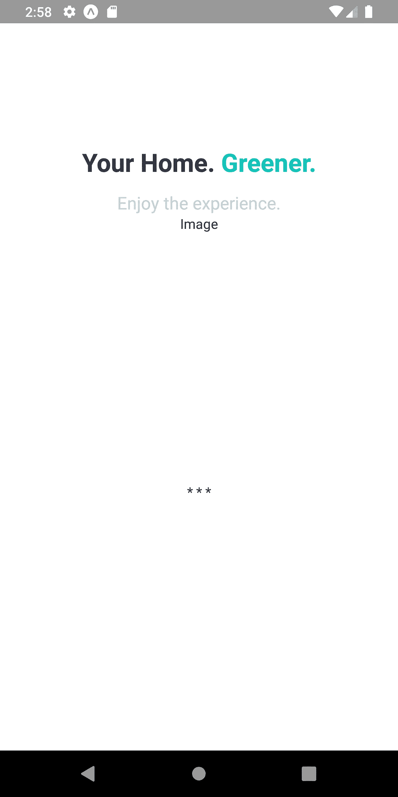
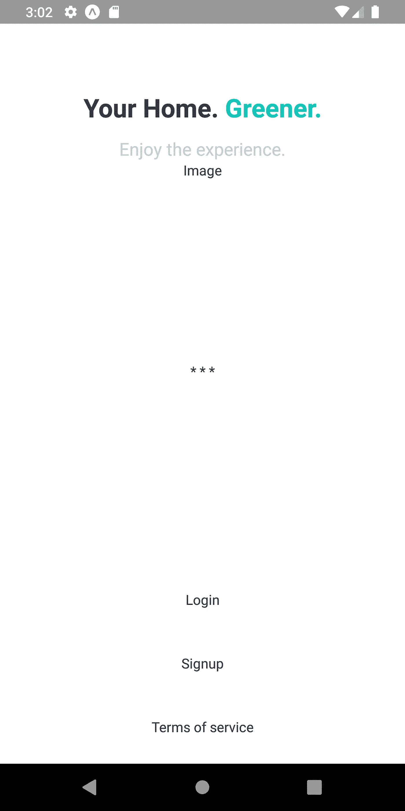
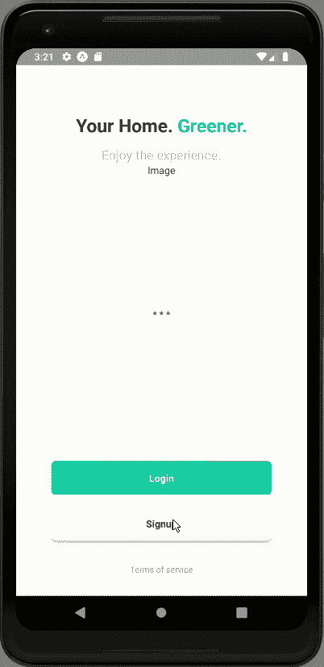
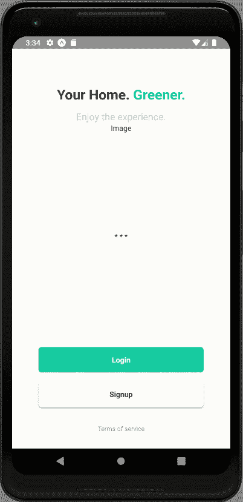

# React 本地工厂应用程序 UI # 3:实现欢迎屏幕

> 原文：<https://medium.com/javarevisited/react-native-plant-app-ui-3-implementing-welcome-screen-a921053ccb09?source=collection_archive---------1----------------------->


本教程是我们 React 原生植物应用教程系列的第三部分。在[上一部分](https://kriss.io/react-native-plant-app-ui-2-implementing-custom-components/)中，我们成功实现了我们的’中的所有组件。/components '文件夹。本教程是我们上一部分停止的同一教程的继续。因此，建议仔细阅读前一部分，以便对整个项目有所了解和认识。

如果您想从头开始学习，本教程系列的所有部分都可以在下面找到:

*   [React 本地植物应用 UI #1:入门](https://kriss.io/react-native-plant-app-ui-1-getting-started/)
*   [React 本地植物应用程序 UI #2:目的地部分](https://kriss.io/react-native-plant-app-ui-2-implementing-custom-components/)

如前几部分所述，本教程系列的灵感来自于 [React Native 应用程序模板](http://instamobile.io)，该模板适用于各种用 React Native 编写的移动应用程序模板，并由通用特性和设计提供支持。这些应用程序模板允许我们实现自己的应用程序，甚至启动自己的创业公司。此外，这第三部分也是 Youtube 视频教程中的编码实现和设计的延续，由 [React UI Kit](https://www.youtube.com/watch?v=gyiwFcrVRCM&list=PLNRPou200YIeu4UllJkv8-Ca19Ld_eOay&index=2) 用于 Plant 应用程序。视频教程非常全面地介绍了整个应用程序的编码实现，但没有任何口头指导。本教程系列是实现相同的编码风格和设计形式的文章。因此，学习者可以经历每一步，慢慢理解实现。

## 概观

在本系列教程的第三部分中，我们将实现欢迎屏幕的一些 UI 部分。这个想法是从实现欢迎屏幕标题/口号部分开始。然后，我们将划分出不同的 UI 部分，我们将在欢迎屏幕中以函数的形式实现这些部分。最后，我们将在欢迎屏幕上添加不同的按钮以及导航配置。

*那么，让我们开始吧！！*

## 欢迎屏幕的实现

这里，我们将在 Welcome.js 文件中实现欢迎屏幕的一些 UI 部分。首先，我们将设置欢迎屏幕的标题或标语部分。为此，我们需要在 Welcome.js 文件的`render()`函数中使用以下代码片段中的代码:

```
render(){
   return (
     <Block>
       <Block center bottom flex={0.4}>
         <Text h1 center bold>
           Your Home.
           <Text h1 primary> Greener.</Text>
         </Text>
         <Text h3 gray2 style={{ marginTop: theme.sizes.padding / 2 }}>
           Enjoy the experience.
         </Text>
       </Block>
       <Block center middle>
         <Text>Welcome</Text>
       </Block>
     </Block>

   );
 }
```

这里，我们使用了`Block`组件以及一些`Text`组件。这些组件不是来自 react-native 包。因此，这些是我们在前面的教程部分中实现的预定义的定制组件。我们还为组件文件中已经配置好的组件分配了一些道具。因此，我们需要将常量 theme.js 文件导入到 Welcome.js 文件中:

```
import { theme } from '../constants';
```

因此，我们将在模拟器屏幕中获得以下结果:


正如我们所看到的，我们的欢迎屏幕上有口号部分，看起来非常吸引人。现在，我们将在欢迎屏幕上划分不同的 UI 部分。因此，每个部分的代码变得更加清晰，我们也更容易实现。

## 在欢迎屏幕中分隔不同的用户界面部分

这里，我们将分开两个 UI 部分。一个是插图部分，另一个是步骤(分隔符点)部分。我们将为这两个部分实现不同的功能。该函数将返回这些部分的模板。

## 插图部分

此部分将包含图像，这将是水平滚动。现在，我们只是用下面的代码片段所示的`renderIllustrations()`函数将它分离出来:

```
renderIllustrations(){
   return(
     <Block>
       <Text>Image</Text>
     </Block>
   )
 }
```

## 步骤部分

本节将根据插图数量包含分隔符点。这个想法是每当我们滚动插图时，动画到活跃点。为此，我们将使用下面代码片段中提供的名为`renderSteps()`的函数:

```
renderSteps(){
   return(
     <Block>
       <Text>* * *</Text>
     </Block>
   )
 }
```

现在，我们需要将这两个函数都调用到我们的`render()`函数中，如下面的代码片段所示:

```
render(){
   return (
     <Block>
       <Block center bottom flex={0.4}>
         <Text h1 center bold>
           Your Home.
           <Text h1 primary> Greener.</Text>
         </Text>
         <Text h3 gray2 style={{ marginTop: theme.sizes.padding / 2 }}>
           Enjoy the experience.
         </Text>
       </Block>
       <Block center middle>
         {this.renderIllustrations()}
         {this.renderSteps()}
       </Block>
     </Block>

   );
 }
```

这里，我们用函数调用替换了带有“欢迎”文本的`Text`组件。因此，我们将在模拟器屏幕中获得以下结果:



正如我们所看到的，我们已经分离出了两个 UI 部分。由“图像”文本标记的插图部分。步骤部分由三个星号标记。

## **实现按钮部分**

这里，我们将在欢迎屏幕的底部步骤部分的正下方添加按钮。我们将添加登录、注册和条款与条件(TOC)三个按钮。为此，我们需要在`render()`函数中使用以下代码片段中的代码:

```
<Block center middle>
  {this.renderIllustrations()}
  {this.renderSteps()}
</Block>
<Block middle flex={0.5} margin={[0, theme.sizes.padding * 2]}>
  <Button>
    <Text center>Login</Text>
  </Button>
  <Button>
    <Text center>Signup</Text>
  </Button>
  <Button>
    <Text center>Terms of service</Text>
  </Button>
</Block>
```

这里，我们在`Block`组件包装函数调用下面添加了另一个`Block`组件。该`Block`组件用`Text`组件包裹三个`Button`组件。因此，我们将在模拟器屏幕中获得以下结果:



正如我们所看到的，我们得到了纯文本形式的按钮，这似乎并不吸引人。因此，我们将添加一些风格，使它们看起来更有吸引力。

## **按钮样式**

在将样式道具应用到`Button`和`Text`组件之前，我们需要对。/components/'文件夹。为此，我们需要安装名为 [expo-linear-gradient](https://docs.expo.io/versions/latest/sdk/linear-gradient/) 的软件包。这个包提供了一个渲染渐变视图的 React 组件。现在，我们将把这个包作为`LinearGradient`导入到 Button.js 文件中，如下面的代码片段所示:

```
import { LinearGradient } from 'expo-linear-gradient';
```

*注意，我们安装了这个包，因为提供* `*LinearGradient*` *组件的 expo 包已经被分离到这个包中。*现在，我们将为`Button`组件添加一些样式道具，如下面的代码片段所示:

```
<Block middle flex={0.5} margin={[0, theme.sizes.padding * 2]}>
  <Button gradient>
    <Text center semibold white>Login</Text>
  </Button>
  <Button shadow>
    <Text center semibold>Signup</Text>
  </Button>
  <Button>
    <Text center caption gray>Terms of service</Text>
  </Button>
</Block>
```

这里，我们在按钮上添加了`gradient`和`shadow`道具。我们还用一些颜色和位置道具设计了我们的`Text`组件。因此，我们将在模拟器屏幕中获得以下结果:



如我们所见，我们的欢迎屏幕上有漂亮的按钮。登录按钮有渐变颜色，注册按钮有阴影样式。现在，我们应该已经猜到这两个按钮导航到登录和注册屏幕。因此，我们现在将向它们添加导航配置。

## 向按钮添加导航

这里，我们将向按钮添加导航配置。为此，我们将使用由`navigation` prop 提供的`navigate()`函数，如下面的代码片段所示:

```
<Block middle flex={0.5} margin={[0, theme.sizes.padding * 2]}>
  <Button gradient onPress={() => this.props.navigation.navigate('Login')}>
    <Text center semibold white>Login</Text>
  </Button>
  <Button shadow onPress={() => this.props.navigation.navigate('SignUp')}>
    <Text center semibold>Signup</Text>
  </Button>
  <Button onPress={() => {}}>
    <Text center caption gray>Terms of service</Text>
  </Button>
</Block>
```

这里，我们已经将导航配置添加到了`Button`组件的`onPress`事件中。但是，我们可能记得，我们已经在的 **index.js 文件中注释掉了`Login`和`SignUp`屏幕。/导航'文件夹**。**现在，是时候取消'的 index.hs 文件中登录和注册屏幕的注释了。/navigation/'文件夹。**现在，我们需要给这两个屏幕添加一个简单的 [React Native](https://javarevisited.blogspot.com/2018/02/5-react-native-courses-to-learn-mobile-development-using-JavaScript.html) 模板。在 Login.js 文件中，我们将使用以下代码片段中的代码来实现一个简单的模板:

```
import React from 'react';
import { StyleSheet } from 'react-native';

import { Button, Block, Text } from '../components';

export default class Welcome extends React.Component {

 static navigationOptions = {
   header : null
 }

 render(){
   return (
     <Block middle>
       <Text>Login</Text>
     </Block>

   );
 }
 }

const styles = StyleSheet.create({

});
```

Signup.js 文件中的注册屏幕也是如此:

```
import React from 'react';
import { StyleSheet } from 'react-native';

import { Button, Block, Text } from '../components';

export default class Welcome extends React.Component {

 static navigationOptions = {
   header : null
 }

 render(){
   return (
     <Block middle>
       <Text>Sign Up</Text>
     </Block>

   );
 }
 }

const styles = StyleSheet.create({

});
```

现在，如果我们在欢迎屏幕中单击这两个屏幕各自的按钮，我们可以测试导航到这两个屏幕是否有效。因此，我们将在模拟器屏幕中获得以下结果:



正如我们所看到的，当我们单击欢迎屏幕上的相应按钮时，我们已经成功地将导航配置为登录和注册屏幕。至此，我们就到了这部分教程的结尾。

最后，我们已经在 React 原生植物应用程序中成功实现了欢迎屏幕的标语和按钮部分。

## **结论**

本教程是 React Native Plant App 教程系列的第三部分。在这一部分中，我们从本系列教程的第二部分停止的地方继续。在教程的这一部分，我们通过使用预定义的定制组件实现了欢迎屏幕的标语部分。然后，我们分离出返回插图和步骤部分模板的函数。最后，我们学习了如何利用`Button`组件来实现按钮，用不同的道具来设计它们，以及用导航特性来配置它们。

在本系列教程的下一部分中，我们将实现我们在本教程部分中分离出来的插图和步骤部分。

*所以，敬请期待！！！*

**继续学习**

[](https://hackernoon.com/top-5-react-native-courses-for-mobile-application-developers-b82febdf8a46) [## 面向移动应用开发者的五大 React-Native 课程

### 如果你是一名网络开发人员，想进入移动应用程序开发的广阔世界，但又不想花费…

hackernoon.com](https://hackernoon.com/top-5-react-native-courses-for-mobile-application-developers-b82febdf8a46) 

*最初发表于* [*克里斯*](https://kriss.io/react-native-plant-app-ui-3-implementing-welcome-screen/) *。*