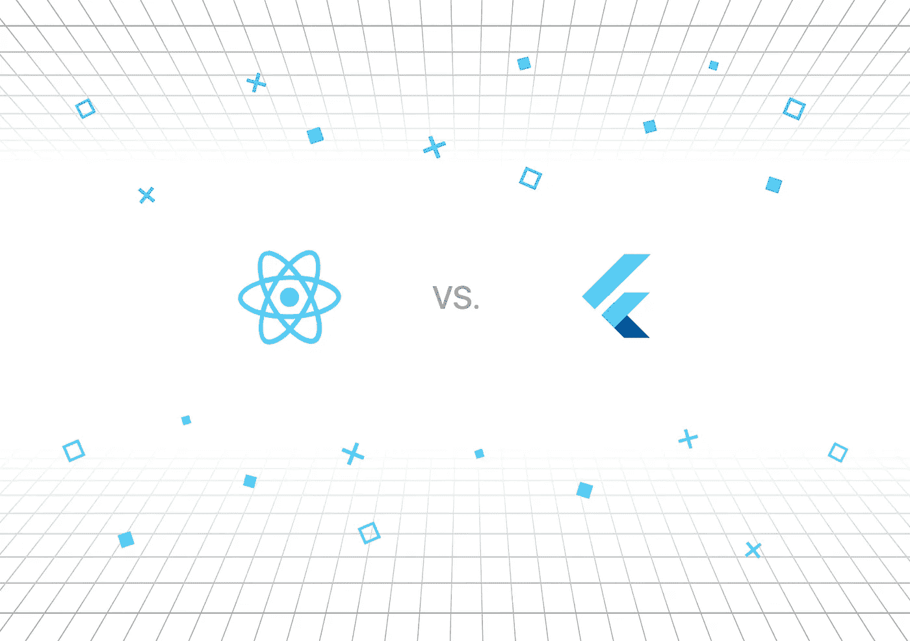

# 跨平台移动开发:反应原生还是颤动？

> 原文：<https://medium.com/javarevisited/react-native-vs-flutter-what-to-chose-for-cross-platform-mobile-development-676ab375b157?source=collection_archive---------2----------------------->

这篇文章的目的是给你一个颤振和反应原生概述。我们将比较这两种跨平台技术，以帮助您为未来的应用程序开发选择最佳选项。

根据各种估计，世界上已经有大约 50 亿部智能手机。其中高达 80%的人使用 Android 操作系统，不到 20%——[iOS](/javarevisited/top-5-online-courses-to-learn-ios-12-swift-in-2019-a35ae1be7b2b?source=---------56------------------)。然而，每个国家都有自己的特点。

例如，在美国，超过 65%的智能手机运行在 iOS 上。创建移动应用程序时，通常需要在 [iOS](/javarevisited/my-favorite-free-courses-to-learn-ios-app-development-f172e7d3ba5d) 和 [Android](/javarevisited/5-free-courses-to-become-an-android-developer-d4d207f53675) 上发布版本。为此，您可以转向跨平台(“混合”)开发。

由于跨平台框架，使用一种技术为 iOS 和 Android 准备版本变得可能“一举两得”。在框架中，以下是特别普遍的:

脸书[反应本土](/javarevisited/my-favorite-free-react-native-courses-for-beginners-in-2020-4629f5274eb6)

*   适用于 iOS、Android 和 Windows 应用程序；
*   使用 JavaScript 和 React.js 库作为主要开发工具。

谷歌[扑](/javarevisited/my-favorite-flutter-and-dart-programming-courses-for-beginners-9e8355710d78)

*   对于 Android、IOS 和 Fuchsia 应用程序；
*   使用 Dart 语言，该语言也用于 web 编程。

# 反应自然和颤动

[**React Native**](https://www.java67.com/2020/07/5-free-courses-to-learn-react-native-in.html) 是由脸书软件工程师 Jordan Walkie 打造的跨平台移动 app 开发框架。2015 年，React Native 成为开源项目。

[**Flutter**](https://www.java67.com/2020/06/5-free-courses-to-learn-flutter-in-2020.html) 也是 Google 团队开发的跨平台开源移动 app 开发框架。它于 2017 年在谷歌 I/O 大会上首次公布。2019 年 7 月发布稳定版。

现在我们来对比一下。

*根据谷歌趋势统计，React Native 和 Flutter 越来越受欢迎，尽管速度不同。*

跨平台框架为多个操作系统“定制”了一个应用程序，因此不需要为每个平台创建独特的元素。因此，您将获得以下好处:

*   需要更少的专家；
*   花费更少的时间和资源；
*   发展速度提高。

如果应用程序逻辑在所有平台上都是相同的，并且接口简单，混合开发可以帮助您更快地进入市场。我们建议在以下条件下使用像 [React Native](/javarevisited/top-5-react-native-courses-for-mobile-application-developers-b82febdf8a46) 和 [Flutter](https://javarevisited.blogspot.com/2019/07/top-5-online-training-courses-to-learn-flutter.html) 这样的框架:

*   如果你需要在短时间内为几个平台写一个应用的原型；
*   如果应用程序从服务器获取所有信息，逻辑在服务器上实现，动画和界面没有根本的重要性；
*   如果最低数量的原生功能(如推送通知、应用内购买、地理定位等。)被使用；
*   如果适度的性能是可接受的并且内容是从因特网下载的。

# 他们有什么共同点

旋舞和反应原生有几个相似之处:

1.  它们都为多个平台提供应用开发，包括 [iOS](https://javarevisited.blogspot.com/2019/01/top-5-ios-developer-course-to-learn-ios.html) 、 [Android](/javarevisited/top-5-courses-to-learn-android-for-java-programmers-667e03d995b4) 和 UWP。虽然 Flutter 得到了谷歌的支持，但它也支持 iOS。
2.  每个框架都由科技巨头支持——React Native 由脸书支持，谷歌提供 Flutter 作为移动应用开发的开源 SDK。
3.  就 Flutter 与 React 原生文档而言，两个社区都热衷于提供更新的文档，包括 API 链接和广泛的资源。
4.  虽然这两个平台都为 iOS 和 Android 平台提供了出色的 UI 支持和原生体验，但 React Native 使用基本的 UI 组装元素，而 Flutter 使用小部件来提供自己的体验。
5.  热重新加载是移动应用程序开发中一个非常重要的功能，因为它允许开发人员触发对应用程序现有状态的更改，而不必从头重新编译所有代码，这提高了效率并加快了开发过程。React Native 和 Flutter 都支持这个特性。在 Flutter 的例子中，这被称为“有状态热重装”。

# 语言

React Native 使用 JavaScript，而 Flutter 使用 Dart 作为编程语言。在易用性方面， [JavaScript](/javarevisited/12-free-courses-to-learn-javascript-and-es6-for-beginners-and-experienced-developers-aa35874c9a32) 更受欢迎，广泛用于编码，不仅用于移动设备，也用于网站和服务器。相比之下，Dart 较新，使用多种语言的最新功能来创建自己的体验。比较适合有面向对象语言经验的开发者，比如 [Java](/javarevisited/top-5-java-online-courses-for-beginners-best-of-lot-1e1e240a758) 、 [C++](/javarevisited/top-10-courses-to-learn-c-for-beginners-best-and-free-4afc262a544e) 。

# 证明文件

Google 为 Flutter UI 平台提供了结构良好且健壮的文档。另一方面，React Native 为用户提供的文档不足。尽管有许多 React 本地用户，但非结构化的指南仍然是一个显著的缺点。

尽管 Flutter 是一个新的框架，但是切换到它是很容易的。 [Dart](https://dart.dev/) 语言类似于 [Kotlin](/javarevisited/top-5-courses-to-learn-kotlin-in-2020-dfc3fa7706d8?source=---------16------------------) 、 [Java](https://javarevisited.blogspot.com/2018/07/top-5-websites-to-learn-coding-in-java.html) 等等。这样懂这些编程语言的开发者就可以开始使用 Dart 开发 flutter 移动设备，没有太大的阻碍。

# 表演

React Native 需要一个 JavaScript 桥来与原生元素交互。Flutter Dart 编程语言编译代码比 [JavaScript](/javarevisited/10-best-online-courses-to-learn-javascript-in-2020-af5ed0801645) 快。因此，它可以以每秒 60 帧的标准速度显示动画。

React Native 架构由两个主要组件组成:JavaScript 和 Native。一开始，它只使用 JS。但是，您必须使用桥来与设备交互(例如，通知)。它有助于将 JavaScript 变量转换成本地变量。这也是 React Native 虽然强大，但比其他原生移动 app 开发工具更循序渐进的原因。

# UI 组件

因为 React Native 使用本地组件，所以在定制 UI 时，Flutter 是首选，因为它有自己的小部件集，使定制的 UI 设计更动态，更具沉浸感。另一方面，应用程序可能缺少一些让用户分心的组件。

另一方面，开发人员可以获得更加个性化的用户界面，因为 React 原生 UI 库非常广泛。React Native 提供了一个更加动态的框架，可以轻松改善用户体验。

# 社区

React Native 是 2015 年推出的，Flutter 是 2017 年才发布的。因此，许多流行的移动应用程序都是使用 React Native 开发的。脸书、Skype、Instagram 等等。此外，React Native 的用户比 Flutter 多得多。然而，Flutter 正在迅速流行起来。

# 发展速度

[Flutter](https://dev.to/javinpaul/top-5-courses-to-learn-flutter-and-dart-in-2020-3bkm) 支持快速应用开发，这让许多开发人员感到高兴。Flutter 还允许使用原生代码，这样你的应用程序看起来就像是原生的。包括了大量的小部件，比如导航、滚动和字体。此外，软件开发度量表明，使用 Flutter 可以主要用于解决 UI 问题。

React 原生应用的开发过程很快，这要归功于现成组件的可用性。该组件有助于加速移动应用程序开发，避免令人头疼的问题。React 原生平台缩短了移动应用的开发时间，增加了更多的 UI，开发项目所需的时间也更少。

# 稳定性比较

开发跨平台应用程序时，稳定性正成为一个重要因素。Flutter 落后了，因为它只有一个 alpha 版本，不太适合长期项目。然而，谷歌最近宣布了 Flutter Beta 2，它提供了改进的开发工具和资产系统。

React Native 从一开始就非常稳定，并得到了许多贡献者的支持。

# 测试

开发者有所有的 [JavaScript 框架](/javarevisited/10-of-the-most-popular-javascript-frameworks-libraries-for-web-development-in-2019-a2c8cea68094)可用于在单元级测试 React 本地应用。然而，当涉及到 UI 测试和自动化时，情况就不那么好了。

[Flutter](/javarevisited/my-favorite-flutter-and-dart-programming-courses-for-beginners-9e8355710d78) 是一个新的框架，当测试一个新的框架时，可能会有点棘手。但是 Flutter 使用了 [Dart](/javarevisited/6-best-dart-programming-courses-for-beginners-to-learn-in-2021-2-are-free-24dc56f5ac14) ，它提供了一个很好的单元测试框架。因此，Flutter 为开发人员提供了一个以单元测试速度离线测试小部件的绝佳选择。

# 总结

在开发跨平台应用程序时，需要考虑许多因素。这些因素包括应用规模、预算、平台和时间。为移动开发选择最好的基础将取决于具体的任务。

我们应该记住，谷歌对 Flutter 日益增长的兴趣、对它的使用和推广将最终导致它的成功。另一方面，React 原生社区的强大支持、经过验证的可靠性和稳定性也使该平台非常受欢迎并得到积极使用。

*原载于 2020 年 12 月 14 日*[*【https://intexsoft.com】*](https://intexsoft.com/blog/cross-platform-mobile-development-react-native-or-flutter/)*。*