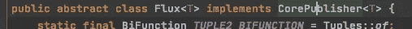
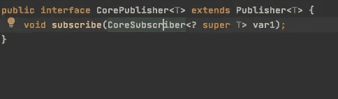
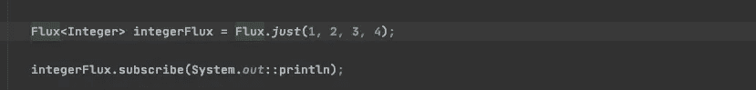
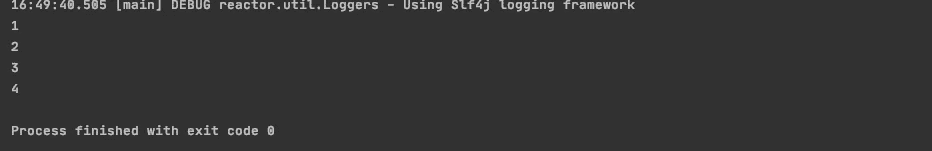
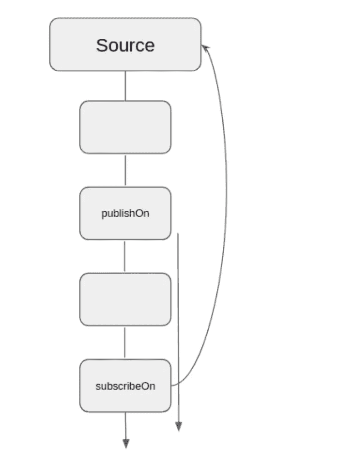
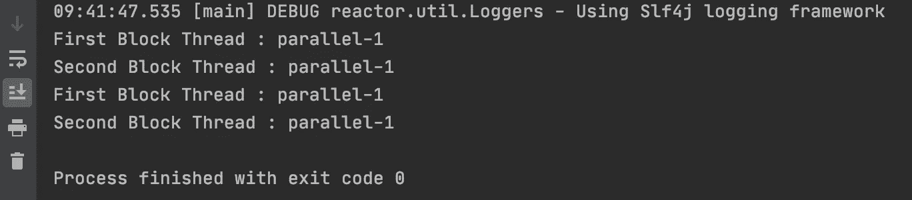
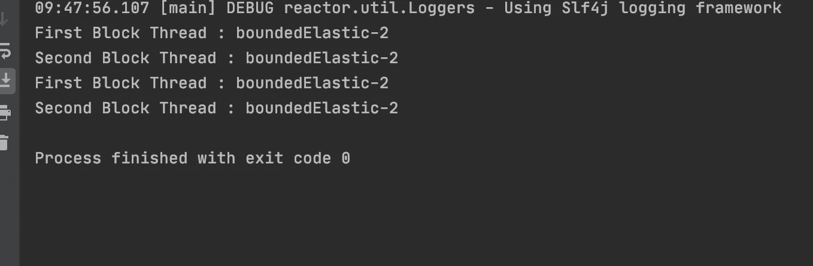

# Java 中的反应式编程基础

> 原文：<https://medium.com/javarevisited/reactive-programming-basics-in-java-part-1-557989b13c8f?source=collection_archive---------1----------------------->

当我开始学习反应式编程时，我发现这里和那里有很多重要的概念，所以想做笔记，后来意识到为什么不把它作为博客发表。所以给你，

## **Java 中什么是反应式编程？**

反应式编程是一种编程范式，它提倡异步、非阻塞、事件驱动的数据处理方法。

术语“反应式”指的是围绕对变化做出反应而构建的编程模型——网络组件对 I/O 事件做出反应，UI 控制器对鼠标事件做出反应，等等。

从这个意义上说，非阻塞是被动的，因为我们现在不是被阻塞，而是在操作完成或数据可用时对通知做出反应。

## **什么是单声道和通量？**

Mono 和 Flux 都是出版商。在 java 中，两者都是从 CorePublisher 实现的，CorePublisher 是从 Publisher 扩展而来的。



Flux 实现 CorePublisher

[](https://javarevisited.blogspot.com/2021/04/best-reactive-spring-and-webflux-courses-for-java-developers.html)

核心发布者扩展发布者

Flux 是发布零个或多个值的发布器，Mono 发布零个或一个值。

*现在让我们看一些例子*

下面是通量的例子，



为了让数据流动，你必须订阅，没有订阅，数据永远不会流动。默认情况下，流是懒惰的，这意味着没有你消费什么都不会执行。

**输出**



而[通量](/javarevisited/7-best-webflux-and-reactive-spring-boot-courses-for-java-programmers-33b7c6fa8995)可以无限大。我们可以利用像 takeUntil 或 take to stop 这样的函数。

takeUntil 的用法

```
Flux.*fromIterable*(lists).takeUntil(s -> s.equalsIgnoreCase("End")).subscribe(System.*out*::println);
```

## **什么是发布和订阅？**



publishOn & subscribeOn 是 Project Reactor 中方便的方法，它接受任何调度程序来更改反应管道中操作的任务执行上下文。subscribeOn 强制源排放使用特定的调度程序，publishOn 为所有下游操作更改调度程序。

**发布**示例:

```
Flux<Integer> flux = Flux.*range*(0, 2)
        .publishOn(Schedulers.*parallel*())
        .map(i -> {
            System.*out*.println("First Block Thread : " + Thread.*currentThread*().getName());
            return i;
        }).map(i-> {
            System.*out*.println("Second Block Thread : " + Thread.*currentThread*().getName());
            return i;
        });

flux.subscribe();
Thread.*sleep*(1000);
```



因此，上述示例在**发布**之后，所有操作都在同一线程上运行，直到我们看到另一个发布，当我们看到遇到发布方法时，它会更改上下文并在单独的线程中运行(基于提到的调度程序)。

**订阅**示例:

```
Flux<Integer> flux = Flux.*range*(0, 2)
        .subscribeOn(Schedulers.*boundedElastic*())
        .map(i -> {
            System.*out*.println("First Block Thread : " + Thread.*currentThread*().getName());
            return i;
        }).
        subscribeOn(Schedulers.*single*())
      .map(i-> {
            System.*out*.println("Second Block Thread : " + Thread.*currentThread*().getName());
            return i;
        });

flux.subscribe();
Thread.*sleep*(1000);
```



在上面的例子中，即使我们已经定义了多个 subscribe 方法(一个是*bounde lastic，另一个是 single scheduler)* 只有靠近源的第一个 subscribe 方法优先。

**注意:** *我们可以有多个发布方法，这些方法会不断切换上下文。然而，subscribeOn 方法不能这样做。只有靠近源的第一个 subscribeOn 方法优先。*

## **什么是调度程序及其类型？**

一个`Scheduler`是给用户控制[线程](https://javarevisited.blogspot.com/2014/07/top-50-java-multithreading-interview-questions-answers.html#axzz6hX6XfwBD)的抽象。它主要有四种类型，或者你也可以选择编写自己的调度程序。

1.  Schedulers.single() —用于所有调用方的单个可重用线程。
2.  Schedulers.immediate() —保持在当前线程中执行。
3.  schedulers . bounde lastic()—与 Elastic 相同，但它的线程池大小(10 * CPU 核心数)，是 IO 操作/非阻塞调用的好选择。
4.  Schedulers.parallel() —适用于 CPU 密集型的短期任务。它可以并行执行`N`这样的任务(默认情况下 N = =数量)

## Schedulers.elastic() —这是一个具有无限线程的线程池，不再是首选。

重要参考:

1.  [https://spring . io/blog/2016/06/07/notes-on-reactive-programming-part-I-the-reactive-landscape](https://spring.io/blog/2016/06/07/notes-on-reactive-programming-part-i-the-reactive-landscape)
2.  [https://docs . spring . io/spring-framework/docs/current/reference/html/we B- reactive . html](https://docs.spring.io/spring-framework/docs/current/reference/html/web-reactive.html)
3.  [https://spring . io/blog/2019/12/13/flight-of-the-flux-3-hopping-threads-and-schedulers](https://spring.io/blog/2019/12/13/flight-of-the-flux-3-hopping-threads-and-schedulers)