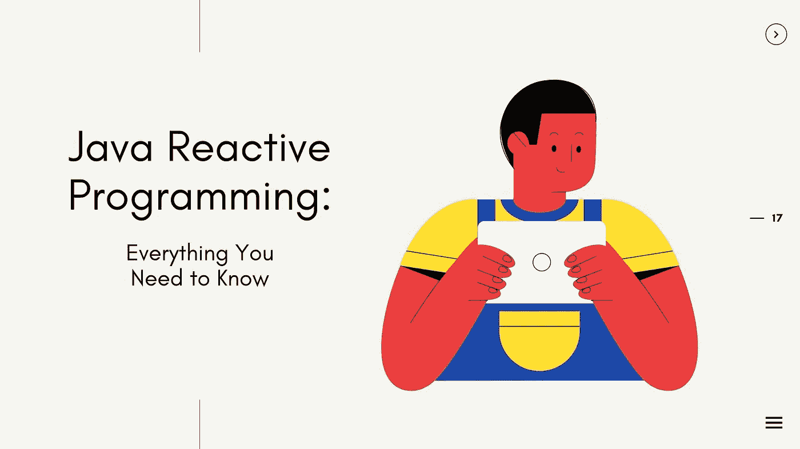

# Java 反应式编程(RxJava)

> 原文：<https://medium.com/javarevisited/reactive-programming-in-java-rxjava-part-2-c1f37ac3282?source=collection_archive---------2----------------------->

图片来源:[https://www . zibtek . com/blog/content/images/2020/11/Java-Reactive-Programming-Everything-You-Need-to-know . jpg](https://www.zibtek.com/blog/content/images/2020/11/Java-Reactive-Programming-Everything-You-Need-to-Know.jpg)

大家好。在本文中，我们将学习反应式 Java (RX Java)

但在这之前，你可以阅读我下面的文章来了解**什么是反应式编程**