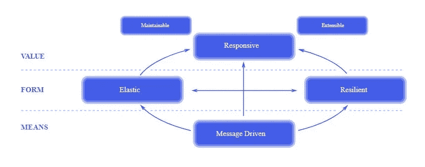

# 反应式编程(第 1 部分)

> 原文：<https://medium.com/javarevisited/reactive-programming-part-1-a3fb88e6c8d8?source=collection_archive---------0----------------------->

大家好，当我不能写作的时候，我的生活发生了很大的变化。我有一个女儿👨‍👩‍👧我是说，我现在是个父亲了😎。适应新的家庭生活需要一些时间，但是我们现在都很开心👨‍👩‍👧我有时间写点好东西😁。

所以回到我的故事，<https://javarevisited.blogspot.com/2021/04/best-reactive-spring-and-webflux-courses-for-java-developers.html>*反应式编程是最近最流行的范例之一。*

*它的流行来自于 ***无阻塞 I/O*** 概念。这个概念描述了当一个代码块运行时，它不会阻塞任何其他线程。简而言之，两个进程可以互不阻塞地工作。*

*让我们开始吧！🦽🦼*

**

*照片由[阿巴斯·特拉尼](https://unsplash.com/@phorgod?utm_source=medium&utm_medium=referral)在 [Unsplash](https://unsplash.com?utm_source=medium&utm_medium=referral) 上拍摄*

## *什么是反应式编程？*

> *一个用可观察流进行异步编程的 API。*

*我们根据 [*面向对象编程*](/swlh/5-free-object-oriented-programming-online-courses-for-programmers-156afd0a3a73) *(OOP)* 开发的程序遵循代码行的流程。因此，它们不足以产生副作用。*

*在这一点上，我们需要其他的东西，能够解决这些副作用。在这里，我们把设计来应对这些副作用的应用程序或代码片段称为*反应式*。*

*[](https://javarevisited.blogspot.com/2018/07/10-object-oriented-design-principles.html)

克里斯·里德在 [Unsplash](https://unsplash.com?utm_source=medium&utm_medium=referral) 上拍摄的照片* 

*应用程序运行时，反应式程序跟随*事件*而不是代码行流。*

*反应系统必须具有以下特征:*

*   *响应式系统在合理的时间内对所有请求做出响应。*
*   *弹性:一个反应式系统即使崩溃了，仍然可以处理请求。*
*   ***弹性:**反应式系统必须在重负载下反应灵敏。*
*   ***消息驱动:**反应式系统使用异步消息传递进行交互。*

*[](https://www.java67.com/2016/07/top-5-object-oriented-design-interview-questions.html)

图来自[https://www.reactivemanifesto.org/](https://www.reactivemanifesto.org/)* 

*如你所见，下面给出了两个关于[阻塞](http://javarevisited.blogspot.sg/2012/02/what-is-blocking-methods-in-java-and.html)和非阻塞 I/O 概念的代码示例。*

```
*// Blocking
alert(1);
var value = localStorage.getItem('foo');
alert(2);*
```

*阻塞样本的输出为`1,... 2`。因为`localStorage`在工作的时候会阻塞 I/O。*

```
*// Non-blocking
alert(1);
fetch('example.com').then(() => alert(2));
alert(3);*
```

*另一方面，非阻塞 I/O 采样的输出是`1, 3,... 2`。这是因为`fetch(...)`在线程运行时不会阻塞 I/O。*

## *为什么要进行反应式编程？*

*如前所述，反应式程序有能力应对副作用。此外，您可以用少量的线程处理更多的请求。*

*如果您的应用程序需要这种能力，您应该学习反应式编程。*

***注:**本教程简单介绍一下反应式编程。我们将在**(第 2 部分)** 中使用 [Spring WebFlux 开发一个反应式邮件服务。所以，继续读下去😄](/@yigitcannalci/reactive-programming-part-2-43f73f43ee68)*

# *资源*

*   *[https://reactivex.io/](https://reactivex.io/)*
*   *[https://www.reactivemanifesto.org/](https://www.reactivemanifesto.org/)*