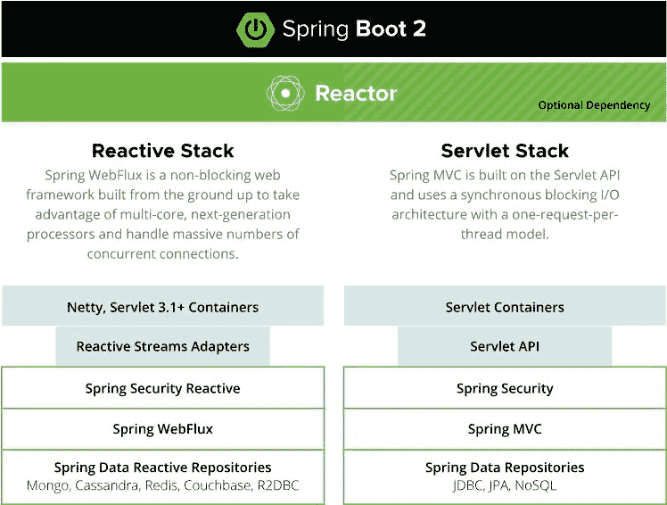
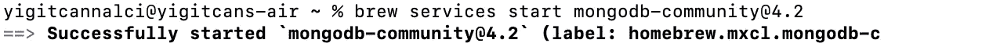
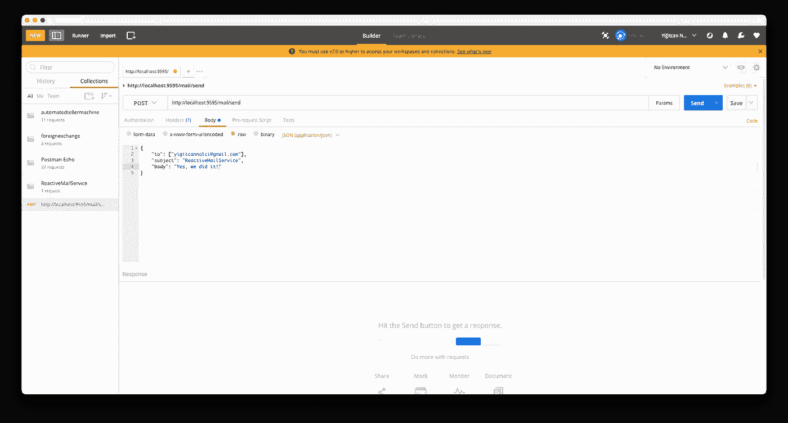
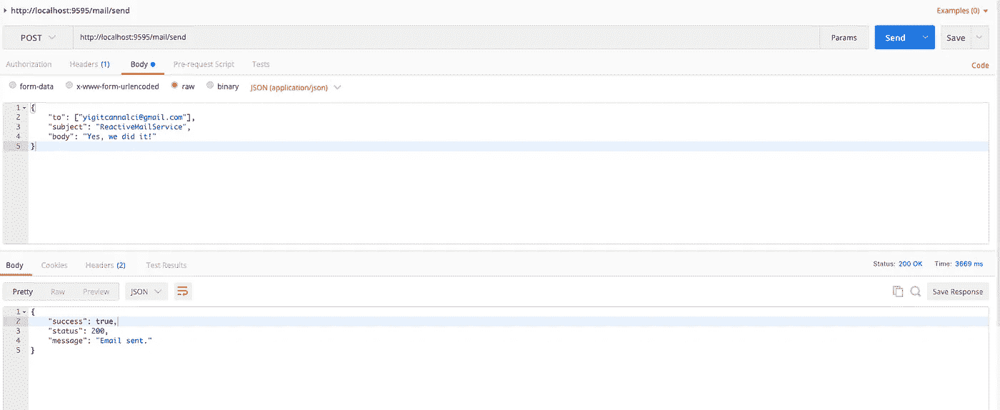

# 反应式编程(第二部分)

> 原文：<https://medium.com/javarevisited/reactive-programming-part-2-43f73f43ee68?source=collection_archive---------0----------------------->

再次嗨，我希望一切都好！我对下面的照片感到高兴，我建议和我有同样感觉的人，深呼吸，看看照片😄。


照片由 [Aaron Burden](https://unsplash.com/@aaronburden?utm_source=medium&utm_medium=referral) 在 [Unsplash](https://unsplash.com?utm_source=medium&utm_medium=referral)

正如我之前所说，我这里有一个反应式编程的实际编码示例。

[](https://javarevisited.blogspot.com/2021/04/best-reactive-spring-and-webflux-courses-for-java-developers.html)

图自 [https://spring.io](https://spring.io/reactive)

在本教程中，我将讲解*“如何用*[*Spring web flux*](/javarevisited/7-best-webflux-and-reactive-spring-boot-courses-for-java-programmers-33b7c6fa8995)*和*[*MongoDB*](/javarevisited/10-free-online-courses-to-learn-mongodb-and-nosql-942609611664)*”*。

# 技术和工具

这里的教程使用 [IntelliJ IDEA](/javarevisited/7-best-courses-to-learn-intellij-idea-for-beginners-and-experienced-java-programmers-2e9aa9bb0c05) 、 [Maven](/javarevisited/6-best-maven-courses-for-beginners-in-2020-23ea3cba89) 和 [Postman](/javarevisited/7-best-courses-to-learn-postman-tool-for-web-service-and-api-testing-f225c138fa5a) 进行编码、构建和 REST API 测试。我在马科斯·蒙特雷跑步。

所有软件都是用 Java 写的，用的是 Spring Boot 2.6.2。 [MongoDB](https://www.mongodb.com/) 4.2 社区服务器用于持久化。

从这里开始，我假设你已经安装了 JDK 17.0、IntelliJ、Maven、 [MongoDB](/javarevisited/10-free-online-courses-to-learn-mongodb-and-nosql-942609611664) 和 [Postman](https://javarevisited.blogspot.com/2020/02/top-5-postman-tutorials-and-courses-for-web-developers.html) 。

# 反应邮件服务

这个[微服务](/javarevisited/10-best-java-microservices-courses-with-spring-boot-and-spring-cloud-6d04556bdfed)提供两个端点。首先，用于发送简单的电子邮件和带有附件的电子邮件。此外，该服务将电子邮件的数据保存到 [MongoDB 数据库](https://javarevisited.blogspot.com/2019/01/top-5-mongodb-online-training-courses.html#axzz7E4Jl2a5D)。


Solen Feyissa 在 [Unsplash](https://unsplash.com?utm_source=medium&utm_medium=referral) 拍摄的照片

我在这里的目标是展示如何使用这些技术以简单的方式开发 REST 服务，而不会打乱业务逻辑。

*   POST 操作用于发送电子邮件。
*   另一个 POST 操作用于发送带有附件的电子邮件。
*   服务存储、接收和返回的所有内容都被格式化为 [JSON](https://javarevisited.blogspot.com/2017/02/how-to-consume-json-from-restful-web-services-Spring-RESTTemplate-Example.html) 。

## 邮件文档模型

这个模型有 6 个字段:id，from，to，cc，bcc，time 和 MailDocument 用于将数据保存到数据库中。

MailDocument.java

## 邮件存储库

您可以使用 [Spring 数据项目](/javarevisited/5-best-spring-data-jpa-courses-for-java-developers-45e6438be3c9)轻松创建一个扩展 *ReactiveMongoRepository* 的接口。有了这个，就不需要实现这个接口了。

MailRepository.java

使用*ReactiveMongoRepository*而不是 *MongoRepository* 是很重要的，因为有了这个接口，我们提供了从表示到持久化的反应性。

## 邮件服务

邮件服务有两个公共方法和五个私有方法。简单地说，这些方法提供发送带附件或不带附件的电子邮件。在 s [结束电子邮件](https://javarevisited.blogspot.com/2014/08/how-to-send-email-from-java-program-example.html)之后，电子邮件数据被保存到 MongoDB 数据库。

MailService.java

## 邮件控制器

*MailController.java*是一个[静止控制器](https://javarevisited.blogspot.com/2017/08/difference-between-restcontroller-and-controller-annotations-spring-mvc-rest.html)，它有两个`@PostMapping`。

MailController.java

## 数据库配置

您需要启动 MongoDB 一次来连接数据库。如果你使用 [brew](https://brew.sh/#install) ，你可以编写下面的命令。

```
brew services start mongodb-community@4.2
```

如果您在终端窗口上看到这条消息，那么您的方法是正确的。



要连接到 [MongoDB 数据库](/javarevisited/5-best-nosql-database-programmers-and-developers-can-learn-42a0bdfa9a12)，编辑*“application . properties”*文件中的设置，该文件是*“resources”*的一部分。以下配置就足够了。

```
#mongodb
spring.data.mongodb.host=localhost
spring.data.mongodb.port=27017
spring.data.mongodb.database=test
```

# 使用 Postman 运行服务和测试

您可以轻松地运行这个项目来测试 REST 端点。

[](https://javarevisited.blogspot.com/2020/05/top-20-spring-boot-interview-questions-answers.html)

在 IntelliJ 中运行项目

运行项目后，可以测试 [REST 服务](/javarevisited/10-best-java-web-services-rest-soap-and-api-courses-for-beginners-724a8f51298d)。为此，打开 Postman，输入网址，选择如下 **POST** 方法。

[](https://javarevisited.blogspot.com/2021/10/top-5-courses-to-learn-api-development.html)

发送电子邮件

您可以通过 Postman 中的**邮政**方法发送邮件到指定的电子邮件地址。首先要输入***Content-Type:application/JSON***header 键值对。第二，在 body 标签页中，你必须输入你想要以 [JSON 格式](https://javarevisited.blogspot.com/2022/03/3-examples-to-parse-json-in-java-using.html)保存数据库的邮件信息。

[](https://www.java67.com/2016/10/3-ways-to-convert-string-to-json-object-in-java.html)

发送的电子邮件

对了，还可以通过提供准确的 [JSON 对象](https://www.java67.com/2019/09/3-ways-to-ignore-null-fields-in-json-java-jackson.html)来测试其他 [**POST** 方法](https://javarevisited.blogspot.com/2016/10/difference-between-put-and-post-in-restful-web-service.html)。

**注:**本教程重点介绍 Spring 数据、Spring WebFlux、MongoDB 和 REST API 的结合。项目中没有对对象字段的验证。

# 资源

*   [https://reactivex.io/](https://reactivex.io/)
*   [https://www.reactivemanifesto.org/](https://www.reactivemanifesto.org/)
*   [https://spring.io/](https://spring.io/)