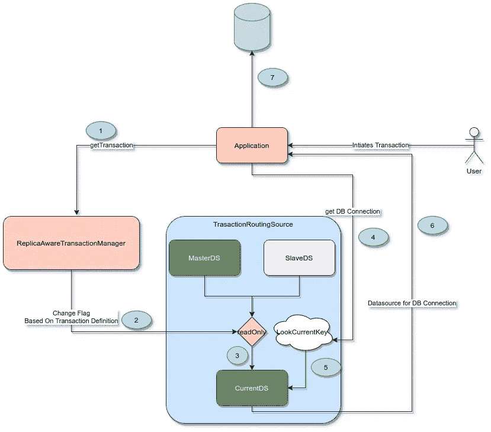

# 在不同的数据库实例中读/写| Java | Spring

> 原文：<https://medium.com/javarevisited/read-write-in-different-db-instances-java-spring-a43bf18a5c77?source=collection_archive---------1----------------------->

## 这篇博客将解释我如何根据需要将我的 spring boot 应用程序数据库调用路由到不同的 DB 实例

我有一个 spring 应用程序，它使用 amazon Aurora DB 集群作为数据源。

## [亚马逊极光数据库集群](https://docs.aws.amazon.com/AmazonRDS/latest/AuroraUserGuide/Aurora.Overview.html)

两种类型的数据库实例组成了一个 Aurora 数据库集群:

*   主数据库实例—支持读写操作，并对群集卷执行所有数据修改。每个 Aurora 数据库集群都有一个主数据库实例。
*   Aurora 副本—连接到与主数据库实例相同的存储卷，并且仅支持读取操作。除了主数据库实例之外，每个 Aurora 数据库集群最多可以有 15 个 Aurora 副本。通过将 Aurora 副本放在单独的可用性区域来保持高可用性。如果主数据库实例变得不可用，Aurora 会自动故障转移到 Aurora 副本。您可以指定 Aurora 副本的故障转移优先级。Aurora 副本还可以从主数据库实例中卸载读取工作负载。

为了利用 Aurora 的优势，我们必须将应用程序数据库调用路由到相关的实例。

使用 [Spring](/javarevisited/top-10-free-courses-to-learn-spring-framework-for-java-developers-639db9348d25) ，我们可以将读取查询配置到一个数据库实例中，将其他查询配置到主实例中。

## Spring DB 配置

这里，我们创建了两个数据源

1.  具有 **db.master** 属性的读写配置 bean
2.  具有 **db.slave** 属性的 readonly 配置

我们创建了两个[数据源](https://javarevisited.blogspot.com/2012/06/jdbc-database-connection-pool-in-spring.html)，但是，如何配置这些数据源来路由数据库连接呢？

为此，我们将使用 Spring 事务设置。默认情况下，Spring 事务是读写的，但是您可以通过[@ Transactional annotation](https://javarevisited.blogspot.com/2021/08/spring-transactional-example-how-to.html)的只读属性显式地将它们配置为在只读上下文中执行。

我们将创建一个管理事务生命周期的定制事务管理器。当创建一个新事务时，我们的`ReplicaAwareTransactionManager` 是一个定制事务管理器。

## ReplicaAwareTransactionManager

如果你看一下我们的`ReplicaAwareTransactionManager` 实现，你可以清楚地说，它充当了 spring 事务管理器的代理。所有的工作都由 spring 事务管理器来完成。这里，我们所做的只是在调用 get transaction 方法时，根据事务定义在`TransactionRoutingSource`中设置一个参数。

```
public TransactionStatus getTransaction(TransactionDefinition definition) throws TransactionException {  
          TransactionRoutingDataSource.setReadonlyDataSource(definition != null && definition.isReadOnly()); return wrapped.getTransaction(definition); }
```

因此，当在 TrasactionManager 上调用 getTransaction 时，我们告诉 TransactionRoutingSource 将其 readOnly 标志设置为 true。让我们深入研究一下 TransactionRoutingSource。为什么我们要这样设置…

## TransactionRoutingSource

由于事务是由[线程](https://javarevisited.blogspot.com/2020/04/difference-between-atomic-volatile-and-synchronized-in-java-multi-threading.html)创建的，我们将基于线程保存数据源信息。这个 TransactionRoutingSource 在一个称为数据源的 hashmap 中包含主数据源和从数据源。

基于查找键将 getConnection()调用路由到各种目标数据源之一的 DataSource 实现。后者通常(但不是必须)通过一些线程绑定的事务上下文来确定。当应用程序需要获得连接时，它将调用 transactionRoutingSource 中的查找键。TransactionRoutingSource current data source 将由由 TransactionManager 控制的标志设置。currentDatasource 将用于获取连接。

我们的主数据源是 TransactionRoutingSource，它由主数据源和从数据源组成。

TransactionRoutingSource 将根据 readOnly 标志切换主数据源和从数据源。因此，当应用程序需要获取数据库连接时，它看起来就像 currentLookUpKey。TransactionManager 将根据事务定义更改此 readOnlyFlag。因为默认的事务类型是 readAndWrite，所以所有的 [DB 连接调用](https://javarevisited.blogspot.com/2016/02/how-to-connect-to-microsoft-sql-server-from-Eclipse.html)都将转到主数据库。如果我们想指向从数据库，我们必须在@ TrasactionAnnotation 中添加 readOnly=true，如下所示。

```
@Transaction(readOnly=true)
```

让我们用下图包装一下

[](https://www.java67.com/2013/02/how-to-connect-mysql-database-from-java.html)

当用户发起交易时。它有一个事务定义。

1.  该事务将通过 getTrasaction 调用启动。
2.  当调用此 getTrasaction 方法时，ReplicaAwareTransactionManager 将设置调用 TrasactionRoutingSource set readonly 方法。这将基于事务定义只读标志而改变。
3.  当根据调用标志调用 setReadOnly 方法时，currentDatasource 将被更改。
    真→将选择从属数据源
    假→将选择主数据源
4.  现在将处理交易。为了获得数据库连接，应用程序将在数据源上查找 currentLookupkey。
5.  对我们来说，我们的数据源是 TransactionRoutingSource。
6.  我们的数据源将为数据库连接提供相关的数据源。
7.  应用程序将使用我们的数据源提供的配置连接到数据库。

[](/javarevisited/21-spring-mvc-rest-interview-questions-answers-for-beginners-and-experienced-developers-21ad3d4c9b82) [## 10 大春季 MVC + REST 面试问题解答适合初学者和有经验的开发者

### 大家好。如果你正在准备 Java 和 Spring 面试或 Spring 认证，并经常寻找一些…

medium.com](/javarevisited/21-spring-mvc-rest-interview-questions-answers-for-beginners-and-experienced-developers-21ad3d4c9b82) [](/javarevisited/top-10-free-courses-to-learn-spring-framework-for-java-developers-639db9348d25) [## 2022 年 Java 开发者学习 Spring 框架的 10 大免费课程

### 大家好，我最近分享了很多资源，如书籍和课程，当我公布了我的最佳…

medium.com](/javarevisited/top-10-free-courses-to-learn-spring-framework-for-java-developers-639db9348d25) [](/javarevisited/13-topics-you-should-prepare-for-your-next-spring-boot-interview-5f2993a04ff5) [## 你应该为 2022 年的下一次 Spring Boot 面试准备的 13 个话题

### 你应该为下一次 Java 和 Spring Boot 面试准备的 13 个基本主题的列表和学习资源…

medium.com](/javarevisited/13-topics-you-should-prepare-for-your-next-spring-boot-interview-5f2993a04ff5)