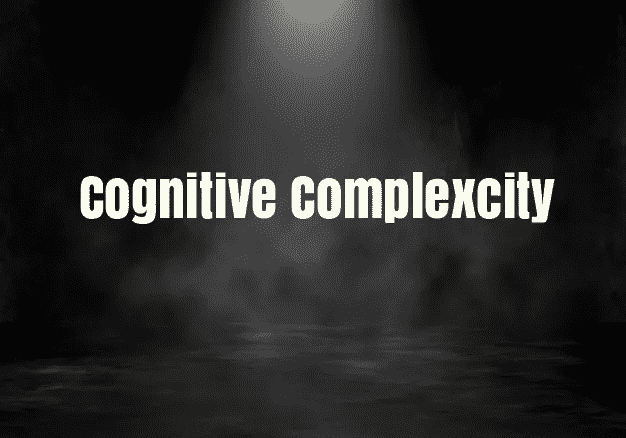
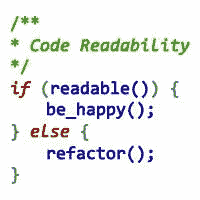
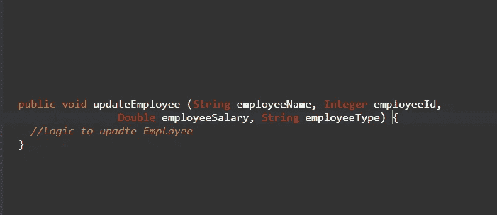
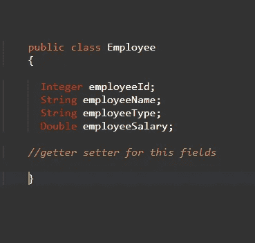
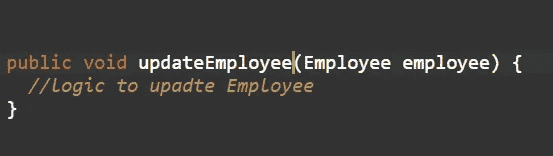

# 可读代码理解认知复杂性

> 原文：<https://medium.com/javarevisited/readable-code-understand-cognitive-complexity-daded367cc1a?source=collection_archive---------1----------------------->

程序员们好，

**测量可读性的方法**

我回来了，带来了一些让我们的代码更具可读性的好技巧，你也可以通过阅读我的[以前的博客](/javarevisited/how-to-make-your-code-to-readable-code-627084f84c28)来阅读一些让你的代码更具可读性的重要技巧。

现在，让我们开始吧，在我之前的[博客](/javarevisited/how-to-make-your-code-to-readable-code-627084f84c28)中，我告诉你们关于重构代码的事情。

> 重构的经验法则是函数应该有且只有一个目的。

让我们从经验法则开始，我们看到在大多数项目中有许多冗长的方法，包含多个 if-else、多次迭代、使用 setter 创建多个对象，所有这些都导致方法长度的增加，从而导致认知复杂性的增加。

认知复杂性被认为是对可读代码的一种度量，它是我们可以决定我们的代码是否可读的实体。根据一些内容，我发现它的最大值是 15，如果你的方法超过 15，那么你需要考虑重构它。

所以这里有一些减少肥胖的建议，

## **1。尽量使用匿名对象来代替变量的创建。**

总是试图使用匿名对象，因为这将在我们的代码中节省一个不必要的变量。

## 2.**减少代码中的多个 if-else 语句**

始终认为要避免在方法中使用多个 if-else 或嵌套的 if-else 语句，有一些方法可以作为多个 if-else 的一个选项，这可以是下一篇博客中将要讨论的一个单独的主题。

## 3.**重构你的代码**

总是想着把你的代码分成只有单一职责的小块。

## 4.**减少方法的参数数量**

一个方法最多有 2-3 个参数总是好的，如果超过了，你可以把所有的参数打包到一个类中，然后传递对象。参考这个例子，我们在一个方法中使用了很多变量，但是我们可以将所有这些都封装在一个名为 Employee 的类中，由 getters 使用。

避免对该方法使用超过 2-3 个参数

所有的数据都包在这个类里

和使用雇员类的对象

感谢阅读！