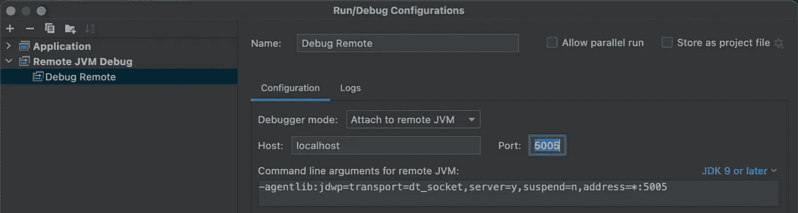
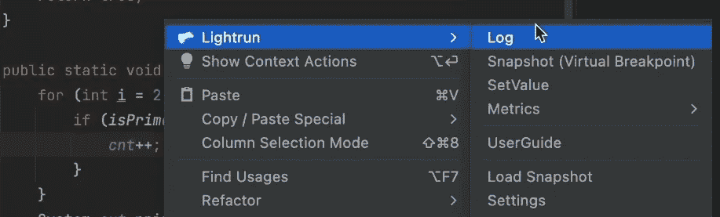
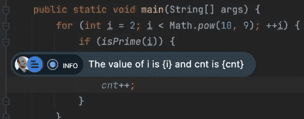
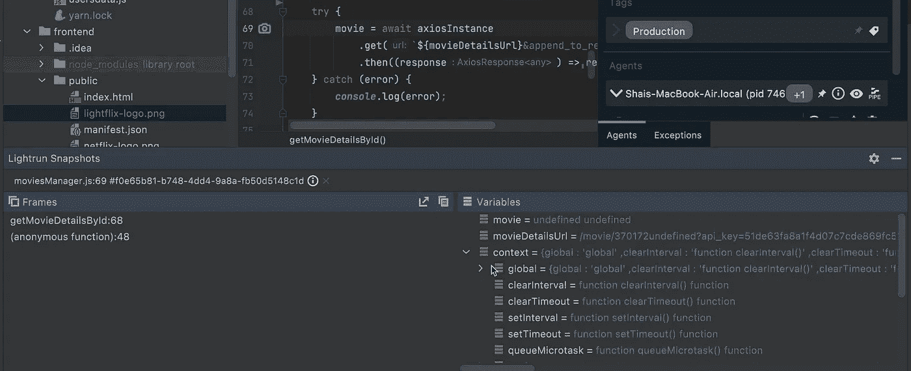
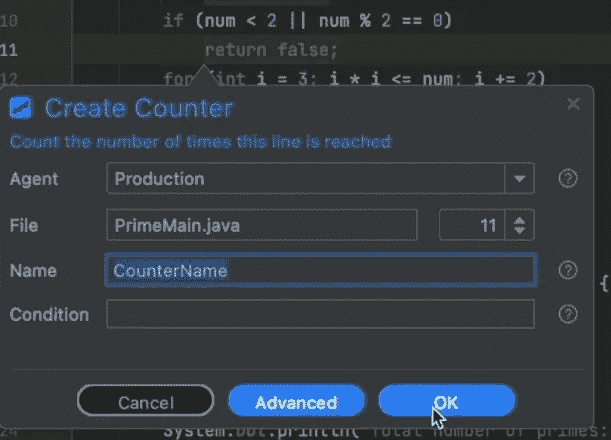

# 远程调试和开发人员可观察性

> 原文：<https://medium.com/javarevisited/remote-debugging-and-developer-observability-8a0dbbc8dd69?source=collection_archive---------1----------------------->


在这篇文章中，我们将讨论远程调试。使用[开发人员可观察性工具](https://lightrun.com/)调试产品，并调试异步代码，这带来了独特的挑战！

这实际上是来自四个独立视频的素材，因为我想把一些想法汇集到一个博客帖子中，异步的东西被拉了进来。话不多说，这些是适用的视频…请继续阅读以进行分析和讨论:

# 远程调试会话

远程调试器几乎是任何编程语言或平台的一个特征，但是在 Java 中使用我们在过去讨论过的 [JDWP 协议](https://talktotheduck.dev/psa-the-risks-of-remote-jdwp-debugging)是很常见的。作为复习，Java 远程调试协议的 JDWP 标准。这是一个与线路无关的协议，它定义了调试时 [IDE](/javarevisited/7-best-courses-to-learn-intellij-idea-for-beginners-and-experienced-java-programmers-2e9aa9bb0c05) 和 [JVM](/javarevisited/7-best-courses-to-learn-jvm-garbage-collection-and-performance-tuning-for-experienced-java-331705180686) 之间的连接。

请注意，远程调试的真正价值主张是在本地，而不是在远程机器上。价值在于连接到我们开发环境之外的运行流程。例如在[码头集装箱](/javarevisited/5-best-docker-courses-for-java-and-spring-boot-developers-bbf01c5e6542)等中。

我们可以在调试模式下启动远程进程，在命令提示符下使用如下代码:

```
java -agentlib:jdwp=transport=dt_socket,server=y,address=9000 ApplicationName
```

但这有点问题。JDWP 非常没有安全感。作为部分解决方法，我们可以通过 SSH 连接到调试目标，如下所示:

```
ssh remoteUser@remoteHost -L 9000:127.0.0.1:9000 -N
```

或者，使用 [Kubernetes](/javarevisited/10-best-kubernetes-courses-for-developers-and-devops-engineers-94c35cd3a2fd) ，我们可以像这样使用端口转发:

```
kubectl port-forward podname 9000:9000
```

一旦我们这样做了，我们就可以通过创建一个[远程调试](https://javarevisited.blogspot.com/2011/02/how-to-setup-remote-debugging-in.html)目标并运行它，从 IDE 直接连接到远程服务器，从而使用通常的调试特性。请注意，您可以在 visual studio 代码中完成所有这些工作，正如这里讨论的。

[](https://javarevisited.blogspot.com/2011/02/how-to-setup-remote-debugging-in.html)

我们现在有了一个应用程序的调试会话，就像我们直接从 IDE 中启动它一样！

# 生产调试

现在我们可能会尝试只开放一个 JDWP 港口，但这种方法有许多问题:

*   重新启动流程—您需要重新启动流程来启用调试—这在生产环境中可能无法实现
*   断点中断——它们可以在其位置停止执行，并在生产环境中引起问题
*   安全性——JDWP 和其他远程调试协议非常不安全。风险包括远程代码执行、访问源文件等等…
*   稳定性——这很容易导致远程进程崩溃，因为一些小错误，比如一个精心设计的表达式，甚至是一个观察变量
*   隐私问题——假设您的组织中有一个恶意开发人员在代码的用户登录部分放置了一个断点，并窃取了凭据。或者利用“设定值”来增加自己的权限。60%的安全漏洞是内部的，这就取消了所有的检查/平衡。这可能违反许多行业的法规/法律！
*   扩展—我们在集群中有多台机器。我们如何知道现在要调试哪台机器呢？一个请求可能命中任何机器

这显然不好。但是我们需要一个能够解决所有这些问题的解决方案。毕竟，在真正远程的机器上跟踪 bug 的价值是巨大的！

# 开发者可观察性

可观察性让我们无需发布新代码就能监控生产环境。它成为 [DevOps 工具链](/javarevisited/13-best-courses-to-learn-devops-for-senior-developers-in-2020-a2997ff7c33c)的一部分已经有一段时间了。在今天的规模下，管理一个没有可观测性的集群是根本不可能的。

开发人员的可观察性将这些想法左移。从 DevOps 团队到 R&D 团队。它直接在“代码行”级别给了我们编程语言级别的可观察性。所以感觉像是 [IntelliJ/IDEA](https://javarevisited.blogspot.com/2018/09/top-5-courses-to-learn-intellij-idea-java-and-android-development.html) 或者 [Visual Studio 代码](/javarevisited/8-best-vs-code-courses-for-beginners-to-learn-online-bd5c169f59b7)中的调试器实例。但它是一个可观察性工具，您可以安全地使用，而不会损害生产环境的完整性。

与面向 DevOps 的可观测性不同，这些工具集成到标准的开发工具中，如 ide 等。

我们可以使用 Lightrun 的[免费版本开始学习这些工具是如何工作的。您需要在 IDE 中安装 Lightrun 插件，然后在生产服务器中设置代理。不像 JDWP，代理是安全和隔离的。我们将进一步讨论这一点…但首先让我们讨论功能。](https://lightrun.com/free)

# 日志

使用大多数开发人员可观察性工具可以做的最简单的事情就是日志注入。这允许您通过 IDE 上下文菜单向正在运行的进程添加新日志。

[](https://javarevisited.blogspot.com/2018/01/10-unit-testing-and-integration-tools-for-java-programmers.html#axzz6j8KhisSX)

我们可以通过管道将日志发送到 IDE 中的调试控制台，或者保留默认设置，就像您在代码中编写日志一样。这意味着该日志将与所有其他日志一起显示。

使用松紧带或类似工具？

该日志将像其他日志一样被接收，并以正确的顺序出现！

此外，您可以打印变量、方法返回值等。表达式求值在您选择的[编程语言](/javarevisited/top-5-programming-languages-you-can-learn-in-2020-e68ab1a17af4)中完成，例如用于 JVM 应用的 Java。这样，我们可以像在这里一样打印变量值:

[](https://www.java67.com/2018/08/top-10-free-java-courses-for-beginners-experienced-developers.html)

这引发了两个重要问题:

*   可变性——如果方法调用改变了应用程序状态，会怎么样？
*   性能—如果该日志降低了性能，该怎么办？

这个问题的答案因工具而异。然而，Lightrun 专门在沙箱中运行这些表达式。对每个表达式进行分析，以确保它是只读的，并且不影响执行。当有疑问时，您将得到一个错误，并且该操作不会被执行。

这个沙箱也验证性能。如果超过了 CPU 使用的特定配额，该操作将暂停，直到获得进一步的详细信息。

保持了远程进程服务器代码的完整性！

# 快照

正如我之前提到的，在调试产品时，常规断点是一个巨大的问题。核心问题是他们“破”。快照(又名捕获或不间断断点)，通过不中断来解决这个问题。

它们为我们提供了类似于源代码中典型断点的信息，这非常有用。我们可以分析这个时间点周围的堆栈跟踪和变量值。他们甚至支持类似于[条件断点](https://javarevisited.blogspot.com/2011/07/java-debugging-tutorial-example-tips.html)的条件表达式。我们可以只获取特定用例的快照。

[](https://javarevisited.blogspot.com/2011/07/java-debugging-tutorial-example-tips.html)

快照是这种远程调试工具的主力。有了它，我们可以深入了解通常只为本地开发工具保留的产品。令人惊讶的是，我们可以在不损害远程机器完整性的情况下获得这种洞察力。

# 标签

规模可能是远程调试面临的最大挑战之一。开发人员可观察性工具让我们可以将任何操作(日志、快照或指标)绑定到标签上。这相当于将操作添加到标记中的所有代理(服务器)。

例如，您可以使用基于平台的标签，如 Ubuntu 20。或者基于部署类型“绿色”等。这让您可以进行大规模调试，无需猜测下一个会遇到错误的远程设备。

# 计数器

你有没有问过自己:

用户真的在用我一直努力修复/编写的这种方法吗？

这个用例是否适用？

有这个标志的用户曾经达到过这个方法吗？如果有，那么有多少？

获得对代码的这些深层的、低层次的见解可以完全改变你的编码方式。为什么要为一件没用的东西承担一项复杂的任务呢？

或者，也许我们应该在这段代码上投入更多的精力，因为它是一个焦点！

APM 提供了一些见解，但是它们提供的信息非常粗糙。在许多情况下，我只是添加一个变量，每次条件发生时递增，并记录该信息。这对于一个简单的项目来说是可以的，但是它需要部署这样的“黑客”,并且会在项目中产生很多噪音。这是我们大多数人不想要的。

计数器就是这样工作的，没有麻烦，也不需要部署。您可以在每个操作中使用条件计数器来计算细粒度的使用情况。

[](http://javarevisited.blogspot.sg/2015/10/133-java-interview-questions-answers-from-last-5-years.html)

# TicToc 和方法持续时间

类似地，我们可能对特定方法或代码块的开销感到好奇。后者正是 tictoc 所支持的。这相当于在代码开始之前存储当前时间。然后在到达块末端时记录“当前时间—开始时间”。

唯一的区别是，这不需要修改代码，不影响生产，并允许我们添加限制条件。

所有指标的输出可以通过管道传输到 statsd/ [Grafana](https://javarevisited.blogspot.com/2022/02/top-5-courses-to-learn-grafana-for.html) 并绘制成图，以帮助决策过程。

# PII 缩减和阻止列表

沙箱只是安全性的一部分。正如我们前面讨论的，这种部署的最大风险之一是来自内部开发人员有意或无意地抽取数据。此外，我们需要遵守监管和法律要求。

为了解决这些问题，我们有两个独立的工具。第一个是 PII 还原。

个人身份信息(PII)是一个法律术语，用于限定应保持安全的私人用户数据。一个很好的例子是信用卡号码。假设我们的用户对象在缓存中包含一个信用卡号字段。我们记录用户对象，并有效地将用户的信用卡号放入随处可得的日志中！

这可能违反法规和法律。这也是信用卡处理所不允许的，可能会导致公司受到制裁。PII 减少阻止众所周知的模式(信用卡，电子邮件等。)出现在日志中。这防止了潜在的滥用，因为更多的人暴露于日志而不是数据库。

阻止列表让我们阻止特定的文件/类插入动作。这意味着我们可以禁止开发者添加快照/日志等。一个可能有风险的文件。例如，默认情况下应该阻止处理登录过程的文件。有了这两个特性，我们可以进一步强化部署。

# 摘要

在上面标题为“产品调试”的部分，我列出了远程调试中的几个问题。这就是开发人员可观察性解决这些问题的方式:

*   重启过程——开发人员可观察性工具可以一直运行，而不会增加安全性问题
*   断点中断—快照不会中断
*   安全性—它不打开外部端口，而是连接到安全管理服务器。因此，它不会暴露攻击媒介
*   稳定性——这取决于工具。有些会影响稳定性，而有些不会。包含沙盒的工具(如 Lightrun)消除了一些这种担心
*   隐私问题—黑名单和 PII 减少解决了这些问题
*   规模——标签解决了这个问题

如您所见，这些开发工具中有许多配置选项和功能。我们可以利用它们来解决 JDWP 的所有固有问题，并更快地修复有缺陷的代码。

随着这个职位，140 秒小鸭系列的基本调试正在进行中断。我将利用夏季的几个月来评估这个系列的影响，并决定我们是否要做另一个系列。我喜欢这种形式，喜欢做视频/帖子，我希望今后能重温这种形式。