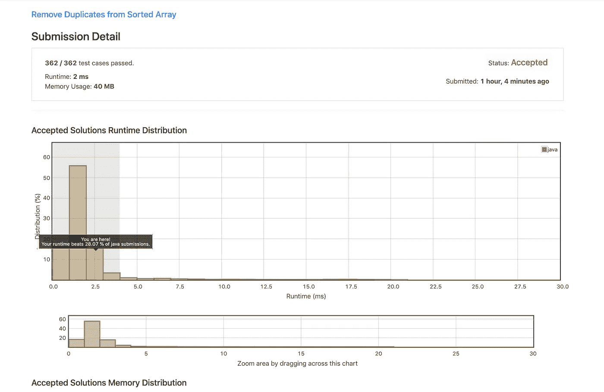
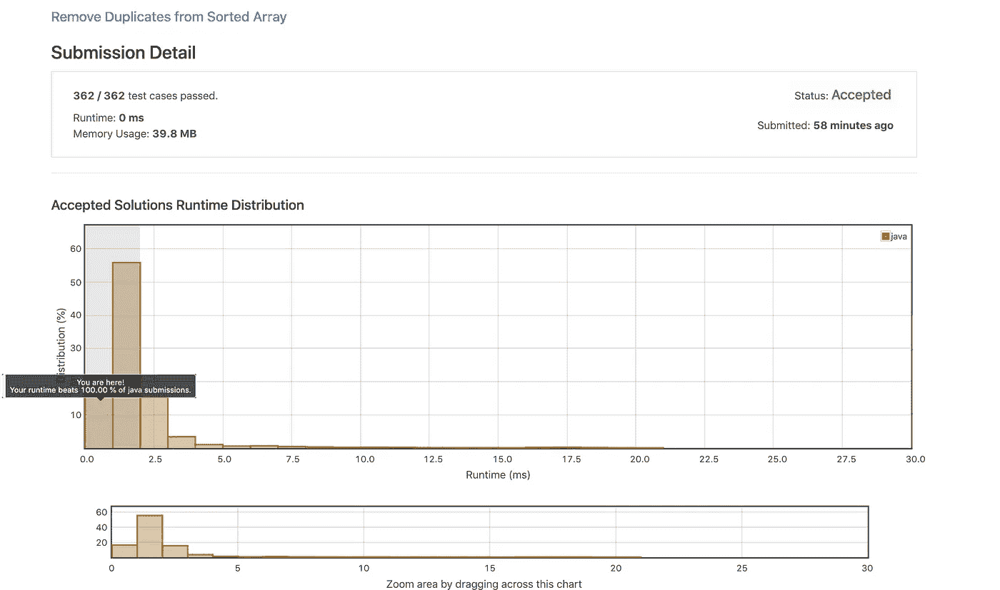

# 从排序后的数组中删除重复项(Leetcode 问题#26)

> 原文：<https://medium.com/javarevisited/remove-duplicates-from-sorted-array-leetcode-problem-26-b7be6e0c2724?source=collection_archive---------1----------------------->

## 用于[https://leet code . com/problems/remove-duplicates-from-sorted-array/](https://leetcode.com/problems/remove-duplicates-from-sorted-array/)的 Java 解决方案

> 最初发表于[https://asyncq.com](https://asyncq.com/remove-duplicates-from-sorted-array-leetcode-problem-26)


## 理解问题

*   我们已经给出了整数数组**num**，它们是按升序排列的。我们需要从 **nums** 数组中删除重复的元素，以便 **nums** 只包含唯一的元素，并且元素的相对顺序应该被保留。
*   我们不能使用额外的内存，需要对输入的 nums 数组执行所有的操作。
*   如果我们的 i [nput 数组包含 k 个副本](https://javarevisited.blogspot.com/2012/02/how-to-check-or-detect-duplicate.html#axzz6eho0TYnf)，那么最初的 n-k 个元素应该是输出，我们可以忽略输入中 n-k 个以外的元素。
*   例如

```
nums = [2,2,3]
output = [2,3,__]nums = [ 1,1,1,2,2,2,3,4,4]
output = [1,2,3,4,______]
         | N-k  |   k   |
```

*   法官将只比较解的 n-k 个元素和忽略 n-k 后的元素

## 我对解决方案的思考

*   我对解决方案的第一个想法是，我们[遍历数组](https://javarevisited.blogspot.com/2016/02/how-to-loop-through-array-in-java-with.html#axzz6vIXZv0pN)中的每个元素，并检查下一个元素是否与当前元素相同，如果是，那么我们可以对该元素执行从下一个元素到结束数组的移位操作。
*   我们还记录了变量中[重复](https://www.java67.com/2019/11/3-ways-to-find-repeating-number-in-array.html)的每一次出现。

## 伪代码

```
1: record traversed element in count variable & duplicate in match variable;
2: traverse each record in loop
     if( current_element == next_element)
     then perform left arrayshift operation by 1

     if( count == nums.length-1 )
     then we have come to the end lets break the loop

     increase the counted element 3: Return counted_elements-duplicates+1; 
```

## 解决方法

## 结果

我们的解决方案通过了所有的测试用例，并被 leetcode 接受，但是运行时间不是很好。运行代码几乎需要 150 毫秒。我认为我们可以做得更好。在我们当前的解决方案中，我们的运行时间是 o(n ),因为我们在循环内部调用循环，所以我们需要改进这一点。让我们以 o(n)为目标

## 解决方案 2

*   当我们[遍历输入数组](https://www.java67.com/2013/08/how-to-iterate-over-array-in-java-15.html)并且我们遇到一个重复时，我们将用`Integer.MAX_VALUE`替换它
*   然后我们可以对输入数组中的元素进行排序，通过这样做，我们将保持顺序并将所有重复的元素推到输入数组的末尾。
*   现在我们只需要返回输入数组的长度- [结果重复计数](https://javarevisited.blogspot.com/2018/04/how-to-find-k-missing-numbers-in-array-java.html#axzz6e8hmwujv)

## 结果

我们的结果通过了所有的测试用例，并且运行时间从 150 ms 提高到 2 ms，因为运行时间复杂度从 O(n)提高到 O(nlogn ),因为 java 排序需要 O(nlogn)时间。
但是我观察到它只胜过 Leetcode java 解决方案的 28%,所以我认为我还有更大的改进空间。我认为 O(n)解是存在的。

[](https://javarevisited.blogspot.com/2015/06/top-20-array-interview-questions-and-answers.html)

## **解决方案 3**

*   我们将我们的解从 O(nlogn)优化到 O(n)。在这个解决方案中，我们遍历输入数组中的每个元素，并检查下一个元素是否与当前元素不同。如果为真，那么我们把它加到输入数组中
*   为什么这个逻辑行得通？
    我们保留输入数组的第一个元素，因为第一个元素本身不能重复，然后从第二个元素开始检查，并与前一个元素进行比较。如果它与前一个相同，那么它是重复的，我们忽略它，但如果它不是重复的，那么我们将它作为下一个元素添加到输入数组中。
*   例如

```
 nums = [1,1,2]**first iteration**
   nums  = [1,1,2] -> check if num[0] != num[1]
   in our case num[0]=num[1] so we ignore element num[1]State of nums = [1,1,2]**Second iteration**
   nums = [1,1,2] => check if num[0]=num[2]
   in our case num[0] != num[2] , hence we can assign num[1]=num[2]
State of nums = [1,2,2]**iteration finished**Since we dont care about element after nums.length-duplicate i.e 3-1 = 2 would be returned as output ,
Judge will only compare 2 elements from out modified input array.i.e nums = [1,2,_] and 3rd element will be ignored
```

## 结果

我们这次的结果提高了很多，运行时间几乎是 0 毫秒，我们击败了 100%的 java 提交。

[](https://www.java67.com/2018/06/data-structure-and-algorithm-interview-questions-programmers.html)

## 结论

这个 Leetcode 问题教会我们如何思考和改进代码的运行时，这是[编码面试](/javarevisited/20-array-coding-problems-and-questions-from-programming-interviews-869b475b9121)中的一个关键方面，因为面试官总是问我们如何改进现有的解决方案，无论是运行时复杂度还是空间复杂度。

如果你对评论区的解决方案有什么看法，请告诉我！

## 奖金

*   如果你想升级你的编码面试游戏，你绝对应该看看这个畅销课程[](https://click.linksynergy.com/link?id=FAaRt1BJn8w&offerid=1060092.1419186&type=2&murl=https%3A%2F%2Fwww.udemy.com%2Fcourse%2Fdata-structures-and-algorithms-deep-dive-using-java%2F)*(这是 Java 语言)*

*Leetcoding 快乐！*

> *下面我们连线上[**LinkedIn**](https://www.linkedin.com/in/suraj-mishra-16b515a4)如果你喜欢这篇文章，请查看更多@【https://asyncq.com/】*

# ***其他 Leetcode 问题***

*   ***[Leetcode 问题#9](https://mishrasuraj.medium.com/solve-with-me-leetcode-problem-9-1666a577bddd)***
*   ***[读取代码问题#13](https://mishrasuraj.medium.com/solve-with-me-leetcode-problem-13-df876bd0e2b1)***
*   ***[密码问题#20](https://mishrasuraj.medium.com/solve-with-me-leetcode-problem-20-3f43dc8a914f)***
*   ***[读取代码问题#7](https://mishrasuraj.medium.com/solve-with-me-leetcode-problem-7-1d362bb441e7)***
*   ***[密码问题#21](https://mishrasuraj.medium.com/solve-with-me-leetcode-problem-21-f37a6fe1766c)***