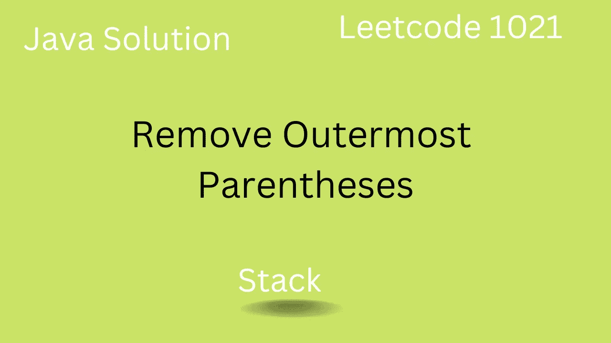

# 删除最外面的括号— Leetcode 1021

> 原文：<https://medium.com/javarevisited/remove-outermost-parentheses-leetcode-1021-63af030e29cf?source=collection_archive---------2----------------------->

## Leetcode 1021 的 Java 解决方案

## 介绍

*   在本文中我们将解决 Leetocode 1021 问题，这个问题帮助我们理解 [**栈数据结构**](https://javarevisited.blogspot.com/2022/09/10-data-structure-programmer-learn.html) 以及如何使用它们。

## 问题陈述

*   我们已经得到了有效的括号，我们需要删除最外面的…