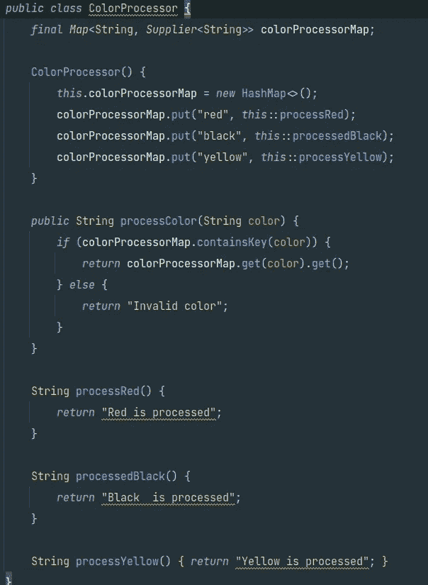

# 移除“如果-否则”的地狱

> 原文：<https://medium.com/javarevisited/remove-the-if-else-hell-java-7927194bd2e?source=collection_archive---------0----------------------->

在某些情况下，我们需要像上面这样做多个 if-else 条件。有人可能更喜欢使用 switch case，但是它不会给出干净和健壮的代码。

那么如何才能去掉这些多重 if-else 条件呢？

## 我们可以用地图来做。

*   对于字符串文字，可以使用散列表
*   如果你有枚举，使用 EnumMap 代替 HashMap。

我们不使用 if-else 条件，而是使用一个[映射](https://javarevisited.blogspot.com/2015/08/difference-between-HashMap-vs-TreeMap-vs-LinkedHashMap-Java.html)

确保你的条件符合地图。我们没有为每个案例编写逻辑处理，我们有一个映射，我们把案例和逻辑作为*键，值*对。因此，我们可以根据键从映射中检索逻辑。

**感谢，**[**Hrishabh puro hit**](https://medium.com/u/7007d97d5b1f?source=post_page-----7927194bd2e--------------------------------)**&**[**Gamehostprogram**](https://medium.com/u/50bbdf0dd53?source=post_page-----7927194bd2e--------------------------------)**的回复。这些回复让我重新思考这篇文章，以定义我们可以使用这种技术的界限。**

> 我从 if-else 开始，因为我们大多数人(开发者)都是从 if-else 开始的。但它实际上是一个很好的开关盒替代品。另外，我想说，我不建议在简单的逻辑相关的开关情况下使用它，因为它会增加代码可读性的复杂性。当类的主要功能实现依赖于开关情况(策略模式)时，我更喜欢 map 方法。

你可能喜欢的其他文章和资源

 [## 学习重构和提高 Java 编码技能的 7 门最佳课程

### 我最喜欢的在线课程学习重构和最佳实践，以提高您的编码技能，并成为一个更好的…

medium.com](/javarevisited/7-best-courses-to-learn-refactoring-and-clean-coding-in-java-47bea3c67006)  [## 干净的代码审查——程序员必读的编码书籍

### 想学习将糟糕的代码转换成好代码的艺术吗？这本书会有所帮助

medium.com](/javarevisited/clean-code-a-must-read-coding-book-for-programmers-9dc80494d27c)  [## 有经验的 Java 程序员学习代码重构的 6 大课程

### 你好伙计们，如果你想提高你的编码技能，学习重构和其他编码最佳实践，并寻找…

javarevisited.blogspot.com](https://javarevisited.blogspot.com/2020/12/top-5-course-to-improve-coding-skills.html) 

如果你不是媒体成员，我强烈推荐你加入媒体，阅读不同领域伟大作家的精彩故事。你可以在 这里**加入介质**