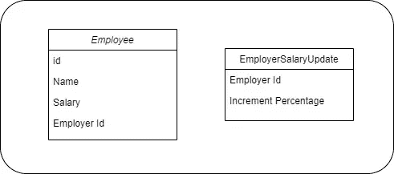

# 在流处理中用 Java 记录替换包装类

> 原文：<https://medium.com/javarevisited/replacing-wrapper-classes-with-java-records-in-stream-processing-6cc0e89b8f64?source=collection_archive---------0----------------------->

带有代码片段的简单案例研究

承认吧，一旦深入 Java 流处理，就没有回头路了。

在您的旧代码中，看到循环的*时，您会退缩。流处理的一切都很好，除了一点。包装类。*

如果您的数据处理很复杂，并且涉及多个数据转换步骤，那么您需要创建占用大量空间的包装类。

即使包装类是[不可变的](/javarevisited/how-to-create-an-immutable-list-list-and-map-in-java-5ac1254c128?source=---------31------------------)(没有设置器)，您仍然需要在您的服务类中创建一个内部类。

这是其中一个地方，[战绩](https://openjdk.java.net/jeps/395)班成绩最好。

我们可以通过一个案例来研究这个问题，我举了一个很久以前的雇员-雇主用例。假设我们正在实现一个人事管理软件的一部分。让我们称我们的软件为 EmployeeSoft)

假设 EmployeeSoft 是一个 SaaS，有一个集中的处理线。

我们将在 EmployeeSoft 中实现一个部分，系统将在其中更新员工的工资。对于一个财政年度末的雇主列表，我们需要根据加薪百分比更新相应雇员的工资。

我们的数据类将会是这样的。

现在，在三月底，我们的 EmployeeSoft 已经收集了想要更新员工工资的雇主列表。现在，我们的服务(我们将实现它)将获得这个带有 employerId 和 hike percentage 的数据类列表。

对于每个雇员的 Id，我们需要查询数据库并获得雇主的雇员数据列表。对于每个雇员，我们根据从 *EmployerSalaryUpdate* 类获得的加薪百分比来计算新的薪水。

如果你在 for-loops 中想到这一点，就会有两个 *for-loops，*外层的 *for-loop* 将是***employearsalyuupdate****的列表，内层的 *for-loop* 将是****Employee***的列表。下面是一个更简单的实现。**

**现在，如果我们想利用 [Java streams 的便利方法](https://www.java67.com/2014/04/java-8-stream-examples-and-tutorial.html)，这也使这有点花哨，我们去 Java 流处理。**

**等效的流处理代码如下所示。我们可以使用一个 [flatMap](https://javarevisited.blogspot.com/2016/03/difference-between-map-and-flatmap-in-java8.html) 或 mapToMulti(有点花哨)来扩展管道 1-n。**

**在我们的例子中，一个雇主有 n 个雇员。这也是我们经常需要包装类的地方，因为后续的数据转换步骤需要来自 EmployerSalaryUpdate 类和 Employee 类的数据。**

**如你所见，我们只是用 ***final*** 成员和 getter[创建了一个不可变的类](http://javarevisited.blogspot.sg/2013/03/how-to-create-immutable-class-object-java-example-tutorial.html)，从简单的 for 循环到流处理的代码转换仍然需要 30 行额外的代码。没有伤害在这里，仍然是不愉快的有这样的锅炉板代码。**

**这就是我们可以使用 Java 16 中引入的记录类的地方。**

**什么是记录类？**

**记录类是不可变的[类的替代品。它不像 lombok 那样是所有样板代码的替代品。但是我们可以用 lombok 模拟记录类的行为。](https://docs.oracle.com/javase/tutorial/essential/concurrency/immutable.html)**

**对于您创建的每个记录类，Java 都会创建所需的 [hashcode()](http://www.java67.com/2013/04/example-of-overriding-equals-hashcode-compareTo-java-method.html) ， [equals()](https://javarevisited.blogspot.com/2012/12/difference-between-equals-method-and-equality-operator-java.html#axzz5Y4Kd7uK1) ，这是一个规范的构造函数，就像在记录头和 getter 方法内部一样。**

**示例记录类别:**

**正如您在第 9 行看到的，您也可以像通常使用[构造函数](https://javarevisited.blogspot.com/2012/01/what-is-constructor-overloading-in-java.html#axzz6j8KhisSX)一样操作这些值。**

**这里要注意的重要一点是，如果你的对象在它的生命周期中会改变它的状态，这意味着如果你需要 setters，那么 Record 类对你来说就没有用了。**

**回到我们的例子，使用记录类的等价代码如下所示**

**在第 18 行，我创建了一个记录类。因为这个记录类是在一个方法中创建的，所以我们称之为本地记录类。这在此方法之外将不可用。这些在数据转换步骤中非常有用。**

**正如您在这里看到的，行数明显减少了。**

**尽管记录类是不可变的，但是如果成员类是可变的，那么您仍然可以改变记录的状态，但是这是不可取的。当你要创建不可变的类时，总是使用不可变的成员。例如，您仍然可以执行以下操作。但是不建议这样做。**

## **参考资料:**

*   **[JEP 395](https://openjdk.java.net/jeps/395)**
*   **[作者的 github 资源库](https://github.com/mrajaian/personnel-management)**