# REST API 最佳实践——来自 Java 和 Spring Web 服务的设计示例

> 原文：<https://medium.com/javarevisited/rest-api-best-practices-with-design-examples-from-java-and-spring-web-services-ebec6161ccd1?source=collection_archive---------0----------------------->

设计优秀的 REST API 对于拥有优秀的微服务非常重要。你如何设计你的 REST API？最佳实践是什么？

# 你会学到的

*   如何设计伟大的 REST API？
*   设计 REST API 的时候应该考虑什么？
*   设计 RESTful Web 服务的最佳实践是什么？

# REST API

这是关于 REST APIs 的系列文章中的最后一篇:

*   [1—REST API 简介— RESTful Web 服务](https://www.springboottutorial.com/introduction-to-rest-api)
*   [2 — REST v SOAP —一些观点](https://www.springboottutorial.com/rest-vs-soap-web-services)
*   [3 —设计 REST API —什么是契约优先？](https://www.springboottutorial.com/rest-api-contRact-first-approach)
*   [4 —设计 REST API —什么是代码优先方法？](https://www.springboottutorial.com/rest-api-code-first-approach)
*   [5 — REST API —什么是 HATEOAS？](https://www.springboottutorial.com/rest-api-what-is-hateoas)
*   [6 — REST API 最佳实践—包含来自 Java 和 Spring Web 服务的设计示例](https://www.springboottutorial.com/rest-api-best-practices-with-java-and-spring)

# 使用消费者第一的方法

谁会使用你的服务？服务消费者。

你是从消费者的角度来看的吗？

*   如果你设计一个 API，你的消费者能理解你的 API 吗？
*   如果您公开您的资源，消费者能够找到并访问它们吗？
*   消费者能理解你的 URIs 吗？
*   你提供什么类型的服务？它是移动应用程序，还是基于 web 的应用程序？你所期待的消费者是什么样的，这些消费者类型在未来有可能改变吗？
*   如果你实现了类似 HATEOAS 的东西，在你实现它之前，想想你的消费者会如何使用它。

> 最重要的是要有很棒的文档。为你的消费者提供方便，这样可以节省你自己的时间。消费者自己能做的越多，你的工作量就越少。

无论何时召开讨论或审查会议，都要把消费者的需求放在第一位。

# 使用合同优先的方法

什么是合同？

web 服务的创建者被认为是**服务提供者**。使用 web 服务的应用程序是**服务消费者**。

**契约**是服务提供者和服务消费者之间关于服务的协议。

为了更好地利用服务，服务消费者需要充分理解合同。合同包括服务的许多方面的细节，例如:

*   如何调用 web 服务？
*   使用什么交通工具？
*   什么是请求和响应结构？

这也被称为**服务定义**。

在**契约优先**方法中，您首先定义服务契约，然后才实现服务。

## 先和 WSDL 签约

例如，当您定义 SOAP web 服务时，您使用 WSDL 来定义协定。

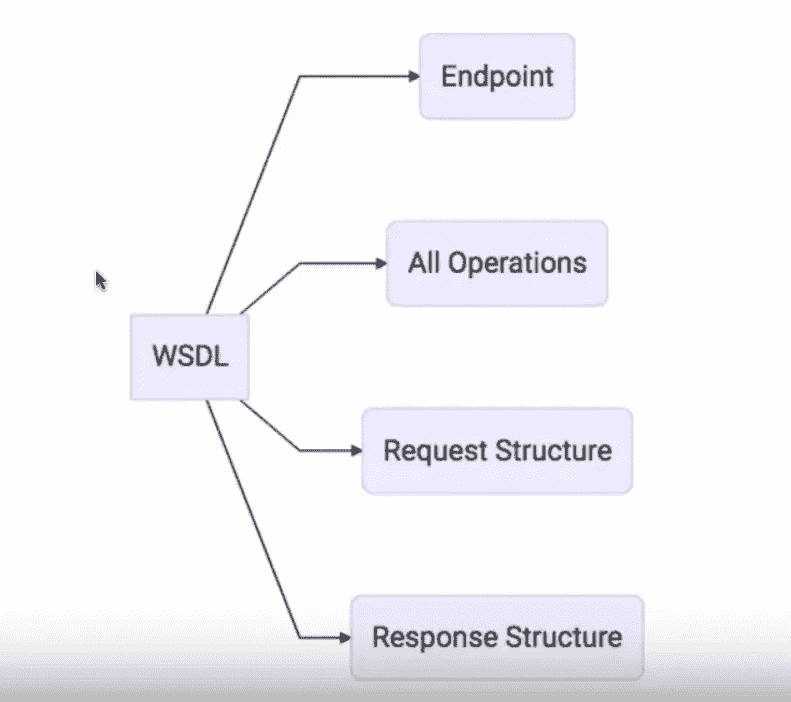

WSDL 定义了什么是服务端点、您公开的操作以及请求和响应结构。

## 首先与 Swagger/Open API 签订合同

当您使用 RESTful web 服务时，Swagger 是一个用于记录 web 服务的流行工具。

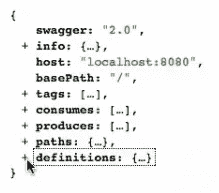

Swagger 允许您定义哪些资源是作为 API 的一部分公开的。它包括每个操作的细节，比如它是否使用 XML、JSON 或者两者都使用。响应的模式也显示在那里。

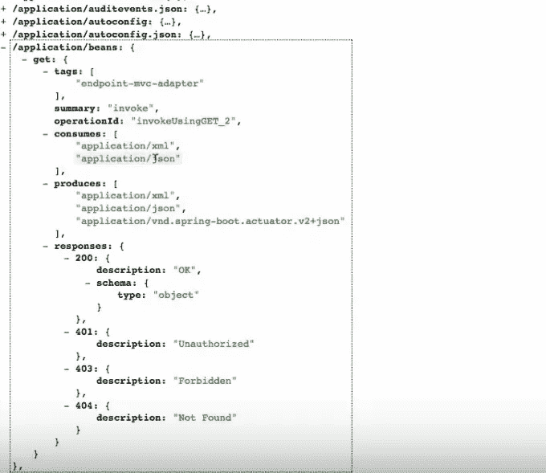

它还给出它支持的响应代码的细节。您还可以看到这个特定的资源，`/jpa/users`:

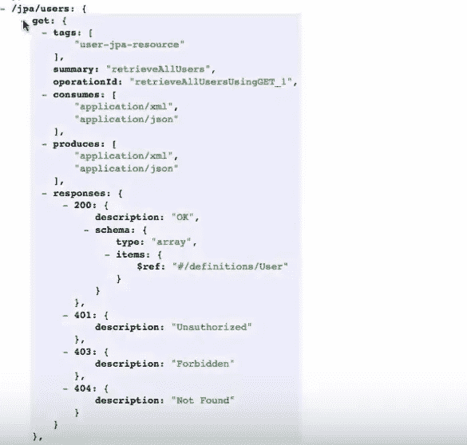

支持 GET 操作。事实上也支持 POST 操作:

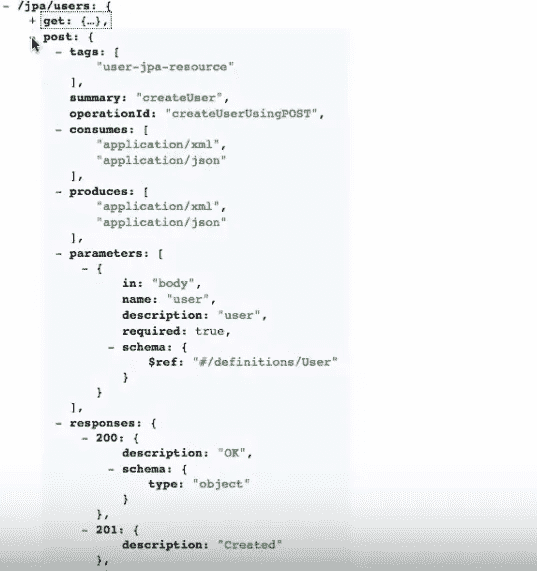

如果此资源被视为，则响应模式为:

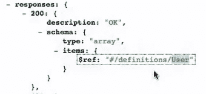

在 Swagger 契约中，用户的定义如下:

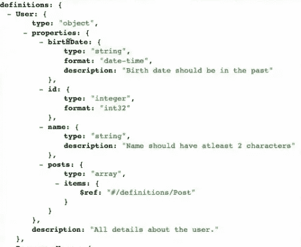

它包括一个`birthDate`，一个`id`，一个`name`和一个`posts`数组。有些字段中还包含一个`description`字段。

在契约优先的方法中，在实现服务之前，您可以通过手工或使用应用程序来创建这样的 Swagger 定义。

## 合同优先方法的优势

通过使用契约优先的方法，您可以考虑您的消费者，以及他们如何使用服务。您最初并不担心实现细节。

如果您在早期就重视实现，那么技术细节会渗透到您的服务定义中。

您需要您的服务定义独立于正在使用的平台，无论是 Java。网什么的。

# 为 REST API 定义组织标准

你的组织标准的一个重要参考就是 YARAS。

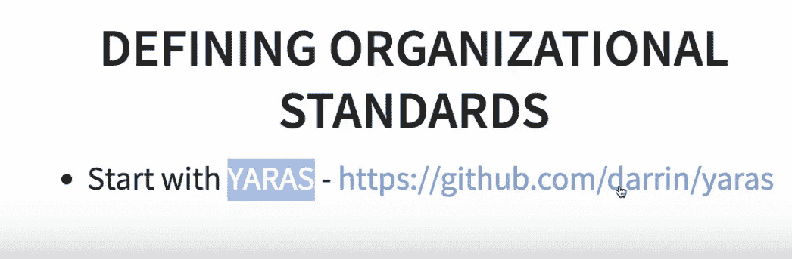

**YARAS** 代表**又一个 RESTful API 标准**。YARAS 提供了开发 RESTful web 服务时需要遵循的标准、指南和约定。它定义了一些提示，例如:

*   你应该如何命名你的服务？
*   你应该如何组织你的请求和回应？
*   你应该如何实现过滤、排序、分页和其他操作？
*   您应该如何进行版本控制？
*   你需要如何处理 API 文档？

## 采用单一方法设计服务

对于 RESTful web 服务，在开始设计之前，您需要解决许多复杂的问题。以上列举的事情都需要想清楚。

作为一个组织，你不希望团队处理不同的资源，以不同的方式处理事情。

例如，让团队 A 采用基于请求参数的版本化，让团队 B 使用基于 URI 的版本化，这是不好的。

因此，有一个清晰定义的组织标准来处理 RESTful 服务是很重要的。

## 根据组织需求定制 YARAS

YARAS 的好处是，它可以定制以满足特定组织的需求。例如，您可以

*   定制请求和响应主体的外观
*   选择特定类型的版本控制系统

由于 YARAS 的报道非常全面，您可以确保没有错过任何重要的决定。

# 构建一个标准的组织范围的 REST API 框架

在 Java 世界中，用于构建 RESTful web 服务的典型框架是 Spring MVC、Spring REST 和 JAX-RS。

如果您在首选的 REST API 框架之上构建一个遵循通用组织标准的特定于组织的框架/原型/参考应用程序，那么团队遵循您的标准将会很容易。

典型特征包括:

*   请求和响应结构
*   错误处理
*   过滤
*   搜索
*   版本控制
*   支持模拟响应
*   哈特奥斯

标准框架确保了在整个组织中实现服务设计和实现的标准方法。

# 对 REST APIs 进行分散治理

从构建 REST API 的团队中创建一个专家小组，并组建一个治理团队。该团队负责

*   改进 REST API 标准
*   构建/设计您的 REST API 框架

# 充分利用 HTTP

每当想到 RESTful web 服务，就想到 HTTP。

HTTP 拥有支持您构建优秀 web 服务的所有特性。

## 使用正确的 HTTP 请求方法

考虑一下您需要利用的 HTTP 请求方法。当您考虑实现任何操作时，请确定要在其上执行操作的资源，然后寻找相关的 HTTP 请求方法。你是在检索一个细节，创建某个东西，更新某个已存在的东西，还是删除某个已存在的东西？

使用

*   获取以进行检索
*   用于创建的帖子
*   发布以供更新
*   为删除而删除
*   部分更新的补丁

## 使用适当的 HTTP 响应状态

当您实现一个操作时，确保您返回正确的响应状态。

例如，当没有找到特定的资源时，不要抛出服务器异常，而是在响应消息中发出适当的响应代码，比如`404`。

当实际存在服务器异常时，发送回一个`500`代码。

当出现验证错误时，发送错误请求的代码。

# 关注代表性

每个资源可以有多种表示形式——XML 或 JSON 格式。服务消费者可以选择他们喜欢的表示。

当我们向服务提交 GET 请求时，服务返回三个用户。在这种情况下，我们接收资源`/users`的 JSON 表示。

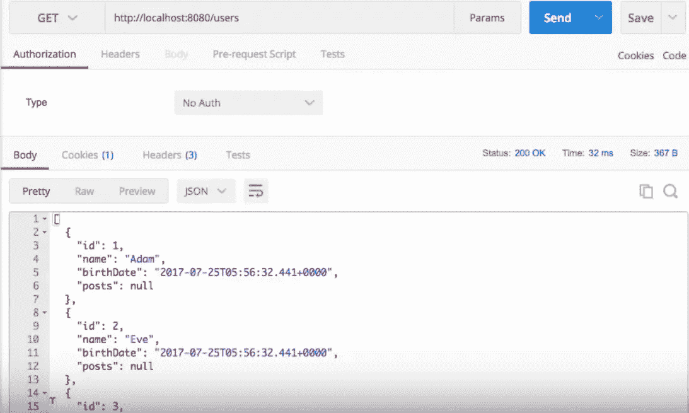

当消费者没有指定首选表示时，我们使用 JSON。

消费者可以发送一个指定表示的接受报头。

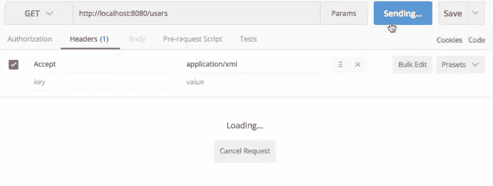

响应正文现在包含 XML 内容:

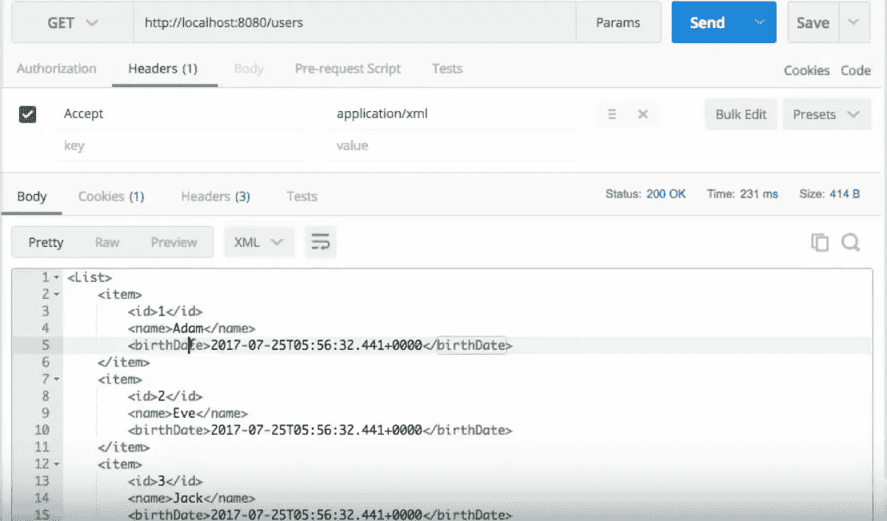

# 使用复数

给资源命名时，一定要用复数。

让我们看一个简单的例子。假设我们有一个托管`users`资源的服务。下面向消费者描述了如何访问它们:

*   创建用户:`POST /users`
*   删除用户:`DELETE /users/1`
*   获取所有用户:`GET /users`
*   获取一个用户:`GET /users/1`

选择复数形式的`users`比`user`更能让《URI》更具可读性。

*   例如，如果我们用`/user`而不是`/users`来表示检索- `GET /user` -就不能向读者传达正确的信息。

# 有很好的文档

消费者需要了解如何最好地利用服务，而帮助他们的最好方法就是创建优秀的文档。

SOAP web 服务可以利用 WSDL 的功能，而 RESTful web 服务可以选择 Swagger(现在是开放 API 文档标准)。

选择格式只是生成好文档的一部分。同样重要的是放入适量的信息来帮助消费者。

文档需要完整，并应包括以下几点:

*   什么是请求和响应结构？
*   消费者需要如何认证自己？
*   使用限制是什么？
*   指定服务预期的所有响应消息类型和相关状态代码

## 拥有一个公共的 REST API 文档门户

一件有益的事情是在整个组织中拥有一个公共的 REST API 文档门户。看看这样一个门户网站:

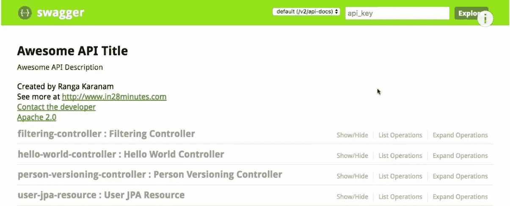

这样的门户整合了组织中存在的所有资源。拥有一个像 Swagger UI 这样的用户界面会有额外的好处。使用 Swagger UI，您可以更详细地查看文档:

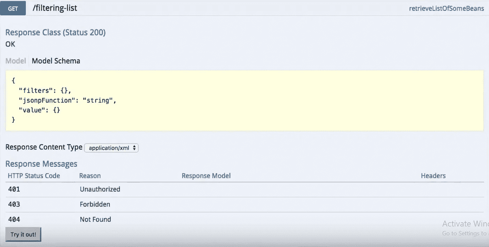

这甚至可以被非技术用户使用。此处显示的信息包括:

*   预期的响应格式
*   内容类型
*   支持的响应代码

Toy 还可以在一个实时请求/响应对中尝试文档的格式。

# 支持版本控制

版本控制给 web 服务带来了很多复杂性。维护同一个 web 服务的多个不同版本是一件痛苦的事情。尽可能避免它。

然而，在某些情况下，版本控制是不可避免的。

让我们从看一个示例服务开始。假设我们最初定义了一个名为`PersonV1`的服务，以这种方式:

这个版本的类没有考虑到一个名字可以有很多子部分，比如名字和姓氏。看看这个:

原始类的第二个版本被更新以纠正这种异常:

我们不能立即迁移整个服务来使用`PersonV2`！可能还有其他消费者在期待以`PersonV1`的形式出现的响应。

这就是需要版本控制的地方。

现在，让我们来看看我们拥有的对这两种资源进行版本控制的选项。

## 使用不同的 URIs

我们的一个选择是对这些不同的资源使用不同的 URIs。在下面的示例代码中，我们使用 URIs `v1/person`和`v2/person`来区分它们:

如果您对资源`v1/person`执行 GET 请求:

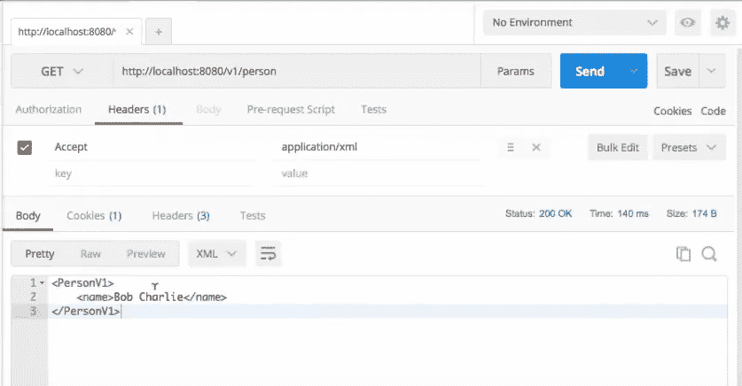

你会得到`v1`对应的信息。对于其他资源:

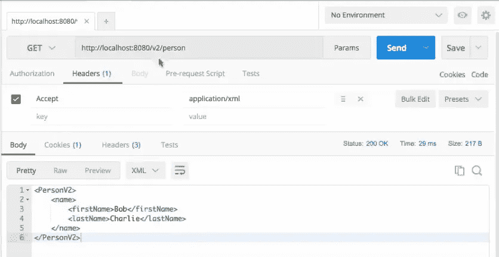

# 使用请求参数

第二种版本控制方法使用请求参数:

对于 URI `/person/param`，如果我们用`version=1`发送一个参数，那么我们返回类型`PersonV1`的资源:

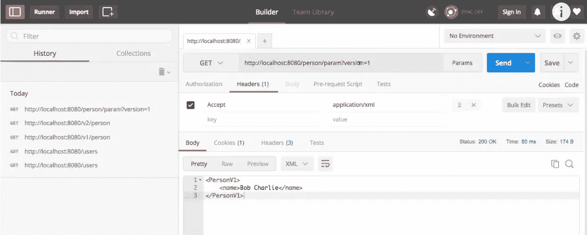

对于同一个 URI，带有`version=2`的参数返回类型为`PersonV2`的资源:

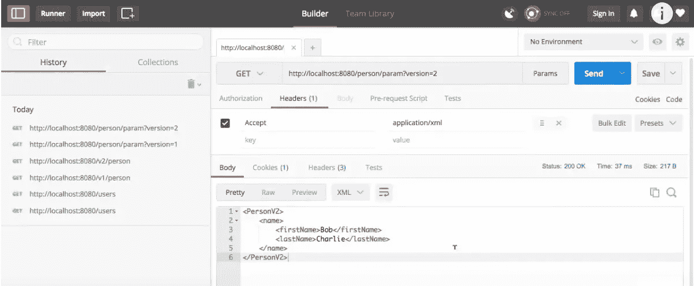

这个方法叫做**请求参数版本**。

# 使用页眉

进行版本控制的另一种方法是指定一个头。

这里，我们使用一个名为`X-API-VERSION`的头，并将 URI 标记为`/person/header`。当头值为`1`时，返回类型为`PersonV1`的资源:

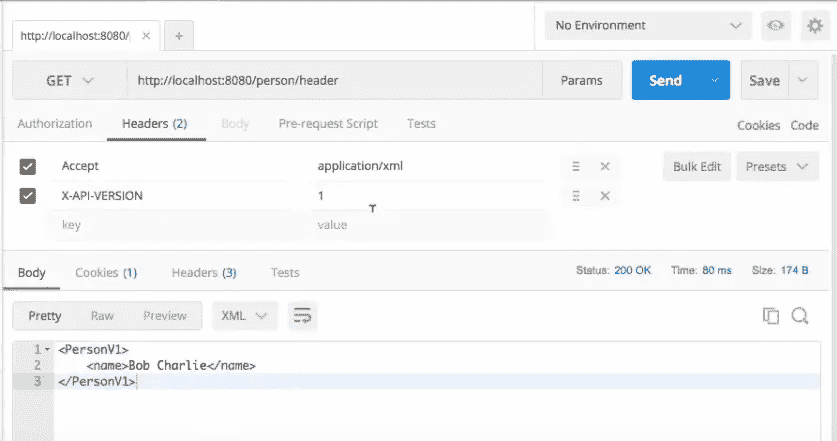

当其值为`2`时，检索类型为`PersonV2`的资源:

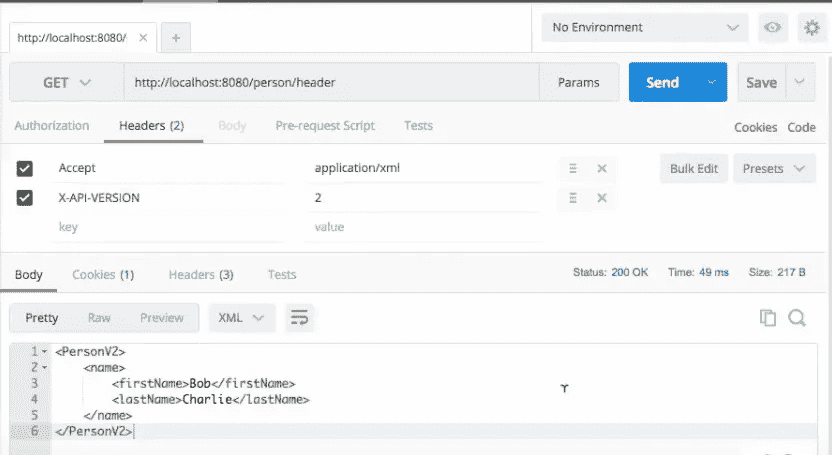

我们在请求头上使用一个属性，为我们执行版本控制。

# 使用接受标题

实现版本控制的最后一种方法是使用 Accept 头。

如果使用者在 GET 请求的 Accept 头中包含第一个版本信息，则返回以下资源:

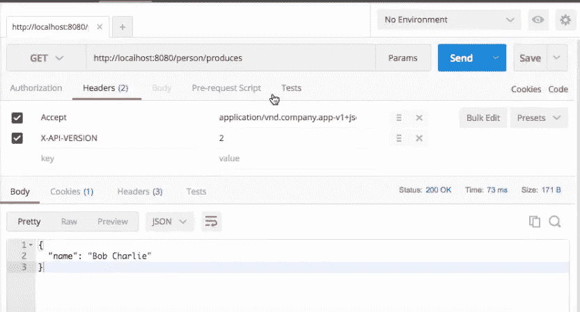

否则，返回类型为`PersonV2`的资源:

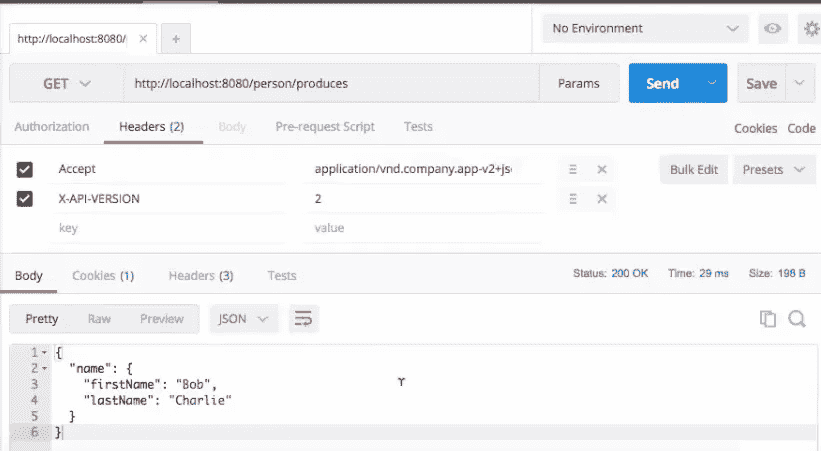

这被称为**接受报头版本控制**，或**媒体类型版本控制**，因为 mime 类型通常是接受报头的内容。

# 比较版本化技术

到目前为止，我们已经看到了四种版本控制技术:

*   URI 版本控制
*   请求参数版本控制
*   标题版本控制
*   媒体类型版本控制

这些中哪一个是最好的？

事实是，这个问题没有单一的答案。

事实是，不同的互联网巨头资助不同类型的版本控制。

*   URI 版本——Twitter
*   请求参数版本控制 Amazon
*   标题参数版本 Microsoft
*   媒体类型版本控制— GitHub

你需要根据你的具体需求来评估这四个选择。有许多重要因素需要考虑:

*   **URI 污染**:由于 URI 版本控制和请求参数版本控制，我们最终污染了 URI 空间。这是因为我们给核心 URI 字符串添加了前缀和后缀。头文件版本控制避免了这一点。
*   **HTTP 报头的误用**:在报头版本控制和媒体类型版本控制的情况下，存在 HTTP 报头的误用，因为它们原本并不用于版本控制。
*   **缓存**:资源由其 URI 定义。但是，如果您不使用 URI 来确定其版本，而是使用基于标头的机制，则无法缓存版本信息。如果 HTTP 缓存对您很重要，请使用 URI 或请求参数版本控制。
*   **浏览器请求可执行性**:头和媒体类型版本化都需要使用 Postman 等工具来执行浏览器请求。然而，如果服务的消费者在技术上不是很精通，那么 URI 或者请求参数版本化将是更好的选择。
*   **API 文档**:你还需要考虑如何为你的 API 编写文档。URI 和请求参数版本化比其他两种版本化类型更容易记录。

认识到没有单一的完美解决方案！

# 考虑错误处理

当消费者向服务发送请求时，他得到正确的响应是很重要的。每当出现问题时，发送适当的响应是很重要的。

## 当消费者请求不存在的资源时

如果我们发送一个 GET 请求来搜索一个现有用户，我们会得到以下响应:

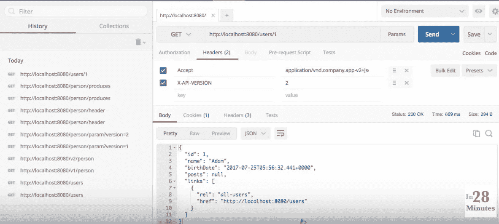

如果您搜索一个不存在的用户:

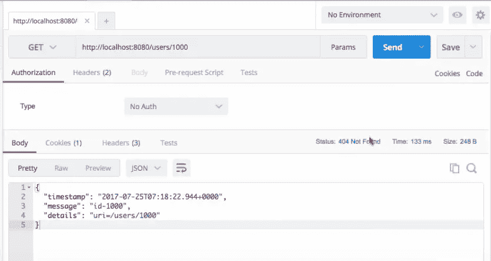

你得到的是一个`404 Not Found`的状态。这是一种很好的错误处理，因为它正确地识别出没有找到资源，并且不返回服务器错误。

现在让我们向一个不存在的 URI 发送一个 GET 请求:

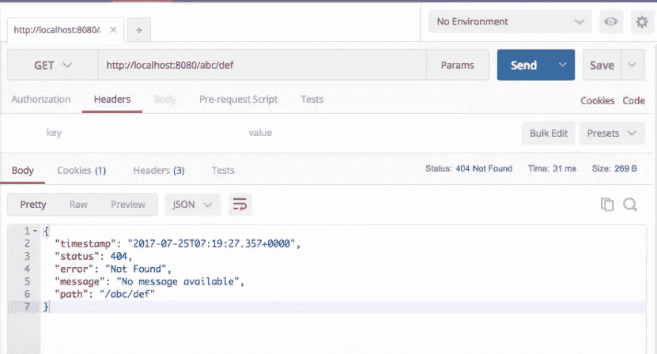

你可以看到你得到一个`404 Not Found`。错误的 URL 表示不存在的资源。

## 查看重要的响应状态

*   200 —成功
*   404 —未找到资源
*   400 —错误的请求(如验证错误)
*   201 —已创建
*   401 —未授权(授权失败时)
*   500 —服务器错误

## 响应正文中的错误详细信息

如果在设计服务时有一个标准的异常结构，会很有帮助。

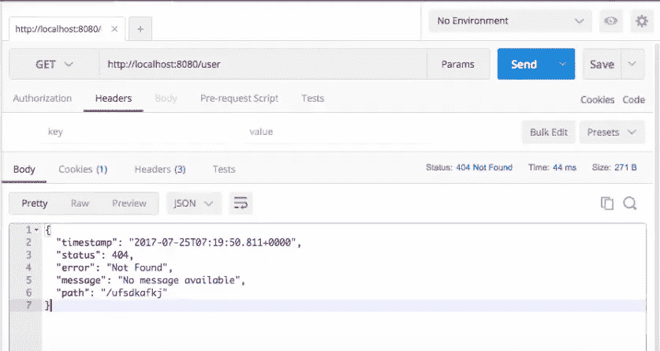

对于特定的错误，可以向消费者返回特定的响应结构，这可以成为整个组织的标准。确保错误响应对消费者来说也是可读的，不会混淆。

# 使用 Swagger 或开放 API 文档

Swagger 是 RESTful web 服务最流行的文档格式之一。如今，它得到了各种组织的支持，并在大量服务中使用。我们在这里着眼于 Swagger 的两个主要方面:

*   Swagger 文档格式
*   Swagger UI，使您能够以视觉愉悦的方式查看 Swagger 文档

## Swagger 文档

看看下面的 Swagger JSON:

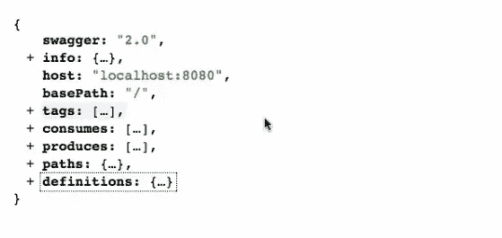

在高层次上，它看起来非常类似于 WSDL 定义。它有几个重要的属性:

*   `host`:托管服务的位置
*   `basePath`:托管服务的路径
*   `consumes`:接受什么样的请求

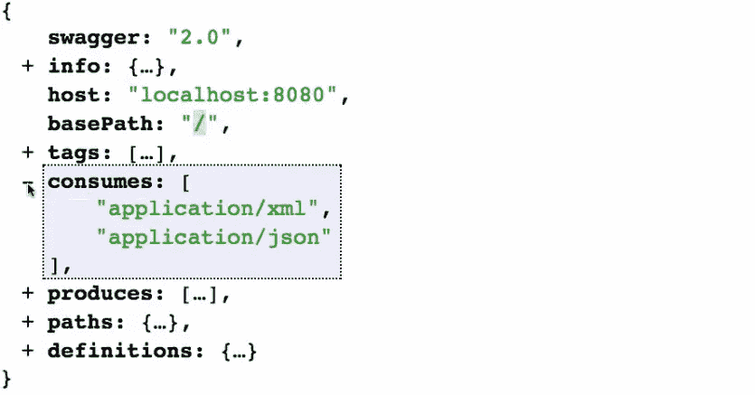

*   `produces`:会产生什么样的反应

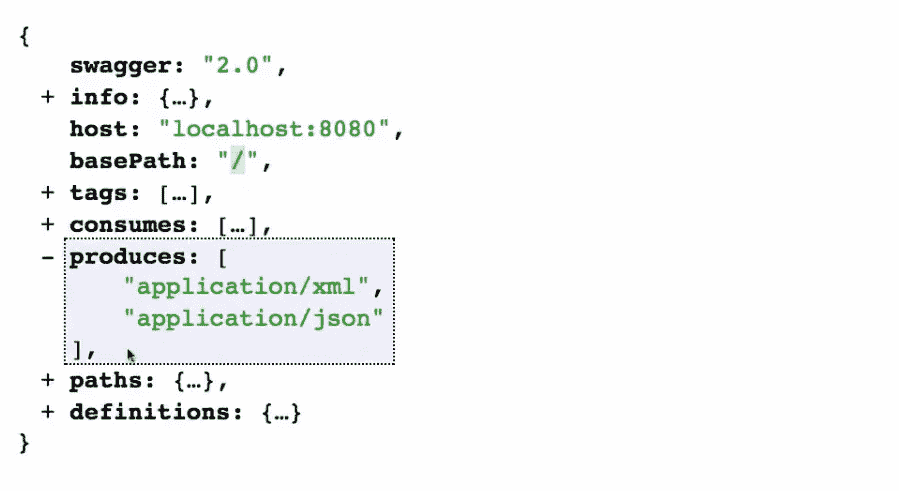

*   `paths`“不同的资源呈现在这个案例中，你列出了几种类型的资源:

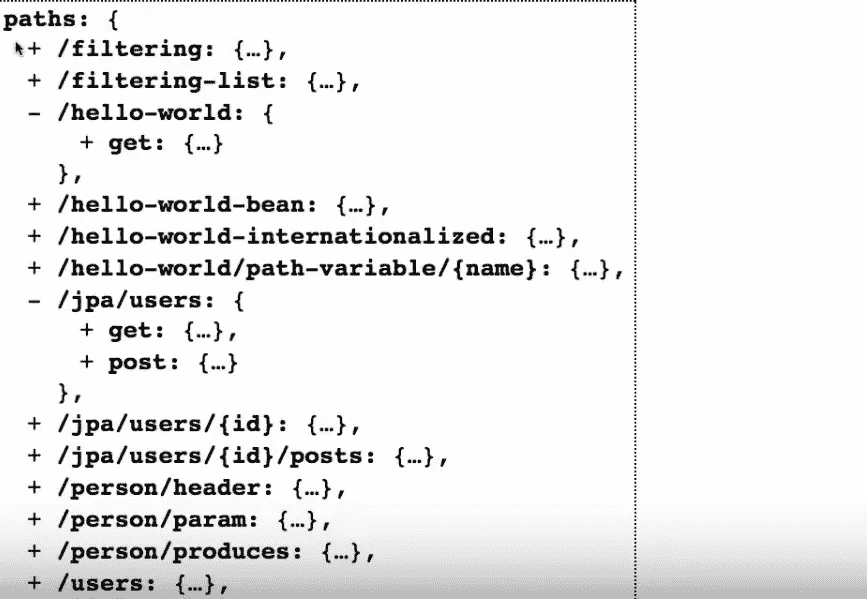

当您查看 Swagger 文档时，您可以快速确定存在的资源、支持的操作以及与每个资源相关的操作:

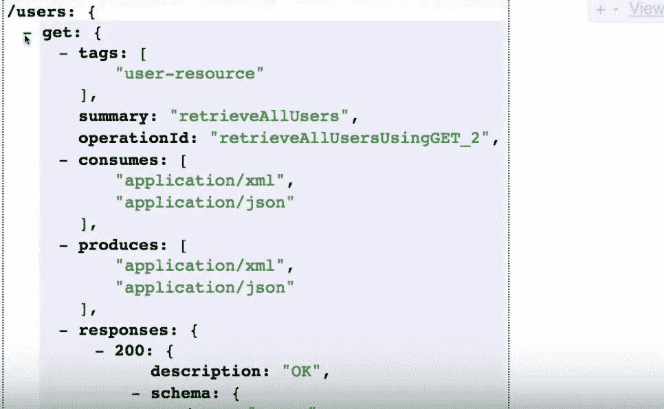

资源`/users`支持`GET`和`POST`操作。对于`GET`，您可以看到支持的请求和响应类型。您还可以看到它有不同的响应类型:

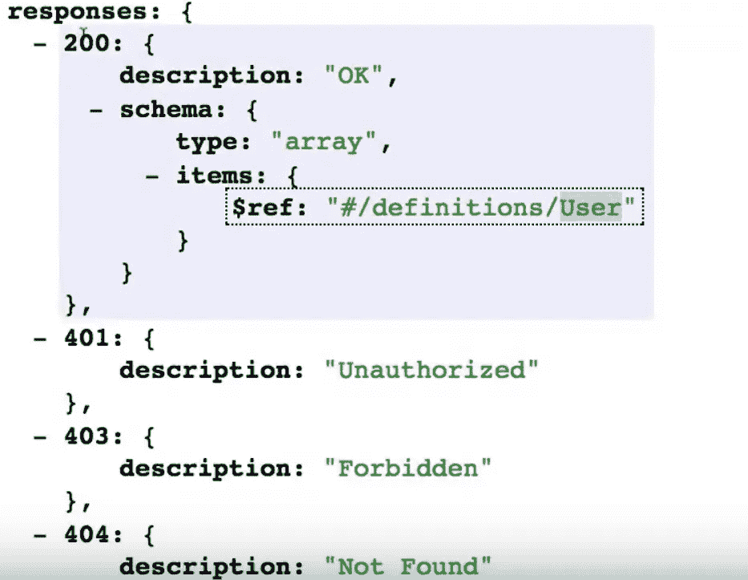

注意，对于一个`200`响应，还提到了一个模式，作为一个`User`的数组。`User`是文档底部`definitions`部分的一部分:

Swagger 完全独立于您用来实现 RESTful web 服务的技术。都是工作中的基本 JSON。

## Swagger UI 简介

Swagger 是一个很棒的 UI 工具，对于可视化 RESTful web 服务的 Swagger 文档很有用。看看下面的截图:

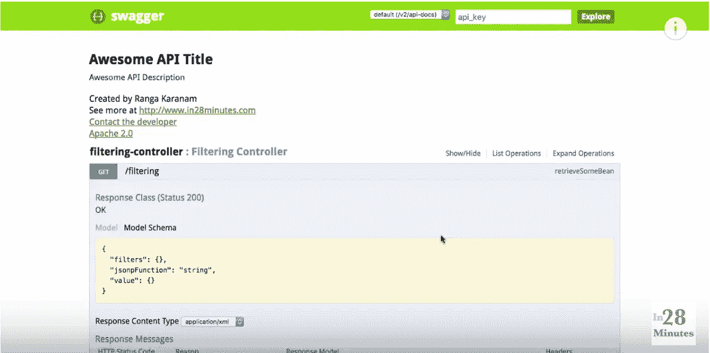

注意，我们已经选择了一个特定版本的 web 服务来查看它的文档。这是同一屏幕的更详细的内容:

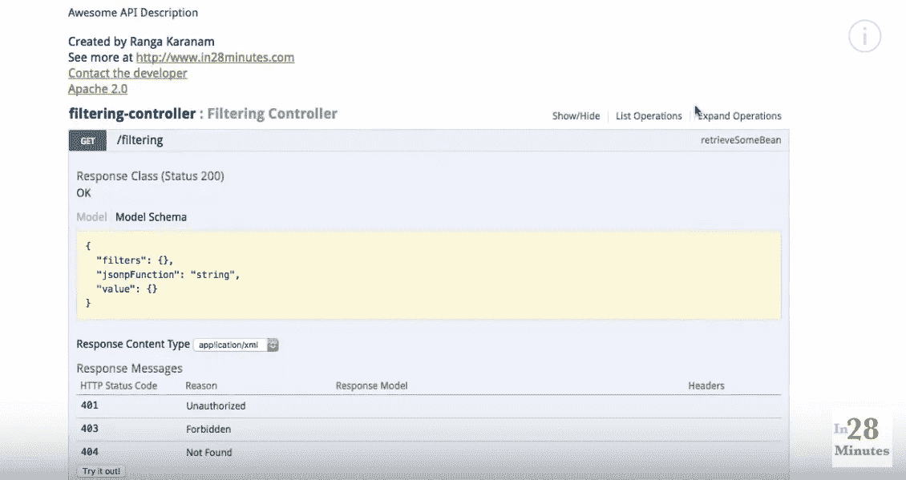

当我们来到主页时，它描述了列出的资源:

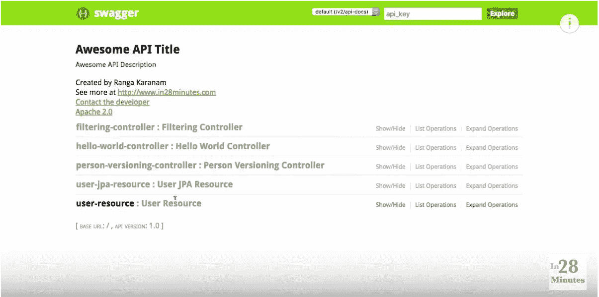

此外，还可以看到资源 URL 支持的一组操作:

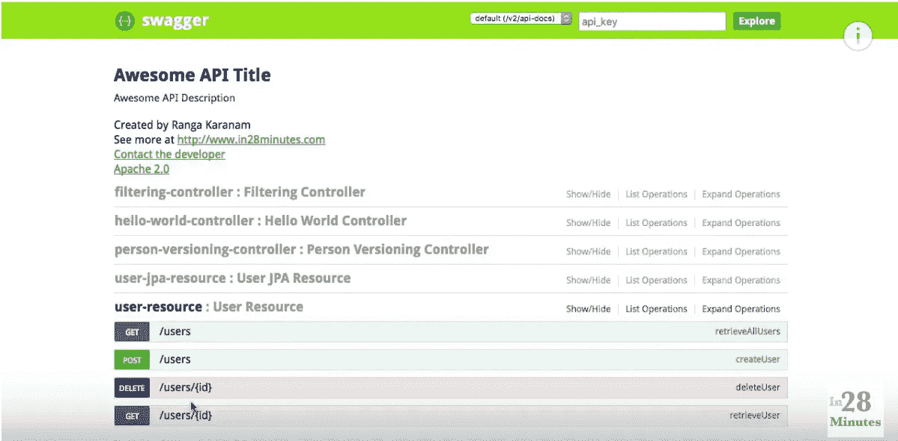

当您单击特定资源的 GET 操作时，您将获得其详细信息:

您可以看到模型模式得到了可视化的描述。属性`birthDate`、`id`、`links`、`name`和`posts`也被显示。您还可以执行一个示例请求，并查看响应:

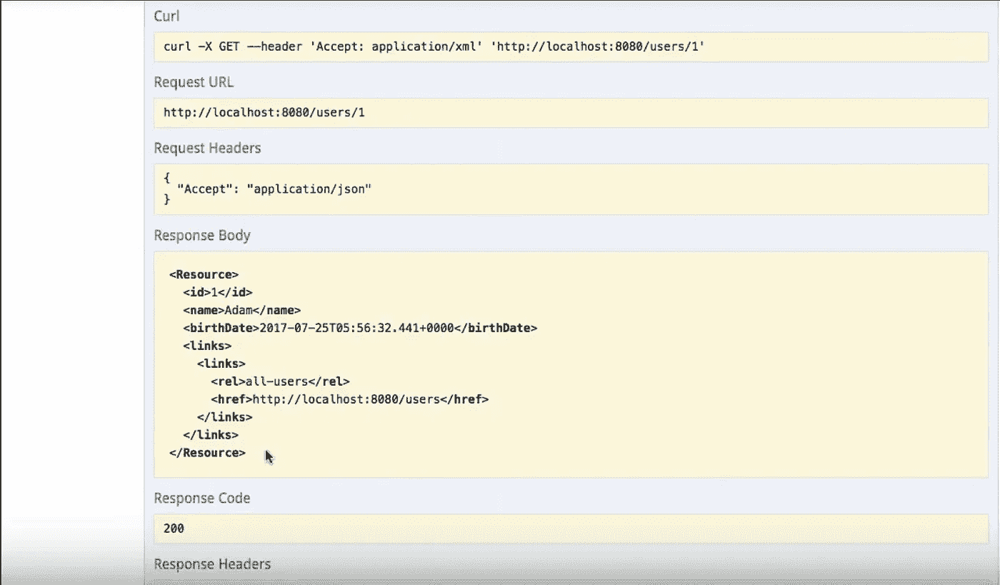

## 使用 Swagger(开放 API 标准)工具

Swagger 的伟大之处在于它周围有很多可用的工具。看一下我们之前使用的以下服务，来解释版本控制:

下面是为这项服务自动生成的文档:

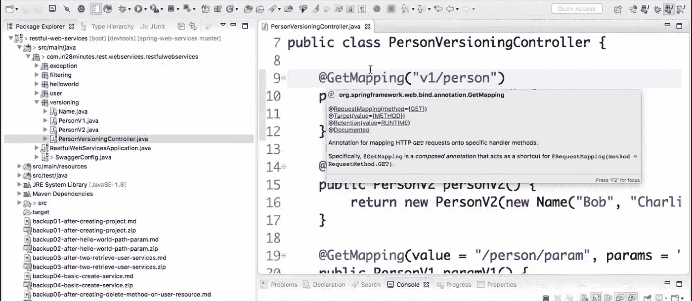

Swagger 既支持契约优先方法，也支持代码优先方法。

一定要看看我们同一个主题的视频:

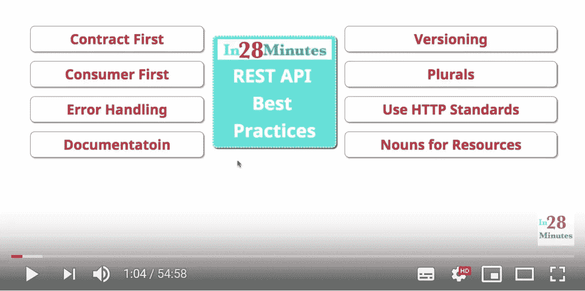

# 摘要

在本文中，我们了解了构建和设计 RESTful web 服务的最佳实践。

# 其他 Java 和 Web 开发资源

1.  [2020 年 Java 开发者路线图](https://javarevisited.blogspot.com/2019/10/the-java-developer-roadmap.html)
2.  [面向 Java 开发者的 5 门免费 Spring 框架课程](http://www.java67.com/2017/11/top-5-free-core-spring-mvc-courses-learn-online.html)
3.  [2020 年学习 Spring Boot 的 5 大课程](https://javarevisited.blogspot.com/2018/05/top-5-courses-to-learn-spring-boot-in.html)
4.  [学习大数据和 Apache Spark 的 5 门课程](http://javarevisited.blogspot.com/2017/12/top-5-courses-to-learn-big-data-and.html)
5.  [学习 Java 设计模式的前 5 门课程](https://javarevisited.blogspot.com/2018/02/top-5-java-design-pattern-courses-for-developers.html)
6.  [5 门免费的数据结构与算法课程](https://javarevisited.blogspot.com/2018/01/top-5-free-data-structure-and-algorithm-courses-java--c-programmers.html)
7.  [学习 React JS 框架的 5 门免费课程](http://www.java67.com/2018/02/5-free-react-courses-for-web-developers.html)
8.  [2020 年学习 Web 开发的五大课程](https://javarevisited.blogspot.com/2018/02/top-5-online-courses-to-learn-web-development.html)

<https://javarevisited.blogspot.com/2019/10/the-java-developer-roadmap.html#123> 