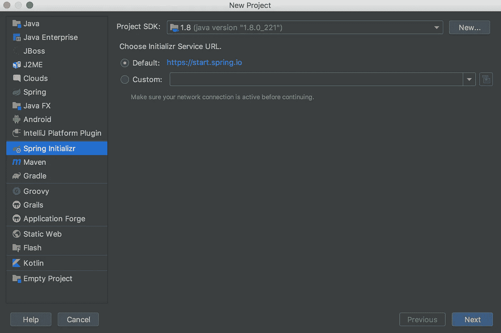
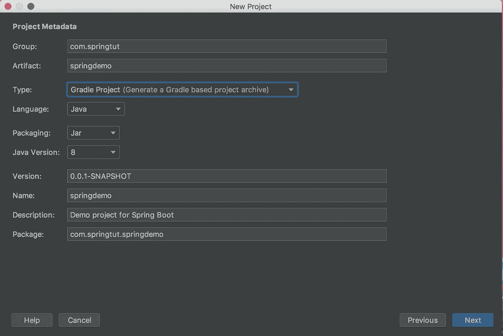
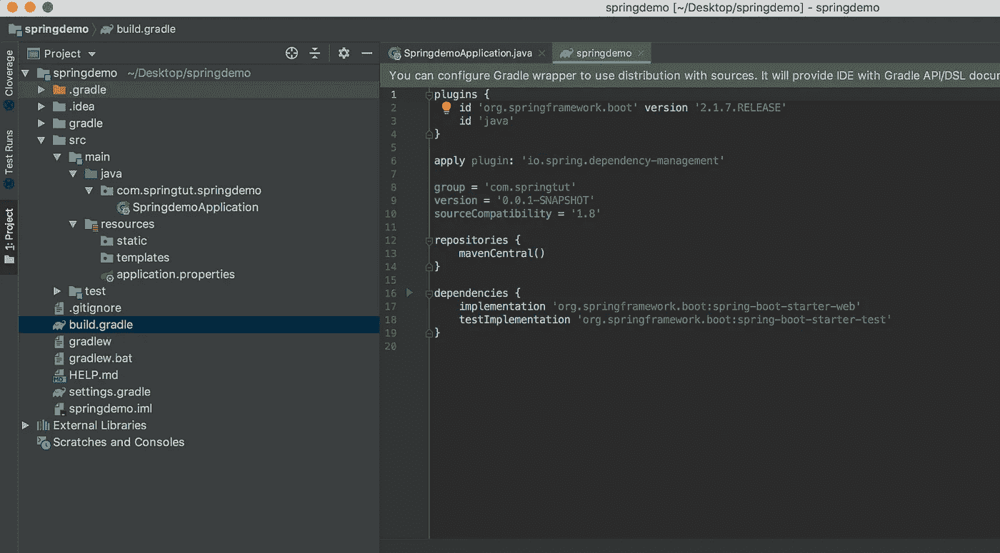
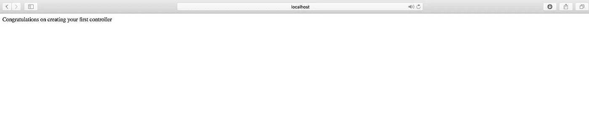

# 使用 Spring Boot 的 REST API 第 1 部分设置和创建基本控制器

> 原文：<https://medium.com/javarevisited/rest-api-using-spring-boot-part-1-setting-up-and-creating-basic-controller-9699330df64f?source=collection_archive---------2----------------------->

微服务允许开发人员独立开发和部署服务，其中每个运行的服务都有其流程。这实现了支持各种业务应用的轻量级模型。Spring Boot 是一个基于 Java 的开源框架，用于开发和部署生产就绪的微服务。

**Spring Boot 的优势**

*   它提供了一种灵活的方式来配置 XML 配置和数据库事务。
*   它提供了一种管理 REST 端点的简单方法。
*   一切都是自动配置的；不需要手动配置。
*   它提供了基于注释的 spring 应用程序
*   简化依赖性管理
*   它包括嵌入式 Servlet 容器
*   易于理解和开发 spring 应用程序
*   提高生产力
*   减少开发时间

我们将为演示帖子构建一个 [REST API](https://dev.to/javinpaul/why-spring-mvc-is-best-for-creating-restful-web-services-in-java-358p) 。它允许一个人获取所有的帖子，获得一个帖子，创建一个帖子，更新和删除一个现有的帖子。

# 要求

*   对 Java 编程语言有良好的理解
*   Gradle 的基础知识

# 启动 Spring Boot 项目

在 [IntelliJ IDEA](https://itnext.io/top-5-intellijidea-and-android-studio-courses-for-java-and-android-programmers-afcc27309b60) 中创建一个新项目，选择 Spring Initialzr，然后点击 next。输入项目的组和工件，并选择类型为 gradle 项目或 maven 项目。“Group”是你唯一的组织名称(大多数情况下，人们使用他们公司的反向域名如“com.springtut”)，“Artifact”是项目的唯一名称(“springdemo”)。

对于本文，我将使用 Gradle 项目。选择 Web starter 作为下一步的依赖项。



该项目已经用 src/main/java 文件夹中的主 SpringBootApplication 类进行了设置。对于任何要运行的 Java 应用程序，您需要至少有一个主类。

Spring Boot 应用程序的入口点是包含[**@ springboot Application**](https://javarevisited.blogspot.com/2018/05/the-springbootapplication-annotation-example-java-spring-boot.html)**注释的类。这个类应该有运行 Spring Boot 应用程序的 main 方法。 **@SpringBootApplication** 注释包括[自动配置](https://javarevisited.blogspot.com/2018/11/top-5-spring-boot-features-java.html)，组件扫描，Spring Boot 配置。**

****

**默认 build.gradle 文件**

**现在，当您运行应用程序并从浏览器转到 url localhost:8080 时，它向您显示一个错误，因为我们没有一个[控制器](https://javarevisited.blogspot.com/2017/08/difference-between-restcontroller-and-controller-annotations-spring-mvc-rest.html)来处理我们的 HTTP 请求。**

****

**无控制器时的错误**

# **编写控制器**

**控制器用于处理来自用户的传入 HTTP 请求，并返回适当的响应。**

**在主 [Spring Boot](https://hackernoon.com/top-5-online-courses-to-learn-spring-boot-in-2019-c2fd7a0282c2) 应用程序类所在的同一个包中创建一个新包。然后在包中创建一个 SpringDemoController.java。**

**[**@ rest Controller**](https://javarevisited.blogspot.com/2017/08/difference-between-restcontroller-and-controller-annotations-spring-mvc-rest.html)注释告诉我们这个类是一个控制器。 **@RequestMapping("/")** 注释意味着任何请求(GET、POST、PUT 等。)到根 URL(/)将由“index()”方法处理。响应属于“字符串”类型。**

```
import org.springframework.web.bind.annotation.RequestMapping;
import org.springframework.web.bind.annotation.RestController;

@RestController
public class SpringDemoController {

    @RequestMapping("/")
    public String index() {
        return "Congratulations on creating your first controller";
    }
}
```

**现在，重新运行应用程序，再次在浏览器中转到 localhost:8080，得到如下显示。**

****

**成功！**

**[***在这里阅读下一篇关于模型、服务、控制器和道的实现的文章。***](/@aditi.mittalborn97/rest-api-using-spring-boot-part-2-adding-model-service-controller-and-dao-implementation-697284b4ff38)**

**其他 **Java 和 Spring 文章**你可能喜欢探讨的
[2018 年 Java 开发者应该学习的 10 件事](http://javarevisited.blogspot.sg/2017/12/10-things-java-programmers-should-learn.html)
[学习和掌握 Spring Cloud](http://javarevisited.blogspot.sg/2018/04/top-5-spring-cloud-courses-for-java.html)
[2018 年学习 Spring 框架的 5 门免费课程](http://www.java67.com/2017/11/top-5-free-core-spring-mvc-courses-learn-online.html)
[2018 年学习 Spring 安全的 5 门课程](http://www.java67.com/2017/12/top-5-spring-security-online-training-courses.html)
[2018 年有经验的 Java 开发者应该阅读的 5 本 Spring 书籍](http://javarevisited.blogspot.sg/2018/04/5-spring-framework-books-experienced-Java-developers-2018.html)
[10 2018 年](http://javarevisited.blogspot.sg/2018/05/10-tips-to-become-better-java-developer.html)
[Java 开发者应该知道的 5 大框架](https://javarevisited.blogspot.sg/2018/04/top-5-java-frameworks-to-learn-in-2018_27.html)
[Java 程序员 20 个春假面试问题](https://javarevisited.blogspot.com/2018/02/top-20-spring-rest-interview-questions-answers-java.html#axzz57Kv4wGXe)**