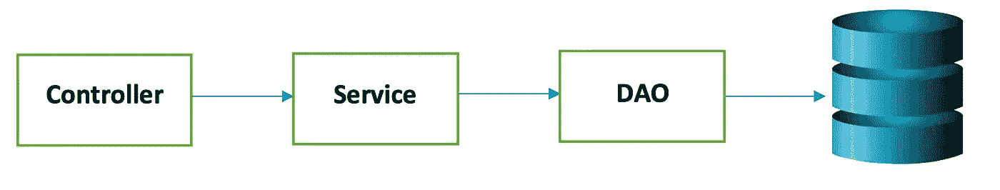

# (使用 Spring Boot 的 REST API)第 2 部分添加模型、服务、控制器和 Dao 实现

> 原文：<https://medium.com/javarevisited/rest-api-using-spring-boot-part-2-adding-model-service-controller-and-dao-implementation-697284b4ff38?source=collection_archive---------1----------------------->



用户流量

本文讨论了模型、服务、数据访问对象(DAO)和控制器的实现。在[第一部分](/javarevisited/rest-api-using-spring-boot-part-1-setting-up-and-creating-basic-controller-9699330df64f?source=friends_link&sk=02dbff036a521ee9adaab275711a31fa)的续篇中，讨论了建立 [Spring Boot](http://www.java67.com/2019/01/top-5-spring-boot-annotations-java-programmers-should-know.html) 项目和编写基本控制器的步骤。

控制器是与外界交互的接口。它处理传入的 HTTP 请求并将响应发送回调用者。基于传入的请求 URL 和 HTTP 动词(GET/POST/PUT/PATCH/DELETE)，API 决定执行哪个控制器和动作方法，例如 GET()方法将处理 HTTP GET 请求，POST()方法将处理 HTTP POST 请求，PUT()方法将处理 HTTP PUT 请求，DELETE()方法将处理上述 Web API 的 HTTP DELETE 请求。服务是定义应用程序业务逻辑的工具。DAO 或数据访问对象用于直接与数据库交互。

# 添加到 application.properties

```
spring.jpa.hibernate.ddl-auto=update
spring.datasource.url=jdbc:mysql://${MYSQL_HOST:localhost}:3306/all_transactions
spring.datasource.username=****
spring.datasource.password=****
spring.jpa.properties.hibernate.dialect = org.hibernate.dialect.MySQL5InnoDBDialect
```

# 编写接口和模型类

## **模特班**

在我的例子中，模型类是用于事务的，它将 id、类型、电子邮件和日期作为它的属性。让我们在 IntelliJ 类中声明这些。

**@ Table(name = " Transaction ")**'用于在 MySQL 数据库中创建一个名为 Transaction 的表。**@ generated value(strategy = generation type。 *AUTO)*** *'* 用于每当增加新交易时自动生成 id。这意味着每当创建一个事务时，id 将自动增加 1。 **@Column(name= "id")** '用于在数据库的交易表中创建一个具有特定名称' id '的列。为每个指定的属性编写 Setters 和 getters 方法。

```
**import** javax.persistence.*;@Entity
@Table(name = "Transaction")
public class Transaction {

    @Id
    @GeneratedValue(strategy=GenerationType.*AUTO*)
    @Column(name="id")
    private Integer id;

    @Column(name="type")
    private String type;

    @Column(name="email")
    private String email;

    @Column(name="date")
    private String date;

    public Transaction(){

    }

    public Transaction(Integer id, String type, String email, String date) {
        this.id=id;
        this.type = type;
        this.email = email;
        this.date = date;
    }

    public int getId() {
        return id;
    }

    public void setId(int id) {
        this.id = id;
    }

    public String getType() {
        return type;
    }

    public void setType(String type) {
        this.type = type;
    }

    public String getEmail() {
        return email;
    }

    public void setEmail(String email) {
        this.email = email;
    }

    public String getDate() {
        return date;
    }

    public void setDate(String date) {
        this.date = date;
    }

}
```

## 服务接口

服务将具有保存交易、获取所有交易、通过 id 获取交易、筛选交易和删除交易的功能。保存交易功能将用于更新现有交易和创建新交易。我们将为服务创建另一个包，其中我们将添加[接口](https://javarevisited.blogspot.com/2018/01/what-is-functional-interface-in-java-8.html)及其实现。

如果交易的电子邮件 id 在黑名单中，并且交易是在过去 30 天内进行的，则筛选交易应返回“已拒绝”。在所有其他情况下，它应该返回“接受”。

```
public interface TransactionService {

    public List<Transaction> findAllTransactions();

    public String screenTransactionById(int theId);

    public Transaction findTransactionById(int theId);

    public Transaction saveTransaction(Transaction theTransaction);

    public int deleteTransactionById(int theId);

}
```

## DAO 接口

DAO 将具有与服务类似的功能，即从数据库中获取所有交易，通过 id 从数据库中获取交易，在数据库中添加交易和在数据库中删除交易。

```
public interface TransactionDAO {

    List<Transaction> getAllTransactions();

    Transaction findTransactionById(int theId);

    Transaction saveTransaction(Transaction theTransaction);

    void deleteTransactionById(int theId);

}
```

## DAO 实现类

DAO 实现类将与数据库交互。本例中使用 MySql 作为数据库。DAO 接口的所有方法都在这个类中被重写。

如果我们用 **@Autowired** 注释一个类，Spring 会自动解析这个实例，并把它注入到声明它的类中。因此，我们不需要自己获得 singleton 实例。如果一个类是[单例](https://javarevisited.blogspot.com/2014/05/double-checked-locking-on-singleton-in-java.html)，那么在整个应用程序生命周期中，这个类只能有一个实例。

**Spring Repository** 非常接近于 [DAO](https://www.journaldev.com/16813/dao-design-pattern) 模式，其中 DAO 类负责提供数据库表上的 CRUD 操作。 **'@Repository'** 注释用于将类声明为由 spring framework 自动检测的存储库对象。

```
**import** org.hibernate.query.Query;
**import** org.springframework.beans.factory.annotation.Autowired;
**import** org.springframework.stereotype.Repository;
**import** javax.persistence.EntityManager;
**import** java.util.List;@Repository
public class TransactionDAOJpaImpl implements TransactionDAO {

    private EntityManager entityManager;

    @Autowired
    public TransactionDAOJpaImpl(EntityManager entityManager){
        this.entityManager = entityManager;

    }

   //get all the transactions from the database
    @Override
    public List<Transaction> getAllTransactions() {
        Query theQuery= (Query) entityManager.createQuery("from Transaction");
        List<Transaction> transactions = theQuery.getResultList();

        return transactions;
    }

    //return the transaction by giving id as input
    @Override
    public Transaction findTransactionById(int theId) {
        Transaction theTransaction = entityManager.find(Transaction.class,theId);
        return theTransaction;
    }

    //add the transaction to the database
    @Override
    public Transaction saveTransaction(Transaction theTransaction) {
        Transaction dbTransaction = entityManager.merge(theTransaction);
        theTransaction.setId(dbTransaction.getId());
        return theTransaction;
    }

    //delete the transaction from the database using transaction id
    @Override
    public void deleteTransactionById(int theId) {
        Query theQuery = (Query) entityManager.createQuery("delete from Transaction where id=:transactionId");
        theQuery.setParameter("transactionId", theId);
        theQuery.executeUpdate();
    }
}
```

一旦定义了映射，**实体管理器**就可以管理您的实体。实体管理器处理与数据库的所有交互。

## 服务实现类

服务接口中声明的所有方法都在该类中被覆盖。

**'@Transactional'** 注释本身定义了单个数据库事务的范围。数据库事务发生在一个*持久上下文*的范围内。

```
**import** org.springframework.beans.factory.annotation.Autowired;
**import** org.springframework.beans.factory.annotation.Qualifier;
**import** org.springframework.stereotype.Service;
**import** org.springframework.transaction.annotation.Transactional;

**import** java.text.SimpleDateFormat;
**import** java.time.LocalDate;
**import** java.util.Arrays;
**import** java.util.List;

**import static** java.time.temporal.ChronoUnit.***DAYS***;@Service
public class TransactionServiceImpl implements TransactionService {

    TransactionDAO transactionDAO;
    private static final String[] *blackListEmails* = new String[] {"blacklist1@gmail.com","blacklist2@gmail.com","blacklist3@gmail.com","blacklist4@gmail.com"};

    @Autowired
    public TransactionServiceImpl(@Qualifier("transactionDAOJpaImpl") TransactionDAO theTransactionDao){
        transactionDAO = theTransactionDao;
    }

    @Override
    @Transactional
    public List<Transaction> findAllTransactions() {
        return transactionDAO.getAllTransactions();
    }

    @Override
    @Transactional
    public String screenTransactionById(int theId) {
        Transaction theTransaction=transactionDAO.findTransactionById(theId);
        String dateInString = theTransaction.getDate();
        LocalDate localDate = LocalDate.*parse*(dateInString);
        LocalDate today = LocalDate.*now*();

        long difference=*DAYS*.between(localDate, today);
        boolean isInBlackList = Arrays.*asList*(*blackListEmails*).contains(theTransaction.getEmail());

        //return Reject if the email id is in blacklist and the transaction has been made in the last 30 days, otherwise return accept
        if(isInBlackList && difference<30) {
            return "REJECT";
        }
        else {
            return "ACCEPT";
        }

    }

    @Override
    @Transactional
    public Transaction findTransactionById(int theId) {
        return transactionDAO.findTransactionById(theId);
    }

    @Override
    @Transactional
    public Transaction saveTransaction(Transaction theTransaction) {
        return transactionDAO.saveTransaction(theTransaction);
    }

    @Override
    @Transactional
    public int deleteTransactionById(int theId) {
        transactionDAO.deleteTransactionById(theId);
        return theId;
    }
}
```

## 控制器类别

Spring Boot [注解](http://www.java67.com/2019/01/top-5-spring-boot-annotations-java-programmers-should-know.html)用于处理不同的 HTTP 请求类型

*   @RequestMapping —用于处理任何请求类型
*   @GetMapping —获取请求
*   @PostMapping —发布请求
*   @PutMapping —上传请求
*   @PatchMapping —修补请求
*   @DeleteMapping —删除请求

路径变量是请求 URL 中的变量，用“[**@ path variable**](https://javarevisited.blogspot.com/2017/10/differences-between-requestparam-and-pathvariable-annotations-spring-mvc.html#axzz5jtleVQXB)”标注。

POST、PUT 和 DELETE 请求可以包含一个名为“ **@RequestBody** ”的有效负载。有效载荷包含可以存储或更新的数据。有效载荷通常是 [JSON 格式](https://javarevisited.blogspot.com/2013/02/how-to-convert-json-string-to-java-object-jackson-example-tutorial.html)

```
**import** org.springframework.beans.factory.annotation.Autowired;
**import** org.springframework.http.HttpStatus;
**import** org.springframework.http.ResponseEntity;
**import** org.springframework.web.bind.annotation.*;

**import** java.util.List;@RestController
@RequestMapping(path="/demo")
public class TransactionRestController {

    private TransactionService transactionService;

    @Autowired
    public TransactionRestController(TransactionService thetransactionservice){
        transactionService = thetransactionservice;

    }

    //For getting all the transactions
    @RequestMapping(value = "/transactions", method= RequestMethod.*GET*)
    public ResponseEntity<List<Transaction>> findAll(){
        System.*out*.println(transactionService.findAllTransactions().size());
        return new ResponseEntity<List<Transaction>>(transactionService.findAllTransactions(), HttpStatus.*OK*);

    }

    //For getting whether the transaction with a given id is rejected or accepted
    @RequestMapping(value = "/transactions/{transactionId}", method = RequestMethod.*GET*)
    public String screenTransaction(@PathVariable int transactionId)  {
        String theTransaction = transactionService.screenTransactionById(transactionId);

        return theTransaction;
    }

    //For adding a transaction
    @RequestMapping(value = "/transactions", method = RequestMethod.*POST*)
    public Transaction addTransaction(@RequestBody Transaction theTransaction){

        return (transactionService.saveTransaction(theTransaction));
    }

    //For updating a transaction
    @RequestMapping(value = "/transactions", method = RequestMethod.*PUT*)
    public Transaction updateTransaction(@RequestBody Transaction theTransaction){
        Transaction transaction = transactionService.findTransactionById(theTransaction.getId());
        if (transaction == null) {
            throw new RuntimeException("Transaction to update doesn't exist");
        }
        return (transactionService.saveTransaction(theTransaction));
    }

    //For deleting a transaction
    @RequestMapping(value = "/transactions/{transactionId}", method = RequestMethod.*DELETE*)
    public String deleteTransaction(@PathVariable int transactionId){
        Transaction tempTransaction = transactionService.findTransactionById(transactionId);
        if(tempTransaction == null){
            throw new RuntimeException("Transaction Id not found");
        }
        transactionService.deleteTransactionById(transactionId);
        return "deleted transaction id " + transactionId;

    }
}
```

现在你可以在 Postman[T5【http://localhost:8080/demo/transactions](http://localhost:8080/demo/transactions.)*，*screen transactions 在 URL[*http://localhost:8080/demo/transactions/{ transaction id }*](http://localhost:8080/demo/transactions/{transactionId})*中选择 get，就可以得到所有的交易。您可以在 URL*[*http://localhost:8080/demo/transactions*](http://localhost:8080/demo/transactions.)*中添加交易，并在 URL[*http://localhost:8080/demo/transactions*](http://localhost:8080/demo/transactions.)*中选择发布和更新交易，然后选择 PUT *。*您也可以通过转到[*http://localhost:8080/demo/transactions/{ transaction id }*](http://localhost:8080/demo/transactions/{transactionId})*并选择删除来删除交易。*****

***如果你想更多地了解 Spring Boot，这里有一些有用的资源，如供进一步阅读的书籍和课程:***

1.  ***[学习春天和 Spring Boot 的 5 门免费课程](http://www.java67.com/2017/11/top-5-free-core-spring-mvc-courses-learn-online.html)***
2.  ***[成为更好的 Java 开发人员的 10 个技巧](http://javarevisited.blogspot.sg/2018/05/10-tips-to-become-better-java-developer.html)***
3.  ***[5 门春季安全课程在线学习](http://www.java67.com/2017/12/top-5-spring-security-online-training-courses.html)***
4.  ***[学习 Spring Boot 和春云的 3 种方法](http://javarevisited.blogspot.sg/2018/01/how-to-learn-spring-core-spring-mvc-boot-security-framework.html#axzz55IgfKjy8)***
5.  ***[初学者学习 Spring Boot 的 5 门课程](https://javarevisited.blogspot.sg/2018/05/top-5-courses-to-learn-spring-boot-in.html)***
6.  ***[深入学习 Spring 框架的前 5 门课程](https://javarevisited.blogspot.com/2018/06/top-6-spring-framework-online-courses-Java-programmers.html)***

******请继续关注第 3 部分，讨论为编写的代码编写单元测试。******

**[](/javarevisited/10-free-spring-boot-tutorials-and-courses-for-java-developers-53dfe084587e) [## 面向 Java 开发人员的 10 个免费 Spring Boot 课程和教程

### 大家好，作为一个 Java 博客的作者和 Java 开发人员，很多人问我关于课程和书籍的问题…

medium.com](/javarevisited/10-free-spring-boot-tutorials-and-courses-for-java-developers-53dfe084587e)**