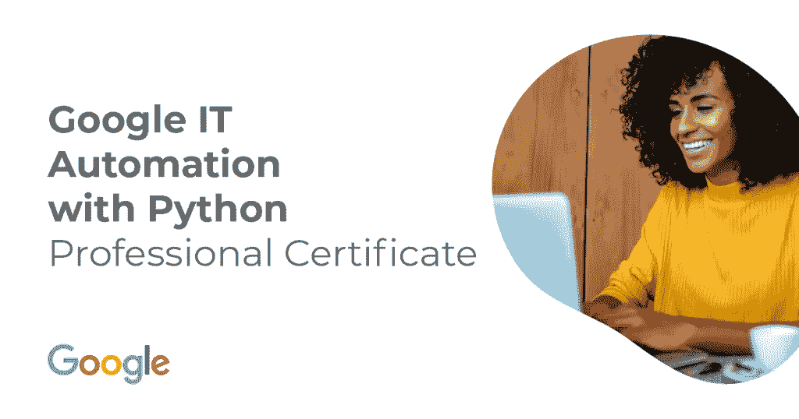

# Google 在 Coursera 上有 Python 专业认证的 IT 自动化值得吗？[2022 年回顾]

> 原文：<https://medium.com/javarevisited/review-googles-it-automation-with-python-professional-certification-on-coursera-f75c1ba670e8?source=collection_archive---------1----------------------->

## 这是一个具有挑战性的 Python 认证，但因为它的可信度和 Google 认证，所以是值得的。这可能需要几个月的时间来完成，但对 Python 的职业生涯来说是非常好的。

image_credit — Coursera

大家好，如果你正在寻找最好的 Python 认证或打算加入 Coursera 上的 [***谷歌的 IT 自动化与 Python 专业认证，并想知道它是否值得你的时间和金钱，那么你来对地方了。***](https://coursera.pxf.io/c/3294490/1164545/14726?u=https%3A%2F%2Fwww.coursera.org%2Fprofessional-certificates%2Fgoogle-it-automation)

早些时候，我已经在 Coursera 上分享了[最佳 Coursera 课程和认证](/javarevisited/18-coursera-courses-you-can-join-in-2020-to-learn-from-the-worlds-top-tech-companies-google-74af46967d1e?source=collection_home---4------0-----------------------)以及我对谷歌其他热门 IT 认证的评论，关于 IT 支持认证的[谷歌课程](/javarevisited/courseras-google-it-support-professional-certification-review-fef6892497c2)，在本文中，我将回顾谷歌在 Coursera 上最受欢迎的 Python 认证课程。

如果你很急，这是给想学习 Python 的 IT 自动化的人的高级认证。这对许多人来说是一个挑战，可能需要几个月才能完成。

有些课程很容易，但有些就不那么容易了。你可能需要一遍又一遍地观看讲座来解决那些讨厌的实验室和评估问题，但考虑到它提供的价值和认可，它绝对是值得的。

[***Google 的 IT automation with Python***](https://coursera.pxf.io/c/3294490/1164545/14726?u=https%3A%2F%2Fwww.coursera.org%2Fprofessional-certificates%2Fgoogle-it-automation)*是一个专业证书*，已经有超过 255，000 人加入了这个课程，它来自 Google，这是一个很好的标志，但是你会在这篇评论中找到关于这个课程的更多信息。

这是一个高级课程，面向那些已经完成了 Google 在 Coursera 上颁发的[Google IT Support Professional Certificate](https://coursera.pxf.io/c/3294490/1164545/14726?u=https%3A%2F%2Fwww.coursera.org%2Fprofessional-certificates%2Fgoogle-it-support)的人，以及那些希望利用 Python 和自动化来提高其 IT 技能的人。

如果你打算在这个行业找一份工作，自动化 IT 任务可能是最好的技能之一，因为这将减少你日常工作的时间和精力，如果你问任何人为此目的你需要使用什么样的最佳语言，他肯定会建议学习并使用 [**Python 编程语言**](https://www.python.org/) 。

你可能想知道[为什么 python](https://becominghuman.ai/why-everybody-should-learn-python-in-2020-2578e7031629) ，嗯，python 是 Guido Van Rossum 在 1990 年开发的一种语言，在短短几年内变得很有名，许多开发人员已经创建了可以帮助你做很多事情的库，例如[数据科学](/javarevisited/my-favorite-data-science-and-machine-learning-courses-from-coursera-udemy-and-pluralsight-eafc73acc73f)和 [web 开发](/javarevisited/top-10-courses-to-learn-python-for-web-development-in-2020-best-of-lot-efe11fb6d212)只有几行代码，语言的语法也非常容易学习和使用。出于这个原因，谷歌创建了一个认证兼课程，向像你这样的学生教授这门语言的基础知识，以及如果你从事 it 工作，如何使用它来自动化你的日常任务，并学习如何使用 Git 和 Github。

如果你有兴趣参加这个课程，请继续关注这篇评论，如果你已经下定决心，那么就去 Coursera 上参加[**Google IT Automation with Python Professional Certificate**](https://coursera.pxf.io/c/3294490/1164545/14726?u=https%3A%2F%2Fwww.coursera.org%2Fprofessional-certificates%2Fgoogle-it-automation)**，你不会后悔的。**

** [## 用 Python 实现谷歌 IT 自动化

### 学习像 Python、Git 和 it 自动化这样的热门技能来推进你的职业生涯

coursera.pxf.io](https://coursera.pxf.io/c/3294490/1164545/14726?u=https%3A%2F%2Fwww.coursera.org%2Fprofessional-certificates%2Fgoogle-it-automation) 

# Google 在 Coursera 上有 Python 专业认证的 IT 自动化值得吗？

这是最重要的问题，因为你不想被一门不适合你的课程所束缚。让我们深入探究一下 Coursera 中这个[最受欢迎的 Python 认证，看看 Google 的 IT 自动化带 Python 专业认证到底值不值。](https://javarevisited.blogspot.com/2020/02/10-best-coursera-courses--for-python.html)

## 1.导师的声誉

这个谷歌 IT 自动化与 Python 证书是由一个名为[与谷歌一起成长](https://grow.google)的团队创建的，这是一个始于 2017 年的倡议，仅在 [Coursera](/javarevisited/coursera-or-udemy-which-one-is-better-for-programmers-and-it-professionals-ad4c89625fc2) 上就建立了大约 14 个课程。

这些认证旨在为您提供在 IT 支持、数据分析、UX 设计或项目管理领域开展职业生涯所需的工作技能，他们的课程在信息技术和安全以及 python 等编程领域的注册人数超过 60 万。

以下是 Coursera 上一些最受欢迎的谷歌 IT 认证:

1.  [**谷歌数据分析专业证书**](https://coursera.pxf.io/c/3294490/1164545/14726?u=https%3A%2F%2Fwww.coursera.org%2Fprofessional-certificates%2Fgoogle-data-analytics)
2.  [**谷歌 IT 支持专业证书**](https://coursera.pxf.io/c/3294490/1164545/14726?u=https%3A%2F%2Fwww.coursera.org%2Fprofessional-certificates%2Fgoogle-it-support)
3.  [**谷歌项目管理:专业证书**](https://coursera.pxf.io/c/3294490/1164545/14726?u=https%3A%2F%2Fwww.coursera.org%2Fprofessional-certificates%2Fgoogle-project-management)
4.  [**谷歌 UX 设计职业证书**](https://coursera.pxf.io/c/3294490/1164545/14726?u=https%3A%2F%2Fwww.coursera.org%2Fprofessional-certificates%2Fgoogle-ux-design)

除了我们在这篇评论中提到的。如果你真的想让自己的技能更上一层楼，并且希望自己的技能得到认可，那么谷歌的这些专业证书是一个很好的开始。

**

## **2.课程结构和内容**

**该课程认证包含 6 个小课程，旨在帮助初学者学习 python，以及自动化任务和其他内容，如 Git 和 Github、Python 测试、面向对象编程、版本控制等。**

**因此，让我们来看看本认证中包含的所有 Python 课程，以及您将在每门课程中学到的内容:**

## **2.1.[Python 速成班](https://coursera.pxf.io/c/3294490/1164545/14726?u=https%3A%2F%2Fwww.coursera.org%2Flearn%2Fpython-crash-course%3Fspecialization%3Dgoogle-it-automation)**

**为了开始编写可以自动完成日常任务的程序，你必须首先学习 python，这门课就是关于。从 [python 编程语言](/javarevisited/10-free-python-tutorials-and-courses-from-google-microsoft-and-coursera-for-beginners-96b9ad20b4e6)的基础开始，如果你是初学者，不需要任何编程经验，你也可以通过创建一些真实世界的程序等获得一些实践经验。**

** [## Python 速成班

### 这个课程的目的是教你的基础，以编写简单的程序在 Python 中使用最常见的…

coursera.pxf.io](https://coursera.pxf.io/c/3294490/1164545/14726?u=https%3A%2F%2Fwww.coursera.org%2Flearn%2Fpython-crash-course%3Fspecialization%3Dgoogle-it-automation)** 

## **2.2.[使用 Python 与操作系统交互](https://coursera.pxf.io/c/3294490/1164545/14726?u=https%3A%2F%2Fwww.coursera.org%2Flearn%2Fpython-operating-system%3Fspecialization%3Dgoogle-it-automation)**

**本章将深入介绍 python，尤其是自动化任务和与计算机操作系统上的文件交互。您还将了解到[正则表达式](/javarevisited/7-best-regular-expression-courses-for-developers-to-learn-in-2021-9b8cb37bb3a5)，它是您的 python 语言中内置的一个有用的工具，使这个过程变得非常容易。**

** [## 使用 Python 与操作系统交互

### 本课程结束时，您将能够在计算机操作系统上操作文件和进程。你会…

coursera.pxf.io](https://coursera.pxf.io/c/3294490/1164545/14726?u=https%3A%2F%2Fwww.coursera.org%2Flearn%2Fpython-operating-system%3Fspecialization%3Dgoogle-it-automation)** 

## **2.3.[Git 和 GitHub 简介](https://coursera.pxf.io/c/3294490/1164545/14726?u=https%3A%2F%2Fwww.coursera.org%2Flearn%2Fintroduction-git-github)**

**本课程将向您展示如何使用 [Git](/javarevisited/7-best-courses-to-learn-gitlab-for-developers-and-devops-engineers-10d4de4ae206) 来跟踪您的代码和配置文件，Git 是一个流行的版本控制工具，并且在一个名为 Github 的服务中设置一个帐户，这样您就可以创建您的第一个存储库来存储您的配置和代码，以及本课程中的许多其他内容。**

** [## Git 和 GitHub 简介

### 在本课程中，您将学习如何使用跟踪工具跟踪不同版本的代码和配置文件

coursera.pxf.io](https://coursera.pxf.io/c/3294490/1164545/14726?u=https%3A%2F%2Fwww.coursera.org%2Flearn%2Fintroduction-git-github)** 

## **2.4.[故障排除和调试技巧](https://coursera.pxf.io/c/3294490/1164545/14726?u=https%3A%2F%2Fwww.coursera.org%2Flearn%2Ftroubleshooting-debugging-techniques%3Fspecialization%3Dgoogle-it-automation)**

**在本课程中，您将学习到一些工具，您将需要这些工具来立即解决您在 IT 工作中发现的实际问题。您还将了解一些应对代码中最常见陷阱的策略和方法。**

** [## 故障排除和调试技术

### 在本课程中，我们将为您提供快速识别和解决您可能遇到的现实问题的工具…

coursera.pxf.io](https://coursera.pxf.io/c/3294490/1164545/14726?u=https%3A%2F%2Fwww.coursera.org%2Flearn%2Ftroubleshooting-debugging-techniques%3Fspecialization%3Dgoogle-it-automation)** 

## ****2.5。** [**配置管理和云端**](https://coursera.pxf.io/c/3294490/1164545/14726?u=https%3A%2F%2Fwww.coursera.org%2Flearn%2Fconfiguration-management-cloud)**

**您将学习如何为一组计算机执行自动化，以及部署一组计算机并保持它们更新的过程等等。你既要管理办公室里运行的电脑，也要管理云电脑。**

** [## 配置管理和云

### 在本课程中，您将学习如何应用自动化来管理计算机群。您将了解如何实现自动化…

coursera.pxf.io](https://coursera.pxf.io/c/3294490/1164545/14726?u=https%3A%2F%2Fwww.coursera.org%2Flearn%2Fconfiguration-management-cloud)** 

## **2.6.[用 Python 自动化现实世界的任务](https://coursera.pxf.io/c/3294490/1164545/14726?u=https%3A%2F%2Fwww.coursera.org%2Flearn%2Fautomating-real-world-tasks-python)**

**这最后一门课程将教您如何通过使用一些模块和库(如 python image library (PIL ))处理图像来扩展 python 代码的功能，并学习如何与网络外部的世界进行通信，如使用 API 等。**

** [## 用 Python 自动化现实世界的任务

### 在最后一门课程中，我们将把你到目前为止所学的概念联系起来。你将处理现实世界…

coursera.pxf.io](https://coursera.pxf.io/c/3294490/1164545/14726?u=https%3A%2F%2Fwww.coursera.org%2Flearn%2Fautomating-real-world-tasks-python)** 

## **3.《人民评论》**

**该课程非常好，它可以帮助你申请 it 领域的许多职位，如系统管理员或 IT 支持专家，这就是为什么在撰写本文时，该课程有大约 165，000 名学生注册，评分为 4.7 分。**

**总的来说，这是 Python 开发人员和所有想学习使用 Python 实现 IT 自动化的人都可以参加的一门很棒的课程。**

****这里是加入这个 Python 认证的链接**——[**Google IT Automation with Python**](https://coursera.pxf.io/c/3294490/1164545/14726?u=https%3A%2F%2Fwww.coursera.org%2Fprofessional-certificates%2Fgoogle-it-automation)**

****

**这就是 Coursera 上的谷歌 IT 自动化与 Python 专业认证的**回顾。现在几乎一切都将转变为数字化，如在组织服务中使用人工智能或使用聊天机器人来回答人们的问题，这些技术大多数都是使用 python 创建的，因此参加这门课程真的值得你花费时间和精力来获得认证并在 IT 行业找到工作。****

**顺便说一句，如果你打算加入多个 Coursera 认证，那么你应该参加 [**Coursera Plus**](https://coursera.pxf.io/c/3294490/1164545/14726?u=https%3A%2F%2Fwww.coursera.org%2Fcourseraplus) 订阅，它可以让你无限制地访问他们最受欢迎的课程、专业证书和指导项目。它每月花费大约 59 美元，但它完全值得你的钱，因为你可以获得无限的证书。**

** [## Coursera Plus |无限制访问 7，000 多门在线课程

### 用 Coursera Plus 投资你的职业目标。无限制访问 90%以上的课程、项目…

coursera.pxf.io](https://coursera.pxf.io/c/3294490/1164545/14726?u=https%3A%2F%2Fwww.coursera.org%2Fcourseraplus) 

如果你认为你要在这上面花一段时间，或者如果你想参加多门课程，那么获得 [Coursera Plus 订阅](/javarevisited/is-coursera-plus-worth-it-review-7df4915cd326) n 会更便宜，因为它涵盖了大多数课程的订阅费用，除了[IBM professional certificate](/javarevisited/top-10-coursera-certificates-to-start-your-career-in-cloud-data-science-ai-mainframe-and-it-558690c83587)s，我不知道为什么，但这些在 Coursera Plus 上不可用。

Coursera 的专业证书最好的一点是，它们是由著名的科技公司如谷歌、脸书、亚马逊、IBM 等提供的，这也是它们被广泛认可的原因。

根据 Coursera 的数据，在美国，82%的 [**谷歌 IT 支持专业证书**](https://coursera.pxf.io/c/3294490/1164545/14726?u=https%3A%2F%2Fwww.coursera.org%2Fprofessional-certificates%2Fgoogle-it-support) 完成者报告了积极的职业成果，比如在 6 个月内获得了新工作、增强的技能、晋升或加薪。

对于希望开始 Python IT 自动化职业生涯的 IT 专业人士来说，完成 Python IT 自动化认证至关重要。

你可能喜欢的其他 **Coursera 和编程文章**

*   [学习云计算的 10 门最佳 Coursera 课程](https://javarevisited.blogspot.com/2020/08/top-10-coursera-certifications-to-learn-cloud-computing-aws.html#axzz6WK1yC5WW)
*   [Udemy vs 复数视线？哪个学习平台比较好？](https://javarevisited.blogspot.com/2019/10/udemy-vs-pluralsight-review-which-is-better-to-learn-code.html)
*   [Udemy vs CocdeCademy vs one month？](https://javarevisited.blogspot.com/2019/09/codecademy-vs-udemy-vs-onemonth-which-is-better-for-learning-code.html#axzz6VYKcmyZz)
*   [Udemy vs Coursera？学理工和编程哪个好](https://javarevisited.blogspot.com/2020/01/coursera-vs-udemy-which-is-better-for-programming-tech.html)
*   【Coursera 证书对工作和事业有帮助吗
*   [学习 Python 的 10 个 Coursera 专业化认证](https://javarevisited.blogspot.com/2020/02/10-best-coursera-courses--for-python.html)
*   你可以在 Coursera 上在线申请的前 5 个计算机科学学位
*   [YouTube 上的最佳 Coursera 认证](https://www.youtube.com/watch?v=6NKULJuitcU)
*   [面向程序员和开发人员的 Coursera 十大项目](https://javarevisited.blogspot.com/2020/08/top-10-coursera-projects-to-learn-essential-programming-skills.html)
*   [Coursera Plus Review——在 Coursera 上学习的更好方式](https://javarevisited.blogspot.com/2020/08/coursera-plus-better-way-to-take-coursera-courses-specilizations-certification.html)
*   [学习 Web 开发的十大 Coursera 课程](https://javarevisited.blogspot.com/2020/08/top-10-coursera-certifications-to-learn-web-development.html)
*   [2022 年学习人工智能的 7 门最佳课程](/javarevisited/7-best-courses-to-learn-artificial-intelligence-in-2020-26d59d62f6fe)
*   [学习数据科学的十大 Coursera 课程](https://javarevisited.blogspot.com/2020/08/top-10-coursera-certifications-to-learn-Data-Science-Visualization-and-Data-Analysis.html)
*   Udemy vs Educative vs CodeCademy？新手哪个好
*   [Coursera 的 10 项数据科学和机器学习认证](/javarevisited/top-10-machine-learning-and-data-science-certifications-and-training-courses-for-beginners-and-a6308497b764)

感谢阅读这篇文章。如果你喜欢我的*Google IT Automation with Python Certification Review*并且觉得这些信息很有用，那么请与你的朋友和同事分享。如果您有任何问题或反馈，请留言。

如果你是 Udemy 的粉丝，正在寻找 2022 年最好的 Udemy 课程，那么你也可以看看我列出的 [**程序员和软件开发人员最好的 Udemy 课程**](https://javarevisited.blogspot.com/2019/08/top-10-udemy-courses-and-certifications-for-programmers.html) 。它包含了最好的 Udemy 课程，学习 Java、Python、Git 以及其他软件开发所需的基本技能

 [## 2022 年面向有经验开发者的 10 大高级 Python 编程课程

### 这些是 Udemy、Coursera、Pluralsight 等网站提供的掌握 Python 编程的最好、最高级的 Python 课程…

medium.com](/javarevisited/8-advanced-python-programming-courses-for-intermediate-programmer-cc3bd47a4d19)**