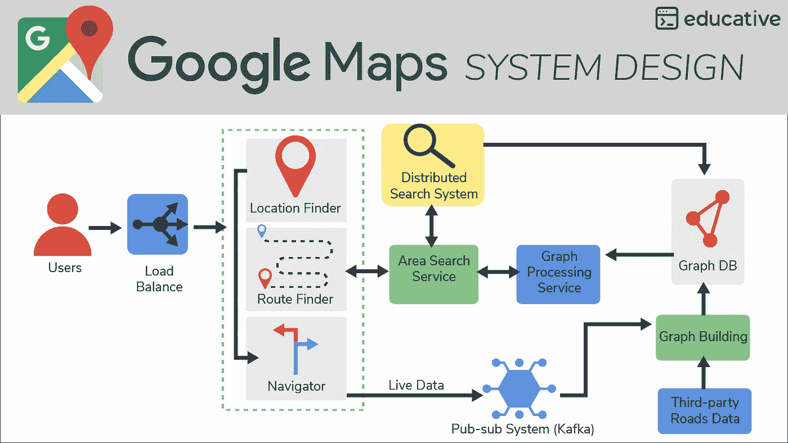
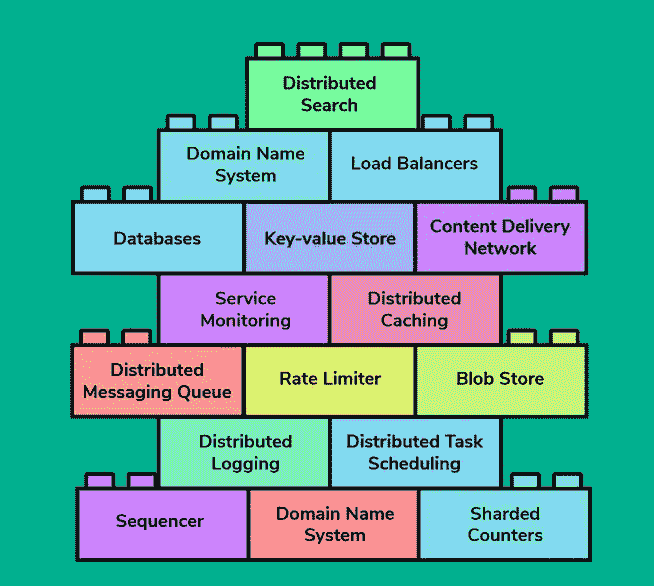
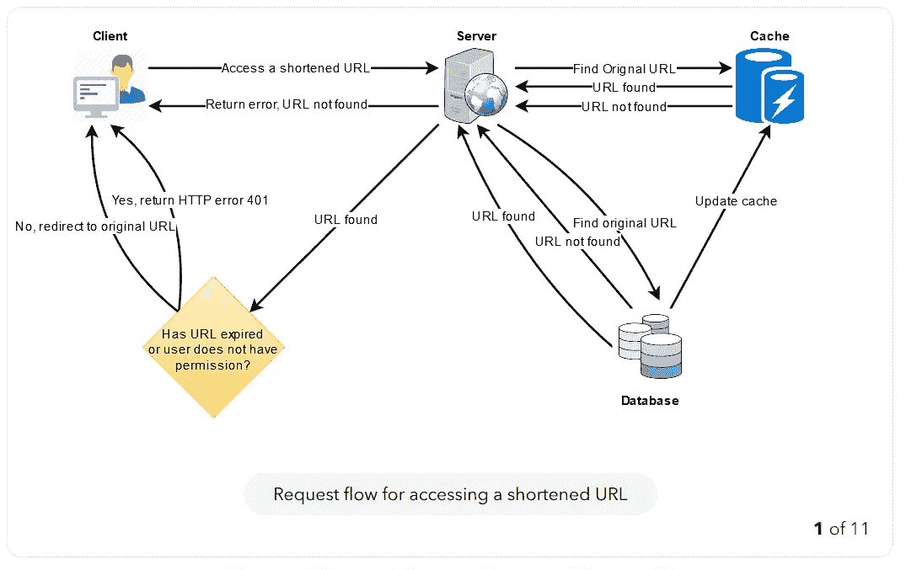
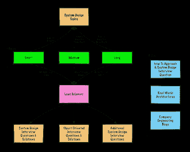
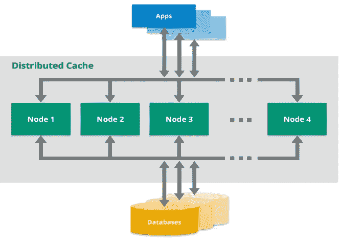
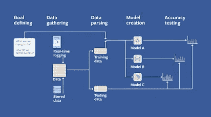

# 回顾——为软件工程师和经理钻研现代系统设计真的是最好的课程吗？

> 原文：<https://medium.com/javarevisited/review-grokking-modern-system-design-for-software-engineers-and-managers-really-the-best-course-f4f3ed31de63?source=collection_archive---------0----------------------->

## Educative 的《软件工程师和管理人员的现代系统设计》真的是系统设计面试的最佳课程吗？

图像-教育性. io

大家好，如果你正在准备技术面试，那么你可能知道系统设计面试是任何编码面试中最难的部分，它需要大量的准备和知识来破解系统设计面试，但你不能回避它。

系统设计已经成为软件工程师面试的一个关键部分，你在系统设计面试中的表现将决定你能否得到这份工作，你的薪水是多少，你的起薪是多少。

作为一名经验丰富的 Java 开发人员，我参加过会议的双方，也面试过数百名软件工程师候选人。系统设计面试一直是一个具有挑战性的循环——即使对于最熟练的程序员也是如此。

这就是 Educative 推出新课程的原因:面向软件工程师和经理的<https://www.educative.io/courses/grokking-modern-system-design-software-engineers-managers?affiliate_id=5073518643380224>**现代系统设计面试，包含 13 个常见系统设计面试问题的逐步分解，包括 [**Design TinyURL**](https://bit.ly/3S98WSc) (您今天可以免费试用)。**

**在本课程中，你将获得系统设计基础的实践知识，这样你就可以在面试中回答任何系统设计问题，甚至是你从未听说过的问题。**

**如果你在这里或者我的博客[上关注过我，那么你可能已经知道，对于系统设计面试，我已经分享了](http://javarevisited.blogspot.com/)[最佳系统设计课程](https://javinpaul.medium.com/hello-guys-if-you-are-preparing-for-system-design-interview-or-just-want-to-improve-your-software-7bc0034ac015)、[书籍](/javarevisited/8-best-system-design-and-software-design-books-for-programmers-be54cb313106)、[免费资源](https://javinpaul.medium.com/hello-guys-if-you-are-preparing-for-system-design-interview-or-just-want-to-improve-your-software-7bc0034ac015)和[网站](/javarevisited/7-best-places-to-learn-system-design-79e2d261f343)来练习系统设计问题，在那里我为程序员和软件工程师分享了很多资源。**

**我甚至分享了一份[准备系统设计面试的完整指南](/javarevisited/how-to-crack-system-design-interviews-in-2022-tips-questions-and-resources-fcad05e2dab)，其中我列出了关键主题和关键系统设计问题，如果你还没有阅读，我建议你也浏览一下。**

**<https://javarevisited.blogspot.com/2022/03/how-to-prepare-for-system-design.html> ** 

## **教育是准备系统设计面试的正确地方吗？**

**如果你正在准备系统设计面试，并且浏览了那些文章，那么你可能知道 Educative 有最好的系统设计课程，像著名的 [*钻研系统设计面试*](https://www.educative.io/collection/5668639101419520/5649050225344512?affiliate_id=5073518643380224) 和这个新课程，叫做 [*钻研软件工程师*](https://www.educative.io/courses/grokking-modern-system-design-software-engineers-managers?affiliate_id=5073518643380224) 和管理人员的现代系统设计。**

**在我对你是否需要选择 Educative 的 [**为软件工程师和经理研究现代系统设计**](https://www.educative.io/courses/grokking-modern-system-design-software-engineers-managers?affiliate_id=5073518643380224) 课程做出判断之前，让我告诉你一点关于系统设计到底是什么。**

**系统设计基本上是定义系统元素的过程，包括基于一组特定需求的系统的模块、架构、组件、接口和数据。**

**它也可以指定义、开发和设计系统的过程。这些设计必须满足公司或组织的特定需求。**

**<https://www.educative.io/courses/grokking-modern-system-design-software-engineers-managers?affiliate_id=5073518643380224> ** 

## **软件工程师和教育管理人员的现代系统设计回顾**

**作为软件工程师和系统设计师，你必须利用所有不同的建模语言来表达系统结构中的信息和知识。这个系统必须由一套一致的规则和定义来定义。它也可以用文本或图形建模语言来定义。**

**有不同种类的图形建模语言，如统一建模语言、UML、流程图、业务流程建模符号和系统建模语言。**

**还有不同类型的设计方法可供您使用。它们包括架构设计、逻辑设计和物理设计。**

**言归正传， [*为软件工程师和管理人员钻研现代系统设计*](https://www.educative.io/courses/grokking-modern-system-design-software-engineers-managers?affiliate_id=5073518643380224) 是目前互联网上最全面和最新的系统设计课程之一。**

**这基本上是一门为你准备系统设计面试的课程。通过本课程，你还将大致了解如何进行系统设计。**

**它还涵盖了系统设计面试的所有*基本主题，如***

1.  **分布式搜索，**
2.  **域名系统**
3.  **数据库ˌ资料库**
4.  **键值存储**
5.  **内容交付网络或 CDN**
6.  **服务监控**
7.  **分布式缓存**
8.  **分布式消息队列**
9.  **限速器**
10.  **Blob 存储区**
11.  **序列发生器**
12.  **分布式日志记录**
13.  **分片计数器等**

**这也是仅有的几门课程之一，它将向你详细讲解大规模分布式系统设计问题。即使你是这个领域的专家也没关系。我确信你会发现这门课是一次宝贵的学习经历。**

****

**这个课程是由那些经历过多次系统设计面试的人创建的，他们还会给你一个设计选择列表。这个列表将使你理解需求，比较不同的方法，并最终为你所面临的复杂问题提出一个合适的解决方案。**

**让这门课真正有趣的是，老师不会向你灌输任何东西。你需要解决这个问题，自己想出创新的解决方案。如果你正在寻找一门课程，可以让你为系统设计面试做好充分的准备，你不需要再找了。**

**本课程的讲师还将与您分享他们如何解决复杂系统设计问题的第一手经验。您将了解到解决一般系统设计问题的所有不同的提示、技巧、概念和方法。**

**你还将有机会练习很多经典的系统设计问题，如网络爬虫、 [**URL 缩写程序，如 TinyUR**](https://www.educative.io/courses/grokking-the-system-design-interview/m2ygV4E81AR?affiliate_id=5073518643380224) L，以及设计一个餐厅预订系统。**

****

**本课程将教你不同的技术，这些技术对扩展分布式系统很有用。您将获得数据库技术和 NoSQL 解决方案的概述。此外，您还将学习如何使用缓存来提高可伸缩性和性能。**

# **关于教育的 5 个最佳系统设计面试课程**

**虽然这是关于教育系统设计的最新课程之一，但它也有更多值得了解的精华。以下是我最喜欢的系统设计面试教育课程列表:**

## **1.[钻研系统设计面试](https://www.educative.io/courses/grokking-the-system-design-interview?affiliate_id=5073518643380224)**

**这是一门很棒的课程，它会教你所有你需要知道的关于系统设计的知识，同时从零开始。这样的话，对于完全的初学者来说绝对是完美的。对于希望进入令人惊叹的系统设计世界的初学者来说，这是一个完美的入门指南。**

****课程时长:3 小时****

****课程评分:4.6 星(满分 5 分)****

****课程讲师:教育性****

****课程价格:每月 20 美元****

****

## **2.[高级系统设计面试](https://www.educative.io/courses/grokking-adv-system-design-intvw?affiliate_id=5073518643380224)**

**在这个奇妙的课程中，您将了解高级系统设计的所有核心特性。你也会成为一名非常高级的系统设计师。你将能够掌握系统设计和搜索。本课程结束时，你将成为一名专家系统设计师。**

****课程时长:2 小时****

****课程评分:4.6 星****

**课程导师:设计大师**

****课程价格:每月 20 美元****

****

## **3.[探寻面向对象设计面试](https://www.educative.io/courses/grokking-the-object-oriented-design-interview?affiliate_id=5073518643380224)**

**这是一门很棒的课程，它将帮助你把面向对象系统设计的技能提升到另一个层次。通过使用面向对象的系统设计，而不是传统的系统设计技术，你将能够做到这一点。这门课程将教你如何通过系统设计面试。你还将学习如何在谷歌找到工作。脸书、微软和亚马逊。**

****课程时长:2 小时****

****球场评分:4.4 星(满分 5 分)****

****课程讲师:教育性****

****课程价格:每月 20 美元****

****

## **4.[机器学习系统设计](https://www.educative.io/courses/machine-learning-system-design?affiliate_id=5073518643380224)【教育性】**

**这是一门令人兴奋的课程，它将在最短的时间内教会你一切你需要知道的关于机器学习系统设计的基础知识。该课程还将教你所有你需要知道的关于机器学习和系统设计的知识。**

****课程时长:1 小时****

****课程评分:4.6 星(满分 5 分)****

****课程讲师:康咪咪·费姆****

****课程价格:每月 20 美元****

****

## **5.[钻研机器学习面试](https://www.educative.io/courses/grokking-the-machine-learning-interview?affiliate_id=5073518643380224)【教育性】**

**这个奇妙的课程将帮助你提高你的机器学习技能。你将能够通过努力获得一份非常好的机器学习工作来做到这一点。**

****课程时长:1 小时****

****课程评分:4 星(满分 5 分)****

****课程讲师:教育性****

**课程价格:每月 20 美元**

****

**这些都在 Educative.io 的《为软件工程师和管理人员探索现代系统设计》课程的评论中。根据我的经验，这是学习系统设计和真正为系统设计面试做准备的最好的在线课程之一，我强烈推荐给所有准备技术面试的软件工程师，尤其是 FAANG 公司。**

**该课程涵盖了基本的系统设计主题，如分布式缓存、消息传递、序列器、负载平衡器，还提供了常见系统设计问题的解决方案，如如何设计谷歌地图、YouTube、设计 TinyURL 等 URL Shortner、Instagram 设计等。**

**如果你喜欢这篇关于 [**Educative 为软件工程师和经理**](https://www.educative.io/courses/grokking-modern-system-design-software-engineers-managers?affiliate_id=5073518643380224) 设计的现代系统的评论**，请随意与你的朋友和家人分享。如果您对本课程有任何疑问，也可以发表评论，我们会尽快回复您。****

****

**我毫不怀疑这门课程将在几周或几个月内把你从一个完全的初学者变成一个系统设计专家。**

**顺便说一句，如果你发现 Educative platform 和他们的搜索课程，如搜索系统设计面试、搜索面向对象编程面试，并想加入 Educative 的多个课程，那么你应该获得一个[**Educative Subscription**](https://www.educative.io/subscription?affiliate_id=5073518643380224)，每月只需 14.9 美元就可以访问他们的 100 多个课程。非常划算，非常适合准备编码面试。**

**<https://www.educative.io/subscription?affiliate_id=5073518643380224>  

祝你的系统设计面试一切顺利。如果您有任何疑问、问题或系统设计问题，请随时在回复中提问。你也可以给我发邮件。

您可能喜欢的其他**编程文章和教程**

*   [如何准备 2023 年系统设计面试](https://javarevisited.blogspot.com/2022/03/how-to-prepare-for-system-design.html)
*   [完整的 Java 开发者路线图](https://javarevisited.blogspot.com/2019/10/the-java-developer-roadmap.html)
*   [5 个免费学习 Python 的网站](https://javarevisited.blogspot.com/2019/09/5-websites-to-learn-python-for-free.html)
*   [免费学习 Java 编码的五大网站](https://javarevisited.blogspot.com/2018/07/top-5-websites-to-learn-coding-in-java.html)
*   [2023 年学习 React.js 排名前五的网站](https://javarevisited.blogspot.com/2020/10/top-5-websites-to-learn-react-for-free.html)
*   [2023 年 Java 程序员应该学会的 10 件事](https://javarevisited.blogspot.com/2017/12/10-things-java-programmers-should-learn.html#axzz5atl0BngO)
*   [2023 年学习 Linux 的五大网站](https://javarevisited.blogspot.com/2021/06/5-websites-to-learn-linux-command-line.html)
*   [2023 年你能学会的 10 种编程语言](http://www.java67.com/2017/12/10-programming-languages-to-learn-in.html)
*   [10 个免费学习 Git 和 Github 的网站](https://javarevisited.blogspot.com/2019/05/10-free-websites-to-learn-git-online.html)
*   [21 个网站免费在线学习编码](https://www.java67.com/2018/06/21-websites-to-learn-how-to-code-for.html)
*   [2023 年要学习的 5 大 Java 框架](http://javarevisited.blogspot.sg/2018/04/top-5-java-frameworks-to-learn-in-2018_27.html)
*   [5 个免费在线学习 SQL 的网站](https://javarevisited.blogspot.com/2015/06/5-websites-to-learn-sql-online-for-free.html)
*   [完整的 DevOps 工程师路线图](/hackernoon/the-2018-devops-roadmap-31588d8670cb)
*   [5 个免费学习数据结构和算法的网站](https://javarevisited.blogspot.com/2017/02/5-websites-for-practicing-data-structure-algorithms-for-coding-interviews.html)
*   [程序员 50+数据结构面试问题](/hackernoon/50-data-structure-and-algorithms-interview-questions-for-programmers-b4b1ac61f5b0)

感谢您阅读本文。如果你知道任何像网站或编程平台这样的优秀在线资源来学习系统设计和软件设计，特别是对于初学者，你认为这是对这两个网站的补充，那么请随意分享。每个人都喜欢伟大的资源和快乐的学习系统设计。

如果你正在寻找 2023 年学习系统设计的替代方案，那么我也建议你去看看 Udemy 上 Frank Kane 的 [**掌握系统设计面试**](https://click.linksynergy.com/deeplink?id=JVFxdTr9V80&mid=39197&murl=https%3A%2F%2Fwww.udemy.com%2Fcourse%2Fsystem-design-interview-prep%2F) 课程。弗兰克是一名前招聘经理，知道如何才能在 2023 年通过那些大型 FAANG 公司的系统设计面试。

或者，您也可以参加 Alex Yu 的 [*系统设计面试—知情人指南*](https://www.amazon.com/System-Design-Interview-insiders-Second/dp/B08CMF2CQF/?tag=javamysqlanta-20) 和 ByteByteGo，进行完整的系统设计面试准备。

<https://bytebytego.com?fpr=javarevisited> **