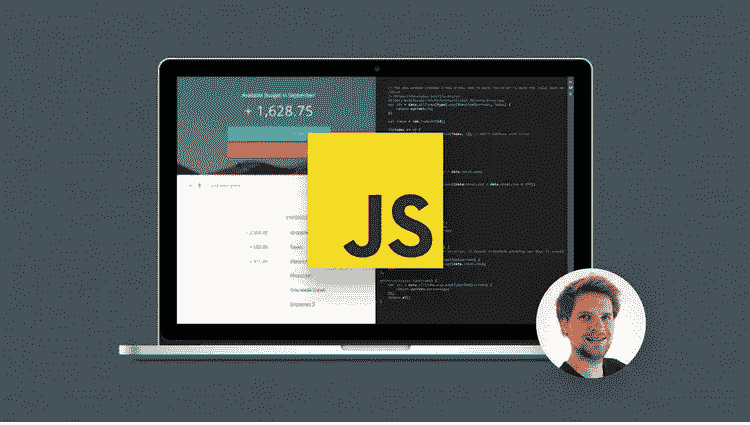
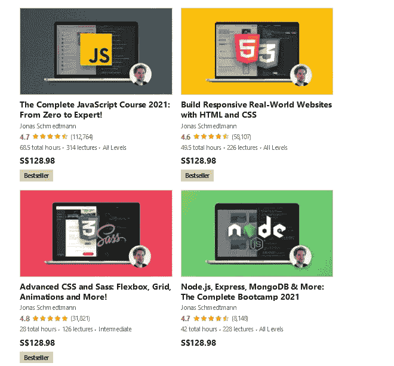
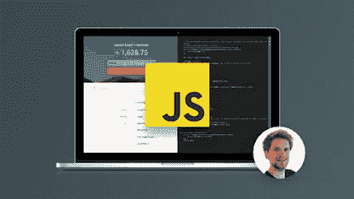

# Udemy Review —是完整的 JavaScript 课程 2023:从零到专家！值得吗？

> 原文：<https://medium.com/javarevisited/review-is-complete-javascript-course-build-real-projects-by-jonas-schmedtmann-on-udemy-worth-it-3500ac234ae2?source=collection_archive---------0----------------------->

## 我对 Udemy 最畅销的 JavaScript 课程的回顾——2023 年完整 JavaScript 课程:从零到专家！2023 年学 JavaScript 是动手的，清晰的，最新的课程

image_credit —

大家好，如果你想在 2023 年学习 JavaScript 并寻找书籍和在线课程等最佳资源，或者想加入完整的 JavaScript 课程 2023:从零到专家！但不确定你是否来对了地方。

早些时候，我已经为初学者和中级 web 开发人员分享了[最佳 JavaScript 课程](/javarevisited/10-best-online-courses-to-learn-javascript-in-2020-af5ed0801645)和[书籍](/javarevisited/5-best-javascript-books-for-beginners-and-experienced-web-developers-2c6353d1cc85?source=---------10----------------------------)，这受到了我的读者朋友们的高度赞赏，在这篇文章中，我将回顾我在 Udemy 上最喜欢的 JavaScript 课程之一—*[*《2023 年完整 JavaScript 课程:构建真实项目*](https://click.linksynergy.com/deeplink?id=JVFxdTr9V80&mid=39197&murl=https%3A%2F%2Fwww.udemy.com%2Fcourse%2Fthe-complete-javascript-course%2F) ，作者不是别人，正是 Jonas Schemdtmann。*

*这是一门真正最好的、清晰的、简明的和最新的课程，通过构建项目和应用在理论讲座中学到的知识，以实践的方式学习现代 JavaScript。*

*他们和实践的结合使得这门课程很棒，但是你会在这篇文章中找到更多加入这门课程的理由。一门好的 JavaScript 在线课程将在你使用这种令人敬畏的[编程语言](/hackernoon/10-best-programming-languages-to-learn-in-2019-e5b05af4a972)制作网站的过程中给你很大帮助。*

*JavaScript 将使您的 web 开发变得更容易，因为它的简单性和实现以及速度，因为这种语言直接在客户端浏览器上运行，不仅如此，它将使您的网站更具交互性，并提供更好的用户体验。*

*自 1995 年创建以来，JavaScript 已经在 web 开发中扮演了相当重要的角色，许多开发人员已经将它作为他们 web 开发旅程中的必修课。

stack overflow 发表的一项研究显示，这种编程语言是近七年来最流行的一种。该语言可用于开发前端和后端，使用许多 JavaScript 框架，如 Node.js 和 Epress.js 以及许多其他可用的框架。

当我在开发 udemy 平台来学习这门语言的基础知识以及构建一些令人惊叹的项目时，我发现了一个名为[**The Complete JavaScript Course 2023**](https://click.linksynergy.com/deeplink?id=JVFxdTr9V80&mid=39197&murl=https%3A%2F%2Fwww.udemy.com%2Fcourse%2Fthe-complete-javascript-course%2F)的项目，我想为什么不复习一下这门令人惊叹的课程呢？*

* [## 学习现代 Javascript(构建和测试应用)-完整课程

### 完全从零开始重建(68 小时视频)***“球场制作得非常非常好。超级深入…

udemy.com](https://click.linksynergy.com/deeplink?id=JVFxdTr9V80&mid=39197&murl=https%3A%2F%2Fwww.udemy.com%2Fcourse%2Fthe-complete-javascript-course%2F) 

# Udemy 课程回顾—完整的 JavaScript 课程 2023:从零到专家！？值得吗？

为了不浪费你更多的时间，这里是我对 Udemy 和互联网上最好的 JavaScript 课程之一的评论。

我从三个主要方面回顾了这门课程，*教师的素质和声誉，课程和内容的结构，以及人们的评价*，这样你不仅可以了解我对这门课程的看法，还可以了解许多从这门课程中学到 JavaScript 的人。

## 1.讲师声誉[Jonas Schmedtmann]

本课程由 Jonas Schmedtmann[创建，他是一名全栈式 web 开发人员和设计师，在 2007 年初获得工程硕士学位后开始开发应用程序。](https://click.linksynergy.com/deeplink?id=JVFxdTr9V80&mid=39197&murl=https%3A%2F%2Fwww.udemy.com%2Fuser%2Fjonasschmedtmann%2F)

Jonas 不仅精通 JavaScript，还精通 web 开发和 web 设计的所有其他领域，他的独特之处在于他的教学风格以及理论与实践的融合。

拥有超过 90 万名学生注册的乔纳斯·施梅德曼 被认为是 udemy 最好的导师之一，他被认为是 Udemy 上最好的导师之一，这并不奇怪。他还有超过 5 门关于 web 开发和 JavaScript 框架的课程，如 Node.js 和 Express，用于构建网站的后端。

我也建议你在加入之前在 Udemy 上观看他的课程的 [*预览，这是我在加入任何 Udemy 课程之前的试金石，如果你能观看预览而不感到厌烦或转发或跳过，那么这是你与导师联系的好机会。*](https://click.linksynergy.com/deeplink?id=JVFxdTr9V80&mid=39197&murl=https%3A%2F%2Fwww.udemy.com%2Fcourse%2Fthe-complete-javascript-course%2F)

选择一门好的课程往往比不选择一个好的教师更重要，在这一点上，乔纳斯和这门课程得到了满分 10 分。如果你喜欢这门课，你也会喜欢乔纳斯的其他课程。似乎他只创造了畅销书。

*

# *2.课程内容和结构*

*正如瓷砖上所说，这个令人惊叹的课程面向所有水平，尤其是 JavaScript 初学者，它包含 32 个部分，超过 94 小时的视频内容。因此，让我们总结一下课程内容以及报名参加本课程后您期望获得的内容:*

***2.1。JavaScript 基础知识**
顾名思义，您将分两部分学习 JavaScript 语言的基础知识，首先创建您的第一个 Hello World 小程序，并链接 JavaScript 文件、变量、数据类型、函数声明，然后在跳到下一部分之前，通过许多编码挑战来测试您的知识。*

***2.2。HTML & CSS 速成班**
最后你还会学到 web 开发的基础知识，也就是构建网页的两种语言 [HTML](/javarevisited/10-best-html-and-css-courses-for-beginners-in-2021-6757eec00032) & [CSS](https://javarevisited.blogspot.com/2020/09/top-5-css-cascading-style-sheet-courses-for-beginners.html) 。如果你想学习如何在你的 web 开发项目中使用 JavaScript，这是一件必须要做的事情。如果您以前对这两种语言有所了解，那么可以跳过这一部分。*

***2.3。JavaScript 如何在后台运行**
如果我们不能讲述所有的 JavaScript 课程，这一部分几乎在大多数 JavaScript 课程中消失了，因为如果你知道代码如何在后台的浏览器中运行，你会更好地理解这种语言*

***2.4。JavaScript 高级**
您将深入了解更多的 JavaScript 函数和技术，例如重组数组和对象、增强的对象文字、回调函数、更多关于数组、数字、日期、定时器等等。*

***2.5。面向对象编程是一种让你从一个公共对象创建许多不同对象的编程方式。在本节中，您将学习原型、继承、设置器和获取器、封装，以及更多关于一些[编码挑战](https://www.java67.com/2018/05/top-75-programming-interview-questions-answers.html)的内容。***

***2.6。JavaScript 中的异步**
这一节将教你 JavaScript 中的异步，比如创建你的第一个 AJAX 调用、回调 hell、promises、后台异步、try… catch 的错误处理、并行运行 promises 等等。*

***2.7。Forkify 应用项目**
学习了这么多关于 JavaScript 的知识后，你将在本节中尝试构建一个名为 Forkify 的应用，这是一个在线网站或服务，可以搜索食谱，创建购物清单，提供你喜欢的服务，并在 Netlify 云服务上部署 web 项目。*

# *3.人物评论*

*超过 40 万的注册人数和 87 人的 4.7 分评分，我只能说这门课程是其他课程中最完整的一门，如果你打算深入学习 JavaScript，你应该选修它。

好的一面是，课程的几乎每个部分都有许多编码挑战，复习部分的人非常满意和喜欢课程内容和视频，这意味着你可以放心地为这门课程付费。*

*如果你想加入这个课程，这里有链接— [**完整的 JavaScript 课程 2023**](https://click.linksynergy.com/deeplink?id=JVFxdTr9V80&mid=39197&murl=https%3A%2F%2Fwww.udemy.com%2Fcourse%2Fthe-complete-javascript-course%2F)*

**

*这就是关于 Udemy 上最好的 JavaScript 课程之一的**评论，完整的 JavaScript 课程 2023:从零到专家！乔纳斯·施梅特曼。如果你想在 2023 年学习 JavaScript，没有比这更好的课程了，而且它也很实惠，你可以在不时举行的 Udemy 大减价上花 10 美元购买。***

*鉴于大多数招聘人员要求 web 开发人员在简历中具备 JavaScript 技能，因为这种语言在每个网站或在线服务中越来越重要，事实上，您可以仅使用这种语言从前端和后端构建一个完整的 web 应用程序。*

*您可能想探索的其他 **JavaScript 和 Web 开发资源***

*   *[前端和后端开发者路线图](https://javarevisited.blogspot.com/2019/02/the-2019-web-developer-roadmap.html)*
*   *[面向 Java 和 DevOps 工程师的 5 门免费 Docker 课程](http://www.java67.com/2018/02/5-free-docker-courses-for-java-and-DevOps-engineers.html)*
*   *[2023 年学习 JavaScript 的 13 门免费课程](/javarevisited/12-free-courses-to-learn-javascript-and-es6-for-beginners-and-experienced-developers-aa35874c9a32)*
*   *[学习 Learn RESTful Web 服务的 3 本书和课程](http://www.java67.com/2018/02/3-books-and-courses-to-learn-restful-web-services-with-spring.html)*
*   *[2023 年 React JS 开发者路线图](https://javarevisited.blogspot.com/2018/10/the-2018-react-developer-roadmap.html#axzz5dPh5g7tg)*
*   *成为全栈 Web 开发人员的 10 门课程*
*   *[2023 年学习打字稿的 10 门免费课程](/javarevisited/top-10-free-typescript-courses-to-learn-online-best-of-lot-44bce9da41d1)*
*   *[5 门学习 Servlet、JSP 和 JDBC 的免费课程](http://www.java67.com/2018/02/5-free-servlet-jsp-and-jdbc-online-courses-for-java-developers.html)*
*   *[我最喜欢的初学者学习棱角分明的课程](/javarevisited/10-courses-to-learn-angular-for-web-development-6da1bd2856dc)*
*   *免费学习 Ruby 和 Rails 的 5 门课程*
*   *Web 开发人员学习 PHP 和 MySQL 的 5 门课程*
*   *[全栈开发者路线图](/javarevisited/the-2019-web-developer-roadmap-ab89ac3c380e)*
*   *10 个免费学习 JavaScript 的网站*
*   *[初学者的 15 门最佳 JavaScript 课程](/javarevisited/10-best-online-courses-to-learn-javascript-in-2020-af5ed0801645)*
*   *[面向初学者的 10 门 Python Web 开发课程](/javarevisited/top-10-courses-to-learn-python-for-web-development-in-2020-best-of-lot-efe11fb6d212)*
*   *[2023 年学习 Angular 的 5 门免费课程](https://javarevisited.blogspot.com/2018/06/5-best-courses-to-learn-angular.html)*
*   *【Fullstack 开发者应该学习的 10 个框架*

*感谢您阅读本文。如果你喜欢我在 Udemy 上对完整 JavaScript 课程的评论，那么请与你的朋友和同事分享。如果您有任何问题或反馈，请发表评论。

**附言——**如果你是 JavaScript 新手，正在寻找免费的 JavaScript 课程来开始你的旅程，那么你也可以从 Udemy 查看这个 [**免费的 Javascript 基础课程**](http://bit.ly/2zNH9Tj) 。*

* [## 免费 JavaScript 教程- Javascript 基础

### 劳伦斯·图尔顿是一名网页开发和平面设计师，专攻 HTML、CSS、jQuery、UI 和 UX 设计。他有…

bit.ly](http://bit.ly/2zNH9Tj) 

这是完全免费的，你只需要一个 Udemy 帐户就可以加入这个课程。它包含超过 6.5 小时的 Javascript 内容，超过 24 万名学生已经加入了该课程。*