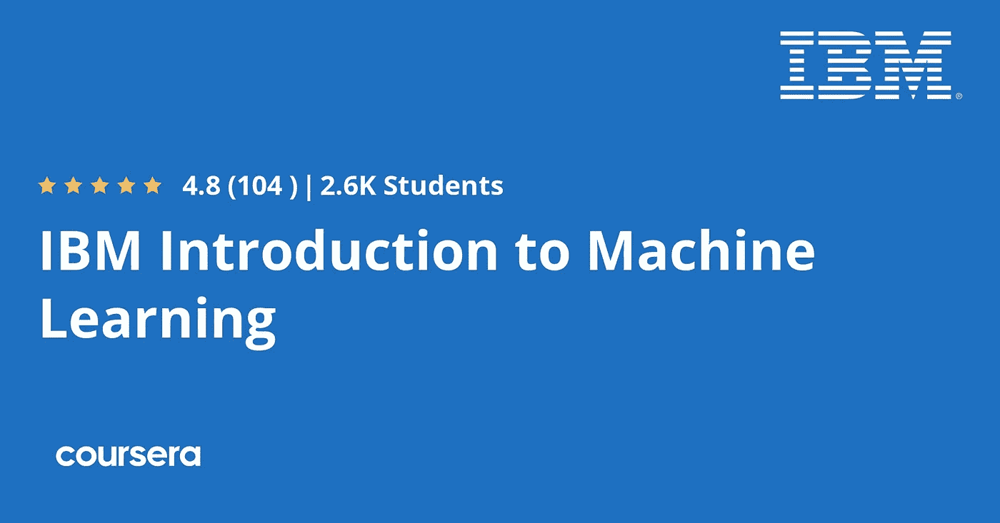
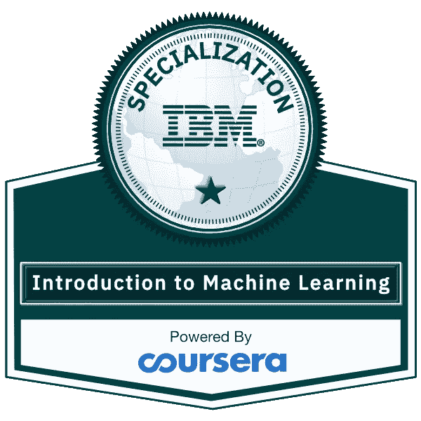
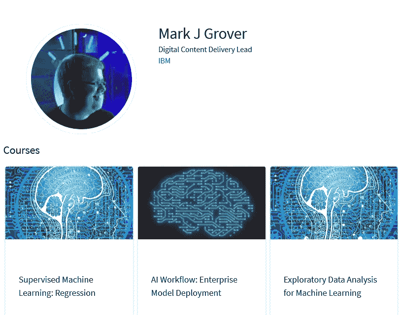
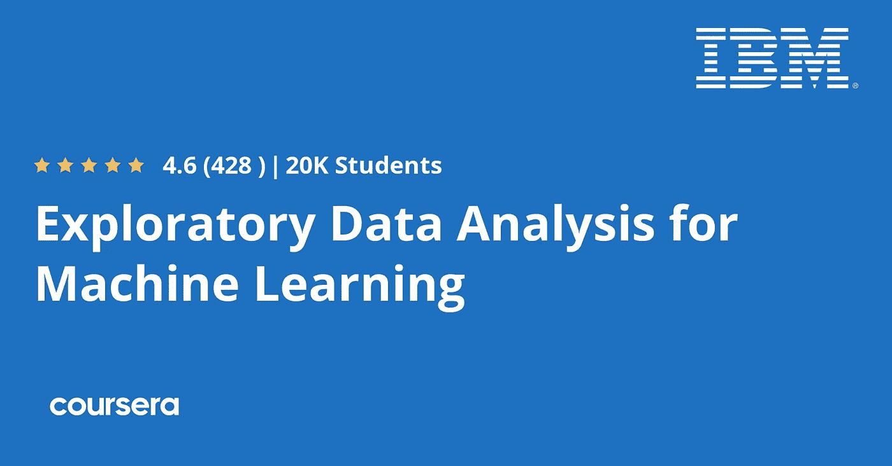
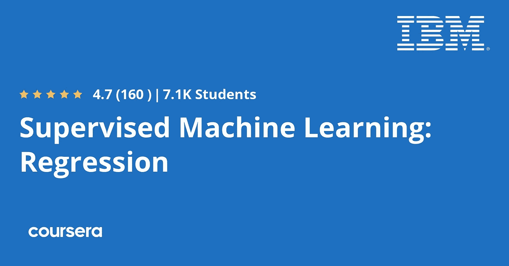
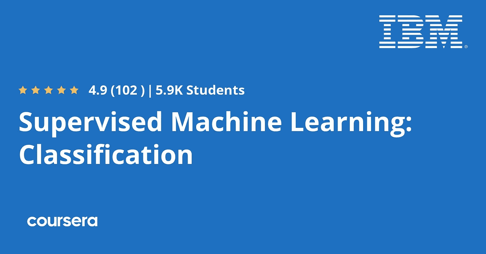

# 回顾 IBM 在 Coursera 上推出的《机器学习专业化导论》值得吗？

> 原文：<https://medium.com/javarevisited/review-is-introduction-to-machine-learning-specialization-by-ibm-on-coursera-worth-it-973dfe055855?source=collection_archive---------1----------------------->

## IBM 在 Coursera 上做的机器学习认证入门值得吗？你应该加入这个机器学习的专业吗？

大家好，如果你对机器学习感兴趣，并在网上寻找最好的机器学习课程，或者你正在考虑加入 IBM 在 Coursera 上的 [*机器学习专业化介绍，但不确定是否值得，那么你来对地方了。*](https://coursera.pxf.io/c/3294490/1164545/14726?u=https%3A%2F%2Fwww.coursera.org%2Fspecializations%2Fibm-intro-machine-learning)

前面我已经分享了 [*最佳数据科学和机器学习课程*](/javarevisited/my-favorite-data-science-and-machine-learning-courses-from-coursera-udemy-and-pluralsight-eafc73acc73f) *，*而在这篇文章中，我将回顾 IBM 在 Coursera 中流行的**机器学习专业化介绍**。

IBM 不需要介绍，它是历史最悠久、最负盛名的软件和技术公司之一，来自 IBM 的任何东西都应该具有一流的质量，本课程也不例外。

对于任何想了解机器学习、其重要性及其影响的人来说，这都是一门很棒的课程。本课程由 IBM 的机器学习专家精心打造，通过现实生活中的例子和用例来教你[机器学习](/javarevisited/10-free-machine-learning-courses-for-beginners-181f83b4c816)；这也是它与其他课程不同的一点。

机器学习是我们日常使用的许多软件的重要组成部分，比如在你的电子邮件中过滤垃圾邮件，在有人给你汇款时检测欺诈交易，甚至在特斯拉自动驾驶汽车照看车轮时，这样的例子不胜枚举。

几年前，这一科学在美国排名第一，在 2015 年至 2018 年的短短三年内增长了 344 美元，平均年薪为 12.8 万美元。

机器学习使用数据进行学习，并根据从学习到的数据做出决策或预测。机器学习中有很多[算法](https://www.java67.com/2020/07/top-5-machine-learning-algorithms-for-beginners.html)可以根据你的数据来使用。

你要解决的问题，和有标签的数据一样，会使用监督学习算法，无标签的数据会使用聚类等无监督学习算法。

成为这一领域的专家不再需要学位或上大学，因为许多大学让你在家里通过电脑和互联网连接就能做到这一点。尽管如此，我还是推荐参加 Coursera 平台的 [**IBM 机器学习专业入门**](https://coursera.pxf.io/c/3294490/1164545/14726?u=https%3A%2F%2Fwww.coursera.org%2Fspecializations%2Fibm-intro-machine-learning) ，有很多课程要学。

# IBM 在 Coursera 上的机器学习入门课程述评

现在你已经知道这个课程是什么，谁应该参加这个课程，让'*详细回顾一下这个机器学习专业*。我们将根据三个重要参数来评估课程:讲师的声誉和教学风格、课程结构、内容质量、其他人对他的课程的评价以及人们的意见。这是我屡试不爽的复习课程的公式，帮助很大。

## 1.教员回顾

这种专业化是由在 IBM 公司工作的两位专家创建的，其中一位讲师是 Mark J Grover，他是全职的计算机技术教授，拥有计算机安全、网络方面的经验，曾在 Cisco 公司工作，另一位讲师是 Miguel Maldonado，他也是 IBM 的机器学习开发人员。

两者都有令人敬畏的评级和优秀的教学风格，甚至适合对像[机器学习](https://www.java67.com/2019/01/5-free-courses-to-learn-machine-and-deep-learning-in-2019.html)这样的主题一无所知的初学者。

随便看看他的一些机器学习课程，都很牛逼。

## 2.课程内容和结构

这个 Coursera 专业化课程只不过是一个机器学习课程的 [*集合*](/javarevisited/top-10-machine-learning-and-data-science-certifications-and-training-courses-for-beginners-and-a6308497b764) 以循序渐进的方式教你一项技能。这个专业包含四门课程或模块，教你从机器学习基础到重要的机器学习算法，如监督和非监督机器学习。

## 2.1.[机器学习的探索性数据分析](https://coursera.pxf.io/c/3294490/1164545/14726?u=https%3A%2F%2Fwww.coursera.org%2Flearn%2Fibm-exploratory-data-analysis-for-machine-learning)

在进入这个专业之前，您需要先有 python 编程语言的经验，并理解代数和统计等数学知识。

通过理解人工智能和机器学习以及人工智能及其应用的历史来开始本课程。

接下来，您将学习如何从不同的来源获取数据，并在将它们提供给机器学习算法之前进行清理，以给出更好的结果。

最后，你将学习推理统计学和假设检验，这将有助于你在将数据输入到[机器学习算法](/javarevisited/5-machine-learning-algorithms-every-data-scientists-should-learn-de467fd2e444)之前衡量数据质量。

## 2.2.[监督机器学习:回归](https://coursera.pxf.io/c/3294490/1164545/14726?u=https%3A%2F%2Fwww.coursera.org%2Flearn%2Fsupervised-machine-learning-regression)

监督学习是最常见和最常用的机器学习类型，它使用标记数据来训练算法并进行预测。本节将学习更多关于监督学习、其他类型的机器学习，以及*回归*和*分类*之间的区别。

接下来，您将学习最佳实践，以避免在训练阶段过度拟合，这意味着机器学习模型过于适应数据，您可以通过使用测试分割方法和您将学习的许多其他技术来避免它们。

最后，学习关于正则化的*回归*，这将阻止学习更复杂的模型以避免过度拟合。有许多这样的技术，如岭回归、套索回归和弹性网。

## 2.3.[监督机器学习:分类](https://coursera.pxf.io/c/3294490/1164545/14726?u=https%3A%2F%2Fwww.coursera.org%2Flearn%2Fsupervised-machine-learning-classification)

之前的课程谈到了回归及其不同的类型。不过，现在我们将转向分类，将一组数据分类，并预测像猫、人、车等事物。

从了解更多关于分类问题开始，然后学习它的算法，比如逻辑回归和它的常见错误度量。

接下来转到另一种被称为 [K 近邻](https://www.java67.com/2020/07/top-5-machine-learning-algorithms-for-beginners.html)的分类算法，这种算法应用广泛，速度快，同时也学习一下支持向量机算法。

稍后，您将了解决策树算法，该算法使您能够基于某些条件做出决策，并广泛用于机器学习分类任务，您还将了解如何对不平衡类进行建模。

## 2.4.[无监督机器学习](https://coursera.pxf.io/c/3294490/1164545/14726?u=https%3A%2F%2Fwww.coursera.org%2Flearn%2Fibm-unsupervised-machine-learning)

监督学习是另一种类似监督学习的机器学习，但它使用未标记的数据从数据中学习，并根据一些标准对数据进行分类。

您还将了解更多关于这种技术以及如何使用 K 均值算法来执行 [*无监督学习*](https://www.java67.com/2020/07/top-5-machine-learning-algorithms-for-beginners.html) 。

接下来，您将看到如何选择适合您的数据的正确的聚类算法。最后，降维是处理大数据和预处理数据的有力技术。

## 3.人民评论

这是 IBM 在 Coursera 平台上推出的一门相当新的课程。虽然 IBM 有许多关于数据科学和人工智能的热门课程，如 [IBM 数据科学专业证书](https://coursera.pxf.io/c/3294490/1164545/14726?u=https%3A%2F%2Fwww.coursera.org%2Fprofessional-certificates%2Fibm-data-science)和 [IBM AI 工程专业证书](https://coursera.pxf.io/c/3294490/1164545/14726?u=https%3A%2F%2Fwww.coursera.org%2Fprofessional-certificates%2Fai-engineer)，但这门课程的目标是初学者和其他希望通过真实世界的用例学习机器学习的技术人员。

超过 3K 的学生加入了这个专业，超过 22，000 人加入了这个项目下的各种课程。如果你不能支付参加这个课程的费用，这个课程也会提供经济资助。

所有这些课程的平均评分为 4.8 分，这是惊人的，但这并不奇怪，因为 IBM 是这些课程的幕后推手。它们是由先驱和最老的行业领导者之一为行业设计的。

**这里是加入这个计划的链接** — [**IBM 机器学习专业化介绍**](https://coursera.pxf.io/c/3294490/1164545/14726?u=https%3A%2F%2Fwww.coursera.org%2Fspecializations%2Fibm-intro-machine-learning)

当谈到加入这门课程时，你有两个选择，你可以单独加入这门课程，每月花费大约 39 美元进行专业化，你也可以加入 [**Coursera Plus**](https://coursera.pxf.io/c/3294490/1164545/14726?u=https%3A%2F%2Fwww.coursera.org%2Fcourseraplus) ，每月花费 399 美元，这是 Coursera 的一个订阅计划，让你无限制地访问他们最受欢迎的课程、专业化、专业证书和指导项目。

<https://coursera.pxf.io/c/3294490/1164545/14726?u=https%3A%2F%2Fwww.coursera.org%2Fcourseraplus>  

## 结论

以上是关于 IBM 最新机器学习专业化介绍的**评论。这是 Coursera 上最好的机器学习认证项目之一，尤其是对初学者而言？你可以学习关键的机器学习概念，如**监督和非监督学习**，回归和分类，非常详细，不会感到无聊。**

这个项目的结构和内容绝对物有所值，你从 IBM 和 Coursera 获得的认证就像蛋糕上的糖衣。

如果你想[学习机器学习](/javarevisited/10-free-machine-learning-courses-for-beginners-181f83b4c816)或者对人工智能职业感兴趣，那么这个 Coursera 项目就是为你准备的。在数据科学和人工智能工程师等许多工作领域，机器学习是一项必备技能。

本课程是学习该领域基础知识和理解使用机器学习的软件如何工作的良好入门。

你可能喜欢的其他 **Coursera 资源文章**

*   [开始职业生涯的十大 Coursera 认证](/javarevisited/top-10-coursera-certificates-to-start-your-career-in-cloud-data-science-ai-mainframe-and-it-558690c83587)
*   [2022 年学习人工智能的 7 门最佳课程](/javarevisited/7-best-courses-to-learn-artificial-intelligence-in-2020-26d59d62f6fe)
*   [2022 年程序员十大课程](https://javarevisited.blogspot.com/2020/08/top-10-coursera-courses-specilizations-and-certifications.html)
*   [面向程序员和开发者的 Coursera 十大项目](https://javarevisited.blogspot.com/2020/08/top-10-coursera-projects-to-learn-essential-programming-skills.html)
*   Udemy vs. Pluralsight？哪个学习平台比较好？
*   [学习云计算的 10 门最佳 Coursera 课程](https://javarevisited.blogspot.com/2020/08/top-10-coursera-certifications-to-learn-cloud-computing-aws.html#axzz6WK1yC5WW)
*   [Coursera Plus Review——在 Coursera 上学习的更好方式](https://javarevisited.blogspot.com/2020/08/coursera-plus-better-way-to-take-coursera-courses-specilizations-certification.html)
*   向顶级科技公司学习的 18 门 Coursera 课程
*   [5 个最佳 Coursera 程序员专业证书](https://javarevisited.blogspot.com/2019/10/top-5-coursera-professional-certificates-for-programmers-IT-professionals.html)
*   [2022 年学习 Python 可以做的 8 个项目](/javarevisited/8-projects-you-can-buil-to-learn-python-in-2020-251dd5350d56)
*   [你可以在 Coursera Online 上获得 5 个数据科学学位](https://www.java67.com/2020/06/top-5-data-science-degree-you-can-earn-online-coursera-edx.html)
*   [你可以在 Coursera 上在线申请的前 5 个计算机科学学位](https://javarevisited.blogspot.com/2020/04/is-it-possible-to-get-master-of-computer-science-degree-online-coursera.html)
*   [Udemy vs Coursera？学理工和编程哪个好](https://javarevisited.blogspot.com/2020/01/coursera-vs-udemy-which-is-better-for-programming-tech.html)
*   [Coursera 证书对工作和事业有帮助吗](https://javarevisited.blogspot.com/2020/02/does-udemy-coursera-edx-educative-or.html)？
*   [学习网页开发的十大 Coursera 课程](https://javarevisited.blogspot.com/2020/08/top-10-coursera-certifications-to-learn-web-development.html)
*   [学习数据科学的十大课程](https://javarevisited.blogspot.com/2020/08/top-10-coursera-certifications-to-learn-Data-Science-Visualization-and-Data-Analysis.html)
*   [Udemy vs . CocdeCademy vs . one month？](https://javarevisited.blogspot.com/2019/09/codecademy-vs-udemy-vs-onemonth-which-is-better-for-learning-code.html#axzz6VYKcmyZz)
*   [Udemy vs . Educative vs . Codecademy？新手用哪个比较好](/javarevisited/codecademy-or-pluralsight-which-is-a-better-platform-to-learn-coding-skills-59251a080642)
*   [学习 Python 的 10 个 Coursera 专业化认证](https://javarevisited.blogspot.com/2020/02/10-best-coursera-courses--for-python.html)
*   【Coursera 的 10 项数据科学和机器学习认证

感谢阅读这篇文章。如果你喜欢 Coursera 和 IBM 的机器学习专业化的这篇*评论，*那么请分享给你的朋友和同事。如果您有任何问题或反馈，请留言。

**p . s .**——如果你正在寻找最好的 Udemy 在线课程来学习 Python 上的数据科学，你也可以查看由基里尔·叶列缅科和他的团队**编写的 [**机器学习 A-Z 课程**](https://click.linksynergy.com/deeplink?id=JVFxdTr9V80&mid=39197&murl=https%3A%2F%2Fwww.udemy.com%2Fcourse%2Fmachinelearning%2F) 。**他们在 Udemy 上有最好的用 Python 和 R 编程的机器学习在线课程。

</javarevisited/udemy-course-review-machine-learning-a-z-hands-on-python-and-r-in-data-science-by-kirill-eremenko-f2b8aa625895> 