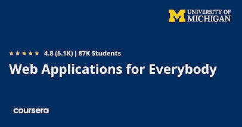
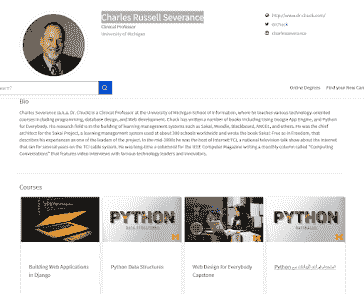
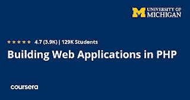
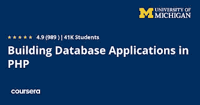
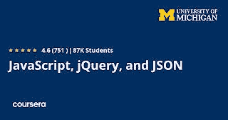

# 回顾——2023 年 Coursera 上面向所有人的网络应用专业化值得吗？

> 原文：<https://medium.com/javarevisited/review-is-web-applications-for-everybody-specialization-on-coursera-worth-it-7c109c9db74?source=collection_archive---------4----------------------->

## Coursera 和密歇根大学的人人网应用认证值得吗？在我对这个热门专业的评论中找到答案。

大家好，如果你正在寻找一门令人惊叹的课程来开始你的 web 应用程序开发生涯，或者你正在 Coursera 上寻找一门很棒的 web 开发课程，或者你正在考虑 [**面向所有人的 Web 应用程序专业化**](https://coursera.pxf.io/c/3294490/1164545/14726?u=https%3A%2F%2Fwww.coursera.org%2Fspecializations%2Fweb-applications) 是否值得，那么你来对了课程。

在过去，我分享过 Coursera 上最好的网络开发课程，在这篇文章中，我们将回顾这个课程。每个公司都需要一个网站来经营他们的业务，并与客户和公司联系。

现在，技术人员可以做到这一点，并为网站编写复杂的功能，但非技术背景的人可以使用一些服务来制作一个购物网站。如果你的网站有一些复杂的功能要执行，而不仅仅是一个简单的网页。

开发一个网站只是学习 HTML、CSS、JavaScript 等前端技术并托管它们。

尽管如此，对于一个订票网站或任何其他提供一些功能的网站，你需要雇佣一个已经知道后端技术的开发人员来为你构建。最常用的语言之一叫做 PHP 编程语言。

PHP 语言是一种服务器或后端语言，它告诉你的网站应该做什么，比如注册用户的数据。假设您想学习这种语言来为您的企业或公司构建 web 应用程序。在这种情况下，我强烈推荐参加这个名为 [**网络应用的课程，让每个人都专业化**](https://coursera.pxf.io/c/3294490/1164545/14726?u=https%3A%2F%2Fwww.coursera.org%2Fspecializations%2Fweb-applications) 。

# 密歇根大学 Coursera 面向所有人的网络应用专业述评

现在，让我们深入这个热门的 Coursera 课程，学习 Web 应用程序开发。我们将从三个方面评估本课程:讲师经验和教学质量、课程内容和结构，并基于已经上过本课程的学员的评估。

## 1.教员回顾

这一大规模专业化的讲师是临床教授**查尔斯·拉塞尔·塞弗伦**，他在这个平台 Coursera 中创建了超过 46 门课程，并在他的课程中教授了超过 300 万名学生，如在 Coursera 课程中获得巨大成功的 [Python For Everybody](https://coursera.pxf.io/c/3294490/1164545/14726?u=https%3A%2F%2Fwww.coursera.org%2Fspecializations%2Fpython) 和[Django For Everybody](https://coursera.pxf.io/c/3294490/1164545/14726?u=https%3A%2F%2Fwww.coursera.org%2Fspecializations%2Fdjango)。他写了很多关于编程语言的书，比如 python。

## 2.课程内容和结构

现在，让我们看看课程是如何组织的，涵盖了哪些主题等等。专业化认证包含学习单个主题的多门课程，因此我们将浏览这些课程以了解更多信息。

## 2.1.[用 PHP 构建 Web 应用](https://coursera.pxf.io/c/3294490/1164545/14726?u=https%3A%2F%2Fwww.coursera.org%2Flearn%2Fweb-applications-php)

您将从学习 web 应用程序如何工作、浏览器如何与它们交互以及探索 HTTP 协议的响应-请求周期开始。接下来，您将学习 HTML 来创建网页，并使用 CSS 语言来设计它们的样式，比如添加颜色等等。

然后，您将在您的操作系统中安装 PHP 环境，即 XAMP 和 MAMP，创建您的第一个 MySQL 数据库，并编写您的第一个 PHP 代码。

您还将了解 PHP 编程语言及其基础知识，如变量和该语言中使用的不同关键字、表达式和控制结构。然后通过理解 PHP 中的数组、数组函数、变量作用域和模块化，进入 PHP 的中级。

这是加入本课程的链接— [用 PHP 构建 Web 应用](https://coursera.pxf.io/c/3294490/1164545/14726?u=https%3A%2F%2Fwww.coursera.org%2Flearn%2Fweb-applications-php)

## 2.2.[结构化查询语言(SQL)简介](https://coursera.pxf.io/c/3294490/1164545/14726?u=https%3A%2F%2Fwww.coursera.org%2Flearn%2Fintro-sql)

您将学习如何在您的计算机操作系统上安装 PHP 和 MySQL 数据库环境，然后学习数据库和 SQL 语言操作的基础知识，以及如何从数据库中提取数据和过滤结果，还将学习 SQL 语言中的不同数据类型以及数据库键和索引。

数据库应该根据您的项目遵循一种模式。您将学习如何创建关系数据库设计、规范化&外键、构建物理数据模式。

最后，了解当您表示用户、角色等时需要的许多关系。

**以下是加入本课程的链接—** [结构化查询语言(SQL)简介](https://coursera.pxf.io/c/3294490/1164545/14726?u=https%3A%2F%2Fwww.coursera.org%2Flearn%2Fintro-sql)

## 2.3.[用 PHP 构建数据库应用](https://www.coursera.org/learn/database-applications-php?specialization=web-applications)

您将从 PHP 语言的中级水平开始，学习 PHP 中不同的面向对象模式。首先，您将理解面向对象的概念，并在 PHP 和其他面向对象的库中用这种语言创建对象。

接下来，您将探索各种 PHP 数据库库，在 PHP 中运行 SQL 查询，使用可移植数据对象将 MySQL 数据库连接到 PHP，并避免 SQL 注入漏洞。

您将看到如何创建一个用户可以登录 web 应用程序并实现 flash 消息的身份验证系统。最后，构建一个 CRUD 应用程序来创建、读取、更新和删除数据，这是一个完整的简单 web 应用程序项目。

**这里是加入本课程的链接—** [用 PHP 构建数据库应用](https://www.coursera.org/learn/database-applications-php?specialization=web-applications)

## 2.4. [JavaScript、jQuery 和 JSON](https://coursera.pxf.io/c/3294490/1164545/14726?u=https%3A%2F%2Fwww.coursera.org%2Flearn%2Fjavascript-jquery-json)

这最后一节将教你 JavaScript 语言，它被认为是 web 开发人员最常用的语言之一。您将了解它的基础知识、核心语言特性、变量和表达式、文档对象模型(DOM)等等。

然后您将看到 JavaScript 如何支持面向对象模式和构建对象。

您还将了解 jQuery，这是一个用于在浏览器中操作 DOM 的 JavaScript 库。最后，了解 JSON，一种用于在服务器和用户浏览器之间交换数据的语法。

**这里是加入本课程的链接—** [JavaScript、jQuery 和 JSON](https://coursera.pxf.io/c/3294490/1164545/14726?u=https%3A%2F%2Fwww.coursera.org%2Flearn%2Fjavascript-jquery-json)

## 3.人民评论

谈到社会证明，已经有超过 87，008 人注册了这门课程，并且获得了极好的评论和评级。

平均而言，它得到了近 5000 名参与者的 4.8 分，这是惊人的。如果你想用 PHP 进入 web 开发领域，这是你能在网上找到的最好的课程。

丘克博士在课程中表现出色。本课程将帮助你探索 PHP 的各种功能。

**这里是加入本期节目的链接** — [**网络应用为大家特殊化**](https://coursera.pxf.io/c/3294490/1164545/14726?u=https%3A%2F%2Fwww.coursera.org%2Fspecializations%2Fweb-applications)

## 结论

以上是密歇根大学 Coursera 网站上所有人的网络应用综述。**查尔斯·拉塞尔·塞弗伦斯**在这个课程上做得非常出色，类似于他早期的杰作课程 [Python For Everybody](https://coursera.pxf.io/c/3294490/1164545/14726?u=https%3A%2F%2Fwww.coursera.org%2Fspecializations%2Fpython) 和 [Django For Everybody](https://coursera.pxf.io/c/3294490/1164545/14726?u=https%3A%2F%2Fwww.coursera.org%2Fspecializations%2Fdjango) 。

 [## 面向所有人的 Python

### 学习用 Python 编程和分析数据。开发收集、清理、分析和可视化数据的程序…

coursera.pxf.io](https://coursera.pxf.io/c/3294490/1164545/14726?u=https%3A%2F%2Fwww.coursera.org%2Fspecializations%2Fpython)  [## 姜戈为每个人

### 使用 Django 构建和部署丰富的 web 应用程序。学习使用…构建全功能网站的基础知识

coursera.pxf.io](https://coursera.pxf.io/c/3294490/1164545/14726?u=https%3A%2F%2Fwww.coursera.org%2Fspecializations%2Fdjango) 

学习用 PHP 构建 web 应用程序是一项非常抢手的技能，大多数网站都在使用 PHP，他们的框架如 Laravel 创建后端，甚至最常用的 CMS WordPress 也在后端使用 PHP。

你可能喜欢的其他 **Coursera 和 Web 开发资源**

*   [前端和后端开发者路线图](https://javarevisited.blogspot.com/2019/02/the-2019-web-developer-roadmap.html)
*   [使用 Angular 进行 Fullstack Web 开发值得吗](https://javarevisited.blogspot.com/2021/08/coursera-review-full-stack-web-development-with-Angular.html)
*   [面向 Java 和 DevOps 工程师的 5 门免费 Docker 课程](http://www.java67.com/2018/02/5-free-docker-courses-for-java-and-DevOps-engineers.html)
*   [2023 年学习打字稿的 10 门免费课程](/javarevisited/top-10-free-typescript-courses-to-learn-online-best-of-lot-44bce9da41d1)
*   [2023 年学习 JavaScript 的 13 门免费课程](/javarevisited/12-free-courses-to-learn-javascript-and-es6-for-beginners-and-experienced-developers-aa35874c9a32)
*   [全栈开发者路线图](/javarevisited/the-2019-web-developer-roadmap-ab89ac3c380e)
*   [面向初学者的 10 门 Python Web 开发课程](/javarevisited/top-10-courses-to-learn-python-for-web-development-in-2020-best-of-lot-efe11fb6d212)
*   [2023 年 React JS 开发者路线图](https://javarevisited.blogspot.com/2018/10/the-2018-react-developer-roadmap.html#axzz5dPh5g7tg)
*   [学习软件开发的 10 门最佳 Coursera 课程](https://javarevisited.blogspot.com/2020/08/top-10-coursera-courses-to-learn-sofware-development-computer-science.html)
*   [3 本学习 Learn RESTful Web 服务的书籍和课程](http://www.java67.com/2018/02/3-books-and-courses-to-learn-restful-web-services-with-spring.html)
*   [Web 开发人员学习 PHP 和 MySQL 的 5 门课程](http://www.java67.com/2018/02/5-free-php-and-mysql-courses-for-web-developers.html)
*   [2023 年学习 Angular 的 5 门免费课程](https://javarevisited.blogspot.com/2018/06/5-best-courses-to-learn-angular.html)
*   [成为全栈 Java 开发人员的前 5 门课程](https://javarevisited.blogspot.com/2020/04/top-5-courses-to-become-full-stack-java-developer-with-Angular-and-Reactjs.html#axzz6Nq9yk7Sc)
*   [我最喜欢的初学者学习棱角分明的课程](/javarevisited/10-courses-to-learn-angular-for-web-development-6da1bd2856dc)
*   【Fullstack 开发者应该学习的 10 个框架

感谢您阅读本文。如果你喜欢 Coursera 上密歇根大学的*网络应用课程评论，请分享给你的朋友和同事。如果您有任何问题或反馈，请发表评论。

**P. S. —** 如果你是 Udemy 课程的粉丝，并且在 Udemy 上寻找从零开始学习 web 开发的最佳 web 开发课程，我强烈推荐你查看这个由 Angela Yu 撰写的[完整的 2023 Web 开发训练营。这是我在 Udemy 上遇到的最好的网络开发课程](https://click.linksynergy.com/deeplink?id=JVFxdTr9V80&mid=39197&murl=https%3A%2F%2Fwww.udemy.com%2Fcourse%2Fthe-complete-web-development-bootcamp%2F)*

 [## 2023 年学习 Web 开发的 8 大在线课程——最佳选择

### 大家好，如果你想在今年学习 Web 开发，并且认为现在制定这个目标为时已晚，那么让我…

javarevisited.blogspot.com](https://javarevisited.blogspot.com/2018/02/top-5-online-courses-to-learn-web-development.html)