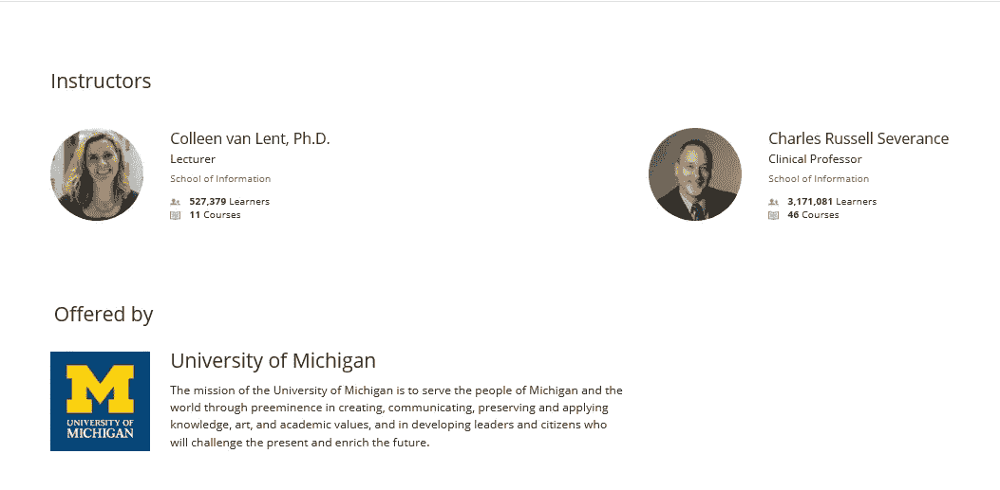
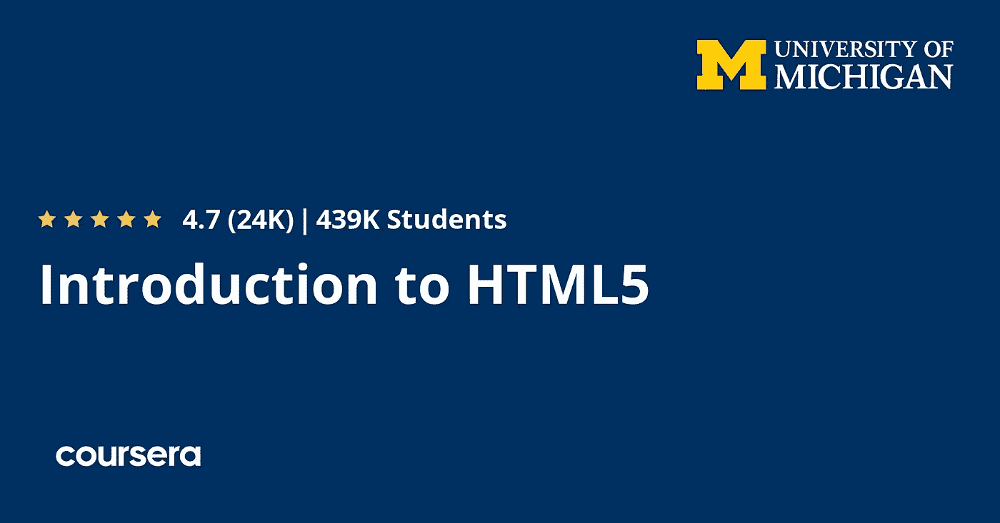
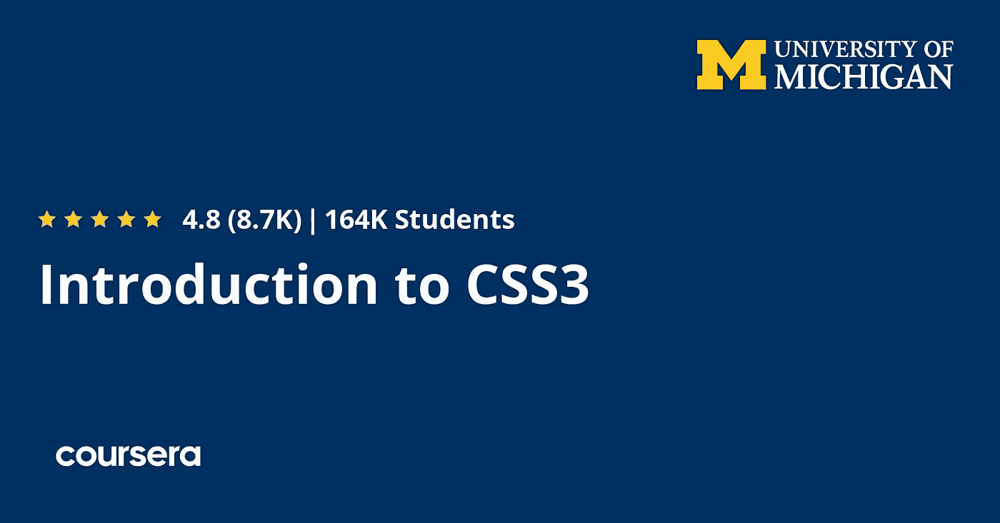
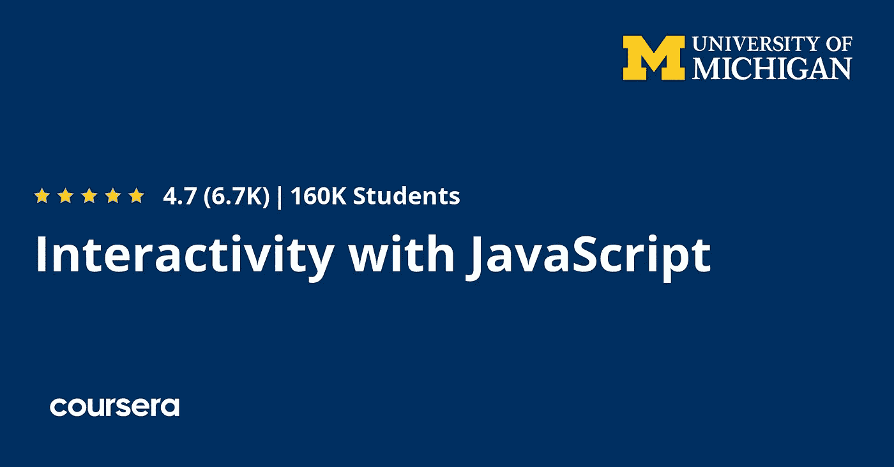
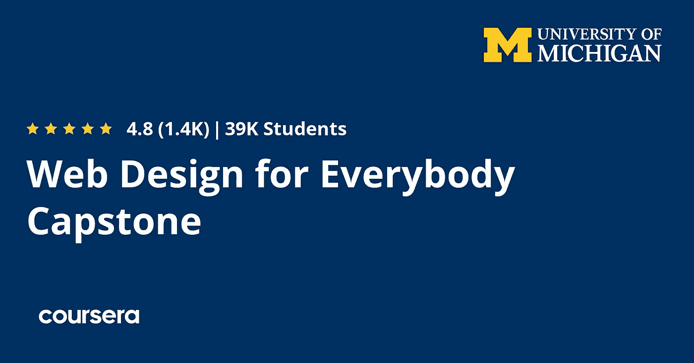

# Coursera 评论——密歇根大学的“面向所有人的网页设计”认证值得吗？

> 原文：<https://medium.com/javarevisited/review-is-web-design-for-everybody-on-coursera-worth-it-4f09797bb040?source=collection_archive---------1----------------------->

## 我对 Coursera 的流行网页设计资源——密歇根大学 2022 年的人人网页设计认证项目的评论

大家好，如果你正在 Coursera 上寻找最好的网页设计课程，或者想加入 Coursera 广受欢迎的 [**网页设计:网页开发基础知识和编码专业化**](https://coursera.pxf.io/c/3294490/1164545/14726?u=https%3A%2F%2Fwww.coursera.org%2Fspecializations%2Fweb-design) ，但不确定你来对地方了。

过去，我曾分享过[Coursera 网站开发人员的最佳课程](https://javarevisited.blogspot.com/2020/08/top-10-coursera-certifications-to-learn-web-development.html)，在这篇文章中，我将回顾 Coursera 的网站设计，看看它是否适合初学者和中级开发人员。

与之前回顾的课程一样，我们将从三个主要参数来回顾这门课程:教师声誉和教学风格、课程内容和结构、社会证明或其他人对这门课程的评价。

这是我尝试过的加入在线课程的方法，我用这种方法从 [Udemy](https://javarevisited.blogspot.com/2020/11/top-10-udemy-courses-you-can-buy-in.html) 、 [Coursera](https://javarevisited.blogspot.com/2020/09/google-it-support-professional-certification-coursera-review.html) 、 [Pluralsight](https://javarevisited.blogspot.com/2017/12/top-10-pluralsight-courses-java-and-web-developers.html) 、 [Educative](https://javarevisited.blogspot.com/2020/05/top-10-educative-courses-for-programmers.html) 和其他热门网站上找到了数百门优质课程。

网络开发是指将你的想法转化为一个网站或一个为人们提供服务的平台的活动，比如食品配送网站或购物电子商务网站，以及 Paypal 和 strip 等支付平台。

任何网站的开发都需要在开始你的旅程之前了解三件事情，即前端开发和用户在浏览器中看到和交互的内容，其次是后端开发，包括网站功能的开发，如处理支付和搜索功能，最后是网站存储数据的数据库。

该公司需要雇用许多开发人员来创建网站的不同部分。他们中的一些人只知道如何使用 HTML、CSS 和 JavaScript 创建前端。这个课程，叫做 [**网页设计给大家**](https://coursera.pxf.io/c/3294490/1164545/14726?u=https%3A%2F%2Fwww.coursera.org%2Fspecializations%2Fweb-design)**会教你前端开发的基础知识。**

****

## **密歇根大学和 Coursera 网站的网页设计评论**

**不要再浪费您的时间，让我们直接进入本课程，了解本课程涵盖的内容、您将在本课程中学到的知识以及参加本课程的好处。**

## **1.教员回顾**

**来自密歇根大学的两个人创造了这个专业。第一个是 Colleen van Lent，她在密歇根大学信息学院工作，在那里接触了许多 IT 主题，如 web 开发。**

**第二位讲师是查尔斯·拉塞尔·塞弗伦，他为所有人创建了最好的 python 课程之一，即 Python。**

****

## **2.课程结构和内容**

**现在，让我们来看看这个专业包括什么，内容是如何组织的。这是参加任何在线课程或认证项目的一个重要标准。**

## **2.1.[html 5 简介](https://coursera.pxf.io/c/3294490/1164545/14726?u=https%3A%2F%2Fwww.coursera.org%2Flearn%2Fhtml%3Fspecialization%3Dweb-design)**

**您将开始学习互联网如何工作以及如何从浏览器访问网页，并且在编写自己的网页之前，您将了解 HTML5 及其基本概念。**

**接下来，您将进入编码部分，学习文档对象模型(DOM)和使用 HTML5 stage & syntax，向网页添加图像，向文本添加链接，以便当有人单击该文本时，它会将他重定向到另一个 URL 等等。**

**最后，学习如何托管你网站并上传到 Github。**

****这里是加入这个 Coursera 课程**——[html 5 简介](https://coursera.pxf.io/c/3294490/1164545/14726?u=https%3A%2F%2Fwww.coursera.org%2Flearn%2Fhtml%3Fspecialization%3Dweb-design)的链接**

****

## **2.2.[CSS3 简介](https://coursera.pxf.io/c/3294490/1164545/14726?u=https%3A%2F%2Fwww.coursera.org%2Flearn%2Fintrocss%3Fspecialization%3Dweb-design)**

**这一节将教你如何使用 CSS3 来设计你的网站，并设计一个复杂的布局。您将了解 CSS3 中的颜色以及如何设置文本样式。**

**接下来，您将学习高级样式并了解盒子模型，这是您必须学习的一个基本概念，以便为用户提供更好的设计。您还将学习如何设计链接和列表的样式，并学习高级选择器。**

**您还将看到如何设计一个链接的样式，当有人点击它或悬停在它上面时，它的颜色和样式会改变，等等。**

****这里是加入本课程**——[CSS3 简介](https://coursera.pxf.io/c/3294490/1164545/14726?u=https%3A%2F%2Fwww.coursera.org%2Flearn%2Fintrocss%3Fspecialization%3Dweb-design)的链接**

****

## **2.3.[与 JavaScript 的交互](https://coursera.pxf.io/c/3294490/1164545/14726?u=https%3A%2F%2Fwww.coursera.org%2Flearn%2Fjavascript%3Fspecialization%3Dweb-design)**

**如果你打算成为一名前端 web 开发人员，JavaScript 是一门必须学习的语言，它为你的网站增加了交互性，构建了丰富的 UI 组件，等等。因此，您将了解 JavaScript 函数、文件夹结构、事件等等。**

**接下来，您将学习 JavaScript 数组和 JavaScript 迭代，以及组合循环、条件和高级条件。**

**最后，您将了解如何通过创建一个简单的表单和简单的验证来验证表单数据，比较两个输入，并向表单添加选项。**

****这是加入本课程的链接** — [与 JavaScript 的互动](https://coursera.pxf.io/c/3294490/1164545/14726?u=https%3A%2F%2Fwww.coursera.org%2Flearn%2Fjavascript%3Fspecialization%3Dweb-design)**

****

## **2.4.[采用响应式设计的高级造型](https://coursera.pxf.io/c/3294490/1164545/14726?u=https%3A%2F%2Fwww.coursera.org%2Flearn%2Fresponsivedesign%3Fspecialization%3Dweb-design)**

**手机和平板电脑的使用越来越多，这使得网站需要采用新的设计模式，所以如果有人从手机访问网站，应该看起来很好，而不仅仅是在桌面上。**

**您将了解响应式设计的概况，并学习如何使用 CSS3 中的媒体查询，它可以检测屏幕大小，并将更改网站设计以适应屏幕。**

**接下来，你将学习如何使用你所学的这些语言的框架来创建你自己的网站，比如 Bootstrap，一个 CSS 框架，并学习它的一些概念。**

****以下是参加本课程的链接** — [响应设计的高级造型](https://coursera.pxf.io/c/3294490/1164545/14726?u=https%3A%2F%2Fwww.coursera.org%2Flearn%2Fresponsivedesign%3Fspecialization%3Dweb-design)**

****

## **2.5.[人人共享的网页设计顶点](https://coursera.pxf.io/c/3294490/1164545/14726?u=https%3A%2F%2Fwww.coursera.org%2Flearn%2Fweb-design-project%3Fspecialization%3Dweb-design)**

**这最后一部分展示了你使用在本课程中学到的语言，为至少三个平台创建响应式网站的知识。**

**最后一门课程分为六个部分。在每一节中，他们将指导你网站应该是什么样子，以及在这一节中你需要使用哪些语言或框架来展示你开发响应性网站的能力。**

**完成本课程后，你已经完成了*面向所有人的网页设计:网页开发基础&编码专业*，你有资格获得结业证书，你可以在简历或 LinkedIn 个人资料中展示该证书。**

****这是加入本课程的链接** — [人人网设计顶点](https://coursera.pxf.io/c/3294490/1164545/14726?u=https%3A%2F%2Fwww.coursera.org%2Flearn%2Fweb-design-project%3Fspecialization%3Dweb-design)**

****

## **3.社会证明**

**谈到社会证明，面向所有人的网页设计:网页开发基础&编码专业化是 Coursera 中最受欢迎的网页设计认证之一。**

**超过 223，254 名学生已经注册了该计划，近 21，000 名参与者的平均评分为 4.8。**

**这个专业的每门课程也非常受欢迎，并有星级的评论。以下是人们对第一门 HTML 课程的评价**

**我真的很喜欢这门课程的一切。我认为练习/测验是公平的，老师向我展示了许多东西，这些东西将有助于我今后的发展。很棒的课程，很棒的导师！**

**以下是另一位学员对 [HTML 课程](/javarevisited/top-10-free-courses-to-learn-html-5-css-3-and-web-development-872d62d97a97)的评价**

**这是一门非常好的课程。在发展到现在的过程中，我知道了很多基本的东西，这些东西我都不介意。我将利用本课程中教授的基本但有意义的东西。为此谢谢你。**

**总的来说，Coursera 是一门学习网页设计的好课程。它既适合初学者，也适合有经验的人，他们想从网页设计、编码和开发工作开始。**

**这是加入这个令人敬畏的项目的链接— [**为大家设计网页**](https://coursera.pxf.io/c/3294490/1164545/14726?u=https%3A%2F%2Fwww.coursera.org%2Fspecializations%2Fweb-design)**

****

**顺便说一下，如果你计划参加多个 Coursera 课程或专业，那么考虑参加 [**Coursera Plus 订阅**](https://coursera.pxf.io/c/3294490/1164545/14726?u=https%3A%2F%2Fwww.coursera.org%2Fcourseraplus) ，它将为你提供无限制的访问他们最受欢迎的课程、专业、专业证书和指导项目的机会。它的费用大约为每月 59 美元或每年 399 美元，但它完全值得你的钱，因为你可以获得无限的证书。**

**<https://coursera.pxf.io/c/3294490/1164545/14726?u=https%3A%2F%2Fwww.coursera.org%2Fcourseraplus> ** 

## **结论**

**有成千上万的课程教你如何使用这三种语言来建立网站:HTML、CSS 和 JavaScript。尽管如此，这门课程是为新手开设的，它是由信息技术领域的顶尖大学开设的，所以你必须向行业专家学习这门科学。**

**你可能喜欢的其他 **Coursera 资源文章****

*   **[学习云计算的 10 门最佳 Coursera 课程](https://javarevisited.blogspot.com/2020/08/top-10-coursera-certifications-to-learn-cloud-computing-aws.html#axzz6WK1yC5WW)**
*   **[你可以在 Coursera 上在线申请的前 5 个计算机科学学位](https://javarevisited.blogspot.com/2020/04/is-it-possible-to-get-master-of-computer-science-degree-online-coursera.html)**
*   **[5 个最佳 Coursera 程序员职业证书](https://javarevisited.blogspot.com/2019/10/top-5-coursera-professional-certificates-for-programmers-IT-professionals.html)**
*   **[2021 年学习 Python 可以做的 8 个项目](/javarevisited/8-projects-you-can-buil-to-learn-python-in-2020-251dd5350d56)**
*   **[你可以在 Coursera Online 上获得 5 个数据科学学位](https://www.java67.com/2020/06/top-5-data-science-degree-you-can-earn-online-coursera-edx.html)**
*   **[开始职业生涯的十大 Coursera 认证](/javarevisited/top-10-coursera-certificates-to-start-your-career-in-cloud-data-science-ai-mainframe-and-it-558690c83587)**
*   **[Coursera Plus Review——在 Coursera 上学习的更好方式](https://javarevisited.blogspot.com/2020/08/coursera-plus-better-way-to-take-coursera-courses-specilizations-certification.html)**
*   **[2021 年学习人工智能的 7 门最佳课程](/javarevisited/7-best-courses-to-learn-artificial-intelligence-in-2020-26d59d62f6fe)**
*   **[2021 年程序员十大课程课程](https://javarevisited.blogspot.com/2020/08/top-10-coursera-courses-specilizations-and-certifications.html)**
*   **[面向程序员和开发者的 Coursera 十大项目](https://javarevisited.blogspot.com/2020/08/top-10-coursera-projects-to-learn-essential-programming-skills.html)**
*   **[Udemy vs. Pluralsight？哪个学习平台比较好？](https://javarevisited.blogspot.com/2019/10/udemy-vs-pluralsight-review-which-is-better-to-learn-code.html)**
*   **[Udemy vs Coursera？学理工和编程哪个好](https://javarevisited.blogspot.com/2020/01/coursera-vs-udemy-which-is-better-for-programming-tech.html)**
*   **[Coursera 证书对工作和事业有帮助吗](https://javarevisited.blogspot.com/2020/02/does-udemy-coursera-edx-educative-or.html)？**
*   **[学习 Web 开发的十大 Coursera 课程](https://javarevisited.blogspot.com/2020/08/top-10-coursera-certifications-to-learn-web-development.html)**
*   **[学习数据科学的十大 Coursera 课程](https://javarevisited.blogspot.com/2020/08/top-10-coursera-certifications-to-learn-Data-Science-Visualization-and-Data-Analysis.html)**
*   **[Udemy vs . CocdeCademy vs . one month？](https://javarevisited.blogspot.com/2019/09/codecademy-vs-udemy-vs-onemonth-which-is-better-for-learning-code.html#axzz6VYKcmyZz)**
*   **Udemy vs. Educative vs. Codecademy？新手用哪个好**
*   **[学习 Python 的 10 个 Coursera 专业和认证](https://javarevisited.blogspot.com/2020/02/10-best-coursera-courses--for-python.html)**
*   **Coursera 的 10 项数据科学和机器学习认证**

**感谢阅读这篇文章。如果你喜欢这个*关于 Coursera 的《面向所有人的网页设计》、《网页开发基础》和《编码专门化》的评论，*那么请与你的朋友和同事分享。如果您有任何问题或反馈，请留言。**

****p . s .**——如果你正在寻找最好的 Udemy 在线课程来学习网页设计和网页开发，你也可以在 Udemy **上查看[**网页设计初学者:HTML 中的真实世界编码& CSS**](https://click.linksynergy.com/deeplink?id=JVFxdTr9V80&mid=39197&murl=https%3A%2F%2Fwww.udemy.com%2Fcourse%2Fweb-design-for-beginners-real-world-coding-in-html-css%2F) 。**这是 Udemy 上最好的网页设计课程之一，受到超过 65，000 名学习者的信任。**

**<https://javarevisited.blogspot.com/2018/02/top-5-online-courses-to-learn-web-development.html> **