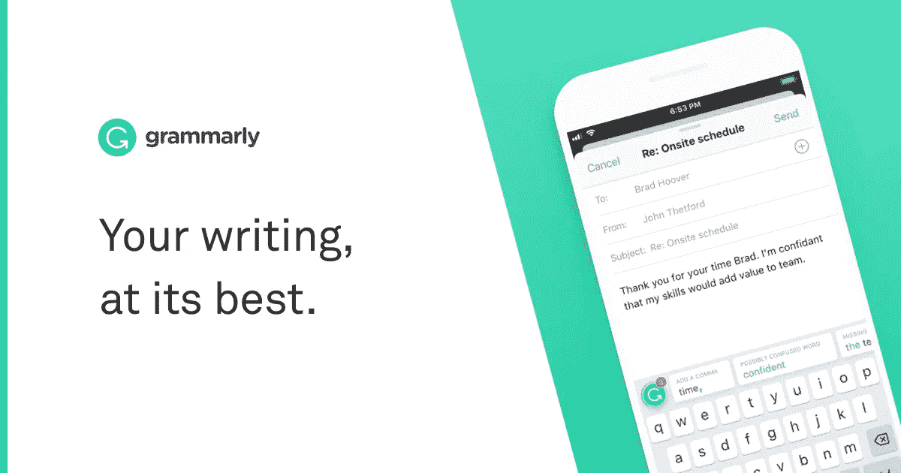
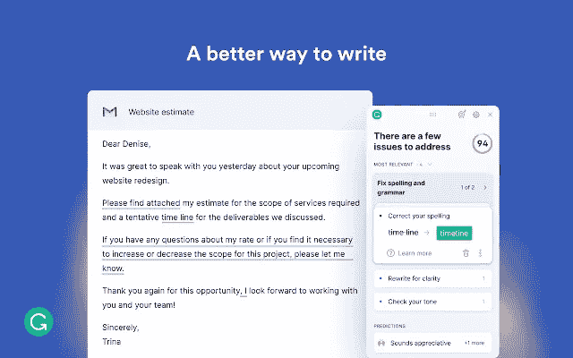
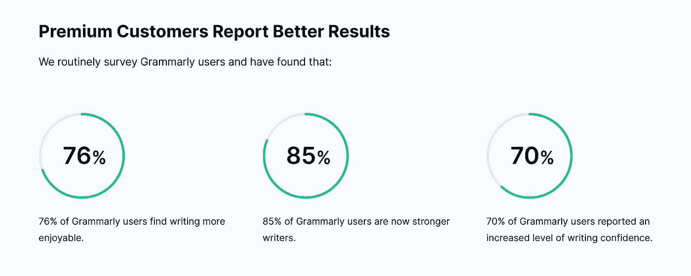
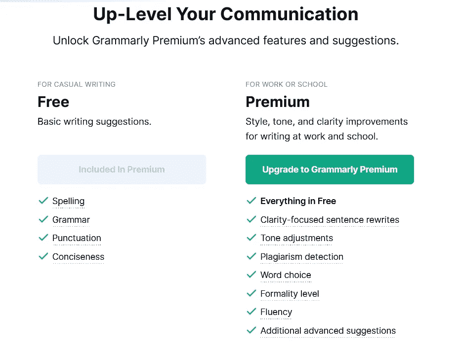
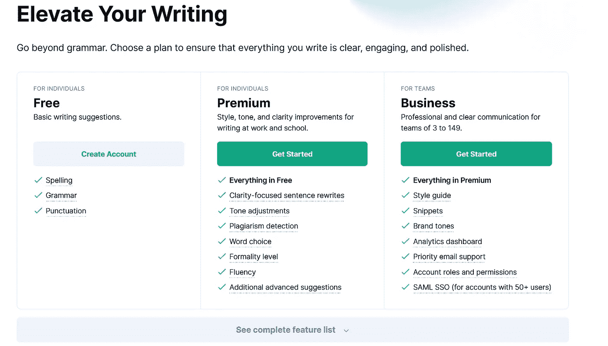
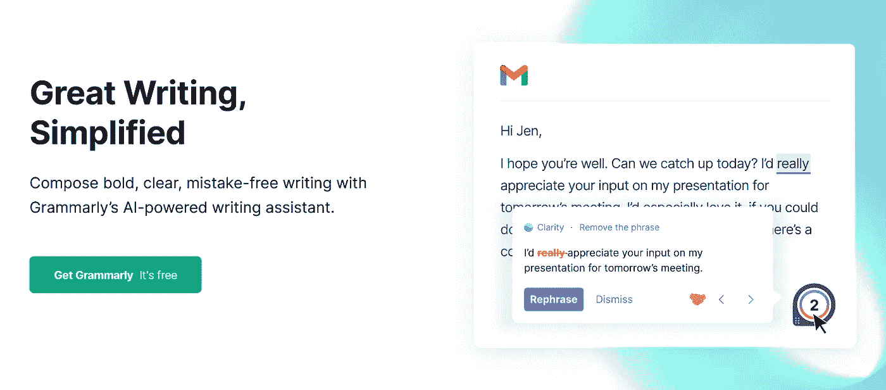
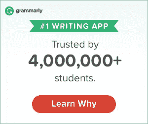

# 语法评论——语法溢价值得吗？[2023 年更新]

> 原文：<https://medium.com/javarevisited/review-my-experience-with-grammarly-writing-tool-is-it-worth-it-bfabc42701b1?source=collection_archive---------0----------------------->

## 我使用 Grammarly 的经验，它是博客作者、作家、内容创作者和程序员的最佳写作工具之一。是的，值得。

image_credit —语法上

大家好，如果你打算购买 Grammarly premium，但不确定它是否值得，那么你来对地方了。在这篇文章中，我将分享我使用[**Grammarly Premium**](https://shareasale.com/r.cfm?b=864277&u=880419&m=26748&urllink=&afftrack=)**的经历——这是一个强大的写作工具，适用于博客作者**，程序员，作家，学生，以及任何想要写出没有语法和拼写错误的正确英语的人。

这是一篇非正式但真实的评论，因为我从过去几年开始一直使用<https://shareasale.com/r.cfm?b=864277&u=880419&m=26748&urllink=&afftrack=>**，从 2019 年到 2023 年，我已经使用 Grammarly Premium 写了 1500 多篇文章。**

**在这篇语法评论中，我将概述 Grammarly 的主要优势，包括免费和高级版本，并帮助您决定是否应该使用[***Grammarly***](https://shareasale.com/r.cfm?b=864277&u=880419&m=26748&urllink=&afftrack=)进行写作。**

**我从 2010 年开始定期写博客，已经写了 3000 多篇关于 Java、编程和技术的文章，但是很少谈论博客本身。**

**在我的读者多次要求我提供写博客的技巧、我的经验以及一个程序员应该为他的进步和财务稳定做些什么之后，我决定偶尔写一些关于我写博客经历的帖子，这是那个系列的第一篇。**

**在这篇文章中，我将分享任何博客作者或作家的必备工具之一——[**语法**，](https://shareasale.com/r.cfm?b=864277&u=880419&m=26748&urllink=&afftrack=)一款帮助你写作的软件。它不仅能纠正你文章中的拼写和语法错误，还能对你文章的可读性、参与性、清晰性和表达方式提供有用的见解。**

**不仅如此，通过改变单词的选择和句子的构成，它还有助于使你的教程或博客文章更好。这对任何写作的人来说都是不可思议的帮助，对博客和作家来说也是绝对必要的，这就是我喜欢语法的原因。

我决定写文章主要是为了提高我的 Java 知识，但是写博客，主要是写文章并不容易。写不仅有用而且吸引人的内容总是一个挑战，我也担心人们会说我写的东西。最初几年，我面临的一个主要困难是我的英语和写作水平不高。虽然因为我的内容是技术性的，而且切中要点，所以我基本上没有受到什么影响，但是在那之间，或者有时有时，不断地犯错误还是有点令人尴尬。我确实学到了，但是没有校对者和合适的工具意味着文章中总会有一些拼写和语法错误。

感谢 [**语法上的**](https://shareasale.com/r.cfm?b=864277&u=880419&m=26748&urllink=&afftrack=) ，现在，我不需要担心我文章中的语法和拼写错误了。经常使用语法也提高了我的写作，我的文章质量比以前好得多。

我的语法错误比以前少了很多，文章阅读率大幅提高。这就是为什么我建议每个博客和作家使用语法，尤其是如果英语不是你的第一语言。**

# **Grammarly Review——Grammarly Premium 真的值得吗？**

**尽管 Grammarly 已经存在很多年了，但我只是在几年前才开始使用它。我知道我迟到了，但迟到总比不到好。因为我大部分时间都在记事本上写东西，所以我没有很多工具来检查我的文章的拼写和语法。当我在 blogger 上复制粘贴我的文章进行格式化时，我主要依靠自己的眼睛和浏览器提供的任何帮助，这是不够的。在我开始写博客的时候，我确实尝试过用微软的 word 写作，但是有太多的问题，比如速度太慢。而是更喜欢记事本的简洁和快捷，让我写的又快又快。

无论如何，当我发现[**语法上有一个 chrome 扩展**](https://shareasale.com/r.cfm?b=224178&u=880419&m=26748&urllink=&afftrack=) 时，我立即开始使用他们的免费服务，并且繁荣我的文章阅读起来更好，语法错误更少甚至没有。**

**语法上提供即时反馈，尽管我从不盲目接受任何东西，总是一个一个地去做。**

**Grammarly 的 [**免费版本非常棒，老实说，我迄今为止使用过的免费工具都没有这么有用，我的意思是他们真的很慷慨地免费提供这么多支持，但是一旦我开始使用他们的**](https://shareasale.com/r.cfm?b=864277&u=880419&m=26748&urllink=&afftrack=) **[*高级服务*](https://shareasale.com/r.cfm?b=864277&u=880419&m=26748&urllink=&afftrack=) ，我就意识到作为一个博客作者和作家，我是多么的缺失。****

****

# **什么是语法溢价？2023 年值得吗？**

**[**Grammarly Premium**](https://shareasale.com/r.cfm?b=224178&u=880419&m=26748&urllink=&afftrack=)是他们的付费版本，提供 400 多种检查和功能，检查语法错误，提供词汇增强建议，检测抄袭，并提供引用建议。这就像一个在线校对的一小部分成本。

作为一个至今写了 3000+帖子的博主，我可以说 Grammarly 是博主最好的拼写软件和写作助手。它不仅能发现你愚蠢的拼写和语法错误，还能提供明智的建议来改进你的内容。**

**一个这样的建议是把一个长的段落分成一个更小更易读的段落，我真的很喜欢它，在使用这个建议后，用户的停留时间增加了，我从我的用户那里收到了积极的反馈。**

**Grammarly premium 的另一个伟大之处是，他们使用机器学习和人工智能来提供更多有用的见解和建议，这些见解和建议涉及语调以及你的内容是如何产生的，比如它是否适合知识渊博的人，它是否正确地使用单词？以及整个故事的影响评分。**

**所有这些特性让 2023 年的[**Grammarly premium**](https://shareasale.com/r.cfm?b=224178&u=880419&m=26748&urllink=&afftrack=)完全值得。我刚刚支付了 49 美元的年度订阅费，这是 Grammarly 的 50%折扣，我每天都在使用。**

****

# **语法免费版 vs 语法高级版**

**这是来自 Grammarly 本身的另一个有用的图表，它显示了 Grammarly 免费版和高级版之间的区别:**

****

# **语法溢价的成本是多少？**

**Grammarly Premium 每月订阅费用约为 29.95 美元，而他们的季度订阅费用为 19.98 美元，但计费为一次支付 59.95 美元。**

**我使用的是 [**Grammarly Premium 年度订阅**](https://shareasale.com/r.cfm?b=224178&u=880419&m=26748&urllink=&afftrack=) ，它每月只需 11.66 美元，并被计费为 139.95 美元，所以你不需要担心每月支付。**

**老实说，它完全对得起他们的价格，每个博客作者和作家都应该在他们的作品中使用 Grammarly。**

****

# **语法上对 SEO 和搜索排名有帮助吗？**

**嗯，这个问题没有官方的答案，但是，从我自己的经验来看，我可以说语法上使用*确实可以提高你的文章的搜索排名*。我已经大量使用 [**语法上的**](https://shareasale.com/r.cfm?b=864277&u=880419&m=26748&urllink=&afftrack=) 来写新文章和更新我现有的文章，更新后它们做得更好。

如果你认为你也会理解，因为[语法上](https://www.grammarly.com)不仅能帮你修正所有的语法和拼写错误，还能让你添加同义词来代替重复的关键词，这意味着更多相关的关键词被插入到你的文章中。它还可以帮助你将句子分解成更简单的小行，这可以提高你的文章或博文的可读性。**可读性的提高意味着读者会在你的网站上花更多的时间，**而且很有可能他们不仅会完整地阅读文章，还会阅读你网站上的其他文章。这种参与度的提高向谷歌发出了积极的信号，即你的网站或博客是有价值的，读者喜欢它，这意味着你的内容的搜索排名提高了。**

****

# **2023 年支付 Grammarly Premium 真的值得吗？**

**绝对的。为 Grammarly 付费完全物有所值。这不仅让你避免了我犯过的令人尴尬的错误，而且提高了你的写作和词汇技能。T21，把它当成你的在线英语家教吧。它教会了我很多东西，比如如何从不错过一篇文章，以及哪个词最有影响力。**

**我强烈推荐[语法](https://shareasale.com/r.cfm?b=224178&u=880419&m=26748&urllink=&afftrack=)给任何博客和作家以及任何公开写作的人。**

**这里是加入 Grammarly Premium 的链接—[**Grammarly Premium**](https://shareasale.com/r.cfm?b=224178&u=880419&m=26748&urllink=&afftrack=)**

****

# **如何充分利用 Grammarly Premium？**

**Grammarly 提供了很多选项，而且从字面上看无处不在，但是你应该先安装 Grammarly 浏览器扩展(它是免费的！).**

**虽然它并不兼容所有东西(比如谷歌套件)，但它确实可以与 WordPress、Blogger 和其他内容管理系统等博客应用程序兼容。

一旦你 [I **安装了语法浏览器扩展**](https://shareasale.com/r.cfm?b=224178&u=880419&m=26748&urllink=&afftrack=) ，你就可以直接输入你的 WordPress 和 Blogger 编辑器，它会给不正确的单词或短语加下划线。它还会在你键入电子邮件、创建脸书和 Twitter 帖子等时突出错误和建议。

也可以直接输入 Grammarly app。这使得在不中断你的流程的情况下点击修改变得容易，并且如果你使用 [Microsoft Word](https://javarevisited.blogspot.com/2022/02/top-5-courses-to-learn-microsoft-word.html) 和 [PowerPoint](https://javarevisited.blogspot.com/2022/02/top-5-courses-to-learn-microsoft.html) ，那么你也可以使用 Grammarly for Microsoft Office。**

****

**这就是我的**语法评论**和**为什么每个博客作者都应该使用语法**。这是一个优秀的工具，也是任何严肃的博客作者或作家的必备之物。它不仅是世界上最好的自动语法检查工具，也是你的虚拟写作助手、在线校对者和英语家教。**

**我不能推荐足够的语法；每个博主都应该用它来写出更好的内容。如果你此刻只想做一件事，那就 [**报名语法**](https://shareasale.com/r.cfm?b=864277&u=880419&m=26748&urllink=&afftrack=) 吧，现在就提升你的文笔。它是免费的。

其他**你可能喜欢的编程和博客文章****

*   **[为什么每个程序员都应该创建在线课程](https://javarevisited.blogspot.com/2019/06/why-programmers-should-create-and-sell.html)**
*   **每个软件工程师都应该学习的 10 件事**
*   **[提高邮件写作技巧的五大课程](https://javarevisited.blogspot.com/2018/02/top-5-professional-email-writing-courses-for-programmers.html#axzz5QneDWILh)**
*   **[提高你软技能的前 5 本书](https://javarevisited.blogspot.com/2017/12/5-career-development-and-soft-skill-books-for-programmers.html)**
*   **[每个程序员都应该读的 10 本书](http://www.java67.com/2015/03/10-books-every-programmer-and-software-engineer-read.html)**
*   **[每个程序员都应该读的 10 本算法书](https://dev.to/javinpaul/10-best-books-to-learn-data-structure-and-algorithms-in-java-python-c-and-c-5743)**
*   **[10 门数据结构与编程课程破解面试](https://hackernoon.com/10-data-structure-algorithms-and-programming-courses-to-crack-any-coding-interview-e1c50b30b927)**
*   **[初学者学习 Python 的 5 大课程](https://javarevisited.blogspot.com/2018/03/top-5-courses-to-learn-python-in-2018.html)**
*   **[学习数据科学和机器学习的 10 门课程](https://javarevisited.blogspot.com/2018/10/data-science-and-machine-learning-courses-using-python-and-R-programming.html)**

**感谢您阅读本文。如果你喜欢这篇关于流行写作工具 Grammarly 的评论，并且有兴趣了解更多关于我写博客的经历，我使用的工具等等。，然后订阅博客，每篇帖子都会通知你。你也可以在 Twitter、脸书和 Medium、

**P. S.** 上加入我的行列——如果你经常使用 Grammarly，我建议升级到他们的 [**高级版**](https://shareasale.com/r.cfm?b=224178&u=880419&m=26748&urllink=&afftrack=) ，这将使你的文章更具可读性，并提高他们在搜索引擎中的排名，因为读者会花更多时间阅读你的文章。**

**<https://javarevisited.blogspot.com/2019/07/why-every-blogger-should-use-grammarly.html> **