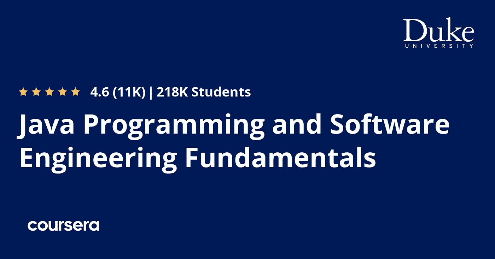
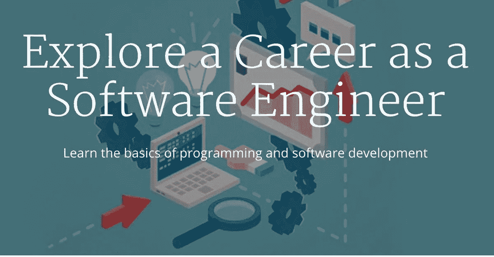
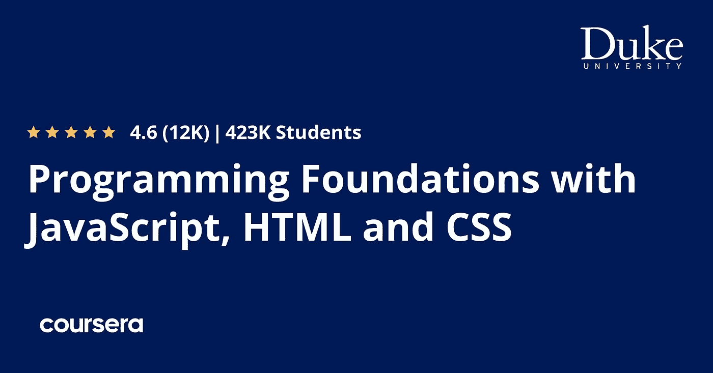
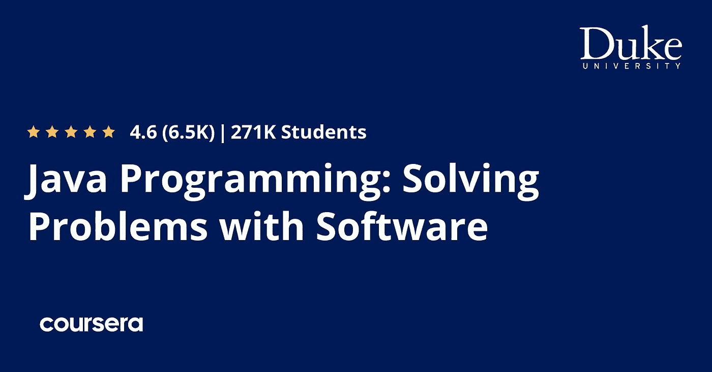
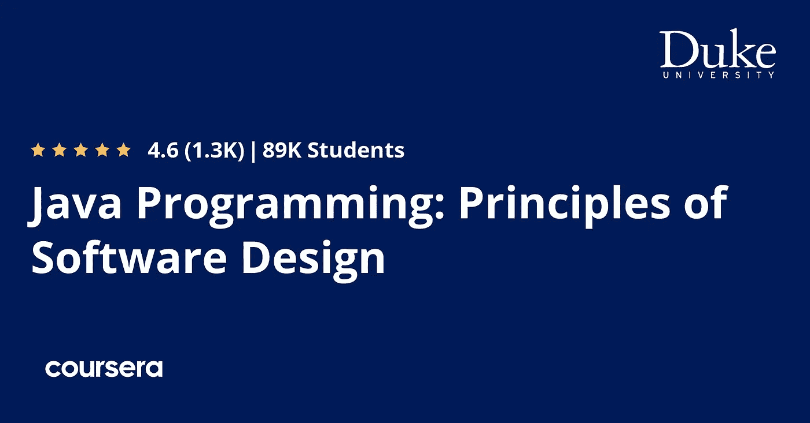
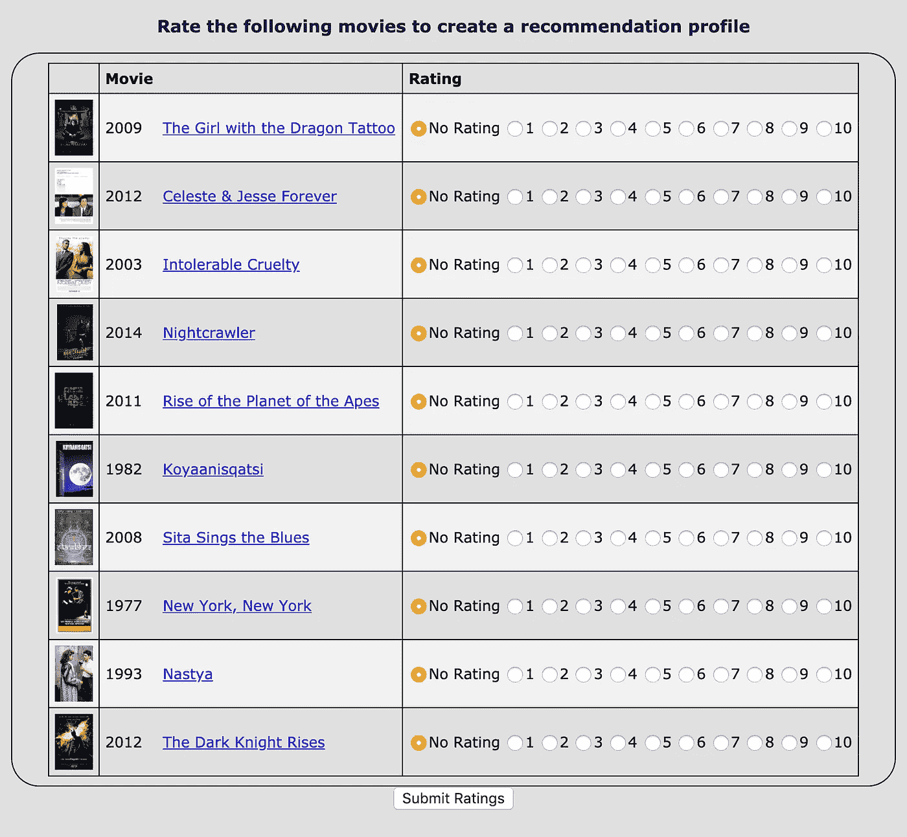

# 回顾 Coursera 上的 Java 编程和软件工程基础专业化值得吗？

> 原文：<https://medium.com/javarevisited/review-of-courseras-java-programming-software-engineering-fundamentals-specialization-4dcfa0ed2de4?source=collection_archive---------1----------------------->

## 我对 Coursera 最受欢迎的 Java 认证——杜克大学的 Java 编程和软件工程基础专业的评论。

大家好，如果你想在 2023 年成为一名 Java 开发人员，深入学习 Java，并在网上寻找最好的 Java 课程，那么你来对地方了。之前我已经分享过[**最佳 Java 编程课程**](/javarevisited/top-5-java-online-courses-for-beginners-best-of-lot-1e1e240a758)[网站](/javarevisited/10-best-places-to-learn-java-online-for-free-ce5e713ab5b2)[书籍](/javarevisited/5-best-core-java-books-for-beginners-20e3f723e3a)，今天我要回顾的是 Courser 最受欢迎的 Java 认证，杜克大学的《Java 编程与软件工程师基础》。

这是 Coursera 的顶级 Java 课程之一，已经有超过 218，000 名学生加入了这门课程。该课程由杜克大学提供，在完成课程的所有模块并完成最后一个模块的项目后，它还提供一个证书。

虽然社会证明足以让 [**加入本课程**](https://coursera.pxf.io/c/3294490/1164545/14726?u=https%3A%2F%2Fwww.coursera.org%2Fspecializations%2Fjava-programming) ，但我们会从不同的角度评估本课程，如讲师素质、课程结构、内容等，以帮助您做出明智的决定。

软件工程可能是每个行业最重要的角色或工作，尤其是对于高度依赖计算机和网站的企业。各公司使用不同的编程语言来满足他们的需求，如用于 iOS 的 Swift 和 macOS 应用程序，每种语言都服务于特定的平台，但 Java 是特殊的。

有了 Java，你可以编写一段代码，在许多平台上工作，比如 Windows、 [Linux](/javarevisited/7-best-linux-courses-for-developers-cloud-engineers-and-devops-in-2021-7415314087e1) 和 macOS。

java 是一种现代编程语言，支持面向对象编程( [**)和面向对象编程**](/javarevisited/my-favorite-courses-to-learn-object-oriented-programming-and-design-in-2019-197bab351733) )，由甲骨文公司于 1995 年发明，可用于任何运行 Java 的平台，如 windows、Linux、macOS，也可用于 android 应用程序。

谢天谢地，有很多在不同平台上学习 Java 编程语言的课程，比如 [Udemy](https://javarevisited.blogspot.com/2018/01/top-10-udemy-courses-for-java-and-web-developers.html) 、 [Educative](https://javarevisited.blogspot.com/2020/05/top-10-educative-courses-for-programmers.html) 、 [Pluralsight](https://javarevisited.blogspot.com/2017/12/top-10-pluralsight-courses-java-and-web-developers.html) 、Skillshare、 [edX](https://javarevisited.blogspot.com/2021/05/top-10-edx-courses-and-certificates-for.html#axzz6v6xLSPvq) 、 [Coursera](https://coursera.pxf.io/c/3294490/1164545/14726?u=https%3A%2F%2Fwww.coursera.org%2F) 等等，但是我发现杜克大学通过 Coursera 平台提供了一门课程，你现在正在阅读这门课程的评论。

# Coursera 评论——杜克大学的 Java 编程和软件工程基础专业值得吗？

既然你知道了学习 Java 编程语言的重要性和益处，那么是时候了解这门课程如何帮助你在 2023 年成为一名 Java 开发人员了。

正如我所说，这是 Coursera 上最受欢迎的 Java 课程和认证之一。既然如此，专业化意味着你在完成课程和项目后将获得 Coursera 颁发的证书，你可以在简历和 LinkedIn 个人资料中展示这些证书。

## 1.讲师声誉

这门课程是由杜克大学的四位讲师创建的，在这一部分，我将简要讨论每位讲师的声誉，所以让我们从第一位讲师开始:

[**苏珊·h·罗杰**](https://coursera.pxf.io/c/3294490/1164545/14726?u=https%3A%2F%2Fwww.coursera.org%2Finstructor%2Fsusan-rodger) **:** 她在普渡大学获得了计算机科学领域的博士和硕士学位，她是达克大学计算机科学系的教授，从事过许多不同的计算机项目。

 [## 苏珊·h·罗杰，讲师| Coursera

### 苏珊·h·罗杰是杜克大学计算机科学系的实践教授。她收到了她的…

coursera.pxf.io](https://coursera.pxf.io/c/3294490/1164545/14726?u=https%3A%2F%2Fwww.coursera.org%2Finstructor%2Fsusan-rodger) 

****:**他在这所大学任教超过 15 年，是达克大学计算机科学系的讲师，拥有布朗大学的计算机科学硕士学位。**

** [## Owen Astrachan，讲师| Coursera

### Owen Astrachan 是杜克大学计算机科学系的实践教授。他教过…

coursera.pxf.io](https://coursera.pxf.io/c/3294490/1164545/14726?u=https%3A%2F%2Fwww.coursera.org%2Finstructor%2Fowen-astrachan) 

**Owen astra chan:**Duck 大学最优秀的教授之一，在教授学生计算机科学方面拥有超过 25 年的经验，他帮助创建了一些与计算机科学相关的项目。

**Andrew d . Hilton:**他以前是 IBM 的顾问，自 2012 年以来一直是达克大学的教师，也是该大学电气和计算机工程系的副教授。

如果你赶时间，想现在就查看课程，这里有在 Coursera 平台上了解更多课程的链接— [**Java 编程和软件工程基础专业**](https://coursera.pxf.io/c/3294490/1164545/14726?u=https%3A%2F%2Fwww.coursera.org%2Fspecializations%2Fjava-programming)

**

# **2.专业化的内容和结构**

**这个流行的 Java 专门化包含许多面向初学者的课程，直到您掌握了创建可以解决复杂现实世界问题的程序的技能。你也可以免费加入这些课程进行学习。因此，让我们来探索专业化内容:**

## **2.1.【JavaScript、HTML 和 CSS 编程基础**

**这是这个 Java 专业的第一门课程，但有趣的是，它使用 [HTML](/javarevisited/10-best-html-and-css-courses-for-beginners-in-2021-6757eec00032) 、 [CSS](/javarevisited/10-best-css-online-courses-for-beginners-and-experienced-developers-54aa2e8c0253) 和 [JavaScript](/javarevisited/10-best-online-courses-to-learn-javascript-in-2020-af5ed0801645) 教授编程基础，这对 Java web 开发人员来说非常好。**

**作为一名程序员，不仅仅是像所有人认为的那样创造程序，而是解决现实世界的问题，最重要的是像计算机一样，你可以给它编程来解决某些问题。**

**这个小课程将教你一些其他语言的概念，比如 JavaScript 和使用 [HTML/CSS](https://www.java67.com/2020/08/5-best-online-courses-to-learn-html-5.html) 创建简单的网页。超过 40 万名学生已经加入了这门课程。**

****这里是加入本课程**—[—*JavaScript、HTML 和 CSS*](https://coursera.pxf.io/c/3294490/1164545/14726?u=https%3A%2F%2Fwww.coursera.org%2Flearn%2Fduke-programming-web) 编程基础的链接**

****

## **2.2. [Java 编程:用软件解决问题](https://coursera.pxf.io/c/3294490/1164545/14726?u=https%3A%2F%2Fwww.coursera.org%2Flearn%2Fjava-programming)**

**在理解了如何像程序员一样思考和一些基础概念之后，你将开始学习 Java 语言，比如循环、函数、变量、创建类等等，以及构建一些简单的程序。**

**超过 200，000 名学生参加了这个课程来学习 Java 编程，你也可以免费参加这个课程，但是你需要支付认证费用。**

****这里是加入本课程** — [Java 编程:用软件解决问题](https://coursera.pxf.io/c/3294490/1164545/14726?u=https%3A%2F%2Fwww.coursera.org%2Flearn%2Fjava-programming)的链接**

****

## **2.3. [Java 编程:数组、列表和结构化数据](https://coursera.pxf.io/c/3294490/1164545/14726?u=https%3A%2F%2Fwww.coursera.org%2Flearn%2Fjava-programming-arrays-lists-data)**

**在前面的课程中，你已经学到了很多东西，但还不是全部。本课程将向您介绍[数组](/javarevisited/20-array-coding-problems-and-questions-from-programming-interviews-869b475b9121)、[列表](/javarevisited/top-20-linked-list-coding-problems-from-technical-interviews-90b64d2df093)、结构化数据，您将构建一个加密和解密数据的程序。**

**这是一门非常重要的课程，因为它涉及 Java 集合框架，该框架提供了几个关键数据结构的标准实现，如数组、列表、集合和映射。**

**要在您的专业和日常工作中使用 Java，需要很好地理解这个模块。超过 10 万人加入了这个免费课程。**

****这是加入本课程的链接**——[Java 编程:数组、列表和结构化数据](https://coursera.pxf.io/c/3294490/1164545/14726?u=https%3A%2F%2Fwww.coursera.org%2Flearn%2Fjava-programming-arrays-lists-data)**

****

## **2.4. [Java 编程:软件设计原理](https://coursera.pxf.io/c/3294490/1164545/14726?u=https%3A%2F%2Fwww.coursera.org%2Flearn%2Fjava-programming-design-principles)**

**现在，在你学习了许多关于 Java 语言的知识后，你将尝试创建一些应用程序，使用接口解决现实世界的问题，其中一个项目是一个分析和排序地震数据的简单程序。**

**软件设计是一个很难掌握但却非常重要的话题。学习软件设计的免费课程并不多，但是你可以利用这个课程来更新你的软件设计技能或者从头开始学习。**

****以下是加入本课程的链接 Java 课程** - [Java 编程:软件设计原理](https://coursera.pxf.io/c/3294490/1164545/14726?u=https%3A%2F%2Fwww.coursera.org%2Flearn%2Fjava-programming-design-principles)**

****

## **2.5. [Java 编程:构建推荐系统](https://coursera.pxf.io/c/3294490/1164545/14726?u=https%3A%2F%2Fwww.coursera.org%2Flearn%2Fjava-programming-recommender)**

**没有比建立项目更好的学习方法了，Coursera 最受欢迎的 Java 认证项目的最后一个模块要求你创建项目。**

**你已经取得了很大的成就，为了证明你很好地理解了 Java，你将创建一个推荐系统，就像你在网飞和亚马逊等大公司的服务中看到的那样。**

**对于 Java 程序员来说，这是一个非常有趣的项目，因为您将处理电影数据，并使用这些数据创建一个推荐系统。我强烈推荐每个 Java 程序员尝试这个项目，提高他们的 Java 和软件开发技能。**

****下面是加入这个项目的链接** — [Java 编程:搭建推荐系统](https://coursera.pxf.io/c/3294490/1164545/14726?u=https%3A%2F%2Fwww.coursera.org%2Flearn%2Fjava-programming-recommender)**

****

# **3.人民评论**

**这个 Coursera specialization 可能是学习编程基础和 Java 语言的最佳课程之一。该课程评分为 4.6 分，有超过 218，000 名学生注册，证明您值得花费时间和精力来学习这门课程，并开始 Java 语言软件工程师的职业生涯。统计数据显示， *42%的学生在完成专业学习后开始了新的职业*，17%的学生获得了加薪或升职。**

****还有，这里是链接—** [Java 编程与软件工程基础专业](https://coursera.pxf.io/c/3294490/1164545/14726?u=https%3A%2F%2Fwww.coursera.org%2Fspecializations%2Fjava-programming)**

****

**顺便说一句，如果你计划参加多个 Coursera 课程或专业，那么考虑参加 [**Coursera Plus 订阅**](https://coursera.pxf.io/c/3294490/1164545/14726?u=https%3A%2F%2Fwww.coursera.org%2Fcourseraplus) ，它可以让你无限制地访问他们最受欢迎的课程、专业、专业证书和指导项目。**

** [## Coursera Plus |无限制访问 7，000 多门在线课程

### 用 Coursera Plus 投资你的职业目标。无限制访问 90%以上的课程、项目…

coursera.pxf.io](https://coursera.pxf.io/c/3294490/1164545/14726?u=https%3A%2F%2Fwww.coursera.org%2Fcourseraplus) 

以上就是 Coursera 广受欢迎的 **Java 编程和软件工程基础专业**的全部内容。这篇文章回顾了学习编程概念和如何像计算机一样思考的最伟大的课程之一，以及日渐流行的 Java 语言，现在你离开始你的新事业又近了一步。

你还在等什么？加入这个课程[2023 年成为 Java 开发者](https://javarevisited.blogspot.com/2020/03/top-20-skills-java-developers-can-learn.html#axzz6k4XBgTw4)。我向初学者强烈推荐这门课程。最后的压顶石项目真的很有趣，你会学到很多。

您可能想探索的其他 Java 编程文章

*   [2023 年 Java 开发人员应该学会的 10 件事](https://javarevisited.blogspot.com/2020/01/10-things-web-developers-should-learn.html)
*   [深入了解春天的五大课程](https://javarevisited.blogspot.com/2018/06/top-6-spring-framework-online-courses-Java-programmers.html)
*   [学习 Spring Boot 微服务的 5 大课程](https://javarevisited.blogspot.com/2018/02/top-5-spring-microservices-courses-with-spring-boot-and-spring-cloud.html#axzz6JJFPbsyP)
*   [面向 Java 开发者的 5 门免费 Spring 框架课程](http://www.java67.com/2017/11/top-5-free-core-spring-mvc-courses-learn-online.html)
*   [5 门免费学习核心 Java 的在线课程](http://javarevisited.blogspot.sg/2017/11/top-5-free-java-courses-for-beginners.html#axzz4zuIICRs9)
*   [面向有经验者的 5 门最佳 Java 设计模式课程](https://javarevisited.blogspot.com/2018/02/top-5-java-design-pattern-courses-for-developers.html)
*   [编程/编码工作面试的 10 门课程](http://javarevisited.blogspot.sg/2018/02/10-courses-to-prepare-for-programming-job-interviews.html)
*   [面向有经验的 Java 开发人员的 5 大 Java 设计模式课程](http://javarevisited.blogspot.sg/2018/02/top-5-java-design-pattern-courses-for-developers.html)
*   [学习 Java 微服务的 7 大课程](/javarevisited/top-5-courses-to-learn-microservices-in-java-and-spring-framework-e9fed1ba804d)
*   [初学者学习 Spring Cloud 的 5 大课程](https://javarevisited.blogspot.com/2018/04/top-5-spring-cloud-courses-for-java.html)
*   [10 个面向 Java 开发者的免费 Spring Boot 教程和课程](/javarevisited/10-free-spring-boot-tutorials-and-courses-for-java-developers-53dfe084587e)
*   [面向全栈 Java 开发人员的 5 大课程](https://javarevisited.blogspot.com/2020/04/top-5-courses-to-become-full-stack-java-developer-with-Angular-and-Reactjs.html#axzz6Nq9yk7Sc)
*   面向 Java 开发人员的 10 门高级 Spring Boot 课程

感谢您阅读本文。如果你在 Coursera 上看到我对杜克大学的 *Java 编程和软件工程基础专业化的评论，那么请与你的朋友和同事分享。如果您有任何问题或反馈，请留言。*

**P. S.** —如果你热衷于学习 Java，但负担不起这门课程，并在寻找免费的在线培训课程来学习 Java，那么我强烈推荐你在 Udemy 上查看 [**Java 完全初学者教程(免费)**](http://bit.ly/2zO3AHT) 。这个课程是完全免费的，已经有 100 多万开发人员加入了这个课程来免费学习 Java。

 [## 免费 Java 教程-免费 Java 教程-完全初学者学习 Java

### 在作为软件开发人员和承包商为包括 CSC 在内的许多公司工作了 14 年后…

bit.ly](http://bit.ly/2zO3AHT)**