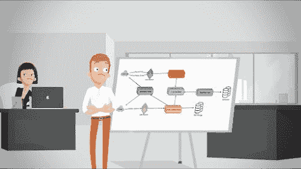
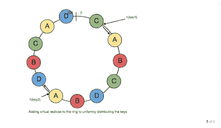
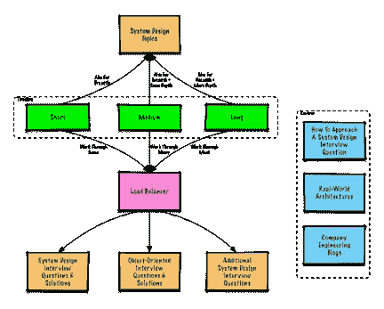

# 探索教育系统设计课程的回顾——值得吗？

> 原文：<https://medium.com/javarevisited/review-of-grokking-the-system-design-course-on-educative-is-it-worth-it-b24af8fb326d?source=collection_archive---------0----------------------->

## 对于所有基本的系统设计概念、图表、案例研究和常见系统设计问题的详细解决方案，钻研系统设计课程绝对是值得的。

图像——探索系统设计面试教学

你好，伙计们，如果你在为技术面试寻找系统设计入门，那么**搜索设计大师的教育性系统设计面试课程**是一个很好的资源。

当我第一次开始准备系统设计面试时，没有太多可用的资源，我在 Udemy 中搜索系统设计课程，只找到了过时的，半生不熟的课程，YouTube 有一些视频，但没有资源可以提供面试所需的良好结构的准备。

当时我偶然看到了设计大师讲授的系统设计面试课程*，并立刻爱上了它。该课程结构良好，内容详细，并深入分析讨论了流行的系统设计问题，他们对图表的使用令人惊叹。Educative 的互动学习平台是蛋糕上的另一颗樱桃。*

*此后情况发生了很大变化，现在有许多专门的系统设计平台和网站，如 [**ByteByteGo**](https://bytebytego.com?fpr=javarevisited) ， [**Exponent**](https://www.tryexponent.com/courses/system-design-interview?ref=javinpaul2) ，它们甚至为 FAANG 公司提供模拟面试，甚至 Udemy 也有令人惊叹的系统设计课程，如 Frank Kane(前亚马逊招聘经理)的 [**【掌握系统设计面试**](https://click.linksynergy.com/deeplink?id=JVFxdTr9V80&mid=39197&murl=https%3A%2F%2Fwww.udemy.com%2Fcourse%2Fsystem-design-interview-prep%2F) ，甚至 Educative 获得了两个[系统设计面试](https://www.educative.io/courses/grokking-adv-system-design-intvw?affiliate_id=5073518643380224)的续集，但它仍然是其中之一*

**

*如果你正在考虑加入这个课程，但还不确定，那么请继续阅读，我已经分享了我的想法，并回顾了这个课程的优点，它提供了什么，它收取的价格和它需要的时间。*

*今天我们要复习一门以系统设计为主的课程！系统设计对编码面试至关重要！这也是最难掌握的话题之一。*

*我已经分享了 [**最佳系统设计课程编码面试**](/javarevisited/10-best-system-design-courses-for-coding-interviews-949fd029ce65)[系统设计书籍](https://javarevisited.blogspot.com/2022/06/best-system-design-and-analysis-books.html)，以及 [25 个软件设计问题](/javarevisited/25-software-design-interview-questions-to-crack-any-programming-and-technical-interviews-4b8237942db0)今天，我将回顾一个顶级系统设计课程的技术讨论，搜寻设计大师 Educative.io 的系统设计面试*

*那还等什么？开始吧！*

## *1.基于文本的系统设计课程*

*如果你最近参加了一家大型科技企业的面试，那么你几乎肯定上过 Educative.io 上最受欢迎的课程——“探索系统设计面试 ”*

* [## 探索系统设计面试——互动学习

### 这个由设计大师们开设的课程已经帮助了 6 万多名用户破解了他们的系统设计面试(SDI)。系统设计…

www.educative.io](https://www.educative.io/collection/5668639101419520/5649050225344512?affiliate_id=5073518643380224) 

这种基于文本的交互式系统设计课程是市场上最好的课程之一。成千上万的人通过本课程学习了*基本系统设计概念*方法，并了解了 [*常见系统设计问题*](/javarevisited/top-30-system-design-interview-questions-and-problems-for-programmers-417e89eadd67) 的解决方案。

实际上，这门课程对于普及 Educative.io 至关重要，这门课程的收入占该公司早期收入的一半以上。

这个课程的成功鼓励了一个续集，Educative 现在也有一个叫做 [**钻研高级系统设计**](https://www.educative.io/courses/grokking-adv-system-design-intvw?affiliate_id=5073518643380224) 的课程，它只是将系统设计面试准备提升到了一个新的层次。

## 2.研究系统设计包括什么，有多好？

这是市场上[最好的系统设计课程](https://javarevisited.blogspot.com/2022/03/eview-is-grokking-system-design-worth-it.html)之一。这是一门基于文本的交互式课程。它提供了一个逐步掌握系统设计面试的方法。

他们精心挑选了一些顶级组织经常问的问题，他们还提供了应对任何系统设计挑战的丰富经验。

对于每个设计挑战，本课程也遵循一个预先确定的框架，其中包括考虑全局、[安全性](/javarevisited/7-best-cyber-security-courses-for-programmers-and-developers-50afafae050b)、 [API 设计](/javarevisited/6-best-rest-api-tools-for-testing-design-and-development-1c5f69ed1f22)、数据库架构、预期需求、容量估计，然后深入研究每种情况下的细节。这种模式可能贯穿整个课程，因为它适用于每个问题。

在 FAANG engineering interviews 这样的大科技公司，系统设计轮次是常事。当脸书的股票开始上涨，硅谷的每个人都想去那里工作时，没有资源可以为设计做准备。

当时的面试圣经是前谷歌员工盖尔·麦克道尔的 [**破解编码面试**](http://www.amazon.com/dp/098478280X/?tag=javamysqlanta-20) 书，但它没有涵盖任何软件设计主题。Grokking 系统设计面试课程立刻填补了这一需求。

你可能会问的问题是，这个课程是否值得你花时间和金钱去学。答案是值得商榷。如果你是一名软件工程师，没有处理过大规模分布式系统，或者不熟悉扩展软件，那么这门课程很有可能让你在下一份工作中获得加薪。

以下是加入本课程的链接— [**钻研系统设计面试**](https://www.educative.io/collection/5668639101419520/5649050225344512?affiliate_id=5073518643380224)

尽管我们大多数人都在做软件开发，但对于我们大多数人来说，拿起一本关于 Cassandra 如何使用一致散列或 HDFS 如何在网络分区的情况下实现 Namenodes 的高可用性的书是不合适的。当然，我们理解毕达哥拉斯定理，但是当涉及到 CAP 定理时，我们就困惑了。

如果最后两个陈述中的技术术语对你来说是陌生的，并且你在不到一个月的时间里安排了一次面试，你应该马上报名参加这个课程。它将立即让您熟悉开发大规模分布式系统的原则。

## 3.您将在本课程中学到的系统设计主题和概念

以下是您将在本课程中学到的[基本系统设计主题和概念](https://javarevisited.blogspot.com/2022/03/how-to-prepare-for-system-design.html)的列表:

*   分布式系统的重要特征
*   负载平衡
*   贮藏
*   数据划分
*   [指标](https://javarevisited.blogspot.com/2022/12/12-database-sql-index-interview.html)
*   委托书
*   冗余和复制
*   SQL 与 NoSQL
*   CAP 定理
*   帕塞尔定理
*   一致散列法
*   长轮询 vs WebSockets vs .服务器发送事件
*   布隆过滤器
*   法定人数
*   领导者和追随者
*   心跳
*   校验和

您可以看到，在设计现实世界的系统时，本课程涵盖了一些最基本的主题。这个主题列表对我来说足够有价值，我可以参加这个课程，而且看起来他们现在已经在这个 [**高级系统设计面试课程**](https://www.educative.io/courses/grokking-adv-system-design-intvw?affiliate_id=5073518643380224) 中增加了更多的内容，扩展了你在这个课程中将要学习的概念。

## 4.常见系统设计问题的解决方案

我参加这个课程的另一个原因是我在寻找常见的[系统设计问题](/javarevisited/25-software-design-interview-questions-to-crack-any-programming-and-technical-interviews-4b8237942db0)的解决方案，比如如何设计一个[交易位置聚合器](https://javarevisited.blogspot.com/2022/03/how-to-design-trade-position-calculator.html) r，或者 Twitter，脸书，或者亚马逊，或者[设计一个自动售货机](https://javarevisited.blogspot.com/2016/06/design-vending-machine-in-java.html)。

更重要的是，我在寻找解决此类问题的指导，本课程提供了解决[系统设计问题](https://www.java67.com/2018/05/top-20-system-design-interview-questions-answers-programming.html)的逐步方法。

以下是本课程涉及的常见软件设计问题列表:

*   设计一个 URL 缩短服务，如 TinyURL，bit.ly 等
*   设计 Pastebin(一个在线编码 IDE)
*   设计 Instagram(照片分享应用和社交网络)
*   设计 Dropbox
*   设计 Facebook Messenger
*   设计 Twitter
*   设计 Youtube 或网飞
*   设计提前输入建议
*   设计 API 速率限制器
*   设计 Twitter 搜索
*   设计网络爬虫
*   设计脸书的新闻源
*   设计 Yelp 或附近的朋友
*   设计优步后端
*   设计 Ticketmaster

你可以看到这些问题大部分是你在 FAANG 公司面试中会预料到的。事实上，他们中的许多人来自谷歌、网飞、优步和亚马逊的采访。通过解决这些问题，你将会学到很多有用的概念，这些概念将会使你作为一名软件开发人员和软件架构师受益终生。

*

## *是什么让苦苦寻找系统设计面试变得值得？*

*如果你仍然不确定这门课，你最初的想法会是，“为什么我不能谷歌所有的信息？”你当然可以；这门课既不合适也不新颖。*

*本课程的**实际价值是收集了最常被问到的系统设计面试问题，以及回答这些问题时的思维过程***

*这里有一些关于这个课程的优点和缺点，你们在继续之前必须知道。*

***优点:***

*   *它包含了大量流行的设计。*
*   *基础、中级和高级主题都有详细的解释。*
*   *有 100 多张图片和问题一起出现。*

***缺点:***

*   *当然，设计挑战是随机分组的，没有采用特殊的排名过程。*
*   *价格不是每个人都能承受的。(最近，印度学生正在享受优惠，请务必查看)。*

*以下是加入本课程的链接— [**钻研系统设计面试**](https://www.educative.io/collection/5668639101419520/5649050225344512?affiliate_id=5073518643380224)*

**

## *5.我喜欢这个系统设计课程的原因*

*这门课程最大的好处之一是，来自 FAANG 和其他顶级跨国公司的导师为这门课程授课。导师根据他们自己的个人经历来教育你和给你建议。*

*他们利用自己在公司的**现实生活经历**作为参考，优先考虑让你熟悉的问题类型。*

*导师通过提供安置支持，在面试过程的各个方面为你提供帮助。这可以确保学生得到明确的指示和工作申请流程的计划。一对一模拟面试、档案优化和档案发展都是这种安置帮助的例子。*

*还有灵活的 Pass 选项，如果你是一名希望边工作边学习的在职专业人士，这很有帮助。它通过让你访问不同批次的课程以及 LMS 门户网站来做到这一点，在那里你可以在闲暇时观看录制的讲座。*

*所有的课程都是实时互动课程，你可以与导师实时交流，还有一对一的解疑课程，以消除任何剩余的疑问。*

*如果您无法继续上课，只要您在课程开始日期的前两周内通知我们，您将有资格获得全额退款。*

*当您访问该网站时，专家会查看您的个人资料，然后为您联系导师，导师会带您学习最符合您需求的课程。*

# *苦苦寻找系统设计面试值得吗？*

*因此，如果你想做的只是准备技术面试中会被问到的那种系统设计问题，特别是关于 FANNG 公司的问题，那么 [*钻研系统设计面试课程*](https://javarevisited.blogspot.com/2022/03/eview-is-grokking-system-design-worth-it.html) 是值得的。*

*对于不熟悉系统设计和软件设计概念(如 SQL vs NoSQL、[可伸缩性](/javarevisited/difference-between-horizontal-scalability-vs-vertical-scalability-67455efc91c)、弹性、容错、主动-主动和主动-被动架构)的人来说，这也是值得加入的。*

*比如想成为软件架构师的 Java 开发者，可以加入这个课程，提高自己的软件设计和系统设计知识。*

*但是，请记住，其中一些主题已经过时，可能不再相关。*

*如果你不仅想要就业帮助，还想要一系列额外的好处，我还推荐你参加 [**高级问题解决与系统设计课程**](https://www.educative.io/courses/grokking-adv-system-design-intvw?affiliate_id=5073518643380224) ，以及本课程。我希望你们现在已经准备好决定做什么和如何进行。*

**

## *如何加入系统设计课程？*

*顺便说一下，参加这个课程，你有两个选择，你可以直接购买这个课程，或者你可以参加 [**教育订阅**](https://www.educative.io/subscription?affiliate_id=5073518643380224) ，提供对他们的年度和半年计划的所有 350+课程的访问，每月只需 14.9 美元。*

**

*他们还提供了一个 7 天的免费体验，这是你可以免费探索教育平台的另一种方式。*

* [## 教育免费试用:加速你的职业生涯

### 提升你的编码技能。不再被动学习。交互式浏览器环境让您参与并测试…

www.educative.io](https://www.educative.io/trial?affiliate_id=5073518643380224) 

这些都在这个**从教育性**开始的系统设计课程的复习中。这无疑是为系统设计面试做准备的最佳在线课程之一。我认为，钻研系统设计课程是完全值得的。

对于系统设计和所有基本的系统设计概念、图表、案例研究以及本课程中以结构化方式给出的常见系统设计问题的详细解决方案来说，这是最具交互性、综合性和最新的课程之一。

这是为系统设计面试做好准备的最佳资源之一，如果你对你的技术面试很认真，你必须在太晚之前看到它。

希望你们现在已经清楚接下来要做什么，以及你们是否需要这门课程。所以，快乐设计，直到下一篇文章，继续学习。

您可能喜欢探索的其他**文章**

*   [如何准备 2023 年系统设计面试](/javarevisited/how-to-crack-system-design-interviews-in-2022-tips-questions-and-resources-fcad05e2dab)
*   [程序员的 10 门最佳教育性 io 课程](https://javarevisited.blogspot.com/2020/05/top-10-educative-courses-for-programmers.html)
*   [准备编码面试的 10 个基本主题](/javarevisited/10-essential-topics-and-resources-for-coding-and-programm-job-interviews-4017cac3a522)
*   [我最喜欢的学习软件架构的课程](/javarevisited/top-5-courses-to-learn-software-architecture-in-2020-best-of-lot-5d34ebc52e9)
*   [成为解决方案架构师的前 5 本书](https://javarevisited.blogspot.com/2018/02/5-must-read-books-to-become-software-architect-solution.html)
*   [2023 年学习 Python 的 5 大课程](/better-programming/top-5-courses-to-learn-python-in-2018-best-of-lot-26644a99e7ec)
*   [Udemy vs . CodeCademy vs . one month](https://javarevisited.blogspot.com/2019/09/codecademy-vs-udemy-vs-onemonth-which-is-better-for-learning-code.html)
*   [2023 年的 10 种编程语言](http://www.java67.com/2017/12/10-programming-languages-to-learn-in.html)
*   为初学者学习编程提供 10 门免费教育课程
*   [2023 年 Java 开发者应该学习的 5 个框架](http://javarevisited.blogspot.sg/2018/04/top-5-java-frameworks-to-learn-in-2018_27.html)
*   [学习动态编程的 6 门最佳课程](/javarevisited/6-best-dynamic-programming-courses-for-coding-interviews-14744060923c)
*   【Java 开发人员在日常工作中使用的 10 个工具
*   【Java 开发者应该知道的 10 个测试工具
*   [学习 Java 大数据和 Apache Spark 的 5 门课程](http://javarevisited.blogspot.sg/2017/12/top-5-courses-to-learn-big-data-and.html)
*   [成为更好的 Java 程序员的 10 个技巧](https://javarevisited.blogspot.com/2018/05/10-tips-to-become-better-java-developer.html)

感谢您阅读本文。如果你喜欢系统设计面试课程的*评论，那么请分享给你的朋友和同事，他们会很欣赏的。如果您有任何问题或反馈，请留言。*

**P. S.** —如果你想深入学习系统设计，那么你也可以看看这个 [**最佳系统设计课程的列表**](/javarevisited/10-best-system-design-courses-for-coding-interviews-949fd029ce65) 来建立你的基础，填补你理解中的空白。学习系统设计还可以提高您的编码意识和编码技能，将现实世界的需求转化为代码。

 [## 十佳系统设计、软件设计和面向对象程序设计课程

### 你好伙计们，如果你正在准备系统设计面试和寻找最佳资源，那么你已经来到了…

javarevisited.blogspot.com](https://javarevisited.blogspot.com/2022/07/best-system-design-and-object-oriented.html)*