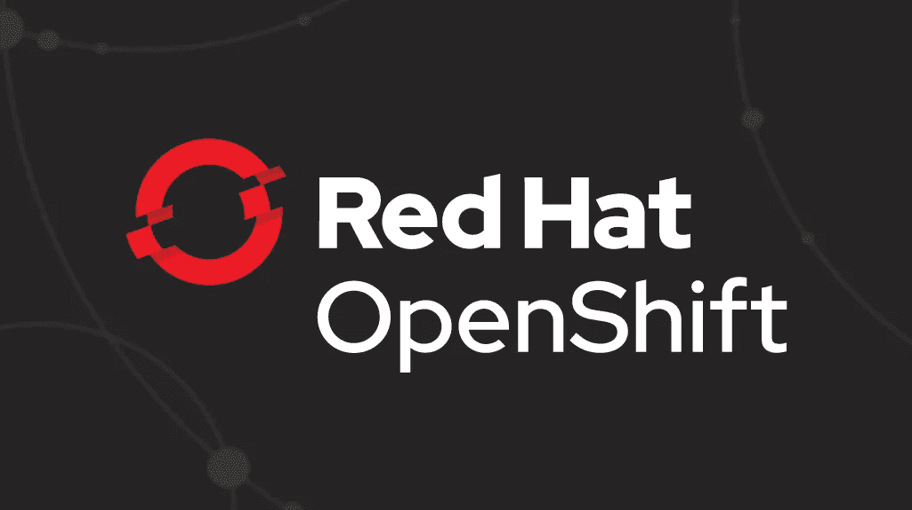
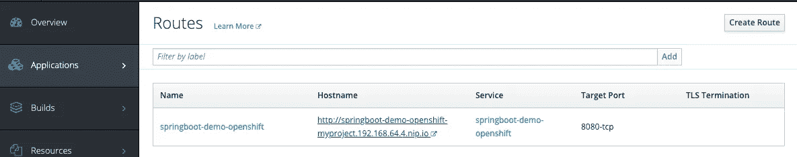
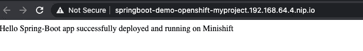

# 在 OpenShift 上运行简单的 Spring Boot 应用程序

> 原文：<https://medium.com/javarevisited/running-simple-springboot-app-on-minishift-84f51894bdf6?source=collection_archive---------1----------------------->

在本文中，我将尝试演示如何在 OpenShift ( **Minishift** )上部署一个简单的 Spring Boot 应用程序。

但是等等 OpenShift 到底是什么鬼？。

> *OpenShift 是 RedHat 的云开发平台即服务(PaaS)。它建立在 Docker 容器和 Kubernetes 容器集群 orchestrator 之上。*

**什么是 Paas** ？。

> **平台即服务** ( **PaaS** )或**应用程序平台即服务** ( **aPaaS** )或基于平台的服务是[云计算服务](https://en.wikipedia.org/wiki/Cloud_computing#Service_models)的一个类别，它提供一个[平台](https://en.wikipedia.org/wiki/Computing_platform)，允许客户开发、运行和管理应用程序，而无需构建和维护通常与开发和启动应用程序相关的基础设施。

**那么什么是 Minishift**？。

> Minishift 是一个工具，它通过在虚拟机内运行单节点 OpenShift 集群来帮助您在本地运行 OpenShift。您可以在您的本地主机上每天试用 OpenShift 或使用它进行开发。

那我们开始吧。我将在我的 mac 上安装它，但是有很多博客/资源解释如何在其他流行的操作系统上安装它，比如 Windows、 [Linux](/javarevisited/top-10-courses-to-learn-linux-command-line-in-2020-best-and-free-f3ee4a78d0c0?source=collection_home---4------0-----------------------) 等。

你可以通过官方安装说明以及下面提到的。

 [## 概述-入门|迷你班| OKD 最新

### 本节包含有关如何为 Minishift 准备虚拟化环境(虚拟机管理程序)的信息…

docs.okd.io](https://docs.okd.io/latest/minishift/getting-started/index.html) 

**安装**

这些基本上是你在 macOS 上本地运行 Minishift 需要遵循的步骤。

1.  [设置您的虚拟化环境](https://docs.okd.io/latest/minishift/getting-started/setting-up-virtualization-environment.html)
2.  从 [Minishift 版本](https://github.com/minishift/minishift/releases)页面下载适用于您的操作系统的 Minishift 软件
3.  [安装 Minishift](https://docs.okd.io/latest/minishift/getting-started/installing.html)
4.  [开始微移](https://docs.okd.io/latest/minishift/getting-started/quickstart.html#starting-minishift)
5.  [配置 Minishift](https://docs.okd.io/latest/minishift/using/basic-usage.html#runtime-options) 以便高效使用。

如第 4 点所述，您可以使用下面的命令启动 Minishift

> 小班次开始

一旦您运行了上面的命令，Minishift 就会像这样执行一些系统检查。

> >启动配置文件“minishift”
> 
> >检查是否使用了不推荐使用的选项…好
> 
> >检查 https://github.com 是否可达…好的
> 
> >检查请求的 OpenShift 版本' v3.11.0 '是否有效…正常
> 
> >正在检查是否支持请求的 OpenShift 版本' v 3 . 11 . 0'…好的
> 
> >检查此平台是否支持请求的虚拟机管理程序“xhyve”..好
> 
> >检查是否安装了 xhyve 驱动程序…
> 
> 如果一切正常，那么你会在你的终端上看到这样的消息。
> 
> > OpenShift 服务器已启动。
> 
> >可通过 web 控制台访问服务器，网址为:
> 
> > https://192 . 168 . 64 . 3:8443/控制台

**访问网络控制台**

现在您可以开始浏览 Minishift web 控制台了，默认情况下可以使用这个 URL[https://192 . 168 . 64 . 3:8443/console](https://192.168.64.3:8443/console)访问该控制台。因为默认情况下没有启用身份验证/授权，所以您可以在首次登录时创建自己的用户名和密码。

迷你轮班登录页面

**创建项目**

你可以选择创建项目等。通过命令行和 web 控制台。我们将使用命令行选项。作为管理员用户使用以下命令首次登录。

> oc 登录-u 系统:管理员

默认情况下，我们可以使用默认项目，即我的项目进行演示。或者，您也可以创建一个新项目。

**创建应用程序**

现在您需要为您将要创建的应用程序选择一个基础映像。由于这是一个 [spring boot 项目](/javarevisited/10-advanced-spring-boot-courses-for-experienced-java-developers-5e57606816bd?source=collection_home---4------0-----------------------)，我们将为我们的应用程序使用一个开放的 jdk8 基础映像。使用下面的命令行命令创建一个带有 openjdk8 基础映像的应用程序。

> oc new-app registry . access . red hat . com/red hat-open JDK-18/open JDK 18-open shift ~ https://github . com/userac/spring boot-kubernetes . git—name = spring boot-demo-open shift

**上述命令的输出**

> →找到 registry.access.redhat.com“registry . access . red hat . com/red hat-open JDK-18/open JDK 18-open shift”的 Docker 图像 6c975f1 (2 周大)
> 
> Java 应用程序
> 
> — — — — — — — — -
> 
> 构建和运行普通 Java 应用程序的平台(fat-jar 和平面类路径)
> 
> 标签:构建器，java
> 
> *图像流标签将被创建为“openjdk18-openshift:latest ”,它将跟踪源图像
> 
> *将使用来自[https://github.com/userac/springboot-kubernetes.git](https://github.com/userac/springboot-kubernetes.git)的源代码创建一个源代码版本
> 
> *生成的图像将被推送到图像流标签“spring boot-demo-open shift:latest”
> 
> *每次“openjdk18-openshift:latest”更改时，都会触发一个新版本
> 
> *该映像将部署在部署配置“springboot-demo-openshift”中
> 
> *端口 8080/tcp、8443/tcp、8778/tcp 将通过服务“springboot-demo-openshift”实现负载平衡
> 
> *其他容器可以通过主机名“springboot-demo-openshift”访问该服务
> 
> →创建资源…
> 
> imagestream . image . open shift . io " open JDK 18-open shift "已创建
> 
> imagestream . image . open shift . io“spring boot-demo-open shift”已创建
> 
> build config . build . open shift . io " spring boot-demo-open shift "已创建
> 
> deployment config . apps . open shift . io " spring boot-demo-open shift "已创建
> 
> 服务“springboot-demo-openshift”已创建

**建造状态**

创建应用程序后，将使用 S2I 自动安排构建。您可以使用下面的命令查看日志，以检查构建的状态。

> oc 日志-f bc/springboot-demo-openshift

**上述命令的输出**

> 正在克隆“https://github . com/userac/spring boot-kubernetes . git”…
> 
> 提交:BD f1 e 3a 36 a 7 c 16 b 69567 de 1b 5343 ff 9 c 51114536(更改消息)
> 
> 作者:ashishchoudhary
> 
> 日期:2020 年 3 月 22 日星期日 00:22:23+0530
> 
> 使用 registry . access . red hat . com/red hat-open JDK-18/open JDK 18-open shift @ sha 256:fa 5f 725 ba 5d 0 ed 29 f 680 a 21d 49 e 87d 88 ef 0 bad 3 db 83158496 EDA 33533 CCA 10 f 8 作为 s2i 构建器映像
> 
> 在/tmp/src 中执行 Maven 构建的信息
> 
> 使用 MAVEN_OPTS -XX 的信息:+UseParallelOldGC-XX:minheafpreeratio = 10-XX:MaxHeapFreeRatio = 20-XX:GCTimeRatio = 4-XX:AdaptiveSizePolicyWeight = 90-XX:MaxMetaspaceSize = 100m-XX:+exitonoutofmemory error
> 
> 使用 Apache Maven 3 . 6 . 1(Red Hat 3 . 6 . 1–6.3)的信息
> 
> maven home:/opt/RH/RH-maven 36/root/usr/share/maven
> 
> Java 版本:1.8.0_272，供应商:Red Hat，Inc .，运行时:/usr/lib/JVM/Java-1 . 8 . 0-open JDK-1 . 8 . 0 . 272 . b10–1 . el7 _ 9 . x86 _ 64/JRE
> 
> 默认区域设置:en_US，平台编码:ANSI _ x 3.4–1968
> 
> 操作系统名称:“linux”，版本:“3 . 10 . 0–1127 . 19 . 1 . el7 . x86 _ 64”，arch:“amd64”，family:“UNIX”
> 
> 信息运行' mvn-e-popen shift-DskipTests-DCOM . red hat . xpaas . repo . red hatga-d fabric 8 . skip = true-batch-mode-DJ ava . net . preferipv 4 stack = true-s/tmp/artifacts/configuration/settings . XML-dmaven . repo . local =/tmp/artifacts/m2 package '
> 
> [信息]错误堆栈跟踪已打开。
> 
> [信息]扫描项目…
> 
> 【信息】从中心下载:[https://repo 1 . maven . org/maven 2/org/spring framework/boot/spring-boot-starter-parent/2 . 2 . 4 . release/spring-boot-starter-parent-2 . 2 . 4 . release . POM](https://repo1.maven.org/maven2/org/springframework/boot/spring-boot-starter-parent/2.2.4.RELEASE/spring-boot-starter-parent-2.2.4.RELEASE.pom)
> 
> 【信息】从中央下载:[https://repo 1 . maven . org/maven 2/org/spring framework/boot/spring-boot-starter-parent/2 . 2 . 4 . release/spring-boot-starter-parent-2 . 2 . 4 . release . POM](https://repo1.maven.org/maven2/org/springframework/boot/spring-boot-starter-parent/2.2.4.RELEASE/spring-boot-starter-parent-2.2.4.RELEASE.pom)(1.7 kB/s 时 8.1 kB)……。
> 
> 信息]构建成功
> 
> [信息] — — — — — — —
> 
> [信息]总时间:02 分 44 秒
> 
> [信息]完成时间:2020–11–11t 05:07:46Z
> 
> [信息] — — — — — — —
> 
> [警告]无法激活请求的配置文件“openshift ”,因为它不存在。
> 
> 将部署从目标复制到/deployments 的信息…
> 
> /tmp/src/target/spring boot-kubernetes-0 . 0 . 1-snapshot . jar '--> '/deployments/spring boot-kubernetes-0 . 0 . 1-snapshot . jar '
> 
> 推送图片 172 . 30 . 1 . 1:5000/my project/spring boot-demo-open shift:最新…
> 
> 推进 0/4 层，完成 1%
> 
> 推进 1/4 层，完成 29%
> 
> 推进 2/4 层，完成 70%
> 
> 推进 3/4 层，完成 95%
> 
> 推动 4/4 层，100%完成
> 
> 推送成功

一旦构建被触发，您可以看到 S2I 正在按预期完成它的工作，首先克隆存储库，然后进行构建。稍后，在构建成功后(如上所示),映像将推动进一步的执行。您已经在 [git 库](/javarevisited/7-best-courses-to-master-git-and-github-for-programmers-d671859a68b2)中从源代码构建并运行了一个新的可运行容器映像，不需要 docker 文件。

现在让我们了解一下 S2I 实际上是什么？

**S2I**

Openshift 的源到图像(S2I)是一个工具包和工作流程，用于从源代码构建可复制的容器图像。S2I 通过将源代码注入到容器映像中，并让容器准备好源代码以供执行，从而生成现成的映像。通过创建自组装构建器映像，您可以像使用容器映像版本化您的运行时环境一样版本化和控制您的构建环境。

**状态**

运行“oc 状态”以查看你的应用的状态。

> oc 状态

**上述命令的输出**

> 在项目服务器[上的我的项目(My Project)https://192 . 168 . 64 . 4:8443](https://192.168.64.4:8443)
> 
> SVC/spring boot-demo-open shift-172 . 30 . 105 . 115 端口 8080、8443、8778
> 
> dc/springboot-demo-openshift 部署 istag/spring boot-demo-open shift:最新
> 
> bc/springboot-demo-openshift source builds [https://github.com/userac/springboot-kubernetes.git](https://github.com/userac/springboot-kubernetes.git)在 istag/openjdk18-openshift:最新
> 
> 20 分钟前部署的 1 号部署— 1 个单元

如您所见，有一个 pod 正在运行。您也可以在 web 控制台上查看相同的状态。您会看到如下所示的内容。如果您仔细观察，就会发现我们还没有向外界公开应用程序，因为我们还没有创建路由。让我们现在就这样做，看看我们是否可以访问应用程序。

**路线**

如上所述，我们的应用程序不向外界公开，我们可以通过执行下面的一个或多个命令来公开我们的服务:

> oc 暴露 svc/springboot-demo-openshift

**上述命令的输出**

> route.route.openshift.io/springboot-demo-openshift 暴露了

同样，如果您转到 web 控制台应用程序>路线。您可以看到路由已创建。现在我们的应用程序向外界公开了。酷毙了。

路线已创建

让我们点击 URL 并访问我们的 [spring boot](/javarevisited/top-10-courses-to-learn-spring-boot-in-2020-best-of-lot-6ffce88a1b6e?source=---------39------------------) 演示应用程序。

我们已经在本地成功地将我们的第一个 Spring boot 演示应用程序部署到了 [Openshift](https://javarevisited.blogspot.com/2020/07/top-5-courses-to-learn-redhat-openshift.html) 上。

在下一篇文章中，我们将讨论如果我们对 Github 库做了任何更改，如何触发构建。

 [## Openshift Github 集成

### 在本文中，我将介绍在将更改推送到 Github 存储库之后，如何使用 Minishift 触发构建。

ashish-choudhary.medium.com](https://ashish-choudhary.medium.com/openshift-webhook-github-1e2df303167b) 

**支持我**

如果你喜欢你刚刚读到的，你可以给我买杯咖啡。

**延伸阅读**

也可以看看我之前的一篇文章。

 [## 连接简单的 Java 客户端和 Apache Geode Docker 容器

### 在上一篇文章中，我们启动了一个简单的 apache geode docker 实例。然而，为了简单起见，我们没有开始任何…

ashish-choudhary.medium.com](https://ashish-choudhary.medium.com/connecting-simple-java-client-with-apache-geode-docker-container-fca32a4c9946)