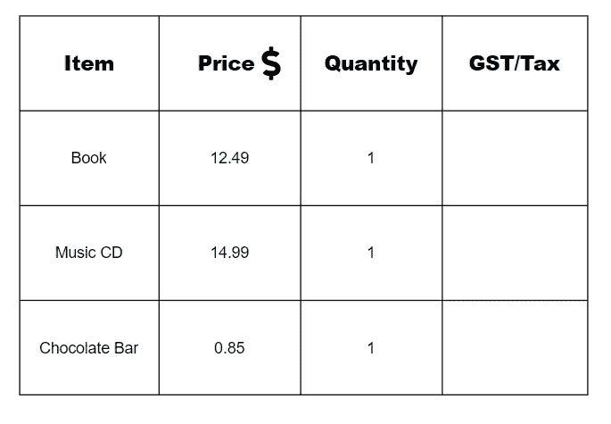
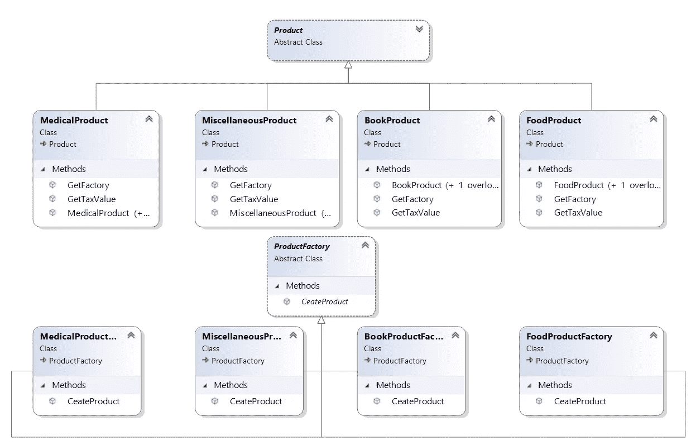
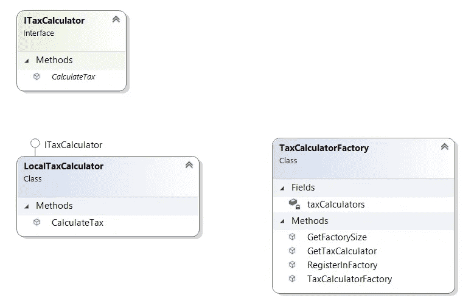
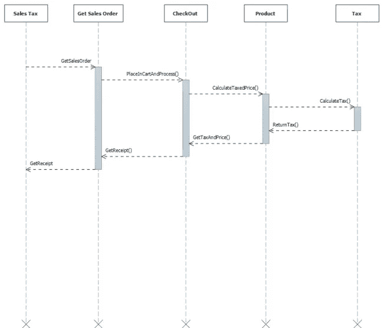
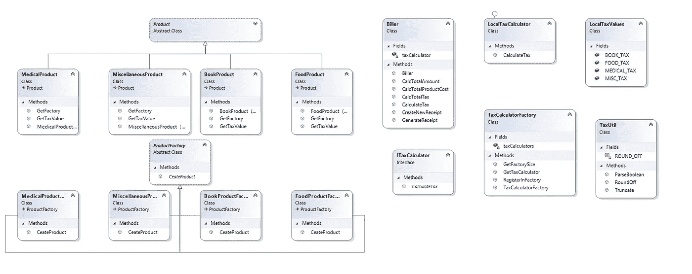

# 销售税或 GST 问题

> 原文：<https://medium.com/javarevisited/sales-tax-or-gst-problem-2ad9d245edb1?source=collection_archive---------0----------------------->


# 介绍

基本销售税或 GST 适用于所有商品，税率为 10%,不包括免税的书籍、食品和医疗产品。进口税是适用于所有进口商品的附加销售税或 GST，税率为 5%,没有免税。

当我购买物品时，我会收到一张收据，上面列有所有物品的名称及其价格(含税)，最后是物品的总成本以及支付的销售税或商品及服务税的总额。销售税的取整规则是，对于税率 **n%** ，货架价格 **p** 包含( **np/100 取整到最近的 0.05** )的销售税金额。

[](https://javarevisited.blogspot.com/2018/02/composite-design-pattern-in-java-real.html)

图 1:项目

假设用户购买了一些产品，如苹果、书籍或冰箱。因此，这里的设计不应该以这样一种方式来完成，即 cooler 或 apple 会告诉用户要支付多少税。政府政策负责告诉用户他或她将为这些项目支付的税收百分比。一个对象应该对它所关心的事情负责，而不是对其他任何人负责。冷气机关心的是吹冷气，而不是收税。如果税法或税率改变，用户不改变冷却器机器，用户需要改变策略对象。

# 从问题陈述中识别名词

在应用程序设计之前，确定问题陈述中使用的所有名词以及它们之间的关系是一项重要的任务。以下是几个确定的要点:

1.  销售税或 GST 是一种税。
2.  进口税也是一种税。
3.  销售税或 GST 的税率是小数
4.  书是一种物品。
5.  食物是一种物品
6.  药品是一种物品。
7.  可以导入项目
8.  销售税或商品及服务税将有一些政策，将确定销售税或商品及服务税是否适用于给定的项目。
9.  一个项目有一个小数形式的销售价格。
10.  包含物品清单、价格和税金的收据。
11.  总价。
12.  总税收。

# 所有名词之间的关系

所有名词之间的关系可以分为两类:

*   Item →它将是一个抽象类，产品将从它继承。
*   SalesTax →它将是一个抽象类，BasicSalesTax 类将从它继承。

项目/产品之间的关系:

[](https://javarevisited.blogspot.com/2021/07/state-design-pattern-example-java-vending-machine.html#axzz7CANam4JD)

图 2:项目或产品的类图中的关系

增值税之间的关系:

[](https://javarevisited.blogspot.com/2022/03/how-to-design-trade-position-calculator.html)

图 3:销售税类图中的关系

# 实施方法

对于这类问题，可以应用两种不同类型的设计模式。下面是两种不同的模式:

*   [抽象工厂](http://javarevisited.blogspot.sg/2013/01/difference-between-factory-and-abstract-factory-design-pattern-java.html)
*   [策略](https://javarevisited.blogspot.com/2014/11/strategy-design-pattern-in-java-using-Enum-Example.html#axzz6RfpBqjsf)

## 抽象工厂模式

该产品是一个抽象的超类和不同种类的项目/产品，如书籍冷却器，药品，食品等。将从 Product 类继承。这将为将来扩展新产品类型提供便利。

这里，将每个产品类型的类分开的主要原因是，将来可以通过扩展产品类来添加其他属性。

下面是可以实现的类:

1.  抽象工厂→产品工厂
2.  混凝土工厂→书籍生产工厂、食品生产工厂、药品生产工厂
3.  抽象产品→产品
4.  具体产品→书籍产品、食品产品、药品产品
5.  客户→货架

优势:

1.  如果要添加新产品，就不需要修改现有的客户端代码。

## 战略模式

计税将使用[策略模式](https://javarevisited.blogspot.com/2014/04/difference-between-state-and-strategy-design-pattern-java.html)进行设计。

以下是将涉及的课程:

1.  策略→ ITaxCalculator
2.  具体策略→ LocalTaxCalculator，或任何税收策略，如进口税、关税等。
3.  上下文→开票人

优势:

1.  我们可以轻松地在特性中添加一个新的计税算法，并且可以在运行时选择。每种产品都有不同的税率和规则。所以，策略对每个类别都是有用的。
2.  TaxCalculator 的实际创建将委托给工厂方法。

销售税/商品及服务税问题序列图:

[](https://javarevisited.blogspot.com/2017/07/top-5-books-to-learn-uml-unified-modelling-language-java.html)

图 4:销售税或 GST 问题的序列图

类图:

[](https://www.java67.com/2021/11/top-5-courses-to-learn-uml-for-software.html)

图 5:销售税或 GST 问题的类图

# 履行

以下是抽象工厂模式的实现:

产品类别:

```
using SalesTax.ProductFactories;
using System;
using System.Collections.Generic;
using System.Linq;
using System.Text;
using System.Threading.Tasks;namespace SalesTax.Products
{
    public abstract class Product
    {
        protected string Name { get; set; }private double _price;
        public double Price
        {
            set { _price = value; }
            get { return _price * Quantity; }
        }public bool Imported { get; set; }public int Quantity { get; set; }public double TaxedCost { get; set; }public Product()
        {
            this.Name = string.Empty;
            this.Price = 0.0;
            this.Imported = false;
            this.Quantity = 0;
            this.TaxedCost = 0.0;
        }public Product(String name, double price, bool imported, int quantity)
        {
            this.Name = name;
            this.Price = price;
            this.Imported = imported;
            this.Quantity = quantity;
        }public override string ToString()
        {
            return (Quantity + " " + ImportedToString(Imported) + " " + Name + " : " + TaxedCost);
        }public String ImportedToString(bool imported)
        {
            if (!imported)
                return string.Empty;
            else
                return "imported";
        }public abstract ProductFactory GetFactory();public abstract double GetTaxValue(String country);
    }
}
```

图书产品类别:

```
using SalesTax.ProductFactories;
using SalesTax.TaxCalculations;
using System;
using System.Collections.Generic;
using System.Linq;
using System.Text;
using System.Threading.Tasks;namespace SalesTax.Products
{
    public class BookProduct : Product
    {public BookProduct()
            : base()
        {
        }public BookProduct(String name, double price, bool imported, int quantity)
            : base(name, price, imported, quantity)
        {}public override ProductFactory GetFactory()
        {
            return new BookProductFactory();
        }public override double GetTaxValue(string country)
        {
            if (country == "Local")
                return LocalTaxValues.BOOK_TAX;
            else
                return 0;
        }
    }
}
```

ProductFactory 类:

```
using SalesTax.Products;
using System;
using System.Collections.Generic;
using System.Linq;
using System.Text;
using System.Threading.Tasks;namespace SalesTax.ProductFactories
{
    public abstract class ProductFactory
    {
        public abstract Product CeateProduct(String name, double price, bool imported, int quantity);
    }
}
```

BookProductFactory 类:

```
using System;
using System.Collections.Generic;
using System.Linq;
using System.Text;
using System.Threading.Tasks;namespace SalesTax.ProductFactories
{
    public class BookProductFactory : ProductFactory
    {
        public override Products.Product CeateProduct(string name, double price, bool imported, int quantity)
        {
            return new Products.BookProduct(name, price, imported, quantity);
        }
    }
}
```

以下是使用策略模式的实现:

ITaxCalculator 接口:

```
using System;
using System.Collections.Generic;
using System.Linq;
using System.Text;
using System.Threading.Tasks;namespace SalesTax.TaxCalculations
{
    /// <summary>
    /// It Computes Total Tax Cost of a Product.
    /// </summary>
    public interface ITaxCalculator
    {/// <summary>
        /// Calculates Tax for a Product where Tax Cost is the Sum of Sales 
        /// Tax and Imported Duty of a Product.
        /// </summary>
        /// <param name="price">The Price of the Product.</param>
        /// <param name="tax">The Tax Rate of the Product.</param>
        /// <param name="imported">Product is whether Imported or not.</param>
        /// <returns></returns>
        double CalculateTax(double price, double tax, bool imported);
    }
}
```

LocalTaxCalculator 类:

```
using SalesTax.utils;
using System;
using System.Collections.Generic;
using System.Linq;
using System.Text;
using System.Threading.Tasks;namespace SalesTax.TaxCalculations
{
    /// <summary>
    /// It Calculates Total Tax Cost According to Local Region Specification.
    /// </summary>
    public class LocalTaxCalculator : ITaxCalculator
    {
        public double CalculateTax(double price, double localTax, bool imported)
        {
            double tax = price * localTax;if (imported)
                tax += (price * 0.5);//rounds off to nearest 0.05;
            tax = TaxUtil.RoundOff(tax);return tax;
        }
    }
}
```

TaxCalculatorFactory 类:

```
using System;
using System.Collections.Generic;
using System.Linq;
using System.Text;
using System.Threading.Tasks;
using System.Collections;namespace SalesTax.TaxCalculations
{
    public class TaxCalculatorFactory
    {
        private Dictionary<String, ITaxCalculator> taxCalculators;public TaxCalculatorFactory()
        {
            taxCalculators = new Dictionary<String, ITaxCalculator>();
            RegisterInFactory("Local", new LocalTaxCalculator());
        }public void RegisterInFactory(string strategy, ITaxCalculator taxCalc)
        {
            taxCalculators.Add(strategy, taxCalc);
        }public ITaxCalculator GetTaxCalculator(String strategy)
        {
            ITaxCalculator taxCalc = (ITaxCalculator)taxCalculators[strategy];
            return taxCalc;
        }public int GetFactorySize()
        {
            return taxCalculators.Count;
        }
    }
}
```

每种产品的计税策略:

```
using SalesTax.Products;
using SalesTax.TaxCalculations;
using SalesTax.utils;
using System;
using System.Collections.Generic;
using System.Linq;
using System.Text;
using System.Threading.Tasks;namespace SalesTax.Billing
{
    public class Biller
    {
        ITaxCalculator taxCalculator;public Biller(ITaxCalculator taxCalc)
        {
            taxCalculator = taxCalc;
        }public double CalculateTax(double price, double tax, bool imported)
        {double totalProductTax = taxCalculator.CalculateTax(price, tax, imported);
            return totalProductTax;
        }public double CalcTotalProductCost(double price, double tax)
        {
            return TaxUtil.Truncate(price + tax);
        }public double CalcTotalTax(List<Product> prodList)
        {
            double totalTax = 0.0;foreach (Product p in prodList)
            {
                totalTax += (p.TaxedCost - p.Price);
            }return TaxUtil.Truncate(totalTax);
        }public double CalcTotalAmount(List<Product> prodList)
        {
            double totalAmount = 0.0;foreach (Product p in prodList)
            {
                totalAmount += p.TaxedCost;
            }return TaxUtil.Truncate(totalAmount);
        }public Receipt CreateNewReceipt(List<Product> productList, double totalTax, double totalAmount)
        {
            return new Receipt(productList, totalTax, totalAmount);
        }public void GenerateReceipt(Receipt r)
        {
            String receipt = r.ToString();
            Console.WriteLine(receipt);
        }}
}
```

# 结论

这个销售税的实施问题非常大，所以我不能在这里包括它。完整的实现可以在我的 GitHub 资源库中找到→ [**销售税问题**](https://github.com/gmershad/Sales-Tax) **。**

销售税问题熟悉并推动我们思考设计方法。所以，这里使用了抽象工厂和[策略设计模式](https://javarevisited.blogspot.com/2015/07/strategy-design-pattern-and-open-closed-principle-java-example.html) s。思考和应用设计模式是一个非常令人愉快的问题陈述。

**延伸阅读**

[](/javarevisited/10-oop-design-principles-you-can-learn-in-2020-f7370cccdd31) [## 2022 年你能学到的 10 个最佳 OOP 设计原则

### 想要写出更好、更可靠的代码，能够经受住生产中时间的考验吗？这些设计原则会有所帮助。

medium.com](/javarevisited/10-oop-design-principles-you-can-learn-in-2020-f7370cccdd31)