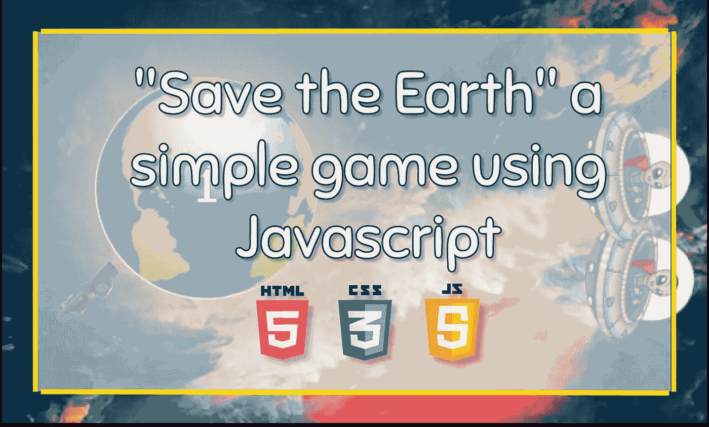
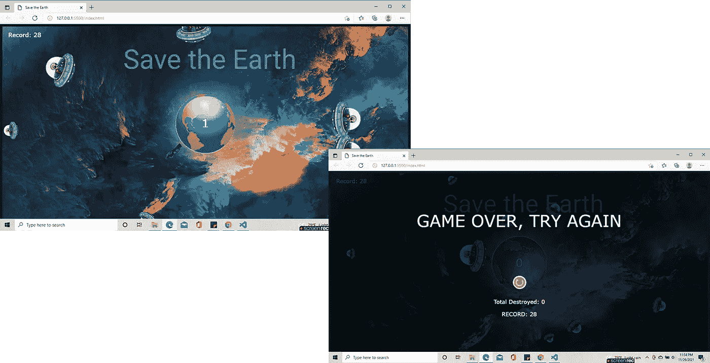
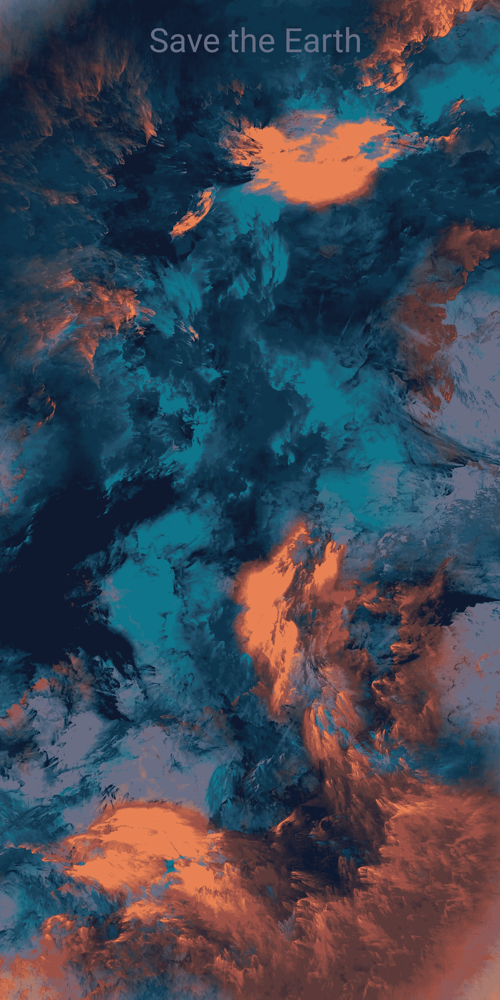
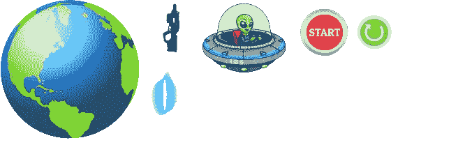

# 使用 Javascript 的“拯救地球”游戏

> 原文：<https://medium.com/javarevisited/save-the-earth-game-using-javascript-702d79b06df?source=collection_archive---------1----------------------->

## 仅使用 HTML、CSS 和 Javascript 创建简单游戏的 3 步指南。

许多人轻视视频游戏，认为它不成熟或者是电视迷的专利，但是你是否意识到这些虚拟世界的许多共同组成部分可能会给现实生活带来巨大的好处？以下是视频游戏对年轻人和成年人的一些优势:

*刺激大脑有益健康*

*解决问题能力的提高*

*应力降低*

说到电子游戏，你要么赢，要么继续尝试，从你的错误中学习，直到你达到目标。因此，一些学者和教育工作者表示，电子游戏可能会教育人们更加自信，朝着自己的目标努力，每次失败都被视为一次新的学习机会。

根据你想要构建的游戏类型，JavaScript 是一种优秀的游戏创作语言。JavaScript 非常适合基于网络的游戏和手机游戏。使用平台和工具可能有助于创建可以直接在浏览器中玩的 2D 和 3D 游戏。

你有没有想过我们可以用编程语言编写游戏代码！！！所以我们走吧…

我想看看只使用基本的 [HTML](/javarevisited/10-best-html-and-css-courses-for-beginners-in-2021-6757eec00032) 、 [CSS](/javarevisited/top-10-free-courses-to-learn-html-5-css-3-and-web-development-872d62d97a97) 和 [JavaScript](/javarevisited/my-favorite-free-tutorials-and-courses-to-learn-javascript-8f4d0a71faf2) 为玩家创建这个游戏有多简单。

因此，在这篇文章中，我将告诉你如何通过三个步骤来创建它。

在这个游戏中，我产生了外星人正从其他星球来入侵我们地球的概念。

他们乘坐他们的外星飞船来。当他们到达时，我们已经可以用激光枪射击了。

摧毁一艘飞船每艘得一分。

如果有一艘飞船着陆并撞到地面，游戏就结束了。

然后你可以从头再来一次。激光枪的使用完全是通过鼠标。

# 第一步:

创建一个 index.html 文件，并编写下面的代码。

[https://www . Java 67 . com/2020/08/5-best-online-courses-to-learn-html-5 . html](https://www.java67.com/2020/08/5-best-online-courses-to-learn-html-5.html)

# 第二步:

创建一个 style.css 文件来设计样式，并编写下面的代码。

# 步骤 03:

创建一个 script.js 文件，并编写下面的代码。

确保所有的图片和 CSS 文件链接完美。

在这里你可以下载天空背景的图片。

sky.png

您可以在这里下载组件的图像(地球、激光枪、激光镜头、航天器、启动按钮、重启按钮)。

component.png

您可以在这里下载指针的图像。

pointer.png

你可以在这里下载全屏图片。

full-screen.png

# 结论

我们非常喜欢玩网络游戏，因为玩网络游戏有很多优点，而不是缺点。出于这个原因，我向您展示了如何创建一个非常有趣的名为“拯救地球”的电脑游戏，它可以由 HTML、CSS 和 javascript 构建而成。

希望这对你有帮助。如果你在实现这个过程中有任何困难或者你需要任何帮助，请联系我。