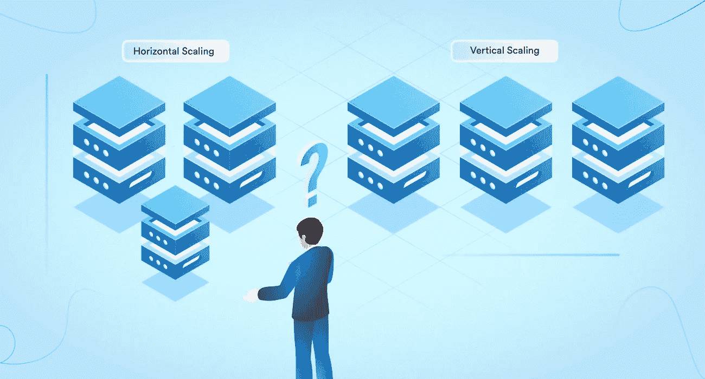

# 云中的可扩展性:垂直扩展与水平扩展

> 原文：<https://medium.com/javarevisited/scalability-in-the-cloud-vertical-vs-horizontal-scaling-ba38ca29d1b7?source=collection_archive---------3----------------------->

图片来源:[https://middleware . io/WP-content/uploads/2021/09/Horizontal-vs .-Vertical-Scaling-Which-one-to-choose _-。jpg](https://middleware.io/wp-content/uploads/2021/09/Horizontal-Vs.-Vertical-Scaling-Which-one-to-choose_-.jpg)

大家好。在本文中，让我们来了解一下云中的可伸缩性和 3 种类型的扩展——水平、垂直和对角扩展

# 什么是缩放？

伸缩是通过扩展或压缩来改变任何系统的大小以满足期望的过程。缩放操作可以通过添加资源来实现…