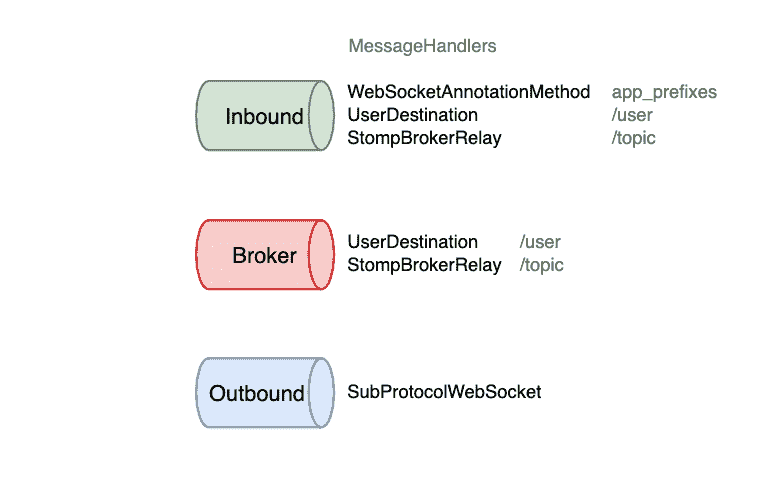
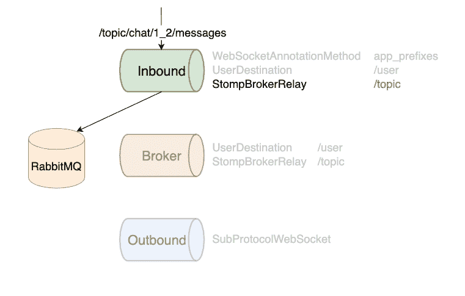
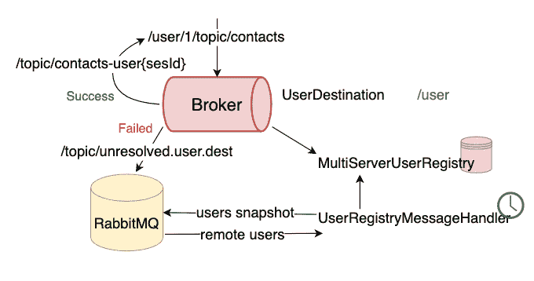

# 在 Spring 服务中扩展 WebSockets 第 2 部分]

> 原文：<https://medium.com/javarevisited/scaling-websockets-in-spring-services-part-2-11f7f32ad05a?source=collection_archive---------0----------------------->

照片由 [CHUTTERSNAP](https://unsplash.com/@chuttersnap?utm_source=medium&utm_medium=referral) 在 [Unsplash](https://unsplash.com?utm_source=medium&utm_medium=referral) 上拍摄

在上一篇文章的[中，我写了一篇关于](/javarevisited/scaling-websockets-in-spring-services-27023f59868c) [Spring Framework](https://spring.io/) 中的代理中继的文章，它允许你横向扩展 WebSockets 连接。

但是我没有用***@ subscribe mapping***很好地覆盖这个问题。在这篇文章中，我想解决这个问题。

# @SubscribeMapping

让我提醒你，问题是我们经常想在用户订阅主题时发送初始状态。

例如，我们有一个主题`/topic/charts/{charId}`，我们想在订阅时发送 20 条最新消息。

如果我们声明应用前缀`/app`和代理前缀`/topic`，那么订阅消息将不会进入 [Spring 控制器](https://www.java67.com/2021/10/3-ways-to-send-different-content-types.html)。它将被直接代理给代理。

在前一篇文章中，我建议了两种方法来解决这个问题:

1.  创造我们自己的`BeanPostProcessor`
2.  使用[***@ get mapping***](https://javarevisited.blogspot.com/2021/10/difference-between-requestmapping-and..html)请求初始数据

幸运的是，有一个更简单的方法(剧透:我们可以在应用前缀和代理前缀上添加`/topic`和`/user`)。现在我将解释它是如何工作的。

# WebSocket 通道

在 Spring 框架中，我们有 3 个消息通道:

1.  入站—从客户端获取消息
2.  代理—代理来自入站通道或应用程序本身的消息(例如，使用`SimpMessagingTemplate`)
3.  出站—向客户端发送消息

每个通道都有一组消息处理程序。

## WebSocketAnnotationMethodMessageHandler

`WebSocketAnnonationMethodMessageHandler`从客户端接收消息，如果它们与应用前缀匹配，则尝试将它们的目的地与控制器匹配。

如果一个控制器方法返回一个值，它被直接**发送**到这个 WebSocket 连接的出站通道。因此，无论单个用户拥有多少个连接，都只会向一个订阅的连接发送响应。

## UserDestinationMessageHandler

如果一个目的地与一个用户前缀匹配，`UserDestinationMessageHandler`解析一个用户，并将这个带有另一个目的地的消息发送到代理通道。对于多个用户连接，它将发送多个消息。

## StompBrokerRelayMessageHandler

`StompBrokerRelayMessageHandler`将消息代理给外部代理。例如，在`UserDestinationMessageHandler`解析用户后，它可以代理来自代理通道的消息。

每个处理器独立工作。因此，我们可以很容易地将`/topic`和`/user`添加到应用前缀中。因此，消息将被发送到控制器，并将被代理到外部消息代理。

# 用户解析

关于`UserDestinationMessageHandler`如何工作还有一件事。用户可能连接到不同的应用程序实例，但他们仍然需要以某种方式解析用户。

为此，我们可以使用`MultiServerUserRegistry`。它定期向特定主题发送本地用户的快照，并订阅该主题以获取远程用户。

如果一个处理程序需要解析一条消息，但是它还没有获得远程用户，那么它会向未解析的主题发送一条消息。因此，它将在另一个实例中解决。

春季经纪人接力赛到此结束。
你可以在 [**GitHub**](https://github.com/wirtsleg/scaling-spring-boot-microservices) 上找到完整的代码(`scalable`分支包含最终解决方案)。