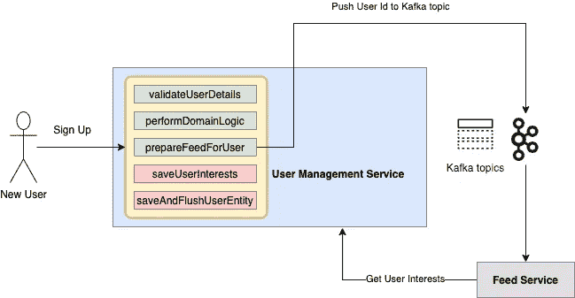

# 使用 Spring transaction synchronization 执行事务后提交的调度方法

> 原文：<https://medium.com/javarevisited/scheduling-methods-to-execute-post-transaction-commit-using-spring-transactionsynchronization-8df3fa4f4e37?source=collection_archive---------0----------------------->

我们都需要的注解


# 问题是

在 spring 中使用事务时，通常需要一些特定的方法在事务成功提交后运行，让我们通过一个例子来理解这一点

假设一个系统中有两个微服务，第一个管理用户生命周期，姑且称之为用户管理服务(UMS)，另一个为用户准备 Feed(Feed Service)。



UMS 和饲料服务互动

当一个新用户在平台上注册时，UMS 会进行一些验证，然后向`create_feed` Kafka topic 推送一条消息。另一方面，提要服务监听关于`create_feed`主题的消息，然后调用 UMS 来获取用户的兴趣以准备提要。你看到这个流程中的一个巨大问题了吗！？如果注册过程中的任何后续方法失败怎么办——用户详细信息从未保存在系统中，订阅服务`get user interest call`将开始失败。当我们谈论多个微服务交互时，这个问题变得更加突出。

可能有许多其他需求，其中需要一些特定的方法来只执行事务提交，让我们看看如何优雅地解决这个问题！

# 解决方案🚀

为了在事务提交后执行一段代码，可以使用`TransactionSynchronizationAdapter`的`afterCommit`方法，应该是这样的

```
TransactionSynchronizationManager.registerSynchronization(
    new TransactionSynchronizationAdapter() {
        @Override
        public void afterCommit() {
            // code for publishing message to kafka
        }
});
```

虽然这种方法可行，但需要在使用它的任何地方添加大量的样板代码，而且这并不是一种非常干净的解决问题的方法。

让我们看看如何创建一个注释(`@PostCommit`)并使用 spring AOP around advice 从后台驱动所有这些。其思想是，每当遇到带有`@PostCommit`注释的方法时，执行被包装在 runnable 中，并添加到 ThreadLocal 中执行，当事务完成时，将调用`TransactionSynchronizationAdapter`的`afterCommit`，并且可以执行`ThreadLocal`的所有`runables`。

**#1 建筑标注**

```
@Target(ElementType.METHOD)
@Retention(RetentionPolicy.RUNTIME)
public @interface PostCommit {
}
```

这一部分很简单，类似于用 Java 创建任何其他注释

**#2 构建后置处理适配器**

后置处理程序有两个功能

1.  它将在`ThreadLocal`上记录`runnables`
2.  覆盖`TransactionSynchronizationAdapter`的`AfterCommit`，在事务提交时运行所有注册的`runnables`

```
@Slf4j
@Component
public class PostCommitAdapter extends TransactionSynchronizationAdapter {
    private static final ThreadLocal<List<Runnable>> RUNNABLE = new ThreadLocal<>();

    **// register a new runnable for post commit execution**
    public void execute(Runnable runnable) {
        if (TransactionSynchronizationManager.isSynchronizationActive()) {
            List<Runnable> runnables = RUNNABLE.get();
            if (runnables == null) {
                runnables = new ArrayList<>();
                RUNNABLE.set(runnables);
                TransactionSynchronizationManager.registerSynchronization(this);
            }
            return;
        }
        **// if transaction synchronisation is not active**
        runnable.run();
    }

    @Override
    public void afterCommit() {
        List<Runnable> runnables = RUNNABLE.get();
        runnables.forEach(Runnable::run);
    }

    @Override
    public void afterCompletion(int status) {
        RUNNABLE.remove();
    }
}
```

如果事务是活动的，`execute`方法在`ThreadLocal`中注册`runnables`,否则，它简单地继续并执行它。`afterCommit`运行`ThreadLocal`内的所有`runnables`

**#3 连接适配器&注释使用左右建议**

为了将`PostCommitAdapter`的执行方法与`@PostCommit`注释挂钩，在`@PostCommit`注释上创建了一个 around advice，它在每个连接点将方法执行封装在 runnable 中，并调用`PostCommitAdapter`的`execute`

```
@Aspect
@Slf4j
@AllArgsConstructor
@Configuration
public class PostCommitAnnotationAspect {
    private final PostCommitAdapter postCommitAdapter;

    @Pointcut("@annotation(com...<**package**>..PostCommit)")
    private void postCommitPointCut(){}

    @Around("postCommitPointCut()")
    public Object aroundAdvice(final ProceedingJoinPoint pjp) {
        postCommitAdapter.execute(new PjpAfterCommitRunnable(pjp));
        return null;
    }

    private static final class PjpAfterCommitRunnable implements Runnable {
        private final ProceedingJoinPoint pjp;

        public PjpAfterCommitRunnable(ProceedingJoinPoint pjp) {
            this.pjp = pjp;
        }

        @Override
        public void run() {
            try {
                pjp.proceed();
            } catch (Throwable e) {
                throw new RuntimeException(e);
            }
        }
    }
}
```

# 使用

一旦样板文件写好了，用法就简单得不能再简单了，无论在事务提交后执行哪种方法，都必须简单地用`PostCommit`注释对其进行注释。

示例:考虑两个具有提交后注释方法的类 A & B

```
Class A {
   **@PostCommit**
   void log(){
      log.info("log from class A")
   }
}Class B {
   **@PostCommit**
   void log(){
      log.info("log from class B")
   }
}
```

和一个调用这些方法的驱动程序类:

```
Class mainClass {
      **@Transactional**
      void transactionalMethod(Entity entity){
          someOperation(entity)
          log.info("inside transaction");
          a.log();
          b.log();
          save(entity);
          log.info("end of method");
      }
}
```

预期产出将是:

```
> inside transaction
> ** saving entity
> log from class A
> log from Class B
```

# 结论

这篇博客试图解释我们如何利用 Spring 的`TransactionSynchronization`在事务提交后执行一段代码，以及如何使用 Spring AOP 将它与一个定制注释挂钩，从后面驱动一切。

如果你需要更多的帮助，请随时联系我。请务必关注所有新的更新。谢谢你的阅读。干杯🍺

你可能喜欢的其他 Java 和 Spring 文章和资源

[](/javarevisited/7-best-webflux-and-reactive-spring-boot-courses-for-java-programmers-33b7c6fa8995) [## 面向 Java 程序员的 7 门最佳 WebFlux 和反应式 Spring Boot 课程

### 我最喜欢的课程 2021 年学习 Java 中的反应式编程使用 WebFlux、RxJava 和反应式 Spring Boot 来自…

medium.com](/javarevisited/7-best-webflux-and-reactive-spring-boot-courses-for-java-programmers-33b7c6fa8995) [](/javarevisited/10-best-free-dropwizard-vert-x-micronaut-and-quarkus-online-courses-for-java-developers-9c2b4161f17) [## 面向 Java 程序员的 10 门最佳免费 DropWizard、Vert.x、MicroNaut 和 Quarkus 在线课程 2021

### 我最喜欢的免费和最好的在线课程，学习像 DropWizard 这样的前沿 Java 微服务框架…

medium.com](/javarevisited/10-best-free-dropwizard-vert-x-micronaut-and-quarkus-online-courses-for-java-developers-9c2b4161f17) [](/javarevisited/10-best-java-microservices-courses-with-spring-boot-and-spring-cloud-6d04556bdfed) [## 2021 年 Spring Boot 和 Spring Cloud 的 10 个最佳 Java 微服务课程

### 我最喜欢的 2021 年用 Spring Boot 和 Spring Cloud 为初学者学习 Java 微服务的在线课程来自…

medium.com](/javarevisited/10-best-java-microservices-courses-with-spring-boot-and-spring-cloud-6d04556bdfed)