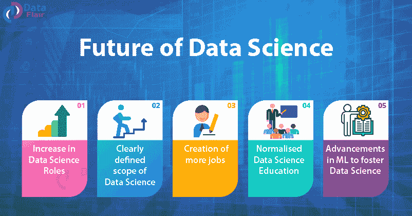
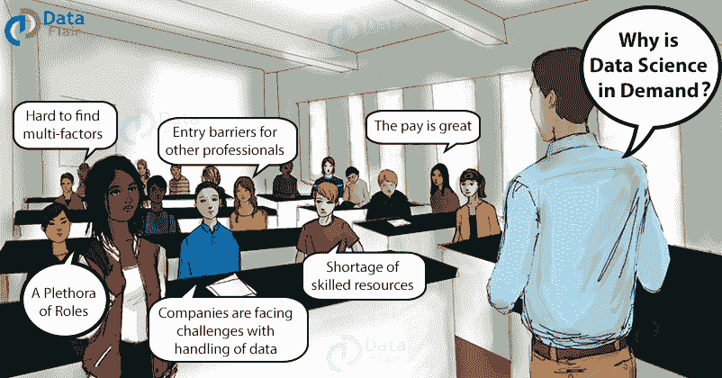
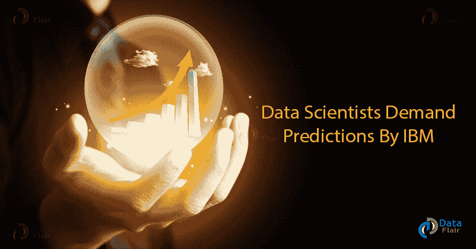
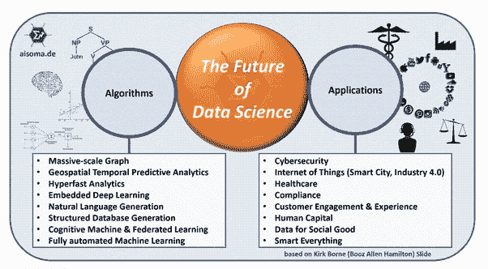
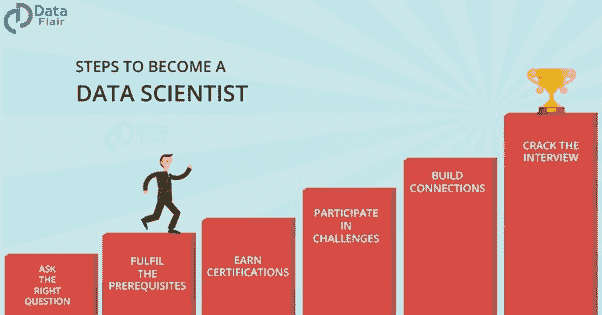

# 2020 年数据科学的范围以及如何获得数据科学的第一份工作？

> 原文：<https://medium.com/javarevisited/scope-of-data-science-in-2020-and-how-to-get-your-first-job-in-data-science-2893169ddf6b?source=collection_archive---------1----------------------->

*“数据科学的未来是辉煌的，直到人类停止生产更多的数据”*

术语[数据科学](https://dev.to/javinpaul/10-data-science-and-machine-learning-courses-for-programmers-looking-to-switch-career-57kd)最早出现在 2001 年，但数据科学的普及在 2010 年爆发，因为从过去十年来看，它是增长最快的领域之一。但是，未来呢？【2020 年后数据科学的未来是什么样的？在开始职业生涯或进入数据科学领域之前，每个数据科学有志者都会问自己这个问题。

作为一名数据科学家，我将向您展示 2020 年数据科学的未来和范围，并揭示 2020 年成为数据科学家的最佳方式。

# 为什么数据科学有需求？

***“数据是一种珍贵的东西，比系统本身更持久”***

如今，每个数据驱动的组织/企业都完全依赖数据分析来为其业务做出最佳决策。借助数据科学工具、方法和算法，组织可以从结构化和非结构化用户数据中获得洞察力，以制定决策、识别潜在客户群和更好地锁定目标。

## **数据科学家对 2020 年的需求调查— IBM 的预测出炉了！**

要了解 IBM 对 2020 年数据科学家需求的一些有趣预测，您可以参考 IBM 的 [**数据科学家需求洞察**](https://data-flair.training/blogs/data-scientists-demand-predictions/)

<https://dev.to/javinpaul/10-data-science-and-machine-learning-courses-for-programmers-looking-to-switch-career-57kd>  

# 数据科学的范围-

***“未来 10 年，数据科学和软件对医药的贡献将超过所有生物科学的总和”***

如果我可以用两个词来描述未来，数据科学的未来是光明和吉祥的。根据 IBM 进行的一项调查，到 2020 年，数据科学家的职位空缺将增加到 272 万个。每个组织都意识到，为了从数据中获得最大收益，他们需要一名技术熟练的人员。因此，这是开始您的数据科学职业生涯的最佳时机。

# 数据科学未来的驱动力-

数据科学是多个数据操作的巨大集合。这些数据操作还涉及到机器学习和统计。**机器学习算法** 非常依赖数据。由于机器学习的巨大贡献，数据科学正在扩展。它在以下方面改进了数据科学场景——

*   向用户提供高级搜索引擎结果
*   量子计算
*   高级个性化
*   无代码环境

# 如何在 2020 年成为一名数据科学家-

*   **编程技能大师** — R、Python、SAS 是数据科学家最常用的工具。探索**[**R vs Python vs SAS for Data Science**](https://data-flair.training/blogs/r-python-or-sas-for-data-science/)选择最合适的工具开始你的数据科学学习。**
*   ****用数据弄脏你的手** —这个领域使用科学的方法和算法。并将这种方法应用于处理、清理和验证数据。**
*   ****良好的动手机器学习技能** —正如我们上面讨论的那样，它是数据科学背后的驱动力。数据科学家使用机器学习技术产生见解。**
*   ****最重要的是项目** —数据科学项目在推动你的数据科学职业生涯中发挥着至关重要的作用。以下是为所有数据科学有志者准备的 [**前五大数据科学项目**](https://data-flair.training/blogs/data-science-projects-code/) 。**
*   ****加入一个好的课程** —有许多关于数据科学的好的在线课程，你可以加入它们向像[吴恩达](https://medium.com/u/592ce2a67248?source=post_page-----2893169ddf6b--------------------------------)这样的专家学习，如果你需要推荐，你可以在这里找到一些 [**最佳数据科学课程**](https://dev.to/javinpaul/top-online-courses-to-learn-data-science-and-machine-learning-for-beginners-best-of-lot-37k8) 。**

**<https://dev.to/javinpaul/top-online-courses-to-learn-data-science-and-machine-learning-for-beginners-best-of-lot-37k8>  

**数据科学家的薪资范围:**初级数据科学专业人员的起薪为 **$165，000** 。而有经验的专业人士的平均工资要高得多，为 25 万美元。

# 摘要-

2020 年对技术熟练的数据科学家有巨大的需求，如果你期待成为一名数据科学家，这是一个完美的时机，每个数据驱动的组织都希望最大化他们的利益，为此需要具备相关技能的专门领导。我们可以说，数据科学家的未来是安全的、光明的、吉祥的！

程序员和数据科学家可能喜欢的其他文章

*   [面向数据科学和机器学习的 8 大 Python 库](https://javarevisited.blogspot.com/2018/10/top-8-python-libraries-for-data-science-machine-learning.html)
*   [2020 年学习 Python 的 5 大课程](https://hackernoon.com/top-5-courses-to-learn-python-in-2018-best-of-lot-26644a99e7ec)
*   [面向数据科学家的 10 大 TensorFlow 课程](https://dev.to/javinpaul/10-of-the-best-tensorflow-courses-to-learn-machine-learning-from-coursera-and-udemy-37bf)
*   [2020 年学习 Python 的 10 个理由](https://hackernoon.com/10-reasons-to-learn-python-in-2018-f473dc35e2ee)
*   [学习数据科学数学和统计的 5 门课程](https://javarevisited.blogspot.com/2019/09/top-5-statistics-and-mathematics-course-for-data-science.html)
*   [学习数据科学表格的前 5 门课程](https://javarevisited.blogspot.com/2019/07/top-5-tableau-online-courses-and-certifications-for-data-science-engineers.html)
*   [学习数据科学 Python 的 5 本书](https://javarevisited.blogspot.com/2019/08/top-5-python-books-for-data-science-and-machine-learning.html)
*   [学习机器学习的 5 大免费课程](https://www.java67.com/2019/01/5-free-courses-to-learn-machine-and-deep-learning-in-2019.html)
*   [初学者学习 TensorFlow 的 5 大课程](https://hackernoon.com/top-5-tensorflow-and-ml-courses-for-programmers-8b30111cad2c)
*   [学习高级数据科学的前 5 门课程](https://hackernoon.com/top-5-data-science-and-machine-learning-course-for-programmers-e724cfb9940a)
*   [初学者学习 Python 的 10 门免费课程](https://hackernoon.com/10-free-python-programming-courses-for-beginners-to-learn-online-38312f3b9912)

感谢您阅读本文。如果你喜欢这些用 Python 进行数据分析的熊猫在线课程，那么请分享给你的朋友和同事。如果您有任何问题或反馈，请留言**