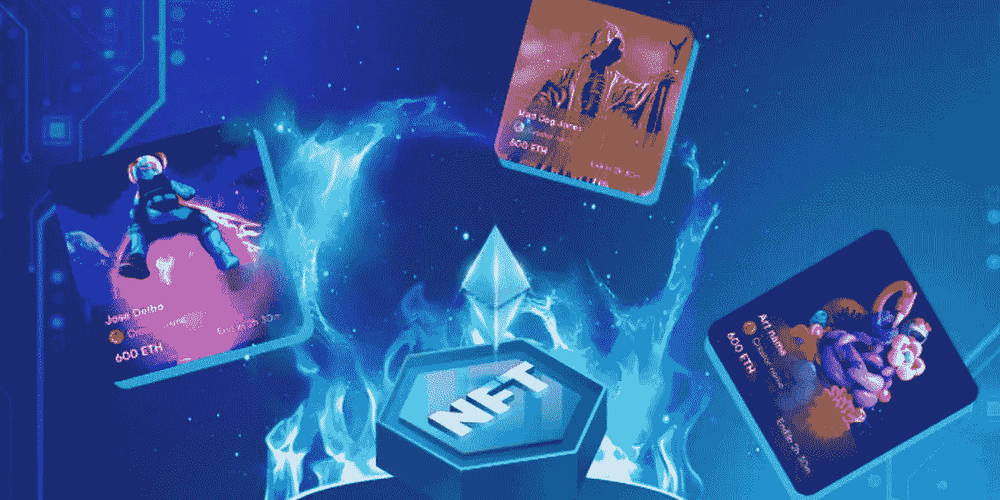
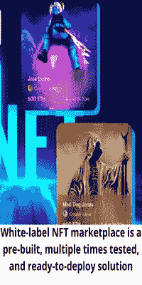

# 筛选马拉松比赛中的 NFT 顶级市场

> 原文：<https://medium.com/javarevisited/screening-the-top-nft-marketplaces-on-the-marathon-18ce0e6bf3dc?source=collection_archive---------4----------------------->

来源:Appdupe

近年来，不可替代代币的趋势迅猛发展。这些符号化的数字资产已经成为新的革命。价值数十亿美元的 NFT 市场已经让许多名人、创作者、艺术家和商业人士沉迷其中。

大多数人想尽一切办法进入 NFTverse。与此同时，这些平台也通过提供高利润率来善待他们。像 NFT 市场和 launchpads 这样的 NFT 风险投资应用已经成为许多初创公司和企业的寻求点。

这样的 NFT 平台开发服务[公司甚至提供白标 NFT 平台解决方案](https://www.appdupe.com/whitelabel-nft-marketplace?utm_source=google&utm_medium=medium&utm_campaign=monika)。因此，我们将看看白色标签解决方案以及如何开发这样的平台。

# 🔥**白牌 NFT 市场概述**

NFT 市场是一个可以交易非功能性食物的地方。由于这些不可替代的代币是建立在[区块链技术](/javarevisited/7-free-courses-to-learn-blockchain-in-2020-764e66b47ebe)上的，市场也将使用相同的技术来开发，以购买、出售或交易它们。这个市场可以是通用的，也可以是一般的。

一般的 NFT 市场，如 OpenSea、Rarible、Foundation、SuperRare 等。，包括所有种类的[NFT](/javarevisited/10-free-nft-non-fungible-tokens-metaverse-and-web3-0-courses-for-beginners-421b1d6ca263)。然而，在 NBA Top Shot 这样的通用市场中，Royal 是一个基于音乐的 NFT 市场，Nifty Gateway 是 NFT 数字艺术市场。

> 白标 NFT 市场是一个预先构建、经过多次测试、随时可部署的解决方案。它几乎获得了与 NFT 市场相同的特征。白标解决方案有其优势，如无缝定制选项、高级别安全性、完全透明和分散平台。一些最好的白色标签 NFT 市场是 OpenSea 克隆，Rarible 克隆，Sorare 克隆，SuperRare 克隆，基金会克隆，Solanart 克隆，金恩克隆等。

来源:男高音

## 🔥**NFT 市场的特点**

🔖**店面:**它是平台的前沿，保存着预览、拍卖、所有者、价格历史和其他信息。在这里，NFTs 的实际交易高效地进行着。

🔖**过滤器:**过滤器可以帮助你轻松快速地找到想要的东西。这些项目被分为多个部分，例如，价格、畅销书、新项目、热门交易等。这样，当用户使用过滤器搜索某个项目时，就可以更容易地找到他们感兴趣的项目。

🔖**列表:**列表是在市场上出售的非功能性食物。当用户想从他们的收藏中[制作一件 NFT](https://www.java67.com/2022/07/10-easy-ways-to-create-and-sell-nfts.html) 出售时，他们可以创建一个列表并跟踪列表的状态。

🔖**高级令牌搜索:**令牌搜索是处理客户满意度的一项重要功能。当用户搜索一个特定的令牌及其描述，而他们找不到它，这就减少了用户使用平台的机会。因此，高级令牌搜索是必要的，并可能增加用户购买资产的机会。

🔖拍卖/销售:拍卖也是市场中的一个必要特征，在市场中，投标人对某个特定的项目出价。用户应该有这个选项来查看哪些令牌是出价，哪些不是。还有必要有一个投标截止日期和时间。

🔖**钱包:**对于用户来说，在使用钱包进行交易的过程中，拥有一个安全可靠的地方来接收和存储资金是至关重要的。

🔖**评分&点评:**这个选项帮助新用户更多地了解平台，以及其他人对平台的感受。此外，它有助于根据用户的评论升级您的论坛。

来源:Appdupe

## 🔥**2022 年最佳 NFT 商场**

随着人们在 NFT 行业的蓬勃发展，这些不可替代代币的许多市场在过去几年中达到了顶峰。2022 年的一些最佳市场是

🗞️ **昆特**

这个加密平台专注于连接元宇宙和真实世界。这个奢侈品驱动的平台通过提供定制的、不可替代的令牌集合来实现其目标。当用户从这个平台上购买 NFT 时，他们会得到它的软拷贝，而它的实体版本会被送到他们手中。它还为金特 NFT 持有者提供了许多好处，如进入元宇宙艺术俱乐部、专属社交俱乐部等。

Crypto.com🗞️

**这是拥有各种 NFT 收藏品的领先平台之一。超过 1000 万人正在使用这个受欢迎的 NFT 市场。该平台中的 NFT 收藏包括艺术、名人、游戏、音乐、体育、密码等。该平台旨在使交易和投资过程变得简单，并适用于所有感兴趣的用户。**

**🗞️ **币安****

**这个 NFT 市场以其低廉的交易费用而闻名。这个市场提供了一个“神秘盒子”功能，用户可以从中获得一个随机的高价值的 [NFT](https://javarevisited.blogspot.com/2022/06/review-is-certified-nft-certification-worth-it.html) 。该平台同时支持币安智能链和以太坊区块链制作的 NFTs。**

**🗞️ **OpenSea****

**这个平台是购买 NFT 的最佳场所之一。据说这是第一个将 NFTs 引入交易的平台。这个包罗万象的平台支持超过 150 种加密货币作为支付方式。**

**🗞️ **俏皮网关****

**这个 NFT 市场以其罕见的下跌而自豪。NFT 在这个市场的发行将是有限的，主要集中在高端投资者身上。这个平台以许多著名的创作者和艺术家为特色。**

**🗞️ **苹果公司****

**这个平台允许用户交易他们的 NFT，还提供许多基于密码和 NFT 的开发和营销服务。作为一家利润丰厚的公司，它将 it 技术栈带给用户并减少障碍。Appdupe 因其开发解决方案和进步的辅助技术而获得巨大的营业额。**

 **** 

## **🔥**开发您的白牌 NFT 平台****

*   ****选择你的利基:**当一个人有了创业的想法时，他应该做一些研究，尽可能多地了解相关信息。当你想开发一个 [NFT 平台时，](https://javarevisited.blogspot.com/2022/07/5-best-platforms-to-learn-nft-non.html)第一步是选择你希望你的平台成为的类型。NFT 市场有许多利基市场，如艺术、音乐、电影剪辑、体育等。**
*   ****选择开发服务:**选择最好的开发服务公司来开发您的 [**白标 NFT 市场**](https://www.appdupe.com/whitelabel-nft-marketplace?utm_source=google&utm_medium=medium&utm_campaign=monika) 。选择时，尝试他们的演示解决方案，看看他们的评级和评论，然后决定哪个开发公司让你满意。向他们解释你对 UI/UX 设计的想法，如果你有的话。向他们勾勒出你希望你的平台具备的所有必要特性。**
*   ****开发并发布:**在开发完您的 NFT 平台之后，对其进行多次缺陷测试。一旦全部清理完毕，平台将准备发射。**

## **🔥**结论****

**白标解决方案是初创公司和企业家在 NFT 创业的好方法。因为它们既省时又有成本效益**