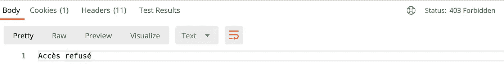

# 用 SpringSecurity 保护您的 rest API

> 原文：<https://medium.com/javarevisited/securing-your-rest-api-with-springsecurity-8ba440fe7b58?source=collection_archive---------0----------------------->

## 执行订单 66 —春季安全教程


# 我们将做什么

在前面的步骤中在[中创建了我们的 API 之后，我们现在将使用 Spring Security 来保护它。
为了做到这一点，我们需要向 pom.xml 文件添加 2 个依赖项](/javarevisited/building-a-simple-rest-api-with-springboot-3f2e4b123ebb)

```
<dependency>
    <groupId>org.springframework.boot</groupId>
    <artifactId>spring-boot-starter-security</artifactId>
</dependency>
<dependency>
    <groupId>org.springframework.security</groupId>
    <artifactId>spring-security-test</artifactId>
    <scope>test</scope>
</dependency>
```

# 它会是什么样子

[](https://javarevisited.blogspot.com/2021/02/spring-security-interview-questions-answers-java.html#axzz6lIcZ8tnd)

# 执行 66 号命令

## 账户实体

为了保护我们的 API，我们将使用一些[角色](https://javarevisited.blogspot.com/2013/07/role-based-access-control-using-spring-security-ldap-authorities-mapping-mvc.html)，因此为了实现这一点，我们将创建一个使用这些角色的帐户实体。

## 仓库

为了知道试图使用我们的 API 的用户是否存在，以及是否有关联的角色，我们还需要创建链接到 Account 实体的存储库。

当我们之前创建`CloneRepository` 时，我们不需要在其中创建任何方法，因为我们使用的所有方法都已经通过[继承](http://www.java67.com/2012/08/what-is-inheritance-in-java-oops-programming-example.html)实现了。这里我们需要一个特定的方法，就像上面的*findonebysUsername*一样，通过这个方法，我们的存储库将知道我们只搜索一个与参数上传递的字符串 username 匹配的结果。(如果你想知道它是如何工作的，请参见 [Spring Data JPA](https://docs.spring.io/spring-data/jpa/docs/current/reference/html/#jpa.query-methods) doc)。

## 控制器

既然我们已经创建了将具有连接到我们的 API 的角色的帐户，我们可以更新我们的控制器，使它在其方法上接受这些角色。

如您所见，我们的方法现在有了`@PreAuthorize`注释，该注释指出了可以访问它的角色。

那么，我的 API 现在安全了吗？回应是**没有**！
我们已经创建了 account 实体及其存储库，我们已经升级了控制器以指示它将使用的角色，但是我们还没有实现安全配置。
那么现在让我们来实现它。

# 配置

为了使上述所有代码正常运行，我们将实现安全性。为此，我们将在一个配置类中扩展**WebSecurityConfigurerAdapter**。

## 配置

正如您在第一个配置方法中看到的，我们指出了可以访问端点的角色。
在第二种方法中，我们描述了将用于认证用户的服务。

## 认证服务

为了认证我们的用户，我们需要创建一个服务来实现来自 [Spring Security](/javarevisited/top-10-courses-to-learn-spring-security-and-oauth2-with-spring-boot-for-java-developers-8f0222d6066d?source=---------5-----------------------) 包的**userdailsservice**，尤其是方法*loaduserbysusername*。

# 测试我们的 API

为了测试我们的 API，我们需要首先启动我们的应用程序。然后，我们可以尝试使用 [postman](/javarevisited/7-best-courses-to-learn-postman-tool-for-web-service-and-api-testing-f225c138fa5a?source=---------13------------------) 或任何其他允许您进行 HTTP 调用的工具来连接到我们在控制器中创建的入口点。

这些示例将与我们创建 API 时的示例相同，但是使用了基本的身份验证。
为了测试我的 API，我创建了两个账户，它们将被预加载到数据库中。

所以现在，如果我试图用错误的凭证访问一个数据点，我将得到一个 [401 错误](https://developer.mozilla.org/fr/docs/Web/HTTP/Status/401)。

```
{
  "timestamp": "2021-03-08T09:45:09.332+00:00",
  "status": 401,
  "error": "Unauthorized",
  "message": "Unauthorized",
  "path": "/kamino/order66"
}
```

如果我在没有适当角色的情况下试图访问一个数据点，我将得到一个 [403 错误](https://developer.mozilla.org/fr/docs/Web/HTTP/Status/403)。



我在异常处理程序中截取了我的 403 错误，以获得比异常堆栈跟踪更具可读性的内容。

感谢您的阅读，和以前一样，本教程中使用的代码可以在[this Github repository](https://github.com/ErwanLT/HumanCloningFacilities)branch security 中找到。