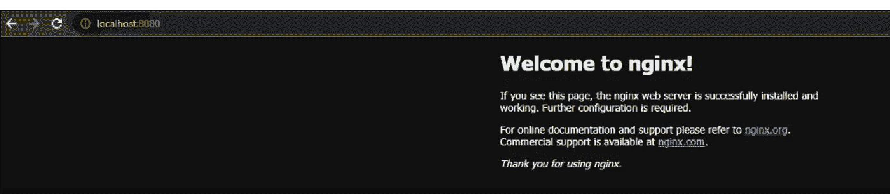
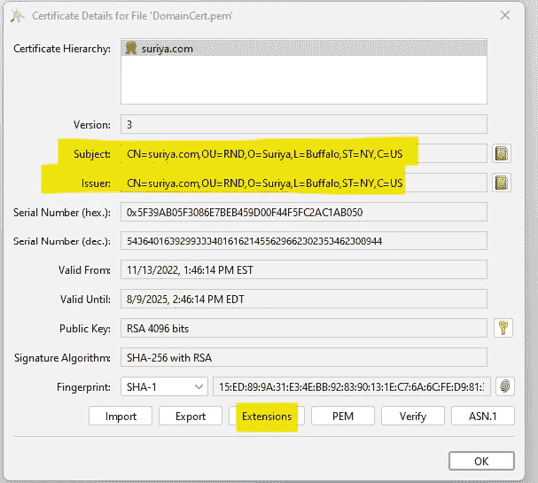
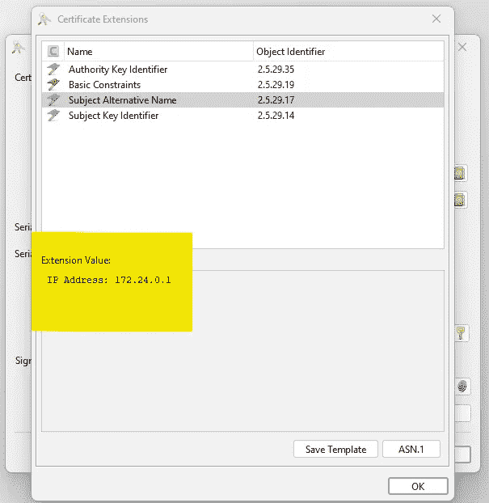
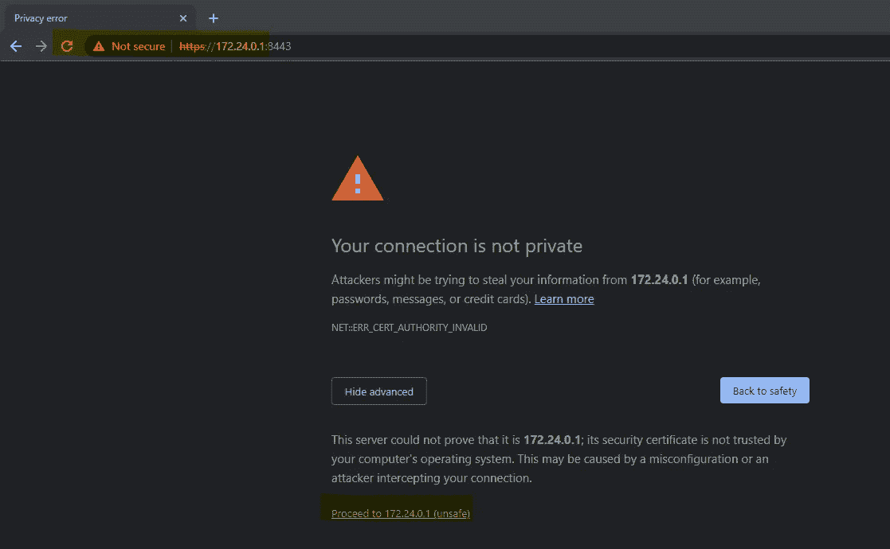
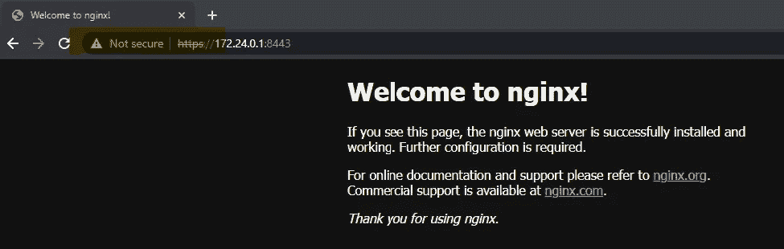
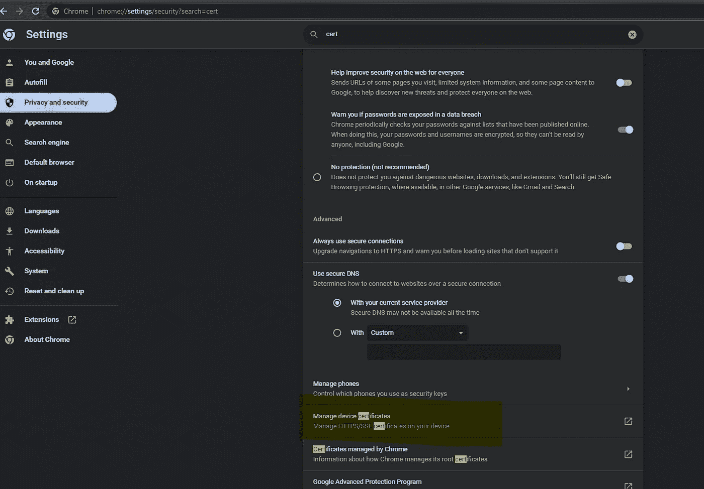
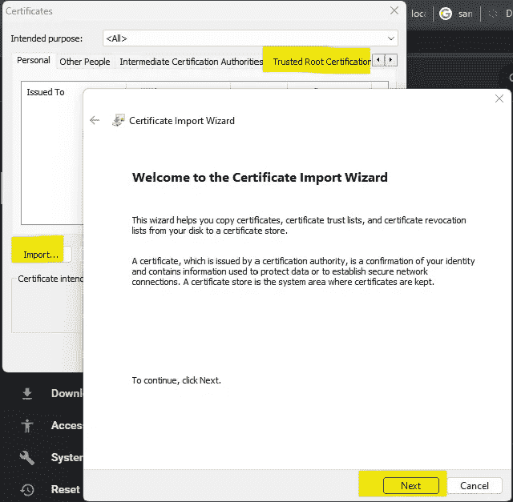
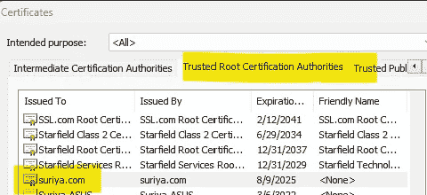
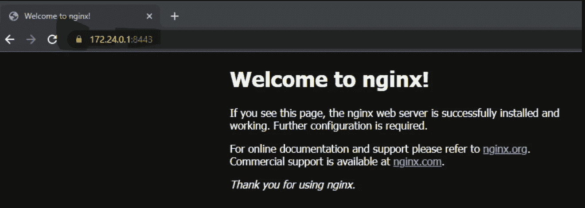

# 正在生成自签名证书

> 原文：<https://medium.com/javarevisited/self-signed-certificate-d545d6054327?source=collection_archive---------0----------------------->

## 本地主机

如今几乎所有的网站都运行在 [**https**](https://javarevisited.blogspot.com/2013/07/how-to-configure-https-ssl-in-tomcat-6-7-web-server-java.html) 上，帮助加密在*网站的客户端*和*网站的服务器*之间传输的数据。

[](http://javarevisited.blogspot.com/2013/07/how-ssl-https-and-certificates-works-in-java-web-application.html)

下面的帖子解释了[为什么我们需要 SSL](https://suriyaprakhash.medium.com/ssl-certificate-67b4e3bdee38#4332) 和[签署 CA 签名证书](https://suriyaprakhash.medium.com/ssl-certificate-67b4e3bdee38#66e2)的步骤。

[](https://suriyaprakhash.medium.com/ssl-certificate-67b4e3bdee38) [## SSL 证书

### 了解 SSL 基础知识

suriyaprakhash.medium.com](https://suriyaprakhash.medium.com/ssl-certificate-67b4e3bdee38) 

**内容**

1.  [先决条件](#69e4)
2.  [默认 http 上的示例 web 应用](#e25e)
3.  [生成**自签名公钥证书**](#59d2)
4.  [生成的证书验证](#94f3)
5.  [将生成的密钥&证书导入服务器](#d020)
6.  [设置本地设备信任证书](#3336)

让我们看看*如何生成*我们的**自己的自签名证书**并**在*我们的开发环境*中信任它们**。

**注意** *避免在生产中使用自签名证书。生产设置需要一个* [*单独的步骤列表*](https://suriyaprakhash.medium.com/ssl-certificate-67b4e3bdee38#66e2) *。*

> 先决条件

1.  [Openssl](https://www.openssl.org/) CLI 生成[密钥](https://suriyaprakhash.medium.com/cryptography-algorithms-e86ce7e2bb9b#abf6)和[证书](https://suriyaprakhash.medium.com/cryptography-algorithms-e86ce7e2bb9b#41bc)。(必需)
2.  [密钥库浏览器](https://keystore-explorer.org/)(非强制)
3.  Nginx 服务器(用于演示)

> 默认 http 上的示例 web 应用程序

出于演示目的，我们将使用在**端口 8080** 上运行的 [nginx](/javarevisited/best-courses-to-learn-nginx-in-36ed9ccca804) 默认 web，而*同样适用于其他服务器*，然而**服务器端配置** *不同*。

[](https://medium.com/javarevisited/best-courses-to-learn-nginx-in-36ed9ccca804)

浏览器显示*不安全*运行在 **http** 上

> 正在生成自签名公钥证书

我们将在 nginx 服务器上生成并使用一个**私钥**和一个**公钥证书**。

要了解什么是[密钥](https://suriyaprakhash.medium.com/cryptography-algorithms-e86ce7e2bb9b#abf6)和[证书](https://suriyaprakhash.medium.com/cryptography-algorithms-e86ce7e2bb9b#41bc)，

[](https://suriyaprakhash.medium.com/exploring-java-keystore-keys-9eb4805fa4ec) [## 探索 Java 密钥库和密钥

### 通过代码

suriyaprakhash.medium.com](https://suriyaprakhash.medium.com/exploring-java-keystore-keys-9eb4805fa4ec) 

现在我们知道我们想要什么，所以让我们使用下面的命令生成私钥***domain Key . PEM***。

```
openssl genrsa -out DomainKey.pem 4096
```

使用上面生成的私钥***domain Key . PEM***发出下面的命令来生成一个**自签名证书**

```
openssl req -new -x509 -sha256 -days 1000 -addext 'subjectAltName = IP:172.24.0.1' -key DomainKey.pem -out DomainCert.pem 
```

这里，我们添加了一个**扩展**，

*subjectAltName —* 要么添加一个 **DNS=*.yourdomain.com** 或者 **IP 地址**作为 **IP.1=x.x.x.x，IP.2=y.y.y.y** 或者只添加 **IP=172.24.0.1。**

***例*** *例提供我的* ***本地 IPV4(使用 ipconfig/ifconfig)****中的* ***SAN。***

**注意——CN 中的*域名*** 不再需要，用 **SAN** 代替。

> 验证证书

您可以使用 **openssl** 命令查看证书详情。然而，在这篇文章中，我们将把 **DomainKey.pem** 导入到密钥库浏览器中。

[](https://javarevisited.blogspot.com/2022/02/top-5-courses-to-learn-nginx-in-depth.html)

它被称为自签名是有原因的

在这里，如果我们看到**发行人**已经签署了**主题，**两者是相同的。因此，我们已经成功创建了一个自签名证书。



**DomainCert.pem** 与**扩展**中相应的 **SAN**


**DomainCert.pem** 带有**基本约束**显示 **CA**

> 将密钥和证书导入服务器

因为我们在上一步中获得了证书。我们可以把它们安装在我们的 nginx 服务器上。在我们的 **nginx.conf** 中，取消对 **https 部分**的注释

```
 # HTTPS server
    #
    server {
       listen       8443 ssl;
       server_name  localhost;

       ssl_certificate      C:\\Suriya\\nginx-1.22.1\\cert\\DomainCert.pem;
       ssl_certificate_key  C:\\Suriya\\nginx-1.22.1\\cert\\DomainKey.pem;

       location / {
           root   html;
           index  index.html index.htm;
       }
    }
```

现在**重启服务器**并通过 ***8443 访问**本地主机**。答对了。！***



点击**高级**和**进入**本地主机



在 **https** 上，但是*浏览器认为证书不可信*

> 信任生成的证书

现在我们需要告诉浏览器[公钥证书](https://suriyaprakhash.medium.com/cryptography-algorithms-e86ce7e2bb9b#41bc)是可信的。

进入浏览器设置和*搜索* ***certs*** ，这里我们用的是 Chrome。



选择管理设备 SSL 证书



导入 **DomainCert.pem** 作为**可信根证书**



一旦导入，它就会出现在这里

**注意** [*如果我们的证书是由浏览器信任的* ***验证过的认证机构*** *签署的，那么整个导入步骤就可以避免。*](https://suriyaprakhash.medium.com/ssl-certificate-67b4e3bdee38#66e2)

现在，设备的浏览器应该信任运行在 *8443* 上的 **172.24.0.1** 的网站，打开一个匿名窗口并检查状态。



浏览器现在很高兴，因为我们添加了我们的 **DomainCert.pem** 证书为*可信*

如果你想模拟证书颁发机构的签名，请随意查看下面的帖子，

[](https://suriyaprakhash.medium.com/ssl-certificate-67b4e3bdee38) [## SSL 证书

### 了解 SSL 基础知识

suriyaprakhash.medium.com](https://suriyaprakhash.medium.com/ssl-certificate-67b4e3bdee38) 

祝本地主机运行愉快！