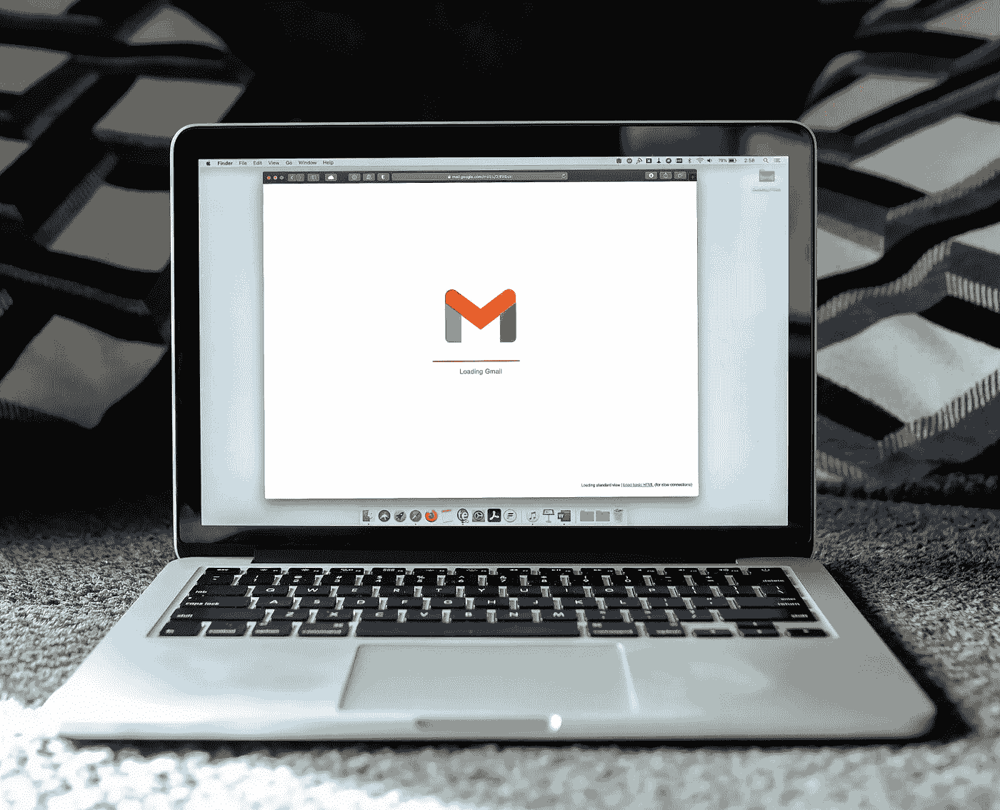

# 使用 Java Mail 发送电子邮件

> 原文：<https://medium.com/javarevisited/send-email-with-java-mail-3379285f109?source=collection_archive---------2----------------------->

Solen Feyissa 在 [Unsplash](https://unsplash.com/s/photos/email?utm_source=unsplash&utm_medium=referral&utm_content=creditCopyText) 上拍摄的照片

电子邮件代表电子邮件，它使我们的生活更加容易和可靠。我们可以在一分钟内将我们的信息发送给世界上的任何人。像 Gmail，Outlook，Yahoo 这样的电子邮件提供商为个人用户提供免费的电子邮件服务，这对我们来说是一件非常好的事情，因为我们使用电子邮件使我们的日常生活工作变得更加轻松，例如大学使用电子邮件向他们的学生发送信息，如课程表，工作…