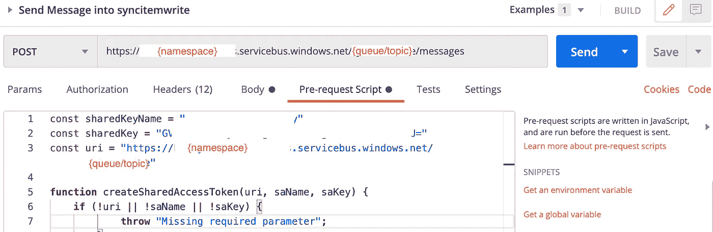
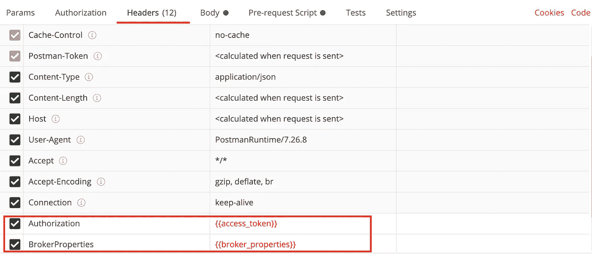

# 使用 SAS 令牌通过邮递员在 1 个步骤中向 Azure 服务总线发送消息

> 原文：<https://medium.com/javarevisited/send-message-to-azure-service-bus-via-postman-using-sas-token-in-1-step-a845686baad0?source=collection_archive---------0----------------------->

Azure Service Bus 是一个完全托管的企业消息代理，它提供

*   消息队列
*   发布-订阅主题

它通常用于分离应用程序和服务，带来以下优势:

*   在相互竞争的工作人员之间平衡工作负载
*   安全路由和传输数据，并控制访问服务和应用边界
*   协调需要高度可靠性的事务性工作

马丁·施瑞德在 [Unsplash](https://unsplash.com/s/photos/code?utm_source=unsplash&utm_medium=referral&utm_content=creditCopyText) 上的照片

当我们开发我们的解决方案时，我们可能想通过向我们的队列/主题发送消息来测试它。

我们可以通过两种方式发送消息:

1.  Microsoft Azure 门户上的浏览器本身
2.  [服务总线服务 Restful API](https://docs.microsoft.com/en-us/rest/api/servicebus/send-message-to-queue)

在本文中，我们将关注通过 Postman 的第二种方法。如果您只想偶尔发送一个简单的测试，Explorer 可能是一个方便的选择。

但是，它会在成功发送后清除您的“消息体”,如果您将使用类似的输入消息，这可能会对测试过程造成相当大的干扰。

让我们看看微软提供的 restful API 来访问我们的服务总线名称空间。这是一个对`http{s}://{serviceNamespace}.servicebus.windows.net/{queuePath or topicPath}/messages`的`POST`请求，在请求头中带有强制属性，如`Authorization`、`Content-Type`和`BrokerProperties`。

`Authorization`的值可以是以下类型之一:

1.  Azure Active Directory(Azure AD)JSON Web 令牌(JWT)
2.  共享访问签名(SAS)令牌

我们将专注于使用 SAS 令牌获得授权。你可以在这里阅读更多关于令牌结构[的内容。](https://docs.microsoft.com/en-us/azure/service-bus-messaging/service-bus-sas#generate-a-shared-access-signature-token)

假设我们需要一个令牌，我们通常要做的就是运行另一个单独的 [POST 请求](https://javarevisited.blogspot.com/2016/10/difference-between-put-and-post-in-restful-web-service.html#axzz7E4Jl2a5D)来生成一个新的令牌。然而，这可能是非常乏味的，并且同样会破坏我们的测试过程。

# 预请求脚本

我想向您介绍一下 Postman 中的预请求脚本功能。这允许我们运行一些代码，并为我们的请求中使用的变量赋值。

在创建消息的`POST`请求中，我们需要两个变量——访问令牌和代理属性(可选，仅在需要设置额外的元数据信息时使用，如`SessionId`、`PartitionKey`等。).您需要用您的`SharedKeyName`、`SharedKey`和`URI`更新以下代码。`createSharedAccessToken`负责根据[结构](https://docs.microsoft.com/en-us/azure/service-bus-messaging/service-bus-sas#generate-a-shared-access-signature-token)形成 SAS 令牌。

邮递员预请求脚本

您的邮递员请求应该如下所示:

示例:Postman 中的预请求脚本

示例:标题

# 摘要

瞧啊。现在，我们可以通过一个简单的步骤将消息发送到我们的队列/主题！

希望你会发现这种方法简单而直观！如果您能帮助与您的同行分享这篇文章，我将非常感激，这样它就能接触到更广泛的受众！🙏

感谢您的阅读！🤓

边注:如果你还不是中会员，点击[这里加入](/@mariochiadev/membership)！

 [## 用我的推荐链接云加入媒体

### 作为一个媒体会员，你的会员费的一部分会给你阅读的作家，你可以完全接触到每一个故事…

medium.com](/@mariochiadev/membership) 

# 参考

 [## Azure 服务总线消息传递概述- Azure 服务总线

### Azure Service Bus 是一个完全托管的企业消息代理，具有消息队列和发布-订阅主题(在…

docs.microsoft.com](https://docs.microsoft.com/en-us/azure/service-bus-messaging/service-bus-messaging-overview)