# 使用 SendGrid 和 spring boot 发送电子邮件

> 原文：<https://medium.com/javarevisited/sending-emails-with-sendgrid-and-spring-boot-81e9637a1f05?source=collection_archive---------1----------------------->


# 什么是 SendGrid？

SendGrid 是一个基于云的 SMTP 提供商，允许你发送电子邮件，而不必维护电子邮件服务器。 **SendGrid** 管理所有的技术细节，从扩展基础设施到 ISP 拓展和信誉监控到白名单服务和实时分析。

# 创建帐户:

  

然后登录您的帐户:

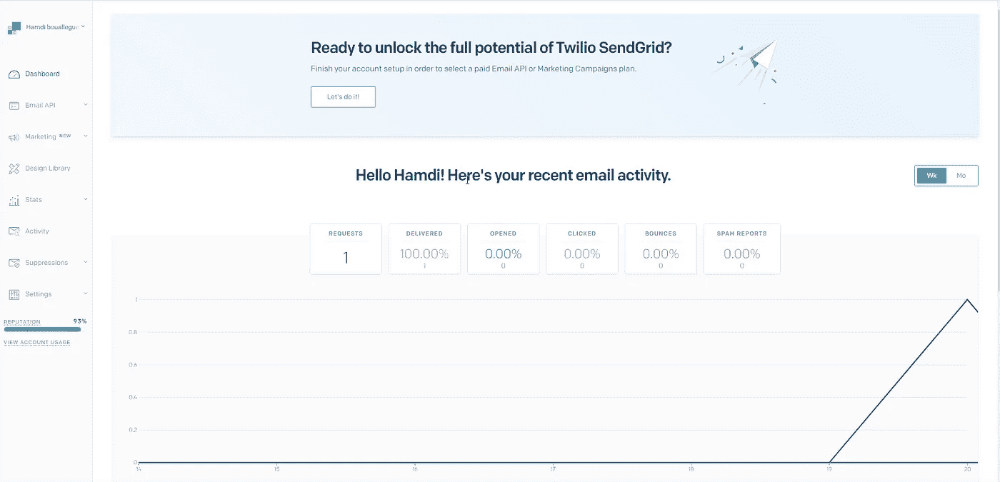

你会看到这样的东西。

# 创建弹簧启动应用程序:

【https://start.spring.io/ 

依赖项:Spring Web 和 Spring Boot 开发工具。

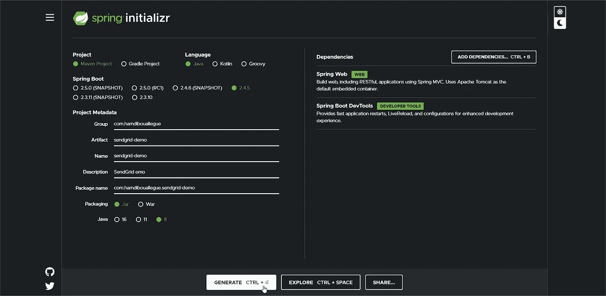

下载并解压缩项目后，添加这个依赖项:

```
<dependency><groupId>com.sendgrid</groupId><artifactId>sendgrid-java</artifactId><version>4.0.1</version></dependency>
```

请参见下面的 pom.xml:

# 创建单一发件人验证:

导航到[https://app.sendgrid.com/settings/sender_auth/senders](https://app.sendgrid.com/settings/sender_auth/senders):

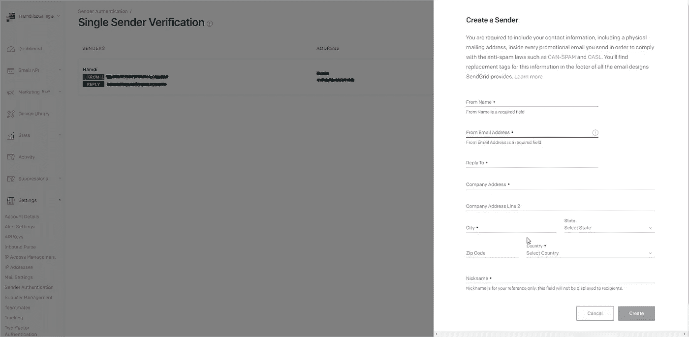

填写完所有输入后，点击创建按钮。然后你会收到一封激活邮件。

# 发送电子邮件:

## 1.获取 API 密钥:

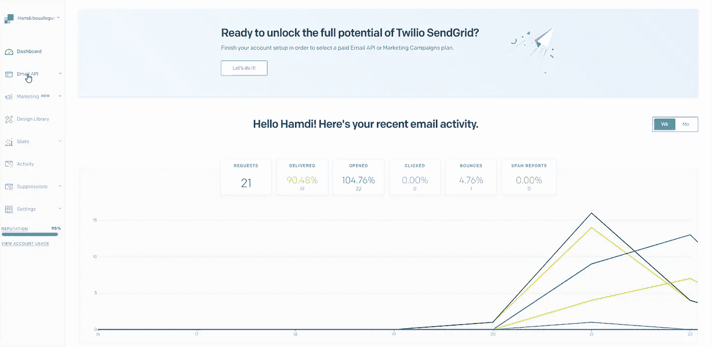

在控制面板中，单击电子邮件 API，然后单击集成指南。


选择了 Web API

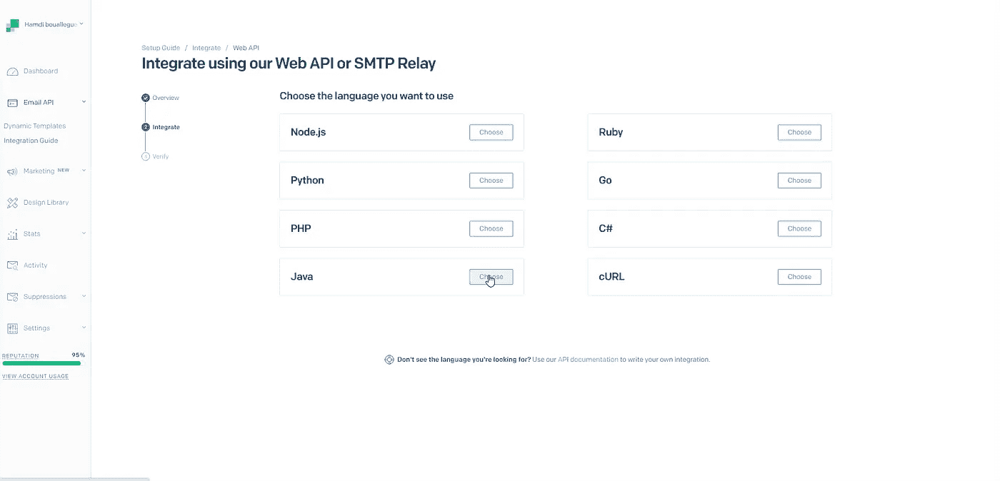

然后是 java:

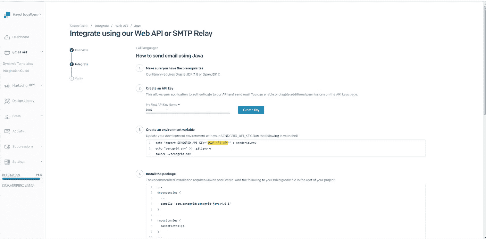

输入密钥名，然后单击创建按钮

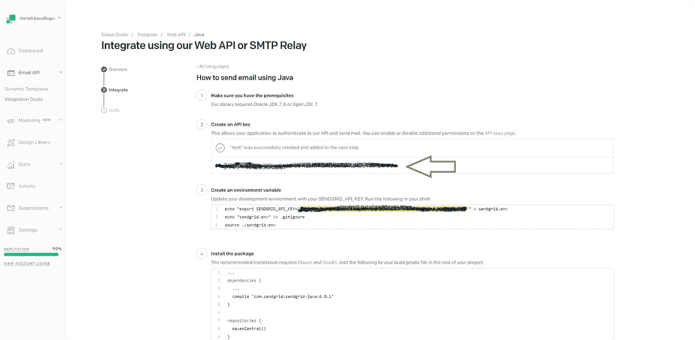

复制您的 API 密钥。

## 2.创建服务:

## 3.创建静止控制器:

## 4.测试 API:

论邮递员

post:[http://localhost:8080/API/send-text](http://localhost:8888/api/send-text)

您将收到一封电子邮件，确认您的垃圾邮件。

# 发送带有动态模板的电子邮件:

SendGrid 使我们能够使用模板或创建自己的模板。

## 1.让我们创建一个模板:

导航[此处](https://mc.sendgrid.com/dynamic-templates)

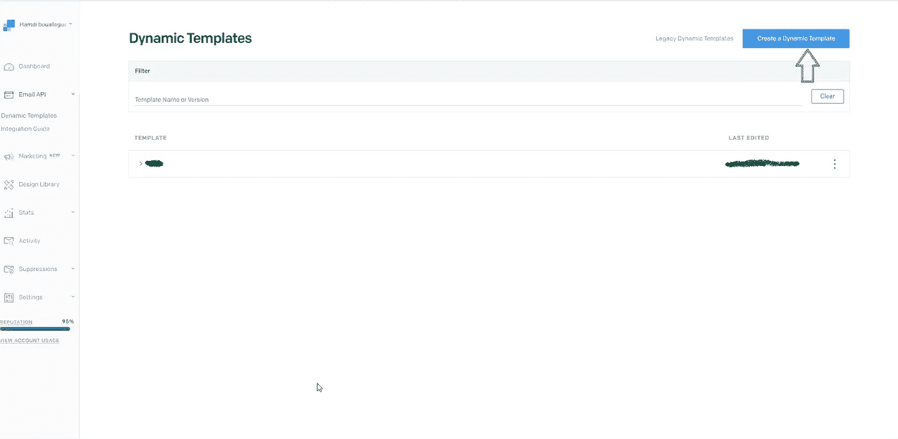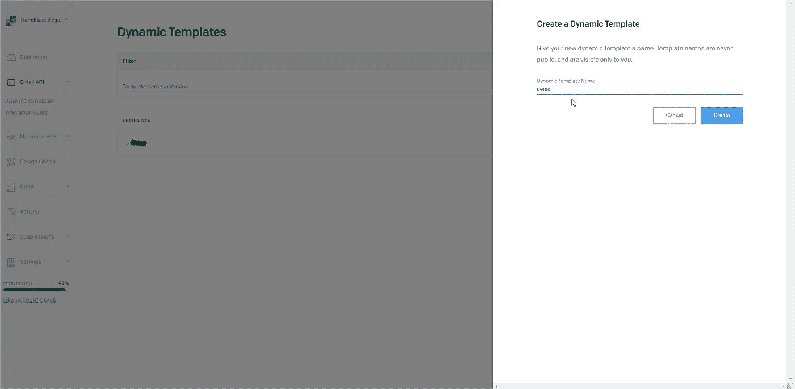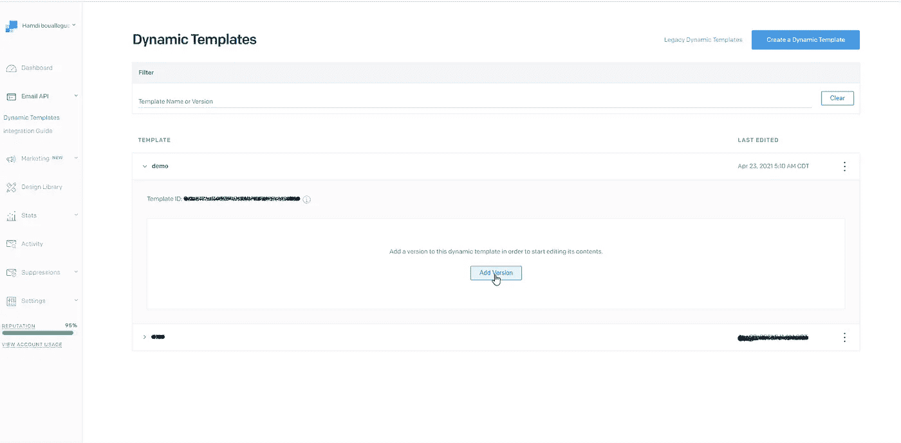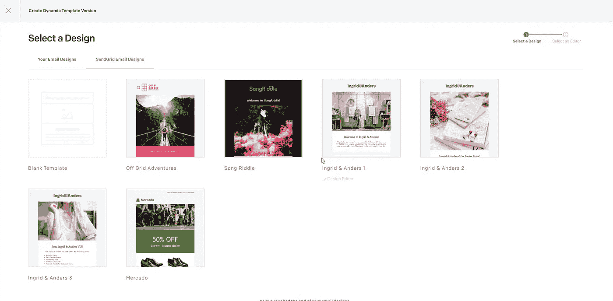

点击 SendGrid 电子邮件设计，我们将选择一个预建的。

我选择脱离电网冒险。


然后选择设计编辑器

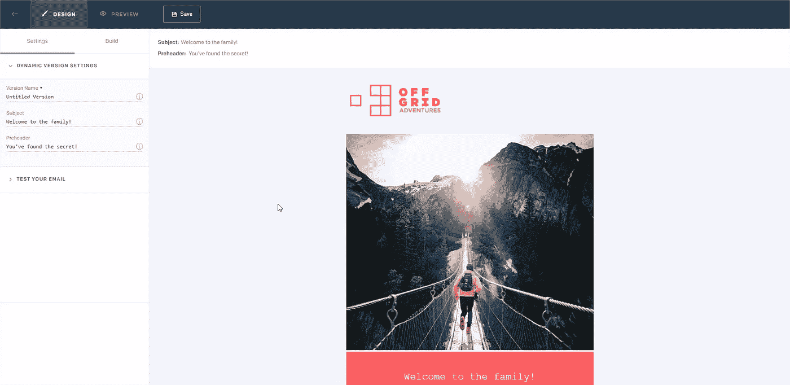

现在让我们给模板添加一些修改。

单击欢迎加入家庭，并将文本更改为

欢迎{ {名字}}

**{{first_name}}** 表示它是一个变量，将使用代码动态更改。

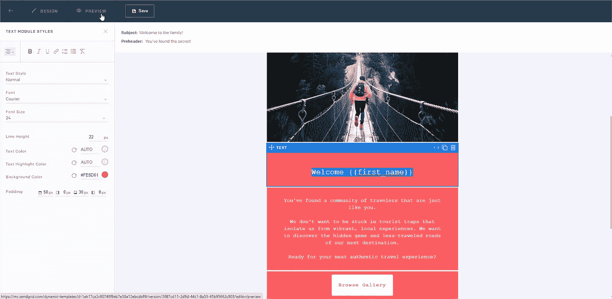

单击预览查看输出

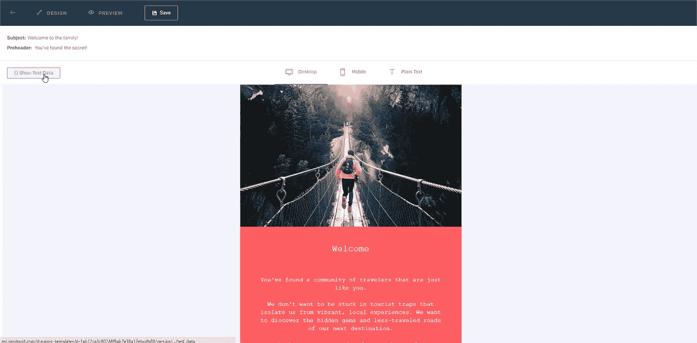

单击显示测试数据

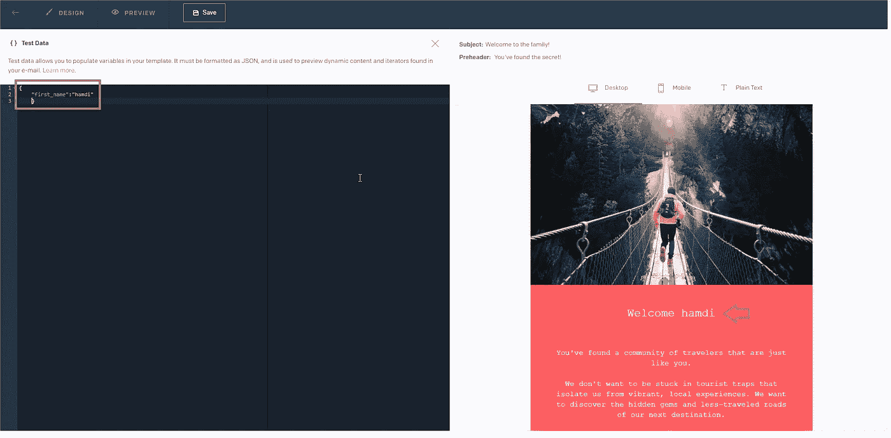

模板已动态更改。

现在点击保存按钮，然后返回箭头

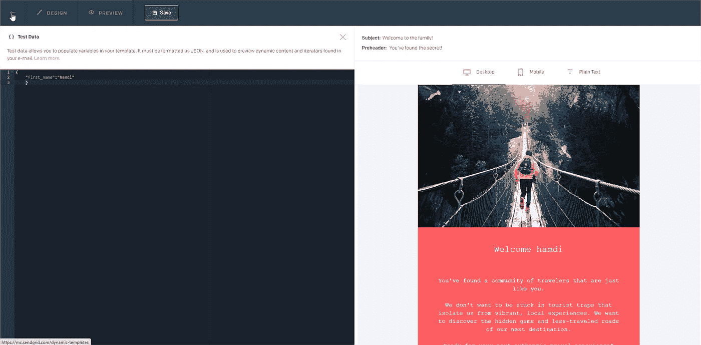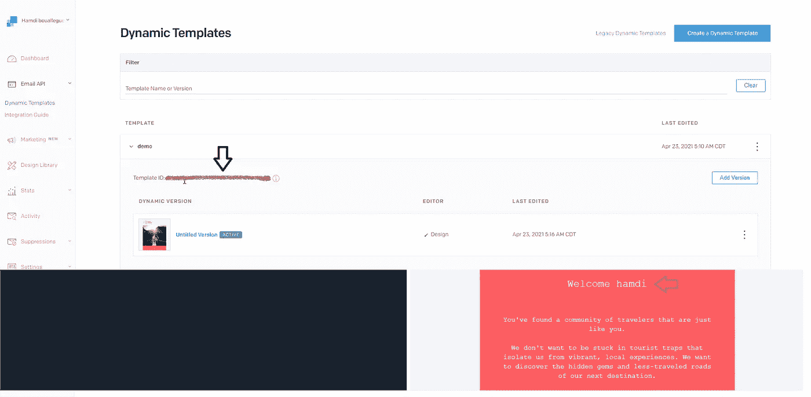

复制模板 id。

## 2.更新邮件服务:

## 3.更新 rest 控制器:

```
@PostMapping("/send")public String sendWithTemplate() throws IOException {return mailService.send();}
```

## 4.测试新的 API:

论邮递员

post:[http://localhost:8080/API/send](http://localhost:8888/api/send-text)

您将收到一封带有我们模板的电子邮件。

验证您的垃圾邮件。

# 最后一句话:

您可以在这里找到源代码:

  

**如果你喜欢这篇文章，请鼓掌**👏**分享它，让其他人也能找到它！关注我，了解我更多信息**😄。