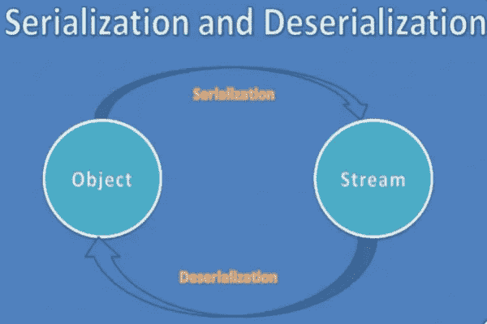
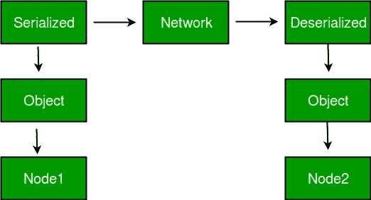
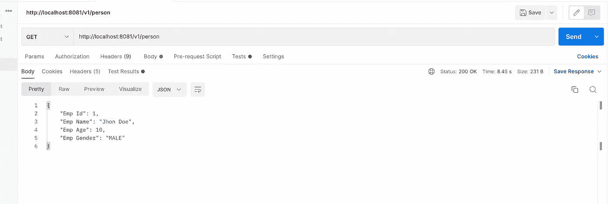
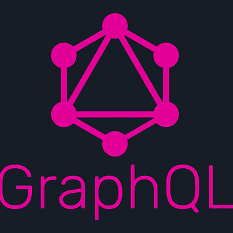
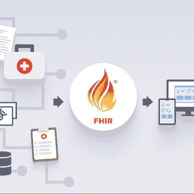
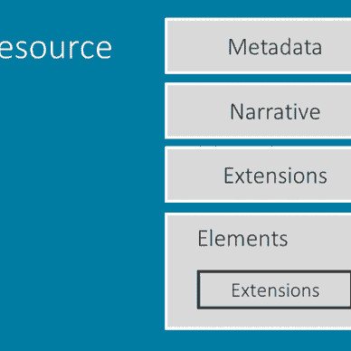

# 5 分钟内完成串行化器/解串行化器

> 原文：<https://medium.com/javarevisited/serializers-de-serializers-in-5-mins-2f8e7d70d516?source=collection_archive---------2----------------------->

[](https://www.java67.com/2020/05/15-java-serialization-interview-questions-answers.html)

当涉及到开发现代应用程序，尤其是 web 应用程序时，有许多主题可以在没有任何通知的情况下轻易地隐藏起来，开发人员在实现他们的尖端解决方案时经常会忽略这些主题。

但这丝毫没有降低这些话题的重要性。通常，了解这些主题有助于理解、发现和实现现有问题的不同解决方案。

串行化器/去串行化器就是这样一个话题，在你的进程遇到阻碍之前，它可能会被忽略。忽略这些可能并不是最糟糕的解决方案，因为许多现代的库和框架已经自动化了许多东西，否则我们需要手动处理。但是，如果完全不知道这些，当遇到与数据序列化相关的问题时，会导致很多困惑和沮丧。

在本文中，我们将了解什么是[序列化和反序列化](https://www.java67.com/2016/01/what-is-default-serialization-in-java.html)，以及我们如何使用现有的序列化程序来定制实现。

# 什么是**序列化/反序列化？**

**序列化**是一种将对象状态转换成字节流的机制。创建的字节流是独立于平台的。因此，在一个平台上序列化的对象可以在另一个平台上反序列化。**反序列化**顾名思义是序列化过程的反义词。每当我们想要获取/使用存储的数据时，为了使数据可供人类使用，我们需要将字节流反序列化为对象。反序列化是使用字节流在内存中重新创建实际对象的过程。这种机制用于持久化对象。

[](https://www.java67.com/2021/04/java-serialization-tutorial-example-.html)

# **为什么我们需要序列化/反序列化？**

几乎所有现代语言都使用对象来存储和处理任何形式的数据。这些只是人类可以理解的数据形式。每当我们想要发送/存储这些对象时，我们需要将这些对象转换成字节流。

这就是序列化发挥作用的地方，它有助于将对象转换成字节流。现在，因为我们正在将对象转换为字节流，所以当我们从网络接收对象时，我们需要进行相反的操作。这就是反串行化器发挥作用的地方，它将字节流转换成语言对象。

# **为什么要定制串行器/反串行器？**

有许多流行的序列化器和反序列化器库，如 [Jackson](https://www.java67.com/2019/09/3-ways-to-ignore-null-fields-in-json-java-jackson.html) 、 [GSON](https://javarevisited.blogspot.com/2022/03/3-examples-to-parse-json-in-java-using.html) 等。大多数时候，序列化器的实现足以满足需求。

但是当你处理**复杂的数据对象(例如:FHIR 资源)**时，默认的实现可能不足以单独处理这些。即使您不想处理复杂的对象，定制的序列化器/反序列化器也会大大节省您可能必须对数据进行的计算时间。

下面我们将讨论如何实现定制的杰克逊序列化器，我们还将看到如何转换通过 rest 调用传递的数据。在这个例子中，我们将看看如何使用定制的 Jackson 序列化器/反序列化器动态地将庇隆对象更改为雇员对象。

[](https://javarevisited.blogspot.com/2014/12/how-to-read-write-json-string-to-file.html)

## 步骤 1:为数据创建模型类

下面是 person 模式类，它将在我们的应用程序中充当 Person 数据的占位符。在下面的代码中，我们还提到了用于 Person 模型类的序列化器/反序列化器。

```
@Builder
@Getter
@Setter
@JsonSerialize(using = CustomSerializer.class)
@JsonDeserialize(using = CustomDeserializer.class)
public class Person {
    int id;
    String firstName;
    String lastName;
    int age;
    String sex;
}
```

## 步骤 2:自定义序列化程序/反序列化程序

**序列化程序:**下面是 CustomSerializer 的实现。该序列化程序会将 person 对象转换为 Employee

```
public class CustomSerializer extends StdSerializer<Person> {

    protected CustomSerializer(Class<Person> t) {
        super(t);
    }
    public CustomSerializer(){
        this(null);
    }

    @Override
    public void serialize(Person person, JsonGenerator gen, SerializerProvider provider) throws IOException {
        gen.writeStartObject();
        gen.writeNumberField("Emp Id",person.getId());
        gen.writeStringField("Emp Name",person.getFirstName()+" "+person.getLastName());
        gen.writeNumberField("Emp Age",person.getAge());
        gen.writeStringField("Emp Gender", person.getSex());
    }
}
```

**2。反序列化器:**下面是 CustomDeserializer 的实现。这将把传入的 Employee 对象转换成 Person 对象。

```
public class CustomDeserializer extends StdDeserializer<Person> {
    protected CustomDeserializer(Class<Person> vc) {
        super(vc);
    }
    public CustomDeserializer(){
        this(null);
    }

    @Override
    public Person deserialize(JsonParser p, DeserializationContext ctxt) throws IOException, JacksonException {
        JsonNode node=p.getCodec().readTree(p);
        Person person=Person.*builder*()
                .id(node.get("Emp Id").asInt())
                .firstName(node.get("Emp Name").asText().split(" ")[0])
                .lastName(node.get("Emp Name").asText().split(" ")[1])
                .sex(node.get("Emp Gender").asText())
                .age(node.get("Emp Age").asInt()).build();
        return person;
    }
}
```

## 步骤 3:注册自定义序列化程序/反序列化程序

[Spring Boot](/javarevisited/10-free-spring-boot-tutorials-and-courses-for-java-developers-53dfe084587e) 使用 **Jackson 的 ObjectMapper 库**来序列化/反序列化传入/传出的对象。为了让对象映射器使用我们的自定义实现，我们需要向[对象映射器](https://javarevisited.blogspot.com/2018/02/how-to-parse-json-with-date-field-in-java-jackson-example.html)注册我们的自定义实现。为了完成这项任务，ObjectMapper 提供了 SimpleModule 类来注册所有的序列化程序/反序列化程序。

```
@Configuration
public class SerializationConfig {

  @Bean
  @SuppressWarnings({"rawtypes", "unchecked"})
  public ObjectMapper getObjectMapper() {
    ObjectMapper mapper = new ObjectMapper();
    SimpleModule simpleModule = new SimpleModule();
    simpleModule.addSerializer(Person.class, new CustomSerializer());
    simpleModule.addDeserializer(Person.class, new CustomDeserializer());
    mapper.registerModule(simpleModule);
    return mapper;
  }
}
```

**步骤 4:示例:**

1.  **序列化:**当我们将对象发送到网络时，将在内部调用 Jackson 序列化程序将对象序列化到流中。如果对象的类型与注册的序列化程序匹配，它将自动使用序列化程序的自定义实现。因此，在发送时，Person 对象将被转换为 Employee 对象。

```
@RestController
@RequestMapping("/v1/person")
@AllArgsConstructor
public class PersonController {

    @GetMapping
    public Person getPerson(){
        Person person=Person.*builder*()
                .id(1)
                .firstName("Jhon")
                .lastName("Doe")
                .sex("MALE")
                .age(10).build();

        return person;
    }

    @PostMapping
    public void savePerson(@RequestBody Person person){
        System.*out*.println("*");
        System.*out*.println("*");
        System.*out*.println("*");
        System.*out*.println(person);
        System.*out*.println("*");
        System.*out*.println("*");
        System.*out*.println("*");
    }

}
```



输出:getPerson

2 **。反序列化:**当我们通过网络接收对象时，它将是流格式的，为了使这个对象可读， [Spring Boot](/javarevisited/top-5-books-to-learn-spring-boot-and-microservices-for-experienced-java-developers-499a9d921d18?source=---------25------------------) 将使用 JacksonDeserializer 将传入的流反序列化为对象，如果传入的流与注册的反序列化器匹配，Jackson 将使用同样的方法将流反序列化为对象。

[](https://www.java67.com/2021/02/spring-boot-actuator-interview-questions-answers-java.html)

呼叫:拯救者

[](https://www.java67.com/2012/08/spring-interview-questions-answers.html)

输出:保存人

# 摘要

在上面的文章中，我们研究了什么是序列化/反序列化，序列化/反序列化的需求是什么，以及如何实现序列化器/反序列化器。我们还研究了如何实现一个定制的序列化器/反序列化器，将 Person 对象转换为 Employee 对象。

如果你喜欢我的作品，请**喜欢并分享**这篇文章(**免费:)**)。还有，做 [**关注**](/@jaideeppahwa1) me 更多这样的文章。

另外，看看我的其他文章:


杰迪普·帕瓦

## 自助救助

[View list](/@jaideeppahwa1/list/self-help-942c66816c1d?source=post_page-----2f8e7d70d516--------------------------------)2 stories

[杰迪普·帕瓦](/@jaideeppahwa1?source=post_page-----2f8e7d70d516--------------------------------)

## 通用技术公司

[View list](/@jaideeppahwa1/list/general-tech-e702a6db69b5?source=post_page-----2f8e7d70d516--------------------------------)2 stories

[杰迪普·帕瓦](/@jaideeppahwa1?source=post_page-----2f8e7d70d516--------------------------------)

## 5 分钟技术

[View list](/@jaideeppahwa1/list/5-minutes-tech-c6f26ea4a89c?source=post_page-----2f8e7d70d516--------------------------------)3 stories

杰迪普·帕瓦

## 面向开发人员的 FHIR

[View list](/@jaideeppahwa1/list/fhir-for-developers-ea551cc4840c?source=post_page-----2f8e7d70d516--------------------------------)9 stories