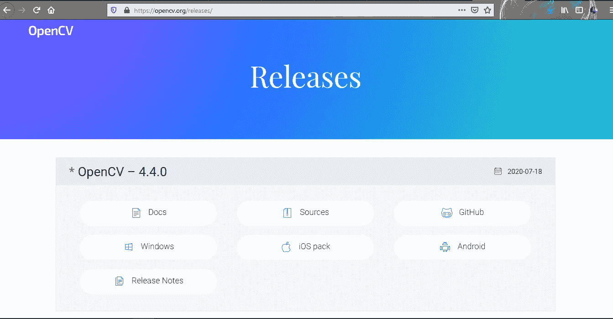
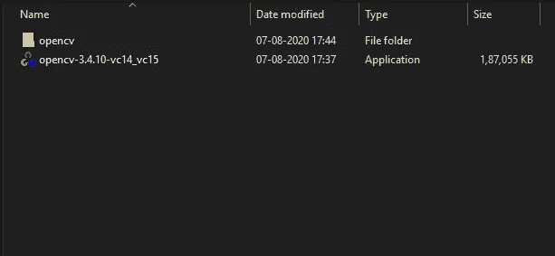
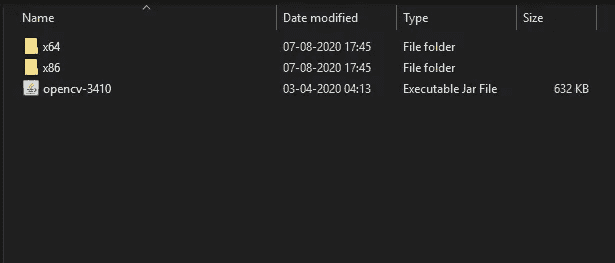
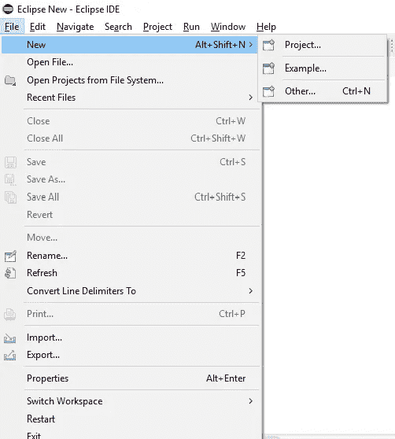
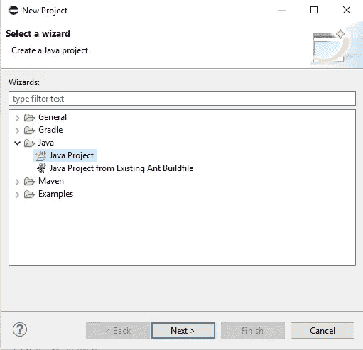
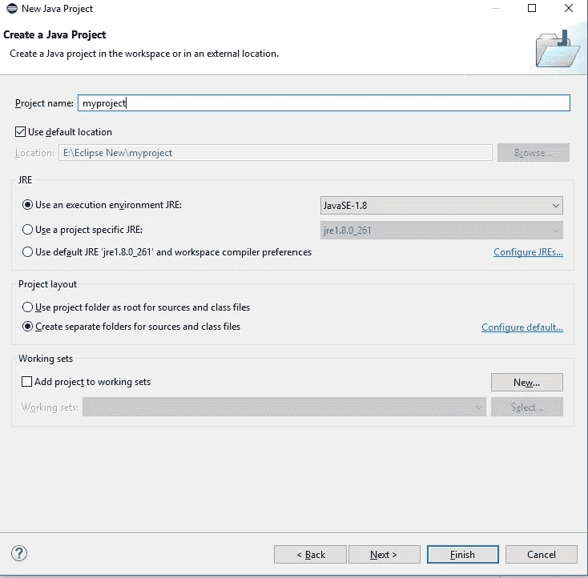
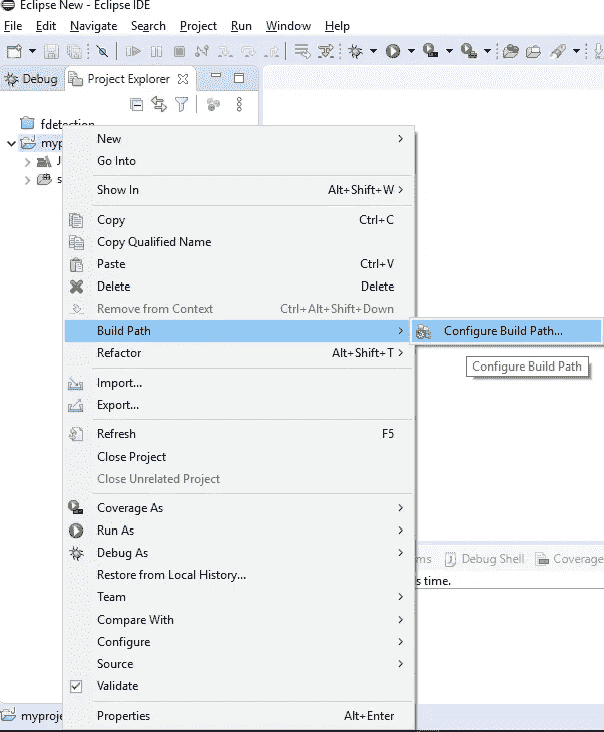
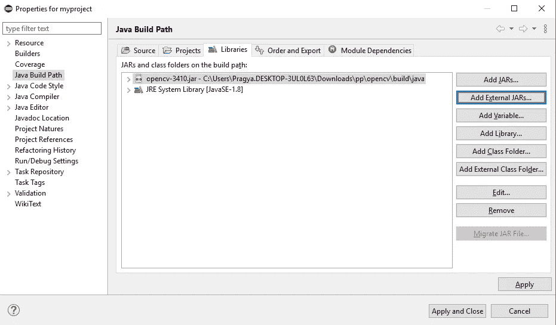
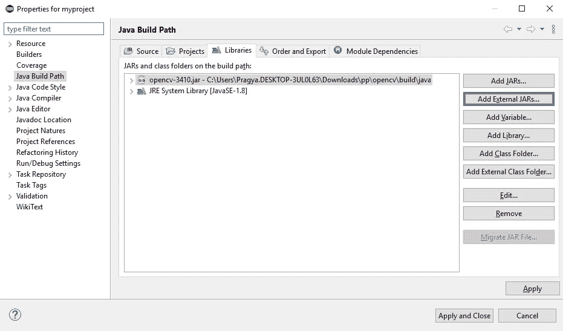
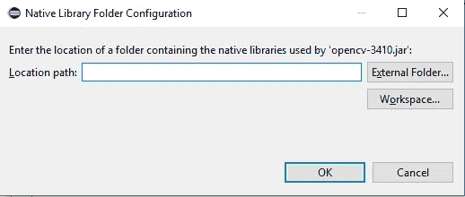

# 为 JAVA 设置 OpenCV。

> 原文：<https://medium.com/javarevisited/setting-up-opencv-for-java-44c6eb6ae7e1?source=collection_archive---------0----------------------->

## 用 java 安装和设置 OpenCV 系统。

卡斯帕·卡米尔·鲁宾在 [Unsplash](https://unsplash.com?utm_source=medium&utm_medium=referral) 上的照片

大家好，在这篇文章中，我们将讨论如何在您的系统中下载和安装 OpenCV，并使用 Java IDE 对其进行配置。

[OpenCV](https://www.java67.com/2020/07/top-5-courses-to-learn-computer-vision-opencv-python.html) 是一个用于开发实时计算机视觉应用的跨平台库。它在许多领域都很有用，如医学、安全、运输等。

使用 OpenCV 我们可以捕捉视频和图像。我们可以变换图像，可以将它的颜色从彩色图像变成灰度图像。

用 OpenCV 搭配 [JAVA](/javarevisited/top-5-java-online-courses-for-beginners-best-of-lot-1e1e240a758) 太酷了。我们必须与 JavaFX 一起使用 OpenCV 和 Java GUI。

OpenCV 是一个非常有用的库，但也是一个庞大的库。这是一个非常大的库，包括这么多有用的包来执行操作。

现在让我们下载 OpenCV 并安装到您的系统中，这样您也可以使用 OpenCV 制作一些好东西。

有几个简单的步骤，你可以按照安装 OpenCV。

首先你得在你的系统里下载 OpenCV。按照这些步骤，您可以在您的系统中下载 OpenCV。

**步骤 1)** 只需按照给定的链接[*https://opencv.org/about/*](https://opencv.org/about/)即可打开 OpenCV 的主页。

点击给定的链接，OpenCV 的主页将被打开。

**步骤 2)** 点击 ***发布*** 链接，会被定向到发布页面，然后你要选择 Windows。它将被下载到你指定的文件夹中。

**第三步)**点击 windows，一个文件名为“*”的文件会被保存在下载文件夹中。你必须点击那个文件并把它安装到你的电脑上。安装后，你会得到一个名为 OpenCV 的文件夹。*

**

***步骤 4)** 你要打开文件夹“***opencv->build->Java***”。在那里你会找到 jar 文件“***opencv-3410 . jar***”。*

**

## ***配置 Eclipse IDE，***

*首先在您的系统中正确安装 Eclipse。下面是在你的系统 [*中下载*](https://www.eclipse.org/downloads/packages/release/oxygen/3a/eclipse-ide-java-developers) *[Eclipse IDE](/javarevisited/top-10-courses-to-learn-eclipse-junit-and-mockito-for-java-developers-4de1e8d62b96?source=collection_home---4------1-----------------------) 的链接 https://www . Eclipse . org/downloads/packages/release/oxygen/3a/Eclipse-IDE-Java-developers*。*

***设置构建路径:***

***步骤 1)** 创建一个新项目，方法是单击文件，然后单击新建并选择项目。*

**

***步骤 2)** 在选择项目时，会打开一个对话框“选择向导”。选择 Java 项目并单击下一步。*

**

***步骤 3)** 现在 ***新建 Java 项目向导*** 将会得到打开。输入您自己的项目名称，然后单击 Finish。*

**

***步骤 4)** 新建项目后，点击右键，选择 ***构建路径*** ，然后 ***配置构建路径*** 。*

**

***步骤 5)** 点击配置构建路径，将会打开 ***Java 构建路径向导*** 。点击 ***添加外部罐子*** 。*

**

***步骤 6)** 选择文件 Opencv jar 文件的路径，点击打开。这些文件将被添加到您的库中。*

**

***第 7 步)**通过点击 Apply and Close，您将成功地将所需的 OpenCV jar 文件添加到您的项目库中。点击 ***可以看到那个库引用的库*** 。*

**

## *设置本地库..*

*现在我们必须为本地库设置路径。需要为 OpenCV 的 DLL 文件设置路径。*

*在文件夹“***opencv->build->Java***”中，您会找到另外两个文件夹，分别命名为**、x64**(64 位的*)和**x86**(32 位*的*)。这些文件夹将包含 OpenCV 所需的 **DLL 文件**。**

**

## ***你要按照一些更简单的步骤来设置 OpenCV 的原生库。***

***步骤 1)** 再次打开 **Java 构建路径向导**。在这里你可以找到添加的 **JAR** 文件和 **JRE 系统库**。*

**

***步骤 2)** 展开 OpenCV jar 文件，会得到系统库和“**原生库位置:**”。参考下图。*

**

***步骤 3)** 双击**原生库位置:**选项，**原生库文件夹配置窗口**将打开**。***

**

***步骤 4)** 现在选择外部文件夹选项，并为 OpenCV 的 DLL 文件选择路径。*

*选择文件夹 **x64** ( *64 位*)还是 **x86** ( *32 位*)，将基于您的系统配置。如果您的系统是 64 位，则选择 x64 文件夹，如果您的系统是 32 位，则选择 x86 文件夹。*

*现在点击应用并关闭，开始为 OpenCV 编写代码。*

*我希望你们都正确安装和配置了 OpenCV。感谢您的访问和阅读全文。*

*谢谢你。*