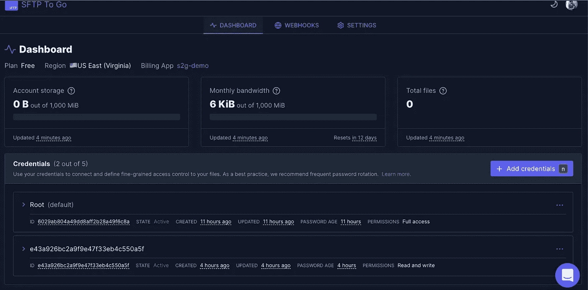
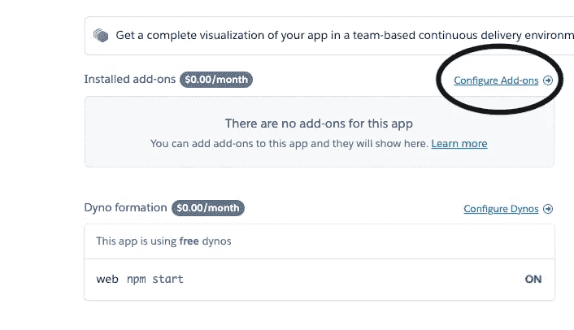
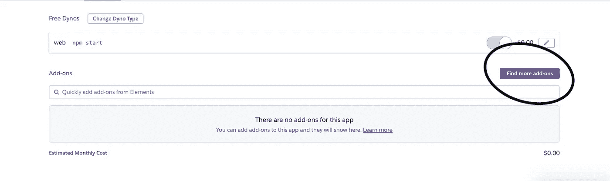
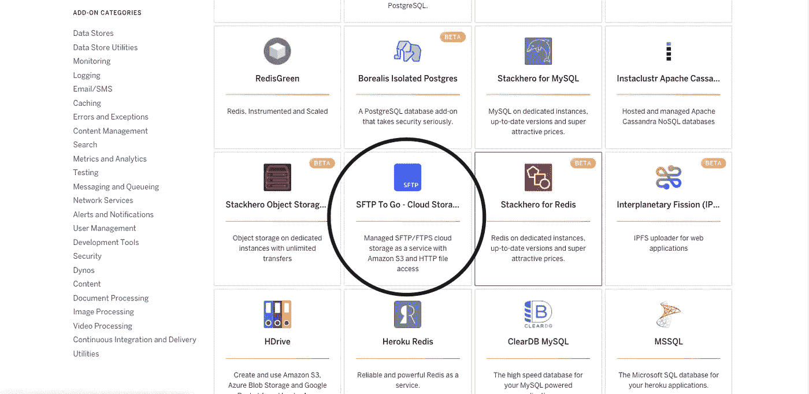
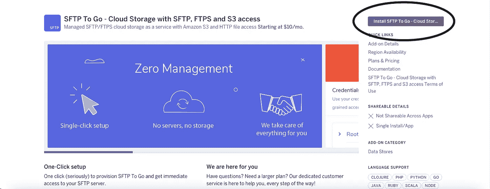
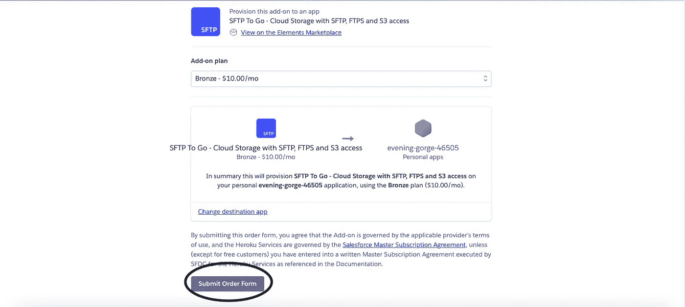
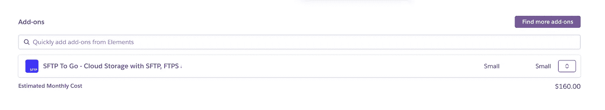
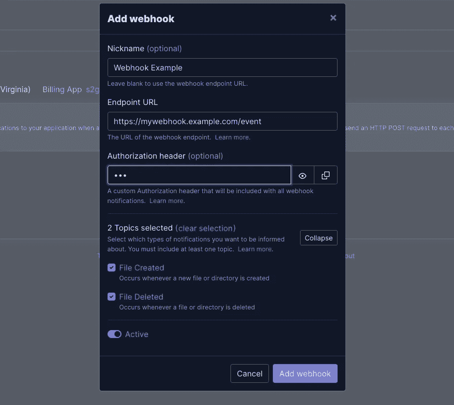

# SFTP 将被 Heroku 的疯狂蚂蚁实验室追加

> 原文：<https://medium.com/javarevisited/sftp-to-go-add-on-by-crazy-ant-labs-on-heroku-b178410c6480?source=collection_archive---------1----------------------->



SFTP 去仪表板

在我们的编程之旅中，我们都曾遇到过 Heroku，这是一个用各种语言开发应用程序的云原生平台。它在一个平台上为我们提供了许多内置功能，如 Github、Docker 集成、命令行、Web UI 和各种其他[插件](https://elements.heroku.com/addons)可供选择。 **Heroku** 一直是最受欢迎的免费网站托管地之一，据说是一个**多语言平台**，因为它为开发者提供了跨大多数语言以类似方式构建、运行和扩展应用的功能。

Heroku 面临的主要问题之一是文件的存储

> Heroku 有一个“短暂的”文件系统，虽然我们可以将文件写入磁盘，但不能保证这些文件在应用程序重启后会持续存在。

现在，为了挽救这一点，尽管 **Heroku** 有几个[存储附加组件](https://elements.heroku.com/addons#data-stores)，但在本文中，我将讨论由 [Crazy Ant Labs](https://crazyantlabs.com/) 创建的[SFTP Go](https://sftptogo.com/)附加组件，它的特性、设置以及与 Nodejs 代码的集成。

# SFTP 要去哪里？

[SFTP Go](https://sftptogo.com/)是一款安全、可扩展、耐用的云存储，主要用于自动或手动保护文件访问、传输和管理，无需维护和处理 API。

# 设置您的环境

设置您的 SFTP Go 非常容易，也遵循其零管理原则，让我们看看如何配置和设置我们的环境，基本上有两种方法可以将 SFTP Go 添加到您的应用程序中，它们是:

## 使用 Heroku UI 将 SFTP 添加到 Go

1.  转到 Heroku 仪表板并选择任何一个现有项目，如果没有现有项目，则创建一个

[](https://javarevisited.blogspot.com/2018/02/10-courses-to-prepare-for-programming-job-interviews.html)

Heroku 仪表板

2.选择项目后，转到**已安装附加组件**部分，点击**配置附加组件**



Heroku 概览仪表板-作者图片

3.现在，点击**查找更多附件**



Heroku 资源仪表板-作者图片

4.现在，从**数据存储**部分的可用附加组件中选择 SFTP Go

**[](https://javarevisited.blogspot.com/2020/08/10-examples-of-essential-linux-commands.html)

Heroku 附加组件数据存储-按作者分类的图像** 

**5.接下来，点击窗口右上角的**安装** SFTP 到**T3****

****

**SFTP 将由作者添加图片**

**6.现在，选择任何**附加计划**，并在搜索栏中选择该附加计划需要连接的应用，点击**提交订单****

****

**SFTP 去订单形式-由作者图像**

**7.接下来，等待几秒钟让附加组件启动，现在，我们可以复制我们的 **URI** 和**密码**来开始！**

****

**SFTP 去仪表板-作者图片**

## **使用 Heroku CLI 添加 SFTP Go**

1.  **使用命令登录到您的 **Heroku** 帐户，并在终端上输入电子邮件和密码等凭证**

```
heroku login -i
```

**2.现在，使用该命令将 SFTP To Go 附加组件添加到您的 **Heroku** 仪表盘**

```
heroku addons:create sftptogo:bronze -a APP_NAME
```

**在上面的命令中， **bronze** 是给定计划的名称，其他可用的计划有 M**micro、Mini、Small、Starter、Professional 和 Premium。****

**准备就绪后，您可以直接从 Heroku 访问 SFTP To Go 仪表盘**

****

**SFTP 去仪表板-作者图片**

**您还可以在此处的仪表板上查看您的加载项**

****

**仪表板中的不同附加组件-作者提供的图片**

**在你的 SFTP To Go 仪表盘中，你可以找到你的所有相关信息凭证(SFTP / FTPS 访问和[亚马逊 S3](/javarevisited/7-best-aws-s3-and-dynamodb-courses-for-beginners-in-2021-a8a44b6066da) )、网络安全配置和 Webhooks**

## **验证访问权限**

**现在，一旦安装了附加组件，在您输入在您的 SFTP To Go 仪表板中给定的 **URI** 和**密码**之后，就可以通过命令行访问存储库了**

```
sftp *****************.sftptogo.com
sftp> ls
dir
sftp> mkdir storageFile
storageFile
```

****

**按作者访问存储库图像的命令**

**在这里，您可以创建自己的存储目录和文件。通过以下命令，我们还可以知道您提供的 SFTP 服务的 URL，包括 root 用户名、密码和主机**

```
heroku config:get SFTPTOGO_URL -a APP_NAME
```

## **应用功能**

**当使用 SFTP 通过 Nodejs 运行时，需要使用以下命令将以下 npm 包安装到 package.json 文件中**

```
npm install ssh2-sftp-client
```

**以及它作为**

```
let Client = require('ssh2-sftp-client');
let sftp = new Client();

sftp.connect({
  host: '*********.sftptogo.com',
  port: '22',
  username: 'swapnilkant11',
  password: '******'
}).then(() => {
  return sftp.list('/');
}).then(data => {
  console.log(data, 'the data info');
}).catch(err => {
  console.log(err, 'catch error');
});
```

# **将凭证添加到 **SFTP To Go** 仪表板**

**除了**根**之外，用户还可以从 SFTP 的**到**仪表板添加其他凭证**

**[](https://www.java67.com/2020/07/top-5-courses-to-learn-linux-in-depth.html)

将凭据添加到 SFTP Go-Image by author** 

**用户可以输入**用户名**和**主目录，**从列表中选择权限并点击**添加凭证**现在，将有一个额外的凭证添加到仪表板中。其他权限包括**只读、只写、**和**读写****

# **什么是 Webhooks？**

**诸如文件删除、文件更新之类的事件可以通过 SFTP 的一个内置特性通知到被称为 **webhooks 的。**通过输入端点 URL、授权头和要监控的事件类型，用户可以从仪表板配置 **webhooks** 。**

****

**SFTP 的 web hook To Go dashboard-作者图片**

# **我们为什么需要这个？**

**SFTP Go 提供了各种非常独特和可靠的功能，其中包括:**

*   ****一键式** **设置**:它提供了对我们 SFTP 服务器的无缝快速访问，我们安全的 SFTP 服务器只需点击几下鼠标，还为我们提供了**一键式**密码轮换**
*   ****亚马逊** **S3** **访问**:这允许我们使用亚马逊 S3 服务 API 访问我们的文件，这意味着我们可以使用不同的、更现代的界面访问相同的文件**
*   ****以** **的规模运行****:构建在[之上的亚马逊云平台](/javarevisited/5-best-aws-courses-for-beginners-and-experienced-developers-to-learn-in-2021-563212409fbd)可以随着流量和文件大小的增加而扩展，并且允许我们以固定的月成本限制我们的存储和带宽配额，并在与用户讨论后进行扩展****
*   ****Webhooks :提供一个 webhook，当文件中有任何涉及更新和删除的更改时，它会自动通知我们****
*   ******网络入站规则:**定义一组可以安全访问我们服务器的 IP 地址****

# ****SFTP 的安全****

****SFTP Go 提供了以下安全功能:****

*   ******数据安全:**对于数据加密，SFTP Go 在其所有网站和微服务上使用 SSL/TLS 加密，并且该平台从未使用我们的数据内容或从中获取信息用于营销或广告，并定期验证安全证书和加密算法以确保我们的数据安全。****
*   ******网络安全:**默认情况下，拒绝所有访问，根据业务需求，只允许明确允许的端口和协议。****
*   ******系统安全性:**在内部，通过将员工的访问权限限制为执行工作所需的最低权限，在外部，通过在代表用户访问第三方系统时向用户询问其服务所需的最低权限，来遵循最低权限原则。****

# ****摘要****

****现在，谈论这篇文章的总结我们有以下 SFTP 的特点要走:****

1.  ****提供简单快速的设置功能****
2.  ****可以通过添加使用 SFTP 服务器的 IP 地址从任何地方访问****
3.  ****Webhooks 提供了简单快捷的通知功能，包括简单的设置和管理****
4.  ****提供广泛的安全功能，包括密码轮换、IP 过滤、SSH 密钥、用于细粒度访问控制的多个凭据。****

# ****结论****

****SFTP Go 是适用于您的 Heroku 应用程序的最佳和全面管理的云 SFTP 存储之一，它灵活、可扩展且易于上手，我对该产品的**零管理功能、可扩展性功能、webhook 功能、安全性等**功能印象深刻，这些功能在其他云存储附件中是不存在的。****

****很乐意看到:****

*   ****可用的免费层:允许开发者免费开始小项目****
*   ****文件更新通知:允许 webhooks 在现有文件被修改时发出通知****

******不断学习，不断成长，不断探索！******

******万事如意！******

****更多有趣和信息丰富的文章和提示请关注我的[**Medium**](https://swapnilkant11.medium.com/)**和**[**Linkedin**](https://www.linkedin.com/in/swapnil-kant-279a3b148/)********