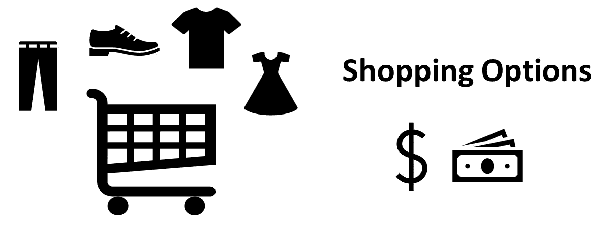

# 购物选择

> 原文：<https://medium.com/javarevisited/shopping-options-2b8652c93cf3?source=collection_archive---------2----------------------->

一位亚马逊客户想买一条牛仔裤、一双鞋、一条裙子和一件上衣，但预算有限。给定每种产品的不同定价选项，确定我们的客户有多少个选项来购买每种产品。你不能花超过预算金额的钱。

购物选择

例子

Jeans 的价格= [2，3]