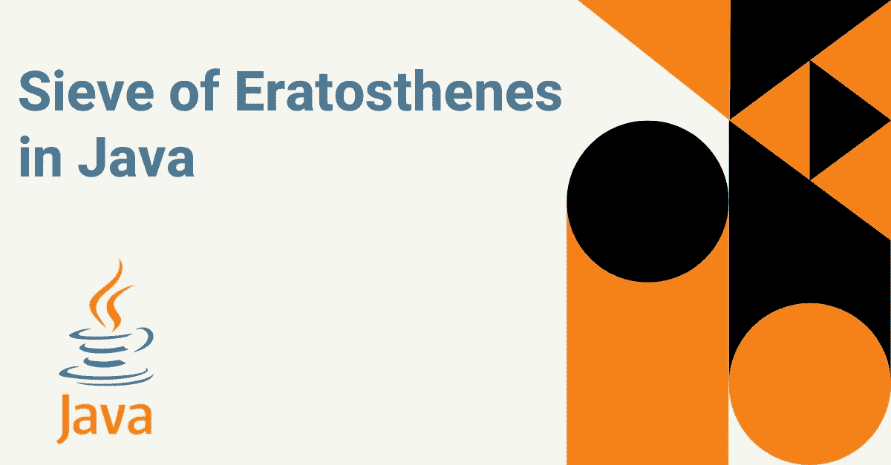
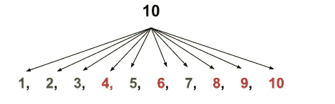
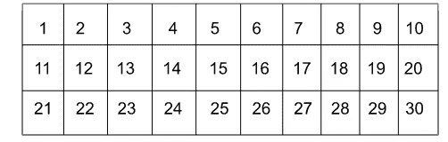
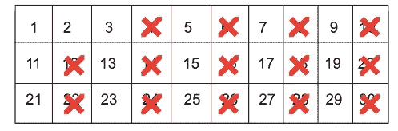
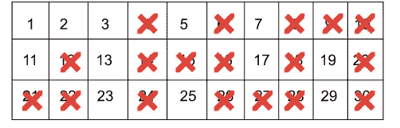
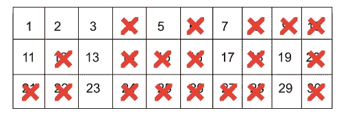
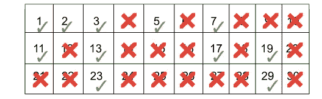

# 爪哇厄拉多塞筛

> 原文：<https://medium.com/javarevisited/sieve-of-eratosthenes-in-java-3556dcea37e2?source=collection_archive---------0----------------------->

爪哇厄拉多塞筛

我们熟悉素数的特征，并在我们的学术生涯中使用过。一个[质数](https://www.youtube.com/watch?v=BHPrHvDooL4)是一个只能被一整除或者只能被自身整除的质数。现在，假设我们需要汇编一个 1 到任意给定 n 之间的所有素数的列表。

下一步是确定[每个数字是否是质数](http://www.java67.com/2014/01/how-to-check-if-given-number-is-prime.html)。如果我们被要求为同样的事情编写一个计算机程序，那么对每个数字遵循同样的程序将是低效的。

事实上，筛选算法就是答案。没错，解决方案就是筛子算法。那么在这篇文章中，我们将了解什么是厄拉多塞之筛？它是如何工作的？以及如何在 Java 中实现厄拉多塞的 [**筛子**](https://www.interviewbit.com/blog/sieve-of-eratosthenes/) 。

# **厄拉多塞的筛子是什么？**

厄拉多塞的筛子是一个用来寻找质数的简单筛子。它是由希腊数学家厄拉多塞在公元前 2 世纪发明的。筛子是一个简单的筛子，它确定一个数是否是质数。筛子的工作原理是将数字除以 2，并将结果与素数表进行比较。如果数字是质数，它将被添加到质数表中。如果它不是质数，它就被丢弃。使用表格，这有助于消除任何数 n 之间的所有非质数。这有助于降低计算机程序的时间复杂性，并广泛用于密码学。让我们借助问题陈述来理解它的工作原理。

**问题陈述:**要求你打印所有小于等于给定数 n 的质数。

根据上面的问题陈述，可以获得的打印质数的第一个解决方案是—从 1 到 n 迭代。检查每个数字，如果是质数，则打印。否则，转到下一个号码，再次执行相同的步骤。

**例:**求 1 到 10 之间的质数。

**解决方案:**考虑下图进行解释。

在上图中，我们可以看到，对于每个数字，我们需要检查它是否是一个质数，然后将它打印出来。否则跳过。现在的问题是，我们如何确定[是否是质数？](https://www.java67.com/2018/06/data-structure-and-algorithm-interview-questions-programmers.html)我们需要从每个数字遍历到 1，并检查它是否能被任何数字整除。如果是，那么它不是质数，否则，它是质数。所以这个方法的算法是-

**算法-**

1.  开始吧。
2.  从 1 到 n 重复数字**‘I’**
3.  从**‘I-1’**到 2 迭代**‘j’**。
4.  如果**‘I’**能被**‘j’**整除，则终止迭代。
5.  如果**‘I’**不能被**‘j’**整除，则继续下一次迭代。
6.  如果内部迭代没有找到任何可以被**‘I’**整除的数，那么打印这个数。因为它是质数。
7.  否则，继续迭代。
8.  停下来。

## **Java 程序进行如下处理**

**输入:**十

**输出:** 1 2 3 5 7

**解释:**外部循环遍历从 1 到输入数 n 的每个元素。然后内部循环从当前数-1 运行到 1，检查当前数可以除其下的任何数。如果可以，则不打印。所以它通过标记变量来终止循环。当内部循环终止时，检查变量是否被修改。如果没有修改，那么这意味着它是质数。所以把那个数字打印出来。并继续下一次迭代。

**上述算法分析:**对于从 1 到 n 的每一个数，我们需要运行一个从元素到 1 的循环。所以渐近方程会是— [n * (n-1) / 2]。也就是 **O(n2)** 。并且不需要额外的空间，所以空间复杂度将是常数。

我们可以看到[算法](/javarevisited/10-data-structure-algorithms-and-programming-courses-to-crack-any-coding-interview-e1c50b30b927)花费了大量的时间来打印元素。因此，我们可以避免对每个第 I 个元素从它本身到它的一半进行不必要的检查。因为没有一个数能被整除。

**举个例子:**对于数字 25 检查它是否是质数，从 12 到 25 没有任何数字可以除尽。因此，我们可以通过从( **i/2** 到 **1)** 遍历内部循环来避免这种情况。这节省了一些计算时间。但是渐近时间是一样的。所以这个算法也可以不被认为是最好的。

所以这就是 Sieve 算法帮助高效找到素数的地方。

厄拉多塞算法的[筛子通过管理一个表并消除所有非素数的元素来解决这个问题。](https://javarevisited.blogspot.com/2015/05/sieve-of-Eratosthenes-algorithm-to-generate-prime-numbers-in-java.html)

sieve 算法的思想是创建一个从 1 到 n 的表，并开始迭代它。并将特定元素的所有倍数标记为假，因为它不可能是质数。这个迭代一直持续到数字 n。

让我们借助一个例子来清楚地理解这一点——考虑从 1 到 30 的数字。我们需要打印这些之间的质数。

*   筛选算法的第一步是——创建一个从 1 到 30 的表格。

*   然后下一步是从 2 到 n 遍历未标记的数字表，对于每个元素，取消其倍数的标记。

**下一个** **无标记数字 2 -**

**下一个** **未标记的数字 3 -**

**下一个未标记的数字 5 -**

**下一个未标记的数字是** 7 11 13 17 …全部执行后，表格将-

所以表中剩余的元素将是质数。这些是在寻找质数的筛选算法中要遵循的步骤。

**所以厄拉多塞算法的筛子是——**

1.  开始吧。
2.  创建一个长度为 n+1 的布尔数组。
3.  从 2 到 n 开始循环。
4.  如果元素被标记，则从当前元素的下一个倍数到 n 开始一个循环，并取消所有当前数的倍数的标记。
5.  否则，继续下一次迭代。
6.  打印所有仍然被标记的数字，因为它们是质数。
7.  停下来。

## **厄拉多塞筛子的 Java 程序-**

**输入:** 100

产量:2 3 5 7 11 13 17 19 23 29 31 37 41 43 47 53 59 61 67 71 73 79 83 89 97

**解释:**我们遵循的是我们在算法中定义的东西。我们创建了一个由布尔值[和](https://www.java67.com/2018/03/java-convert-string-to-boolean.html)组成的表格，然后对所有的值进行了初始标记。然后我们开始一个循环，检查表中的当前值是否仍然被标记。如果这个数仍然被标记，那么它将是一个质数。所以把它打印出来，去掉它的所有倍数。

**算法分析—** 先来了解一下外循环中每个数字的步骤，以及嵌套循环执行了多少次。

最初，当 i == 2 时，内部循环发现它被标记，所以它将执行内部循环 n/2 次。那么对于 i == 3，就是 n/3 次。对于 i == 5，就是 n/5 次，以此类推。所以如果我们试图用泰勒级数来证明这一点——[n++⅓+⅕+…]。那么我们得到的时间复杂度是 **O(log (log n))。这对于 n 个不同的值执行。所以总的时间复杂度将是 **O( n * log(log n))。****

我们必须维护非质数的非标表格**。**表格可以包含 n 个空格。所以空间复杂度会是 **O(n)** 。

# **结论**

厄拉多塞的筛子是帮助获得从 1 到 n 的最优质数的技术。它使用列表法来找到它。希腊数学家和科学家厄拉多塞在大约 2300 年前创造了它。在这篇博客中，我们已经了解了常规问题的基本方面，以及 sieve 算法如何通过 java 实现来优化解决这个问题。

 [## 如何在 Java 中找到一个数组中所有和与给定数字相加的对

### 大家好，如果你一直在解决数据结构和算法问题，或者已经完成了几个编码…

medium.com](/javarevisited/two-sum-coding-problem-how-to-find-all-pairs-which-adds-to-a-given-sum-in-an-array-in-java-a396be0f308d)  [## 20 多个数组编码问题和来自编程访谈的问题

### 大家好，数组是最基本的数据结构，它将元素存储在连续的内存位置。它…

medium.com](/javarevisited/20-array-coding-problems-and-questions-from-programming-interviews-869b475b9121)  [## 来自编程访谈的 20 多个二叉树编码问题

### 大家好，我已经分享了很多关于编程面试的资源，比如书籍、课程和一些…

medium.com](/javarevisited/20-binary-tree-algorithms-problems-from-coding-interviews-c5e5a384df30)