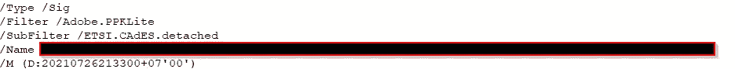

# PDF 上的简单数字签名验证

> 原文：<https://medium.com/javarevisited/simple-digital-signature-validation-on-pdf-17a66c1bf8d2?source=collection_archive---------0----------------------->

## **1。简介**

基于维基百科，数字签名(DS)是一种验证数字消息或文档真实性的数学方案。它被用作不可否认的工具。

PDF 中的数字签名类型从消息摘要到另一种类型的签名(CMS 高级电子签名或 CAdES *)各不相同。*本文将详细介绍如何验证 PDF 文件中的数字签名。

## 2.问题陈述

*   PDF 上的数字签名验证
*   类型签名:CAdES 分离、PKCS7 分离或 ETSI。RFC3161

## 3.PDF 中的数字签名

当您在文本编辑器中打开 PDF 文件时，您会发现其中包含标签的结构，有点像 xml 文件。数字签名放在 Sig 类型标记(签名字典)中。尝试在 PDF 文件中找到这种标签/类型/签名。下面是一个例子:



PDF 中的数字签名示例

在那里，您还可以看到一个过滤器和子过滤器标签。有关该标签中值的进一步解释，您可以查看 PDF 32000–1:2008 文档第 12.8.1 节。进一步深入 Sig 字典，您会发现一个 Contents 标记。该标记内是数字签名的 Based64 值。下面的例子显示了内容标签中的 CAdES 签名。还要注意 ByteRange 标记，我们也将在数字签名验证过程中使用它。


数字签名内容标签示例

## 4.数字签名验证

我们将重点关注 PDF(/子过滤器类型 ETSI)上的 PAdES-B 签名。CAdES.detached)。它基本上是使用 CAdES-detached 签名放入内容标签。下图描述了验证的步骤。


PDF 签名验证流程

1.  将/Contents 标记中的内容解析为 CMS(加密消息语法)
2.  验证 CMS 中的签名是否有效(使用 signerInfo 类型的证书，将其与 CMS 中的签名属性进行比较)
3.  如果有效，那么从 CMS 中的签名属性获取消息摘要。还要获取使用的摘要算法(SHA1、SHA256 等)
4.  计算 PDF 中的实际消息摘要(使用第 3 条中的字节数和摘要算法)
5.  比较数字(3)和数字(4)，如果有效，则数字签名值有效

需要注意的是，上述步骤没有处理数字证书验证、CRL 检查或 OCSP 检查。我们将在另一篇文章中讨论这个问题。所以，让我们把上面的步骤分解成 java 代码。实际代码可以在我的 [github](https://github.com/rsatrio/PDF-Signature-Check/) 中看到。我们将使用 2 个外部库:pdfbox 和 bouncycastle。

**4.1 解析 CMS 内容内部/内容标签**

首先打开 pdf，用这行代码获得签名:

然后获取签名中的/Contents 标记:

```
//Get PKCS#7 Data
        CMSSignedData signedData=new CMSSignedData(signature.getContents());
```

**4.2 验证 CMS 签名有效**

首先，我们获得了 CMS 内部的 signerInfo:

```
//Get SignerInfo
SignerInformation signerInfo=signedData.getSignerInfos().iterator().next();
```

然后，我们获得了 CMS 内部的公钥:

然后，我们获得了签名算法:

然后，我们检查 CMS 内部签名的有效性:

```
Signature rsaSign=Signature.getInstance(encAlgo);       
        rsaSign.initVerify(pubKey);
        rsaSign.update(signerInfo.getEncodedSignedAttributes());
        boolean cmsSignatureValid=rsaSign.verify(signerInfo.getSignature());
```

**4.3 获取 CMS 内的消息摘要算法和消息摘要数据**

**4.4 计算 PDF 中的消息摘要**

首先，我们计算 PDF 上的字节数数据

然后，我们在 PDF 上计算消息摘要

```
//Calculate MD in PDF

        String mdPdf=Base64.getEncoder().encodeToString(digest.digest(contentToSigned));
```

**4.5 比较 CMS 中的信息摘要和 PDF 中的计算结果**

如果相同，则签名有效。另一方面，如果不相同，则签名无效。

```
if(mdPdf.equals(messageDigest)) {
            logApp.info("Message Digest Signature ID {} is valid, data integrity is OK",signatureSID);
        }
        else    {
            logApp.info("Message Digest Signature ID {} is invalid, data integrity is NOT OK",signatureSID);
        }
```

## 5.评论

基本上，我们在这个博客中讨论的是一个非常简单的 PDF 文件中数字签名验证的例子。我们希望这个简单的例子足以成为理解验证如何工作以及 PDF 中的数字签名如何工作的起点。如果您有任何问题或建议，请在下面评论。

**6。参考文献**

*   [www.adobe.com/go/pdfreference](http://www.adobe.com/go/pdfreference)
*   [https://github.com/rsatrio/PDF-Signature-Check/](https://github.com/rsatrio/PDF-Signature-Check/)