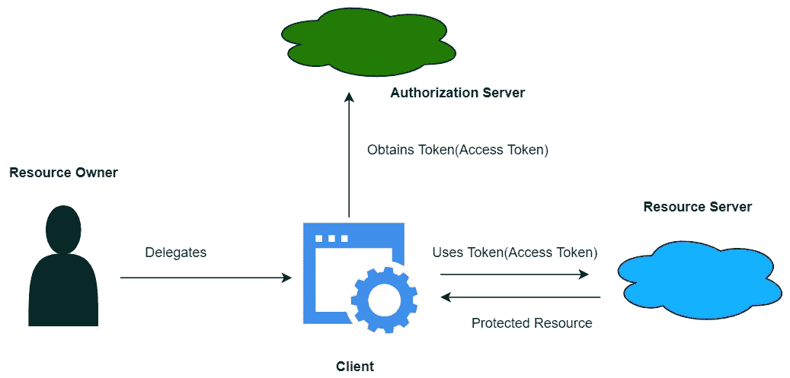
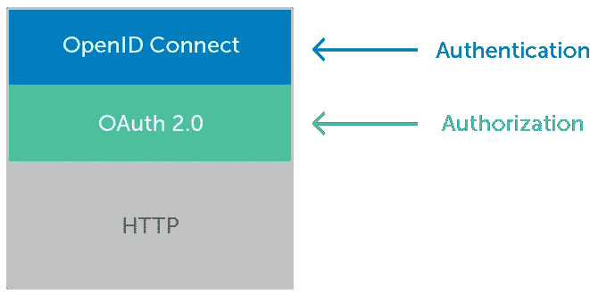
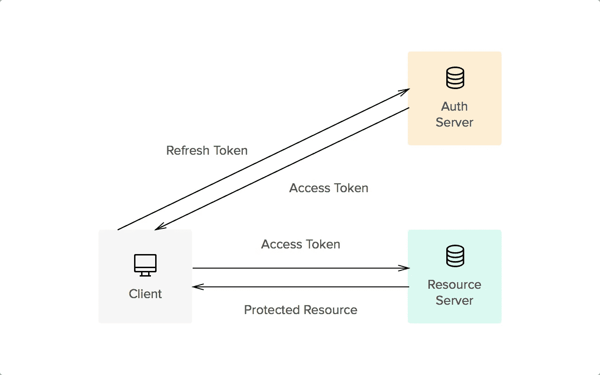

# Spring Boot 的单点登录(SSO)

> 原文：<https://medium.com/javarevisited/single-sign-on-sso-with-spring-boot-37fd7203240f?source=collection_archive---------0----------------------->

关于 SSO 和 OAuth 实际上是什么有很多混淆。有些人认为 OAuth 是一种“安全的东西”,并没有真正理解更多。当我们谈论 OAuth 和单点登录时，会出现一组流行词汇。因此，我的目的是澄清这些疑问，并希望让您了解 SSO 和 OAuth 如何以及在哪里可以让您的应用程序受益。

# 什么是单点登录？

单点登录(SSO)是一种身份验证方法，使用户只需使用一组凭据就可以安全地对多个应用程序和网站进行身份验证。

OAuth 2.0 和 OpenID Connect 都涉及 SSO 功能。让我们举一个例子来更好地理解这个概念。如果您登录了 Gmail，您可以自动访问 YouTube、Google Drive、Google Photos 和其他 Google 产品。

SSO 实际上是称为联合身份管理的更大概念的一部分，FIM 只是指在两个或多个域或身份管理系统之间创建的信任关系。也可以将 OAuth 2 视为职能指令手册架构的一部分。OAuth 关注于这种信任关系，允许跨域共享用户身份信息。

# OAuth 2.0

OAuth(开放授权)是委托授权的标准协议。简而言之，OAuth 是一种授权协议，它允许您代表您批准一个应用程序与另一个应用程序进行交互，而无需给出您的凭据。

假设 ESPN 是客户端，脸书是服务提供商(资源服务器)，万一 ESPN 遭到入侵，你的脸书密码仍然安全。让我们看看 OAuth 术语和 OAuth 流是如何工作的。

## **奥特演员**

OAuth 流中的参与者如下:

**资源所有者**:拥有资源服务器中的数据。

**资源服务器**:存储客户端想要访问的数据的 API。

**客户端**:想要访问你的数据的应用。

**授权服务器**:OAuth 的主引擎。授权服务器发布访问令牌以及客户端 ID 和密码。

## **OAuth 2 基本工作流程**

OAuth 工作流

让我们用一个例子来理解工作流。我们以脸书为例。比方说，我们正在使用脸书上的一个应用程序，它要求你显示你的个人资料和照片。脸书在这种情况下资源服务器(它有你的登录数据和图片)。app 就是消费者(客户端)。作为用户，我们希望使用该应用程序来处理我们的图片。我们特别授权这个应用程序访问我们的图片，OAuth 在后台管理这些图片。当我们让这个应用程序访问我们的图片时，应用程序(客户端)从授权服务器获得访问令牌，并将其发送到资源服务器。以便客户端从资源服务器接收请求资源。

我应该使用哪个 OAuth 2.0 流程？

[OAuth 2.0 授权框架](https://auth0.com/docs/protocols/protocol-oauth2)支持几种不同的流程(或授权)。流是检索访问令牌的方式。决定哪一个适合您的用例主要取决于您的[应用类型](https://auth0.com/docs/applications)，但是其他参数也很重要，比如对客户端的信任程度，或者您希望您的用户拥有的体验。

**OpenID 连接 vs OAuth 2**

OAuth 与 OpenID 连接

*   **OAuth 2.0** 用于授权。
*   **OpenID Connect** 用于认证。

OAuth 2 是一个授权框架，OAuth 缺乏认证指导导致了一些混乱，这也正是 OpenID connect 被创建的原因。OIDC 是更新的标准，它扩展了 OAuth，增加了对身份验证的支持。基本上，OpenID Connect 是一个建立在 OAuth 2.0 之上的身份验证层，用于提供单点登录功能。

**客户端 ID 和客户端密码**

该 ID 用于标识客户端和授权服务器。客户端密码是只有客户端和授权服务器知道的密码。

客户端 ID 和密码由授权服务器生成。这就是授权服务器验证客户端的方式。

**访问令牌与刷新令牌**

访问令牌与刷新令牌

当访问令牌过期或变得无效，但应用程序仍然需要访问受保护的资源时，应用程序面临的问题是在不迫使用户再次授予权限的情况下获得新的访问令牌。为了解决这个问题，OAuth 2.0 引入了一个叫做[刷新令牌](https://auth0.com/docs/tokens/refresh-token/current)的工件。刷新令牌允许应用程序在不提示用户的情况下获得新的访问令牌。刷新令牌只返回到授权服务器，访问令牌返回到(RS)资源服务器。

**ID 令牌**

OpenID Connect (OIDC)是建立在 OAuth 2.0 之上的身份验证协议。使用 OAuth 2.0，用户可以通过授权服务器进行身份验证，并获得一个授权访问某些服务器资源的访问令牌。在 OIDC，他们还会给你一个名为 ID token 的令牌。

ID 令牌包含有关用户及其身份验证状态的信息。您的客户端既可以使用它进行身份验证，也可以将它作为用户信息的存储库。一个 OIDC 流可以返回访问令牌和 ID 令牌。

**JWT (JSON 网络令牌)**

JWT 只是一种令牌格式，用于授权。JWT 令牌是 JSON 编码的数据结构。用户登录后，每个后续请求都将包含 JWT，允许用户访问该令牌允许的路由、服务和资源。单点登录是当今广泛使用 JWT 的一个特性。

**JWT vs OAuth 2**

JWT 和 OAuth2 是完全不同的，服务于不同的目的，但它们是兼容的，可以一起使用。OAuth2 协议没有指定令牌的格式。因此，JWT 可以并入 OAuth2 的用法中。

## 结论

我们从讨论单点登录开始，然后讨论了与 SSO 相关的术语。基本上，在本文中，我们学习了这些事情如何与 SSO 相关联以及 OAuth 流如何工作等。在本文的第二部分，我们将学习如何在您的 [spring boot 应用程序](/javarevisited/top-10-courses-to-learn-spring-boot-in-2020-best-of-lot-6ffce88a1b6e)中实现 SSO 特性。感谢阅读😊。